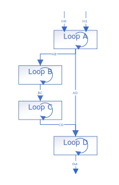
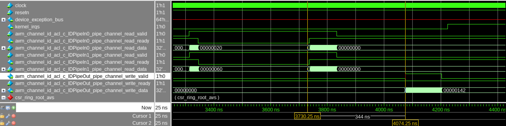
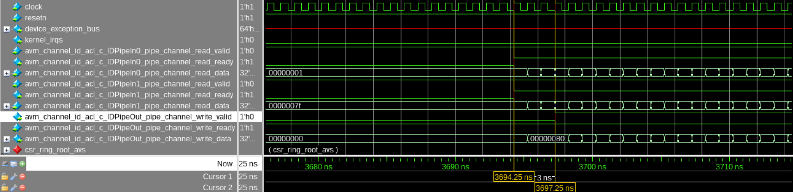

# `Parallel Loops` Sample

This sample is an FPGA tutorial that demonstrates how to use task sequences to describe multiple parallel loops in a single kernel.

| Area                 | Description
|:--                   |:--
| What you will learn  | How to use task sequences to add concurrency to your design
| Time to complete     | 30 minutes
| Category             | Concepts and Functionality

## Purpose

Task sequences enable function calls to run asynchronously from the main flow of a kernel. Functions called asynchronously like this are referred to as 'task functions'. Including multiple task sequences in the same kernel expresses coarse-grained thread-level parallelism, such as executing loops in parallel. This tutorial shows you how to use task sequences to execute a sequence of loops in parallel, and how it can improve your design's performance.

## Prerequisites

| Optimized for        | Description
|:---                  |:---
| OS                   | Ubuntu* 20.04 <br> RHEL*/CentOS* 8 <br> SUSE* 15 <br> Windows* 10 <br> Windows Server* 2019
| Hardware             | Intel® Agilex® 7, Arria® 10, and Stratix® 10 FPGAs
| Software             | Intel® oneAPI DPC++/C++ Compiler

> **Note**: Even though the Intel DPC++/C++ OneAPI compiler is enough to compile for emulation, generating reports and generating RTL, there are extra software requirements for the simulation flow and FPGA compiles.
>
> For using the simulator flow, Intel® Quartus® Prime Pro Edition and one of the following simulators must be installed and accessible through your PATH:
> - Questa*-Intel® FPGA Edition
> - Questa*-Intel® FPGA Starter Edition
> - ModelSim® SE
>
> When using the hardware compile flow, Intel® Quartus® Prime Pro Edition must be installed and accessible through your PATH.

> **Warning** Make sure you add the Quartus® Prime device files associated with your target FPGA device to your Quartus® Prime software installation.

This sample is part of the FPGA code samples.
It is categorized as a Tier 2 sample that demonstrates a compiler feature.


Find more information about how to navigate this part of the code samples in the [FPGA top-level README.md](/DirectProgramming/C++SYCL_FPGA/README.md).
You can also find more information about [troubleshooting build errors](/DirectProgramming/C++SYCL_FPGA/README.md#troubleshooting), [running the sample on the Intel® DevCloud](/DirectProgramming/C++SYCL_FPGA/README.md#build-and-run-the-samples-on-intel-devcloud-optional), [using Visual Studio Code with the code samples](/DirectProgramming/C++SYCL_FPGA/README.md#use-visual-studio-code-vs-code-optional), [links to selected documentation](/DirectProgramming/C++SYCL_FPGA/README.md#documentation), and more.

## Key Implementation Details

This sample demonstrates some key concepts:
- How to execute multiple dependent loops in parallel using the `task_sequence` class, the `pipe` class and the `async()` function call
- How the compiler automatically adds depth to pipes that bypass one or more loops

The demonstration system in this tutorial is explained in the following diagram. The code contains a sequence of loops that communicate through arrays (for example Loop A communicates to loop B through `array_a_b`). The compiler will schedule these loops such that a producer loop must completely finish executing before its corresponding consumer loop can begin, as shown in the following simulation waveforms. You can improve performance by placing each loop in a `task_sequence` and joining the task sequences with pipes instead of arrays. This allows the compiler to schedule the loops to run in parallel.

```c++
struct NaiveKernel {
  int len;

  void operator()() const {
    int array_a_b[kVectSize];
    int array_b_c[kVectSize];
    int array_c_d[kVectSize];
    int array_a_d[kVectSize];

    // loopA
    [[intel::initiation_interval(1)]]  
    for (size_t i = 0; i < len; i++) {
      int in0 = PipeIn0::read();
      int in1 = PipeIn1::read();
      array_a_b[i] = in0;
      array_a_d[i] = in1;
    }

    // loopB
    [[intel::initiation_interval(1)]]  
    for (size_t i = 0; i < len; i++) {
      int tmp = array_a_b[i];
      tmp += i;
      array_b_c[i] = tmp;
    }

    // loopC
    [[intel::initiation_interval(1)]]  
    for (size_t i = 0; i < len; i++) {
      int tmp = array_b_c[i];
      tmp += i;
      array_c_d[i] = tmp;
    }

    // loopD
    [[intel::initiation_interval(1)]]  
    for (size_t i = 0; i < len; i++) {
      int tmp0 = array_c_d[i];
      int tmp1 = array_a_d[i];
      int out = tmp0 + tmp1;
      PipeOut::write(out);  
    }
  }
};
```



The behavior of the naive implementation using a sequence of loops is compared with an implementation using task sequences to schedule the loops to run in parallel below. 

When you write code containing a sequence of loops, each loop in the sequence must wait for the previous loop in the sequence to fully complete. This results in long execution time and poor occupancy of the FPGA datapath. Observe in the following diagram that it takes many hundreds of clock cycles or approximately 344 clock cycles* before the output pipe `IDPipeOut` produces any output:



Task sequences allow you to schedule loops to run in parallel, so data quickly flows through sequences of loops. A consumer loop can process an output as soon as a producer loop produces it, without waiting for the whole producer loop to finish executing. Observe in the following diagram that the output pipe `IDPipeOut` produces results almost immediately in approximately 3 clock cycles*:


*modelsim is configured with 1 clock cycle = 1ns

>**Note**: This is possible only when the loops process data in the same order. That is, the first piece of data the second loop consumes should be the first piece of data produced by the first loop. Converting loops to task sequences and executing them in parallel will not help performance if the first piece of data consumed by the second loop is the last piece of data produced by the first loop, because then the second loop requires the first loop to completely finish.

### Code Example 

To use a task sequence in your design, include the `<sycl/ext/intel/experimental/task_sequence.hpp>` header file in your source code. The `task_sequence` class is a templated class with 3 parameters:

| Template Parameter | Type     | Default Value | Description
|--------------------|----------|---------------|---
| Task function      | callable | N/A           | A callable object `f` that defines the asynchronous task to be associated with the `task_sequence`. The callable object `f` must meet the following requirements: <br> • The object `f` must be statically resolvable at compile time, which means it is not a function pointer. <br> • The object `f` must not be an overloaded function. <br> • The return type (`ReturnT`) and argument types (`ArgsT…`) of object f must be resolvable and fixed.
| Invocation Capacity* | `uint32_t` | 1 | The size of the hardware queue instantiated for `async()` function calls.
| Response Capacity* | `uint32_t` | 1 | The size of the hardware queue instantiated to hold task function results.

> *Invocation capacity and response capacity are optional 

The following example shows how to use task sequences to schedule loops to run in parallel.  

```c++
[[intel::use_stall_enable_clusters]] 
void LoopA(int len) {
  [[intel::initiation_interval(1)]]  
  for (size_t i = 0; i < len; i++) {
    int in0 = PipeIn0::read();
    int in1 = PipeIn1::read();

    PipeAB::write(in0);
    PipeAD::write(in1);
  }
}

[[intel::use_stall_enable_clusters]] 
void LoopB(int len) {
  [[intel::initiation_interval(1)]]  
  for (size_t i = 0; i < len; i++) {
    int tmp = PipeAB::read();
    tmp += i;
    PipeBC::write(tmp);  
  }
}

[[intel::use_stall_enable_clusters]] 
void LoopC(int len) {
  [[intel::initiation_interval(1)]]  
  for (size_t i = 0; i < len; i++) {
    int tmp = PipeBC::read();
    tmp += i;
    PipeCD::write(tmp);  
  }
}

[[intel::use_stall_enable_clusters]] 
void LoopD(int len) {
  [[intel::initiation_interval(1)]]  
  for (size_t i = 0; i < len; i++) {
    int tmp0 = PipeCD::read();
    int tmp1 = PipeAD::read();
    int out = tmp0 + tmp1;
    PipeOut::write(out);  
  }
}

///////////////////////////////////////

struct OptimizedKernel {
  int len;

  void operator()() const {
    sycl::ext::intel::experimental::task_sequence<LoopA> task_a;
    sycl::ext::intel::experimental::task_sequence<LoopB> task_b;
    sycl::ext::intel::experimental::task_sequence<LoopC> task_c;
    sycl::ext::intel::experimental::task_sequence<LoopD> task_d;

    task_a.async(len);
    task_b.async(len);
    task_c.async(len);
    task_d.async(len);
  }
};
```
The C++ functions `LoopA`, `LoopB`, `LoopC` and `LoopD` are the task functions with asynchronous activities defined. Each of the task functions is used to parameterize a specific `task_sequence` class to create four `task_sequence` object instances, `task_a`, `task_b`,`task_c` and `task_d`. The task functions are called in parallel through `async()` method that accepts the same arguments as their respective task functions. The
`async()` method call is non-blocking, and it returns before the asynchronous task function finishes executing, and potentially before the task function even _begins_ executing, as the return type of the `async()` method provides no implicit information on the execution status of task functions.

You can see an example of a kernel that naively uses four sequential loops in `naive/main.cpp`. This design is modified to use task sequences to run the loops concurrently in `task_sequence/main.cpp`.

## Sample Structure
The 2 different example designs in this sample perform similar operations. You may compare the C++ source files to see the code changes that are necessary to convert a design to use task sequences instead of sequential loops.

1. [Naive](naive/src/main.cpp) This implementation contains sequential loops. Arrays are used to pass data between the loops.
2. [Task sequence](task_sequence/src/main.cpp) This implementation uses task sequences to schedule loops to run concurrently. Pipes are used to pass data between the loops.

## Build a Design
>**Note**: When working with the command-line interface (CLI), you should configure the oneAPI toolkits using environment variables. Set up your CLI environment by sourcing the `setvars` script in the root of your oneAPI installation every time you open a new terminal window. This practice ensures that your compiler, libraries, and tools are ready for development.
>
> Linux*:
> - For system wide installations: `. /opt/intel/oneapi/setvars.sh`
> - For private installations: ` . ~/intel/oneapi/setvars.sh`
> - For non-POSIX shells, like csh, use the following command: `bash -c 'source <install-dir>/setvars.sh ; exec csh'`
>
> Windows*:
> - `C:\Program Files(x86)\Intel\oneAPI\setvars.bat`
> - Windows PowerShell*, use the following command: `cmd.exe "/K" '"C:\Program Files (x86)\Intel\oneAPI\setvars.bat" && powershell'`
>
> For more information on configuring environment variables, see [Use the setvars Script with Linux* or macOS*](https://www.intel.com/content/www/us/en/docs/oneapi/programming-guide/current/use-the-setvars-and-oneapi-vars-scripts-with-linux.html) or [Use the setvars Script with Windows*](https://www.intel.com/content/www/us/en/docs/oneapi/programming-guide/current/use-the-setvars-and-oneapi-vars-scripts-with.html).

### On Linux*

1. Change to the sample directory.
2. Build the program for Intel® Agilex® 7 device family, which is the default.
   ```
   mkdir build
   cd build
   cmake .. -DTYPE=<NAIVE|TASK_SEQUENCE>
   ```
   >Use the appropriate `TYPE` parameter when running CMake to choose which design to compile:
   >| Example                                      | Directory             | Type (-DTYPE=) |
   >|----------------------------------------------|-----------------------|----------------|
   >| Naive                                        | naive/                | `NAIVE`        |
   >| Task sequence                                | task-sequence/        | `TASK_SEQUENCE`|
   
   > **Note**: You can override the default target by using the command:
   >  ```
   >  cmake .. -DFPGA_DEVICE=<FPGA device family or FPGA part number> -DTYPE=<NAIVE|TASK_SEQUENCE>
   >  ```

3. Compile the design. (The provided targets match the recommended development flow.)

   1. Compile for emulation (fast compile time, targets emulates an FPGA device).
      ```
      make fpga_emu
      ```
   2. Generate the HTML optimization reports.
      ```
      make report
      ```
      The report resides at `task_sequences.report.prj/reports/report.html`.
   3. Compile for simulation (fast compile time, targets simulator FPGA device).
      ```
      make fpga_sim
      ```
   4. Compile with Quartus place and route (To get accurate area estimate, longer compile time).
      ```
      make fpga
      ```

### On Windows*

1. Change to the sample directory.
2. Configure the build system for the Intel® Agilex® 7 device family, which is the default.
   ```
   mkdir build
   cd build
   cmake -G "NMake Makefiles" .. -DTYPE=<NAIVE|TASK_SEQUENCE>
   ```
   >Use the appropriate `TYPE` parameter when running CMake to choose which design to compile:
   >| Example                                      | Directory             | Type (-DTYPE=) |
   >|----------------------------------------------|-----------------------|----------------|
   >| Naive                                        | naive/                | `NAIVE`        |
   >| Task sequence                                | task-sequence/        | `TASK_SEQUENCE`|
   
   > **Note**: You can override the default target by using the command:
   >  ```
   >  cmake -G "NMake Makefiles" .. -DFPGA_DEVICE=<FPGA device family or FPGA part number> -DTYPE=<NAIVE|TASK_SEQUENCE>
   >  ```

3. Compile the design. (The provided targets match the recommended development flow.)

   1. Compile for emulation (fast compile time, targets emulated FPGA device).
      ```
      nmake fpga_emu
      ```
   2. Generate the optimization report. 
      ```
      nmake report
      ```
   3. Compile for simulation (fast compile time, targets simulator FPGA device).
      ```
      nmake fpga_sim
      ```
   4. Compile with Quartus place and route (To get accurate area estimate, longer compile time).
      ```
      nmake fpga
      ```

> **Note**: If you encounter any issues with long paths when compiling under Windows*, you may have to create your ‘build’ directory in a shorter path, for example `C:\samples\build`.  You can then run cmake from that directory, and provide cmake with the full path to your sample directory.
### Read the Reports

Locate `report.html` in the `naive.report.prj/reports/` and `task_sequences.report.prj/reports/` directory.

Navigate to **Loop Analysis** (Throughput Analysis > Loop Analysis). In this view, you can see the kernel system on the Loop List panel. Here, you can verify that there is only 1 kernel with seqeuntial loops in the `naive` version while there are 4 kernels containing the parallel loops in the `task_sequence` version. 

> **Note**: It is possible for loops to be fused by the compiler. For more information on loop fusion, see [loop_fusion](../../loop_fusion) tutorial

## Run the Design

### On Linux

1. Run the sample on the FPGA emulator (the kernel executes on the CPU).
   ```
   ./naive.fpga_emu
   ./task_sequences.fpga_emu
   ```
2. Run the sample on the FPGA simulator.
   ```
   CL_CONTEXT_MPSIM_DEVICE_INTELFPGA=1 ./naive.fpga_sim
   CL_CONTEXT_MPSIM_DEVICE_INTELFPGA=1 ./task_sequences.fpga_sim 
   ```

### On Windows

1. Run the sample on the FPGA emulator (the kernel executes on the CPU).
   ```
   naive.fpga_emu.exe
   task_sequences.fpga_emu.exe 
   ```
2. Run the sample on the FPGA simulator.
   ```
   set CL_CONTEXT_MPSIM_DEVICE_INTELFPGA=1
   naive.fpga_sim.exe
   task_sequences.fpga_sim.exe
   set CL_CONTEXT_MPSIM_DEVICE_INTELFPGA=
   ```

## Example Output

### Naive
```
PASSED
```

### Task Sequence
```
PASSED
```

## License
Code samples are licensed under the MIT license. See [License.txt](https://github.com/oneapi-src/oneAPI-samples/blob/master/License.txt) for details.

Third party program Licenses can be found here: [third-party-programs.txt](https://github.com/oneapi-src/oneAPI-samples/blob/master/third-party-programs.txt).
