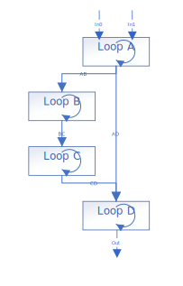
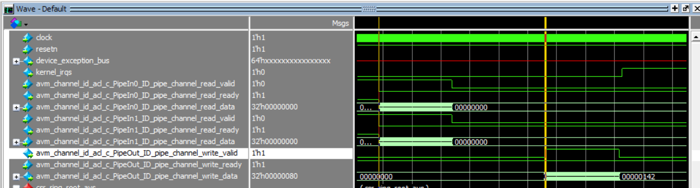
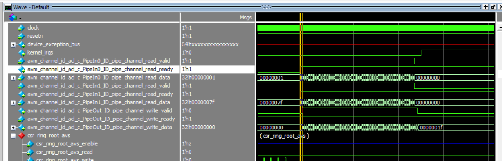

# `Task Sequences` Sample

This sample is an FPGA tutorial that demonstrates how to use task sequences to describe multiple parallel loops in a single kernel.

| Area                 | Description
|:--                   |:--
| What you will learn  | How to use task sequences to add concurrency to your design
| Time to complete     | 30 minutes
| Category             | Concepts and Functionality

## Purpose

Task sequences enable operations that we call 'task functions' to run asynchronously from the main flow of kernel. A `task_sequence` object allows repeated calls to a function to be enqueued in a sequence, rather than repeatedly in-lining the function body. A task sequence expresses coarse-grained thread-level parallelism, such as executing loops in parallel.

## Prerequisites

| Optimized for        | Description
|:---                  |:---
| OS                   | Ubuntu* 20.04 <br> RHEL*/CentOS* 8 <br> SUSE* 15 <br> Windows* 10 <br> Windows Server* 2019
| Hardware             | Intel® Agilex® 7, Arria® 10, and Stratix® 10 FPGAs
| Software             | Intel® oneAPI DPC++/C++ Compiler

> **Note**: Even though the Intel DPC++/C++ OneAPI compiler is enough to compile for emulation, generating reports and generating RTL, there are extra software requirements for the simulation flow and FPGA compiles.
>
> For using the simulator flow, Intel® Quartus® Prime Pro Edition and one of the following simulators must be installed and accessible through your PATH:
> - Questa*-Intel® FPGA Edition
> - Questa*-Intel® FPGA Starter Edition
> - ModelSim® SE
>
> When using the hardware compile flow, Intel® Quartus® Prime Pro Edition must be installed and accessible through your PATH.

> **Warning** Make sure you add the device files associated with the FPGA that you are targeting to your Intel® Quartus® Prime installation.

This sample is part of the FPGA code samples.
It is categorized as a Tier 2 sample that demonstrates a compiler feature.


Find more information about how to navigate this part of the code samples in the [FPGA top-level README.md](/DirectProgramming/C++SYCL_FPGA/README.md).
You can also find more information about [troubleshooting build errors](/DirectProgramming/C++SYCL_FPGA/README.md#troubleshooting), [running the sample on the Intel® DevCloud](/DirectProgramming/C++SYCL_FPGA/README.md#build-and-run-the-samples-on-intel-devcloud-optional), [using Visual Studio Code with the code samples](/DirectProgramming/C++SYCL_FPGA/README.md#use-visual-studio-code-vs-code-optional), [links to selected documentation](/DirectProgramming/C++SYCL_FPGA/README.md#documentation), and more.

## Key Implementation Details

This sample demonstrates some key concepts:
- How to execute multiple dependent loops in parallel using the `task_sequence` class, `pipe`s and the `async()` function call
- How the compiler automatically adds depth to pipes that bypass one or more loops

The demonstration system in this tutorial is structured like this:



When you write code containing a sequence of loops, each loop in the sequence must wait for the previous loop in the sequence to fully complete. This results in long execution time and poor occupancy of the FPGA datapath. Observe in the following graphic that it takes many hundreds of clock cycles before the output pipe produces any output:



Task sequences allow you to schedule loops to run in parallel, so data quickly flows through sequences of loops. A consumer loop can process an output as soon as a producer loop produces it, without waiting for the whole producer loop to finish executing. Observe in the following graphic that the output pipe produces results almost immediately:




### Code Example 

To use a task sequence in your design, include the `<sycl/ext/intel/experimental/task_sequence.hpp>` header file in your source code. The `task_sequence` class is a templated class with 3 parameters:

| Template Parameter | Type     | Default Value | Description
|--------------------|----------|---------------|---
| Task function      | callable | N/A           | A callable object `f` that defines the asynchronous task to be associated with the `task_sequence`. The callable object `f` must meet the following requirements: <br> • The object `f` must be statically resolvable at compile time, which means it is not a function pointer. <br> • The object `f` must not be an overloaded function. <br> • The return type (`ReturnT`) and argument types (`ArgsT…`) of object f must be resolvable and fixed.
| Invocation Capacity* | `uint32_t` | 1 | The size of the hardware queue instantiated for `async()` function calls. This parameter value corresponds to the minimum number of outstanding `async()` function calls to be supported. When the outstanding number of `async()` function calls reaches this value, further calls may block until the number of outstanding calls is reduced to the `invocation_capacity`. The default value of this parameter is 1.
| Response Capacity* | `uint32_t` | 1 | The size of the hardware queue instantiated to hold task function results. This parameter value corresponds to the maximum number of outstanding `async()` calls such that all outstanding tasks are guaranteed to make forward progress. Further `async()` calls may block until the number of outstanding calls reduces to the `response_capacity`. The default value of this parameter is 1.
*Invocation capacity and response capacity are optional
The following example shows how to use task Sequence.  

```c++
// Task function
int mult(int a, int b) {
	 return a * b;
}

int mult_and_add(int a1, int b1, int a2, int b2) {
  task_sequence<mult> task1, task2;
  task1.async(a1, b1);
  task2.async(a2, b2);
  return task1.get() + task2.get();
}
```
C++ function, mult is the task function with asynchronous activity defined. The task function is used to parameterize the task_sequence class with two object instances, task1 and task2. Parallel invocations of the task function is then launched through async() method of each object instance and their results collected by calls to the get() method on each object. The
async() function call is non-blocking, and it returns before the asynchronous f invocation completes executing and potentially before f even begins executing, as the return type from the async() function provides no implicit information on the execution status of f.
The get() function retrieves the oldest result from this logical FIFO queue and blocks (waits) until a result is available if no result is available immediately upon the call to the get() function. The return type of the get() function is the same as the return type of the task function .

You can see a concrete example of a kernel that naively uses four sequential loops in `naive/main.cpp`. This design is modified to use task sequences to run the loops concurrently in `task_sequence/main.cpp`.

## Sample Structure
The 2 different example designs in this sample perform similar operations. You may compare the C++ source files to see the code changes that are necessary to convert a design to use task sequences instead of sequential loops.

1. [Naive](naive/main.cpp) This implementation contains sequential loops. Arrays are used to pass data between the loops.
2. [Task sequence](task_sequence/main.cpp) This implementation uses task sequences to schedule loops to run concurrently. Pipes are used to pass data between the loops.

## Build a Design

Use the appropriate `TYPE` parameter when running CMake to choose which design to compile:
| Example                                      | Directory             | Type (-DTYPE=) |
|----------------------------------------------|-----------------------|----------------|
| Naive                                        | naive/                | `NAIVE`        |
| Task sequence                                | task-sequence/        | `TASK_SEQUENCE`|

>**Note**: When working with the command-line interface (CLI), you should configure the oneAPI toolkits using environment variables. Set up your CLI environment by sourcing the `setvars` script in the root of your oneAPI installation every time you open a new terminal window. This practice ensures that your compiler, libraries, and tools are ready for development.
>
> Linux*:
> - For system wide installations: `. /opt/intel/oneapi/setvars.sh`
> - For private installations: ` . ~/intel/oneapi/setvars.sh`
> - For non-POSIX shells, like csh, use the following command: `bash -c 'source <install-dir>/setvars.sh ; exec csh'`
>
> Windows*:
> - `C:\Program Files(x86)\Intel\oneAPI\setvars.bat`
> - Windows PowerShell*, use the following command: `cmd.exe "/K" '"C:\Program Files (x86)\Intel\oneAPI\setvars.bat" && powershell'`
>
> For more information on configuring environment variables, see [Use the setvars Script with Linux* or macOS*](https://www.intel.com/content/www/us/en/develop/documentation/oneapi-programming-guide/top/oneapi-development-environment-setup/use-the-setvars-script-with-linux-or-macos.html) or [Use the setvars Script with Windows*](https://www.intel.com/content/www/us/en/develop/documentation/oneapi-programming-guide/top/oneapi-development-environment-setup/use-the-setvars-script-with-windows.html).

### On Linux*

1. Change to the sample directory.
2. Build the program for Intel® Agilex® 7 device family, which is the default.
   ```
   mkdir build
   cd build
   cmake .. -DTYPE=<NAIVE/TASK_SEQUENCE>
   ```
   > **Note**: You can change the default target by using the command:
   >  ```
   >  cmake .. -DFPGA_DEVICE=<FPGA device family or FPGA part number> -DTYPE=<NAIVE/TASK_SEQUENCE>
   >  ```

3. Compile the design. (The provided targets match the recommended development flow.)

   1. Compile for emulation (fast compile time, targets emulates an FPGA device).
      ```
      make fpga_emu
      ```
   2. Generate the HTML optimization reports.
      ```
      make report
      ```
      The report resides at `task_sequences.report.prj/reports/report.html`.
   3. Compile for simulation (fast compile time, targets simulator FPGA device).
      ```
      make fpga_sim
      ```
   4. Compile with Quartus place and route (To get accurate area estimate, longer compile time).
      ```
      make fpga
      ```

### On Windows*

1. Change to the sample directory.
2. Configure the build system for the Intel® Agilex® 7 device family, which is the default.
   ```
   mkdir build
   cd build
   cmake -G "NMake Makefiles" .. -DTYPE=<NAIVE/TASK_SEQUENCE>
   ```
   > **Note**: You can change the default target by using the command:
   >  ```
   >  cmake -G "NMake Makefiles" .. -DFPGA_DEVICE=<FPGA device family or FPGA part number> -DTYPE=<NAIVE/TASK_SEQUENCE>
   >  ```

3. Compile the design. (The provided targets match the recommended development flow.)

   1. Compile for emulation (fast compile time, targets emulated FPGA device).
      ```
      nmake fpga_emu
      ```
   2. Generate the optimization report. 
      ```
      nmake report
      ```
   3. Compile for simulation (fast compile time, targets simulator FPGA device).
      ```
      nmake fpga_sim
      ```
   4. Compile with Quartus place and route (To get accurate area estimate, longer compile time).
      ```
      nmake fpga
      ```

> **Note**: If you encounter any issues with long paths when compiling under Windows*, you may have to create your ‘build’ directory in a shorter path, for example `C:\samples\build`.  You can then run cmake from that directory, and provide cmake with the full path to your sample directory.

## Run the Design

### On Linux

1. Run the sample on the FPGA emulator (the kernel executes on the CPU).
   ```
   ./naive.fpga_emu
   ./task_sequences.fpga_emu
   ```
2. Run the sample on the FPGA simulator.
   ```
   CL_CONTEXT_MPSIM_DEVICE_INTELFPGA=1 ./naive.fpga_sim
   CL_CONTEXT_MPSIM_DEVICE_INTELFPGA=1 ./task_sequences.fpga_sim 
   ```

### On Windows

1. Run the sample on the FPGA emulator (the kernel executes on the CPU).
   ```
   naive.fpga_emu.exe
   task_sequences.fpga_emu.exe 
   ```
2. Run the sample on the FPGA simulator.
   ```
   set CL_CONTEXT_MPSIM_DEVICE_INTELFPGA=1
   naive.fpga_sim.exe
   task_sequences.fpga_sim.exe
   set CL_CONTEXT_MPSIM_DEVICE_INTELFPGA=
   ```

## Example Output

### Naive
```
PASSED
```

### Task Sequence
```
PASSED
```

## License
Code samples are licensed under the MIT license. See [License.txt](https://github.com/oneapi-src/oneAPI-samples/blob/master/License.txt) for details.

Third party program Licenses can be found here: [third-party-programs.txt](https://github.com/oneapi-src/oneAPI-samples/blob/master/third-party-programs.txt).
