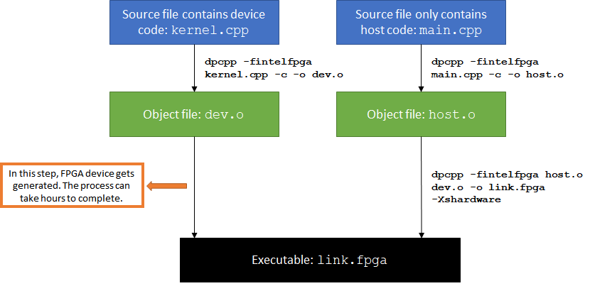
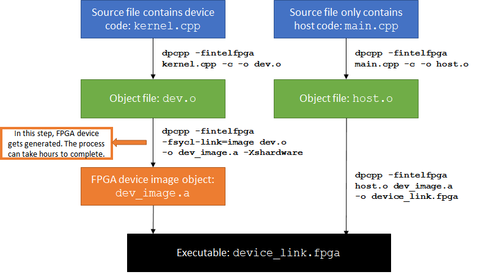

# `Fast Recompile` Sample

This sample is an FPGA tutorial that demonstrates how to separate program compilation host code and device code to save development time. You should read the `fpga_compile` sample information and review the sample code before this one.

| Area                 | Description
|:---                  |:---
| What you will learn  | Why to separate host and device code compilation in your FPGA project. <br> How to use the `-reuse-exe` and device link methods. <br> Which method to choose for your project.
| Time to complete     | 15 minutes
| Category             | Getting Started

## Purpose

Intel® oneAPI DPC++/C++ Compiler only supports ahead-of-time (AoT) compilation for FPGA, which means that an FPGA device image is generated at compile time. The FPGA device image generation process can take hours to complete. Suppose you make a change that is exclusive to the host code. In that case, it is more efficient to recompile your host code only, re-using the existing FPGA device image and circumventing the time-consuming device compilation process.

When targeting an FPGA family/part, no FPGA executable is generated. So this sample is really meant to be used when targeting a device with a BSP (for example, the Intel® PAC with Intel Arria® 10 GX FPGA) where an FPGA executable would be produced.

>**Note**: Throughout the sample, the compiler is referred to by the Linux* invocation: `icpx`. On Windows*, use `icx-cl` instead.

The compiler provides two different mechanisms to separate device code and host code compilation.

- Passing the `-reuse-exe=<exe_name>` flag to `icpx` instructs the compiler to attempt to reuse the existing FPGA device image.
- The more explicit "device link" method requires you to separate the host and device code into separate files. When a code change only applies to host-only files, an FPGA device image is not regenerated.

This tutorial explains both mechanisms and the pros and cons of each. The included code sample demonstrates the device link method but does **not** demonstrate the use of the `-reuse-exe` flag.

## Prerequisites

| Optimized for        | Description
|:---                  |:---
| OS                   | Ubuntu* 18.04/20.04 <br> RHEL*/CentOS* 8 <br> SUSE* 15 <br> Windows* 10
| Hardware             | Intel® Agilex® 7, Arria® 10, and Stratix® 10 FPGAs
| Software             | Intel® oneAPI DPC++/C++ Compiler

> **Note**: Even though the Intel DPC++/C++ OneAPI compiler is enough to compile for emulation, generating reports and generating RTL, there are extra software requirements for the simulation flow and FPGA compiles.
>
> For using the simulator flow, Intel® Quartus® Prime Pro Edition and one of the following simulators must be installed and accessible through your PATH:
> - Questa*-Intel® FPGA Edition
> - Questa*-Intel® FPGA Starter Edition
> - ModelSim® SE
>
> When using the hardware compile flow, Intel® Quartus® Prime Pro Edition must be installed and accessible through your PATH.

> **Warning**: Make sure you add the device files associated with the FPGA that you are targeting to your Intel® Quartus® Prime installation.

This sample is part of the FPGA code samples.
It is categorized as a Tier 1 sample that helps you getting started.


Find more information about how to navigate this part of the code samples in the [FPGA top-level README.md](/DirectProgramming/C++SYCL_FPGA/README.md).
You can also find more information about [troubleshooting build errors](/DirectProgramming/C++SYCL_FPGA/README.md#troubleshooting), [running the sample on the Intel® DevCloud](/DirectProgramming/C++SYCL_FPGA/README.md#build-and-run-the-samples-on-intel-devcloud-optional), [using Visual Studio Code with the code samples](/DirectProgramming/C++SYCL_FPGA/README.md#use-visual-studio-code-vs-code-optional), [links to selected documentation](/DirectProgramming/C++SYCL_FPGA/README.md#documentation), and more.

## Key Implementation Details

The sample illustrates the following important concepts.

- Why to separate host and device code compilation in your FPGA project
- How to use the `-reuse-exe` and device link methods
- Which method to choose for your project

### Using the `-reuse-exe` Flag

If the device code and options affecting the device have not changed since the previous compilation, passing the `-reuse-exe=<exe_name>` flag to `icpx` instructs the compiler to extract the compiled FPGA binary from the existing executable and package it into the new executable, saving the device compilation time.

Some examples are shown below.

```
# Initial compilation
icpx -fsycl -fintelfpga <files.cpp> -o out.fpga -Xshardware
```

The initial compilation generates an FPGA device image, which takes several hours. Next, make changes to the host code.

```
# Subsequent recompilation
icpx -fsycl -fintelfpga <files.cpp> -o out.fpga -reuse-exe=out.fpga -Xshardware
```

If `out.fpga` does not exist, `-reuse-exe` is ignored and the FPGA device image is regenerated. This will always be the case the first time a project is compiled.

If `out.fpga` is found, the compiler checks whether any changes affecting the FPGA device code have been made since the last compilation. If no such changes are detected, the compiler reuses the existing FPGA binary, and only the host code is recompiled. The recompilation process takes a few minutes. Note that the device code is partially re-compiled (similar to a report flow compile) to check that the FPGA binary can safely be reused.

If `out.fpga` is found but the compiler cannot prove that the FPGA device code will yield a result identical to the last compilation, a warning is printed and the FPGA device code is fully recompiled. Since the compiler checks must be conservative, spurious recompilations can sometimes occur when using `-reuse-exe`.

### Using the Device Link Method

The program accompanying this tutorial is separated into two files, `host.cpp` and `kernel.cpp`. Only the `kernel. cpp` file contains device code.

In the normal compilation process, FPGA device image generation happens at link time. As a result, any change to either `host.cpp` or `kernel.cpp` will trigger an FPGA device image's regeneration.

```
# normal compile command
icpx -fsycl -fintelfpga host.cpp kernel.cpp -Xshardware -o link.fpga
```

The following image shows the compilation process.



If you want to iterate on the host code and avoid long compile time for your FPGA device, consider using a device link to separate device and host compilation:

```
# device link command
icpx -fsycl -fintelfpga -fsycl-link=image <input files> [options]
```

The compilation is a 3-step process:

1. Compile the device code.
   ```
   icpx -fsycl -fintelfpga -fsycl-link=image kernel.cpp -o dev_image.a -Xshardware
   ```
   Input files should include all source files that contain device code. This step may take several hours.

2. Compile the host code.
   ```
   icpx -fsycl -fintelfpga host.cpp -c -o host.o
   ```
   Input files should include all source files that only contain host code. This takes seconds.

3. Create the device link.
   ```
   icpx -fsycl -fintelfpga host.o dev_image.a -o fast_recompile.fpga
   ```
   The input should have N (N >= 0) host object files *(.o)* and one device image file *(.a)*. This takes seconds.

**NOTE:** You only need to perform steps 2 and 3 when modifying host-only files.

The following image shows the device link compilation process.



### Determining Which Method to Use

Of the two methods described, `-reuse-exe` is easier to use. It also allows you to keep your host and device code as single source, which is preferred for small programs.

For larger and more complex projects, the device link method has the advantage of giving you complete control over the compiler's behavior.

- When using `-reuse-exe`, the compiler recompiles the code partially and then analyzes the device code to ensure that it is unchanged. This takes several minutes for larger designs. Compiling separate files does not require the extra time.
- When using `-reuse-exe`, you may occasionally encounter a "false positive" where the compiler wrongly believes that it must recompile your device code. In a single source file, the device and host code are coupled, so some changes to the host code **can** change the compiler approach to the device code. The compiler will always behave conservatively and trigger a full recompilation if it cannot prove that reusing the previous FPGA binary is safe. Compiling separate files eliminates this possibility.

## Build the `Fast Recompile` Tutorial

>**Note**: When working with the command-line interface (CLI), you should configure the oneAPI toolkits using environment variables. Set up your CLI environment by sourcing the `setvars` script in the root of your oneAPI installation every time you open a new terminal window. This practice ensures that your compiler, libraries, and tools are ready for development.
>
> Linux*:
> - For system wide installations: `. /opt/intel/oneapi/setvars.sh`
> - For private installations: ` . ~/intel/oneapi/setvars.sh`
> - For non-POSIX shells, like csh, use the following command: `bash -c 'source <install-dir>/setvars.sh ; exec csh'`
>
> Windows*:
> - `C:\Program Files (x86)\Intel\oneAPI\setvars.bat`
> - Windows PowerShell*, use the following command: `cmd.exe "/K" '"C:\Program Files (x86)\Intel\oneAPI\setvars.bat" && powershell'`
>
> For more information on configuring environment variables, see *[Use the setvars Script with Linux* or macOS*](https://www.intel.com/content/www/us/en/develop/documentation/oneapi-programming-guide/top/oneapi-development-environment-setup/use-the-setvars-script-with-linux-or-macos.html)* or *[Use the setvars Script with Windows*](https://www.intel.com/content/www/us/en/develop/documentation/oneapi-programming-guide/top/oneapi-development-environment-setup/use-the-setvars-script-with-windows.html)*.


### On Linux*

1. Change to the sample directory.
2. Build the program for Intel® Agilex® 7 device family, which is the default.
   ```
   mkdir build
   cd build
   cmake ..
   ```
   > **Note**: You can change the default target by using the command:
   >  ```
   >  cmake .. -DFPGA_DEVICE=<FPGA device family or FPGA part number>
   >  ```
   >
   > Alternatively, you can target an explicit FPGA board variant and BSP by using the following command:
   >  ```
   >  cmake .. -DFPGA_DEVICE=<board-support-package>:<board-variant>
   >  ```
   >
   > You will only be able to run an executable on the FPGA if you specified a BSP.

3. Compile the design. (The provided targets match the recommended development flow.)

   1. Compile and run for emulation (fast compile time, targets emulates an FPGA device).
      ```
      make fpga_emu
      ```
   2. Compile for simulation (fast compile time, targets simulated FPGA device).
      ```
      make fpga_sim
      ```
   3. Compile and run on FPGA hardware (longer compile time, targets an FPGA device).
      ```
      make fpga
      ```

### On Windows*

1. Change to the sample directory.
2. Build the program for the Intel® Agilex® 7 device family, which is the default.
   ```
   mkdir build
   cd build
   cmake -G "NMake Makefiles" ..
   ```
   > **Note**: You can change the default target by using the command:
   >  ```
   >  cmake -G "NMake Makefiles" .. -DFPGA_DEVICE=<FPGA device family or FPGA part number>
   >  ```
   >
   > Alternatively, you can target an explicit FPGA board variant and BSP by using the following command:
   >  ```
   >  cmake -G "NMake Makefiles" .. -DFPGA_DEVICE=<board-support-package>:<board-variant>
   >  ```
   >
   > You will only be able to run an executable on the FPGA if you specified a BSP.

3. Compile the design. (The provided targets match the recommended development flow.)

   1. Compile for emulation (fast compile time, targets emulated FPGA device).
      ```
      nmake fpga_emu
      ```
   2. Compile for simulation (fast compile time, targets simulated FPGA device, reduced problem size).
      ```
      nmake fpga_sim
      ```
   3. Compile for FPGA hardware (longer compile time, targets FPGA device):
      ```
      nmake fpga
      ```
> **Note**: If you encounter any issues with long paths when compiling under Windows*, you may have to create your ‘build’ directory in a shorter path, for example c:\samples\build.  You can then run cmake from that directory, and provide cmake with the full path to your sample directory.

## Run the `Fast Recompile` Sample

### On Linux

1. Run the sample on the FPGA emulator (the kernel executes on the CPU):
   ```
   ./fast_recompile.fpga_emu
   ```
2. Run the sample on the FPGA simulator device:
   ```
   CL_CONTEXT_MPSIM_DEVICE_INTELFPGA=1 ./fast_recompile.fpga_sim
   ```
3. Run the sample on the FPGA device (only if you ran `cmake` with `-DFPGA_DEVICE=<board-support-package>:<board-variant>`):
   ```
   ./fast_recompile.fpga
   ```

### On Windows

1. Run the sample on the FPGA emulator (the kernel executes on the CPU):
   ```
   fast_recompile.fpga_emu.exe
   ```
2. Run the sample on the FPGA simulator device:
   ```
   set CL_CONTEXT_MPSIM_DEVICE_INTELFPGA=1
   fast_recompile.fpga_sim.exe
   set CL_CONTEXT_MPSIM_DEVICE_INTELFPGA=
   ```
3. Run the sample on the FPGA device (only if you ran `cmake` with `-DFPGA_DEVICE=<board-support-package>:<board-variant>`):
   ```
   fast_recompile.fpga.exe
   ```

## Example Output

```
PASSED: results are correct
```

Try modifying `host.cpp` to produce a different output message. Then, perform a host-only recompile via the device link method to see how quickly the design is recompiled.

## License

Code samples are licensed under the MIT license. See [License.txt](https://github.com/oneapi-src/oneAPI-samples/blob/master/License.txt) for details.

Third-party program Licenses can be found here: [third-party-programs.txt](https://github.com/oneapi-src/oneAPI-samples/blob/master/third-party-programs.txt).