# `Platform Designer` Sample

This example design shows how to use an FPGA IP produced with the Intel® oneAPI DPC++/C++ Compiler with the Intel® Quartus® Prime Pro Edition software suite.

| Optimized for                     | Description
|:---                               |:---
| OS                                | Linux* Ubuntu* 18.04/20.04 <br> RHEL*/CentOS* 8 <br> SUSE* 15 <br> Windows* 10
| Hardware                          | This process applies to any Intel® FPGA that is supported by the DPC++/C++ compiler, but the sample Intel® Quartus® Prime Pro Edition project targets the [Intel® Arria® 10 SX SoC Development Kit](https://www.intel.com/content/www/us/en/products/details/fpga/development-kits/arria/10-sx.html)
| Software                          | Intel® oneAPI DPC++/C++ Compiler <br> Intel® Quartus® Prime Pro Edition Version 22.3 or later
| What you will learn               | How to integrate an RTL IP generated from a SYCL kernel with an Intel® Quartus® Prime Pro Edition project
| Time to complete                  | 1 hour

> **Note**: Even though the Intel DPC++/C++ OneAPI compiler is enough to compile for emulation, generating reports and generating RTL, there are extra software requirements for the simulation flow and FPGA compiles.
>
> To use the simulator flow, Intel® Quartus® Prime Pro Edition and one of the following simulators must be installed and accessible through your PATH:
> - Questa*-Intel® FPGA Edition
> - Questa*-Intel® FPGA Starter Edition
> - Questa* Advanced Simulator
> - ModelSim® SE
>
> To use the hardware compile flow, Intel® Quartus® Prime Pro Edition must be installed and accessible through your PATH.

> **Note**: In oneAPI full systems, kernels that use SYCL Unified Shared Memory (USM) host allocations or USM shared allocations (and therefore the code in this tutorial) are supported only by Board Support Packages (BSPs) with USM support (for example the Intel® FPGA PAC D5005 (with Intel Stratix® 10 SX) `intel_s10sx_pac:pac_s10_usm`). Kernels that use these types of allocations can always be used to generate standalone IPs.

## Prerequisites

This sample is part of the FPGA code samples.
It is categorized as a Tier 1 sample that helps you getting started.


Find more information about how to navigate this part of the code samples in the [FPGA top-level README.md](/DirectProgramming/C++SYCL_FPGA/README.md).
You can also find more information about [troubleshooting build errors](/DirectProgramming/C++SYCL_FPGA/README.md#troubleshooting), [running the sample on the Intel® DevCloud](/DirectProgramming/C++SYCL_FPGA/README.md#build-and-run-the-samples-on-intel-devcloud-optional), [using Visual Studio Code with the code samples](/DirectProgramming/C++SYCL_FPGA/README.md#use-visual-studio-code-vs-code-optional), [links to selected documentation](/DirectProgramming/C++SYCL_FPGA/README.md#documentation), etc.

## Purpose

This sample demonstrates how to compile a SYCL kernel into an IP component and add that component to an Intel® Platform Designer system, and how to run the resulting system on a hardware board. The sample uses the JTAG to Avalon® Master Bridge Intel FPGA IP to expose your IP component to the JTAG control interface. You can use the System Console application to control and observe the behavior of your IP component.

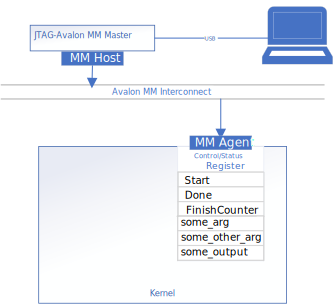

This example is intended for users interested in creating standalone modules that can be included in Intel® Quartus® Prime projects. It serves as a minimal example, and while it targets a specific board, a user familiar with the Intel® Quartus® Prime Software Suite should be able to easily port this design to other hardware.

### Board-specific Considerations

This design is intended to work with the Intel® Arria® 10 SX SoC Development Kit. These board-specific configurations are not guaranteed to work with different boards:
1. Choose `10AS066N3F40E2SG` device to match the devkit
2. Choose pin `PIN_AM10` to drive the `i_clk` signal
3. Choose pin `PIN_AR23` to drive the `fpga_led` signal
4. Choose pin `PIN_AV21` to drive the `reset_button_n` signal
5. Use `jtag.sdc` from the Intel® Arria® 10 SoC Golden Hardware Reference Design (GHRD) [source code](https://github.com/altera-opensource/ghrd-socfpga).

## Building the `platform_designer` Tutorial

> **Note**: When working with the command-line interface (CLI), you should configure the oneAPI toolkits using environment variables. 
> Set up your CLI environment by sourcing the `setvars` script located in the root of your oneAPI installation every time you open a new terminal window. 
> This practice ensures that your compiler, libraries, and tools are ready for development.
>
> Linux*:
> - For system-wide installations: `. /opt/intel/oneapi/setvars.sh`
> - For private installations: ` . ~/intel/oneapi/setvars.sh`
> - For non-POSIX shells, like csh, use the following command: `bash -c 'source <install-dir>/setvars.sh ; exec csh'`
>
> Windows*:
> - `C:\Program Files(x86)\Intel\oneAPI\setvars.bat`
> - Windows PowerShell*, use the following command: `cmd.exe "/K" '"C:\Program Files (x86)\Intel\oneAPI\setvars.bat" && powershell'`
>
> For more information on configuring environment variables, see [Use the setvars Script with Linux* or macOS*](https://www.intel.com/content/www/us/en/develop/documentation/oneapi-programming-guide/top/oneapi-development-environment-setup/use-the-setvars-script-with-linux-or-macos.html) or [Use the setvars Script with Windows*](https://www.intel.com/content/www/us/en/develop/documentation/oneapi-programming-guide/top/oneapi-development-environment-setup/use-the-setvars-script-with-windows.html).

Follow these steps to compile and test the design:
1. Compile the SYCL code to RTL. Although this design supports emulation and simulation like other FPGA code samples, they are not the focus of this tutorial. The emulation and simulation commands have been omitted.

   Linux:

   ```bash
   $> cd add-oneapi
   $> mkdir build
   $> cd build
   $> cmake ..
   $> make report
   ```

   Windows:

   ```bash
   > cd add-oneapi
   > mkdir build
   > cd build
   > cmake -G "NMake Makefiles" ..
   > nmake report
   ```

2. **From the same terminal**, prepare a project directory for the Intel® Quartus® Prime project and copy the source files `add.sv` and `jtag.sdc` from the `add-quartus-sln` into it. Then launch the Intel® Quartus® Prime Pro Edition GUI, and create a new Intel® Quartus® Prime project using the 'New Project' wizard.

   > **Note**: You may confirm your Intel® Quartus® Prime project settings by comparing with the sample Intel® Quartus® Prime project included in the `add-quartus-sln` directory.

   Linux:
   
   ```
   $> cd ../../
   $> mkdir add-quartus
   $> cp add-quartus-sln/add.sv add-quartus
   $> cp add-quartus-sln/jtag.sdc add-quartus
   $> cd add-quartus
   $> quartus
   ```

   Windows:
   
   ```
   > cd ..\..\
   > mkdir add-quartus
   > xcopy add-quartus-sln\add.sv add-quartus
   > xcopy add-quartus-sln\jtag.sdc add-quartus
   > cd add-quartus
   > quartus.exe
   ```

   1. Set the project directory to be the `add-quartus` directory.

   2. Set the top-level entity to be `add` to make project management easier.

      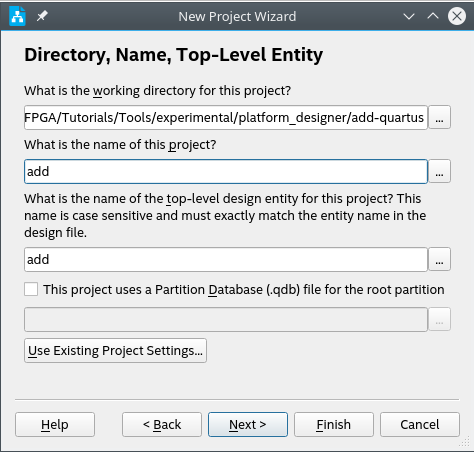

   3. Make sure you choose an appropriate device. See **Board-specific Considerations** above.

   4. Choose **Empty Project** when prompted to select a project type.

   5. Add the source file `add.sv` and `jtag.sdc` to the design when the wizard prompts you. These may be copied from `add-quartus-sln`.

      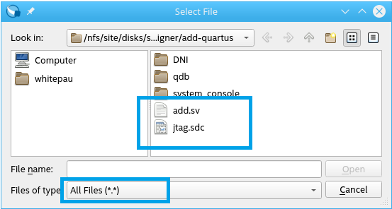

3. Copy the IP you generated in Step 1 to the Intel Quartus® Prime project. 

   Linux:

   ```
   $> cd .. # navigate to project root if not there already
   $> cp -r add-oneapi/build/add.report.prj/ add-quartus/
   ```

   Windows:

   ```
   > cd .. # navigate to project root if not there already
   > ROBOCOPY add-oneapi\build\add.report.prj\ add-quartus\add.report.prj\ /S
   ```

4. Create the Platform Designer system.

   1. Open Platform Designer from the Intel® Quartus® Prime GUI:

      

   2. Create a new system by clicking the 'New Platform Designer System' button (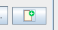) and name it `add_kernel_wrapper.qsys`.

   3. Disconnect the clock from the `Reset Bridge` IP:

      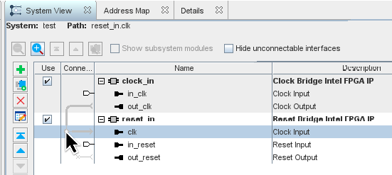

   4. Configure the `Reset Bridge` IP as shown:

      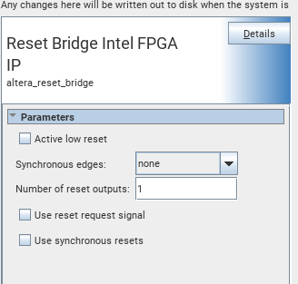

   5. Add the following IP to your system:

      * Basic Functions > Bridges and Adaptors > Memory Mapped > **JTAG to Avalon Master Bridge Intel® FPGA IP**

      * oneAPI > **add_report_di**

      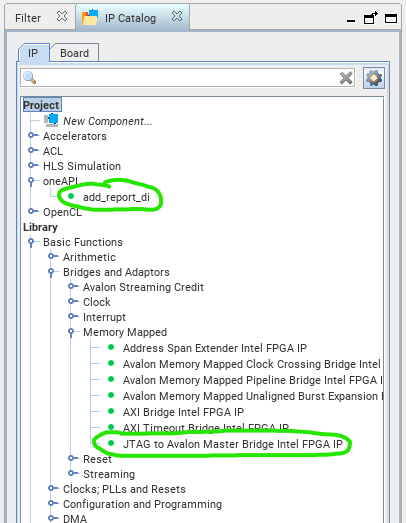

      > **Note**: If you cannot see the oneAPI IP component, refresh Platform Designer by clicking `File` > `Refresh System`
      >
      > 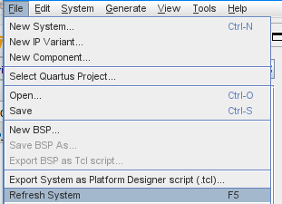

   6. Connect the modules as shown:

      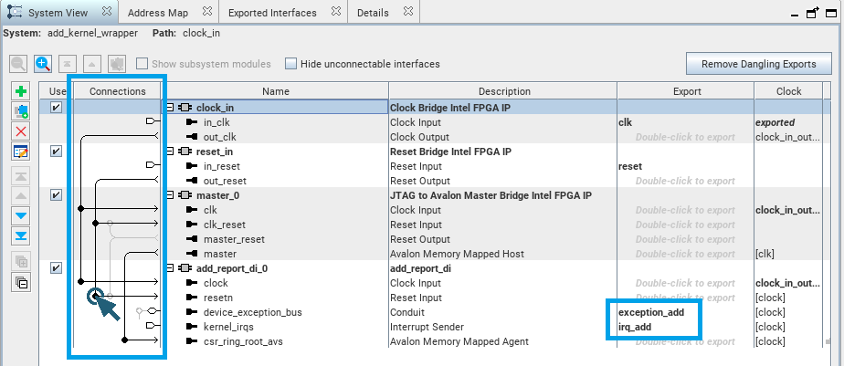

      Don't forget to export the `irq_add` and `exception_add` signals. The provided top-level RTL file (`add.sv`) uses the generated IP. Following these naming conventions allows the IP to connect to this handwritten RTL.

   7. Save the system by clicking `File` > `Save`

   8. Make sure there are no errors in the 'System Messages' panel.

   9. Generate the system so that it can be included in the Intel® Quartus® Prime project by clicking `Generate HDL...`

      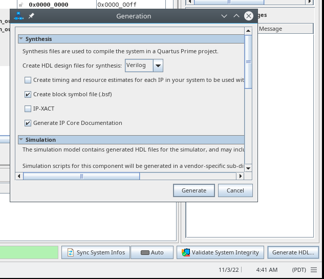

   10. Close Platform Designer. 
   
6. In the Intel® Quartus® Prime window, run Analysis and Elaboration by clicking 'Start Analysis and Elaboration'.

   

7. Select pins for the `i_clk` and `reset_button_n` inputs and `fpga_led` output. The JTAG to Avalon® Master Bridge Intel FPGA IP handles the connection between your design and the JTAG pins on your board automatically.

   1. Open the pin planner using `Assignments` > `Pin Planner` in the main Intel® Quartus® Prime GUI. Consult the data sheet for your board to choose an appropriate clock input. In this project, the `PIN_AM10` was chosen because it supplies a 100MHz clock signal in the the GHRD source code (see link in **Board-specifc Considerations**).

   2. Assign pins for the `fpga_led` and `reset_button_n` signals using the same method:
   
      *Pin planner from GHRD:*

      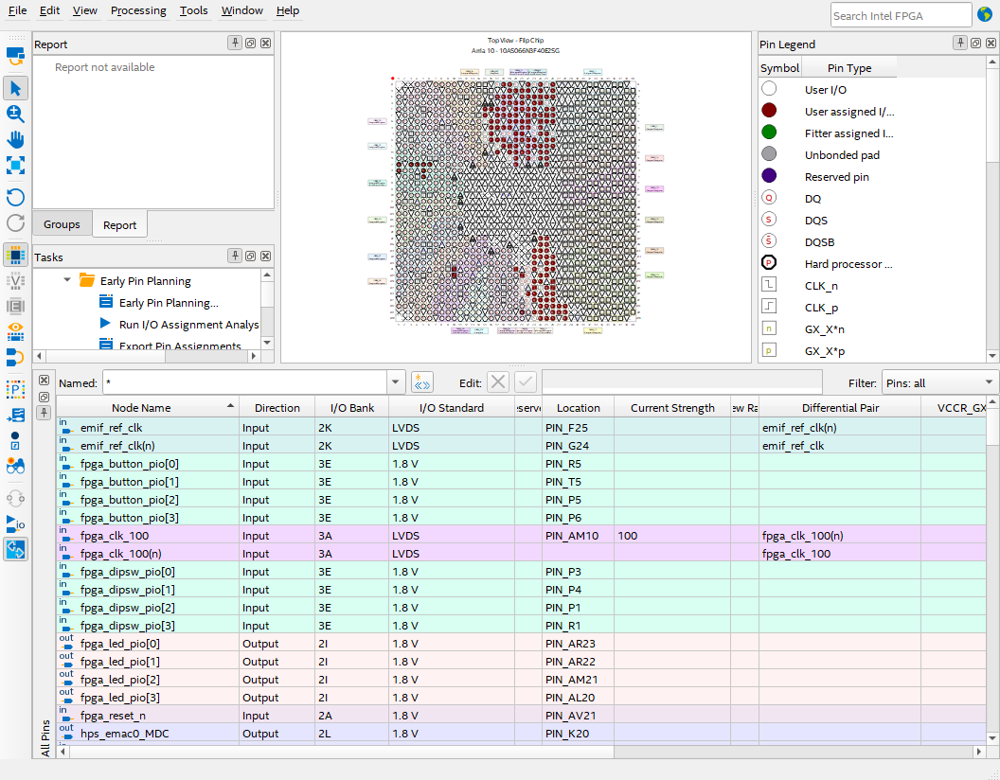

      *Final pin planner configuration:*

      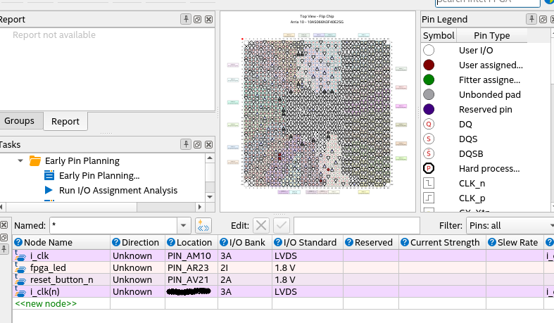

      > **Note**: If you cannot see the pin details, click the `All Pins` button in the bottom left corner of the Pin Planner GUI.
      > 
      > 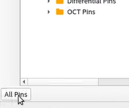

      > **Note**: Make sure you choose 'LVDS' for the I/O standard of `i_clk`, the pin location will be automatically populated for `i_clk(n)`.

8. Add the timing constraints. 

   1. If you are using the Intel® Arria® 10 SX SoC Dev Kit, you can find a timing constraints file for the JTAG interface (jtag.sdc) in the GHRD. This file was added during project creation.

   2. Create a new Synopsis Design Constraints (SDC) file named `add.sdc` and insert a new clock called `i_clk` to match the clock you defined in `add.sv`. Set the period to be 10ns:

      ```
      set_time_format -unit ns -decimal_places 3
      create_clock -name i_clk -period 10 [get_ports {i_clk}]
      ```

   3. Cut the clock paths for asynchronous I/O:
      
      ```
      set_false_path -from [get_ports {reset_button_n}] -to * 
      set_false_path -from [get_ports {fpga_led}] -to *
      set_false_path -from * -to [get_ports {fpga_led}]
      ```

9. Compile the full design by clicking the 'Start Compilation' button in the Intel® Quartus® Prime GUI.

      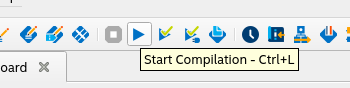

10. Copy the generated `add.sof` file to the `system_console` directory.

   Linux:

   ```
   $> cp add-quartus/output_files/add.sof system_console
   ```

   Windows:

   ```
   > xcopy add-quartus\output_files\add.sof system_console
   ```

### Additional Documentation
- [Intel® Arria® 10 SoC Golden System Reference Design](https://rocketboards.org/foswiki/Documentation/Arria10SoCGSRD) describes a reference design you can use with your Intel® Arria® 10 SX SoC Developer kit.
- [Intel® Arria® 10 SX SoC Development Kit](https://www.intel.com/content/www/us/en/products/details/fpga/development-kits/arria/10-sx.html) describes the Intel® Arria® 10 SX SoC Development kit in greater detail.
- [Intel® FPGA Software Installation and Licensing](https://www.intel.com/content/www/us/en/docs/programmable/683472/current/) describes how to license Intel® Quartus® Prime Pro Edition software.
- [Intel® Quartus® Prime Pro Edition User Guide: Getting Started](https://www.intel.com/content/www/us/en/docs/programmable/683463/current/) introduces you to the Intel® Quartus® Prime Pro Edition software.
- [Intel® Quartus® Prime Pro Edition User Guide: Platform Designer](https://www.intel.com/content/www/us/en/docs/programmable/683609/current/) describes the Intel® Platform Designer software.
- [Intel® Quartus® Prime Pro Edition User Guide: Programmer](https://www.intel.com/content/www/us/en/docs/programmable/683039/current/) describes the Intel® Quartus® Prime Pro Programmer software.

## Running the Sample

Use the `test.bat` script in the `system_console` directory to flash the design to your development board, and launch the system console. The included `.tcl` script in the `system_console` directory demonstrates how to use the System Console to interact with your IP through the JTAG to Avalon® Master Bridge Intel FPGA IP on the FPGA.

To move the design to a different computer, copy the `system_console` and directories from the `add-quartus` directory.

See output:

```
> test.bat
Info: *******************************************************************
Info: Running Quartus Prime Programmer
<output from Intel® Quartus® Prime programmer>
Info: Quartus Prime Programmer was successful. 0 errors, 0 warnings
    Info: Peak virtual memory: 1309 megabytes
    Info: Processing ended: Wed Feb  8 15:26:54 2023
    Info: Elapsed time: 00:00:20
    Info: System process ID: 16980
Press any key to continue . . . 

---------------------------------------
---------------------------------------
 Welcome to Intel's FPGA System Console

<etc.>
---------------------------------------
% source test_add.tcl
Resetting IP...
TEST 1: READ OUTPUT AFTER RESET
Read outputs
  Data   (0x88): 0x00000000 0x00000000
  Status (0x00): 0x00050000 0x00000000
  finish (0x30): 0x00000000 0x00000000

TEST 2: LOAD INPUTS AND CHECK OUTPUT
press 'enter' key to load inputs ==>
Store 1 to address 0x80
Store 2 to address 0x84
Set 'Start' bit to 1
Check that IRQ LED is lit, then press 'enter' key to consume outputs ==>
Read outputs
  Data   (0x88): 0x00000003 0x00000000
  Status (0x00): 0x00050002 0x00000000
  finish (0x30): 0x00000001 0x00000000

press 'enter' key to load inputs ==>
Store 3 to address 0x80
Store 3 to address 0x84
Set 'Start' bit to 1
Check that IRQ LED is lit, then press 'enter' key to consume outputs ==>
Read outputs
  Data   (0x88): 0x00000006 0x00000000
  Status (0x00): 0x00050002 0x00000000
  finish (0x30): 0x00000001 0x00000000

TEST 3: LOAD INPUTS WITHOUT CHECKING OUTPUT
press 'enter' key to load inputs ==>
Store 5 to address 0x80
Store 4 to address 0x84
Set 'Start' bit to 1
Check that IRQ LED is lit, then press 'enter' key to overload inputs without consuming outputs ==>
Store 64 to address 0x80
Store 64 to address 0x84
Set 'Start' bit to 1
Check that IRQ LED is lit, then press 'enter' key to overload inputs without consuming outputs ==>
Store 7 to address 0x80
Store 8 to address 0x84
Set 'Start' bit to 1
Check that IRQ LED is lit, then press 'enter' key to consume outputs ==>
Read outputs
  Data   (0x88): 0x0000000f 0x00000000
  Status (0x00): 0x00050002 0x00000000
  finish (0x30): 0x00000003 0x00000000

TEST 4: READ OUTPUT AFTER NO PENDING INPUTS
press 'enter' key to consume outputs ==>
Read outputs
  Data   (0x88): 0x0000000f 0x00000000
  Status (0x00): 0x00050000 0x00000000
  finish (0x30): 0x00000000 0x00000000

Test complete.
```

## License
Code samples are licensed under the MIT license. See
[License.txt](https://github.com/oneapi-src/oneAPI-samples/blob/master/License.txt) for details.

Third party program Licenses can be found here: [third-party-programs.txt](https://github.com/oneapi-src/oneAPI-samples/blob/master/third-party-programs.txt).
