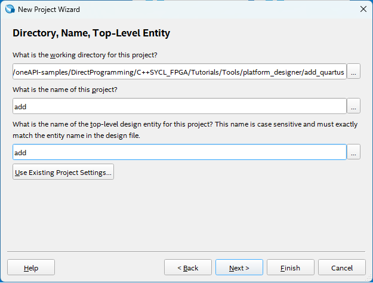
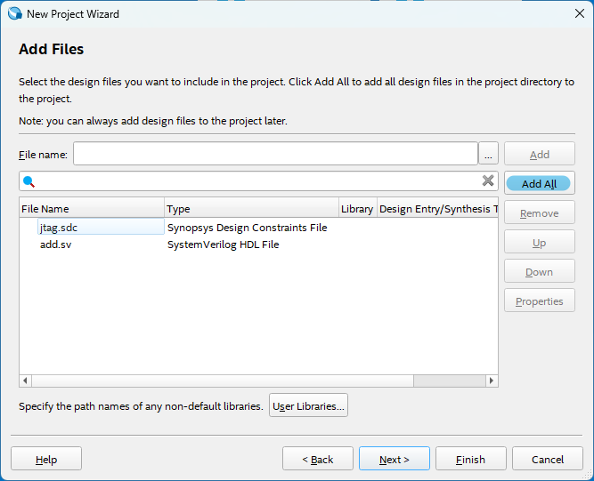
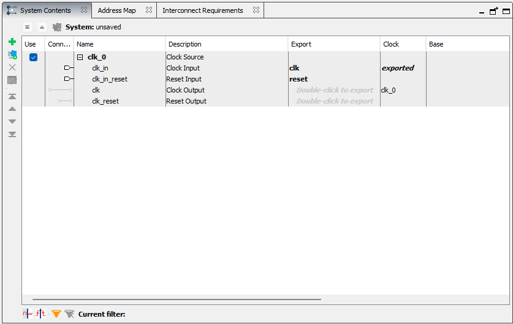
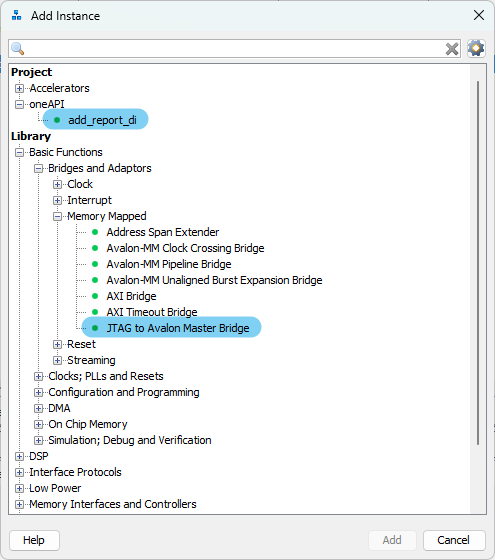
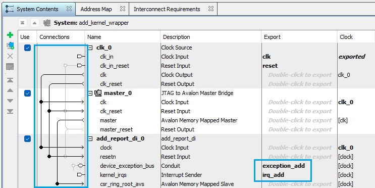
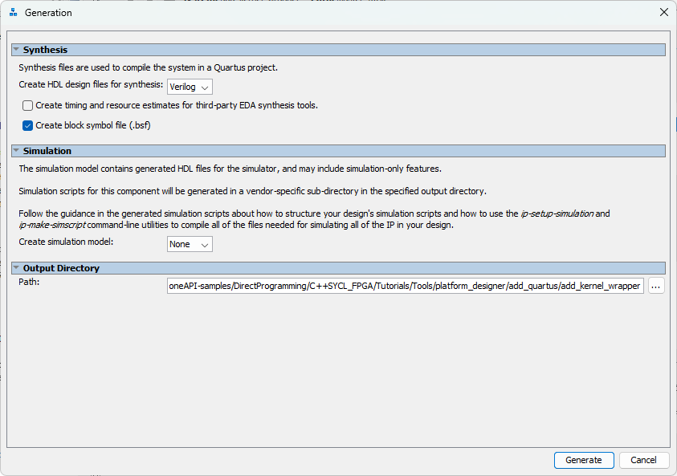
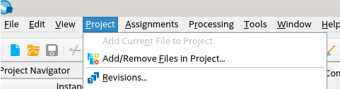
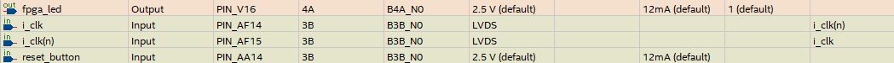
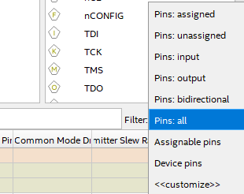

# `Platform Designer Standard` Sample

This example design shows how to use an FPGA IP produced with the Intel® oneAPI DPC++/C++ Compiler with the Intel® Quartus® Prime Standard Edition.

| Optimized for                     | Description
|:---                               |:---
| OS                                | Ubuntu* 20.04 <br> RHEL*/CentOS* 8 <br> SUSE* 15 <br> Windows* 10 <br> Windows Server* 2019
| Hardware                          | This process applies to the Cyclone® V line of FPGAs, but the sample Intel® Quartus® Prime Standard Edition project targets the [Terasic DE1-SOC Development Board](https://de1-soc.terasic.com/)
| Software                          | Intel® oneAPI DPC++/C++ Compiler <br> Intel® Quartus® Prime Standard Edition Version 22.3 or later
| What you will learn               | How to integrate an RTL IP generated from a SYCL kernel with an Intel® Quartus® Prime Standard Edition
| Time to complete                  | 1 hour

> **Note**: Even though the Intel DPC++/C++ oneAPI compiler is enough to compile for emulation, generating reports and generating RTL, there are extra software requirements for the simulation flow and FPGA compiles.
>
> To use the simulator flow, Intel® Quartus® Prime Standard Edition and one of the following simulators must be installed and accessible through your PATH:
> - Questa*-Intel® FPGA Edition
> - Questa*-Intel® FPGA Starter Edition
> - Questa* Advanced Simulator
> - ModelSim® SE
>
> To use the hardware compile flow, Intel® Quartus® Prime Standard Edition must be installed and accessible through your PATH.

## Prerequisites

This sample is part of the FPGA code samples.
It is categorized as a Tier 1 sample that helps you getting started.


Find more information about how to navigate this part of the code samples in the [FPGA top-level README.md](/DirectProgramming/C++SYCL_FPGA/README.md).
You can also find more information about [troubleshooting build errors](/DirectProgramming/C++SYCL_FPGA/README.md#troubleshooting), [running the sample on the Intel® DevCloud](/DirectProgramming/C++SYCL_FPGA/README.md#build-and-run-the-samples-on-intel-devcloud-optional), [using Visual Studio Code with the code samples](/DirectProgramming/C++SYCL_FPGA/README.md#use-visual-studio-code-vs-code-optional), [links to selected documentation](/DirectProgramming/C++SYCL_FPGA/README.md#documentation), etc.

## Purpose

This sample demonstrates how to:

* Compile a SYCL kernel into an IP component
* Add the IP component to an Intel® Platform Designer system
* Add the Platform Designer system to a top-level entity in a Intel® Quartus® Prime project
* Compile and run the resulting system on a hardware board. 

The sample uses the JTAG to Avalon® Master Bridge Intel FPGA IP to connect your IP component to the JTAG control interface. You can use the System Console application to control and observe the behavior of your IP component.


This example is intended for users interested in creating standalone modules that can be included in Intel® Quartus® Prime projects. It serves as a minimal example, and while it targets a specific board, a user familiar with the Intel® Quartus® Prime Software Suite should be able to easily port this design to other hardware.

## Key Implementation Details

This tutorial is structured with four source code directories.

| Source Directory  | Description
|:--                |:--
| `add_oneapi`      | The source and build scripts needed to compile a simple IP using oneAPI
| `add_quartus_sln` | An example of the project files that are created using the Intel® Quartus® Prime GUI
| `starting_files`  | The minimal source files you need to create a Intel® Quartus® Prime project. Additional project files are created using the Intel® Quartus® Prime GUI.
| `system_console`  | Scripts for controlling the System Console application while you test the design in hardware

### Board-specific Considerations

This design is intended to work with the Terasic DE1-SOC Development Board. These board-specific configurations are not guaranteed to work with different boards:
1. Choose `5CSEMA5F31C6` device to match the devkit
2. Choose pin `PIN_AF14` to drive the `i_clk` signal
3. Choose pin `PIN_V16` to drive the `fpga_led` signal
4. Choose pin `PIN_AA14` to drive the `reset_button` signal

## Building the `platform_designer_standard` Tutorial

> **Note**: When working with the command-line interface (CLI), you should configure the oneAPI toolkits using environment variables. 
> Set up your CLI environment by sourcing the `setvars` script located in the root of your oneAPI installation every time you open a new terminal window. 
> This practice ensures that your compiler, libraries, and tools are ready for development.
>
> Linux*:
> - For system-wide installations: `. /opt/intel/oneapi/setvars.sh`
> - For private installations: ` . ~/intel/oneapi/setvars.sh`
> - For non-POSIX shells, like csh, use the following command: `bash -c 'source <install-dir>/setvars.sh ; exec csh'`
>
> Windows*:
> - `C:\"Program Files (x86)"\Intel\oneAPI\setvars.bat`
> - Windows PowerShell*, use the following command: `cmd.exe "/K" '"C:\Program Files (x86)\Intel\oneAPI\setvars.bat" && powershell'`
>
> For more information on configuring environment variables, see [Use the setvars Script with Linux* or macOS*](https://www.intel.com/content/www/us/en/develop/documentation/oneapi-programming-guide/top/oneapi-development-environment-setup/use-the-setvars-script-with-linux-or-macos.html) or [Use the setvars Script with Windows*](https://www.intel.com/content/www/us/en/develop/documentation/oneapi-programming-guide/top/oneapi-development-environment-setup/use-the-setvars-script-with-windows.html).

Follow these steps to compile and test the design:
1. Compile the SYCL code to RTL. Although this design supports emulation and simulation like other FPGA code samples, they are not the focus of this tutorial. The emulation and simulation commands have been omitted.

   Linux:

   ```bash
   $> mkdir build
   $> cd build
   $> cmake ../add_oneapi
   $> make report
   $> cd ..
   ```

   Windows:

   ```bash
   > mkdir build
   > cd build
   > cmake -G "NMake Makefiles" ../add_oneapi
   > nmake report
   > cd ..
   ```

2. **From the same terminal**, prepare a project directory called `add_quartus` for the Intel® Quartus® Prime project and copy the source files `add.sv` and `jtag.sdc` from the `starting_files` directory into it. Then launch the Intel® Quartus® Prime Standard Edition GUI, and create a new Intel® Quartus® Prime project using the 'New Project' wizard.

   > **Note**: You may confirm your Intel® Quartus® Prime project settings by comparing with the sample Intel® Quartus® Prime project included in the `add_quartus_sln` directory.

   Linux:
   
   ```bash
   $> mkdir add_quartus
   $> cp -r starting_files/* add_quartus/
   $> cd add_quartus
   $> quartus
   ```

   Windows:
   
   ```bash
   > mkdir add_quartus
   > ROBOCOPY starting_files/ add_quartus/ /S /NFL /NDL
   > cd add_quartus
   > quartus.exe
   ```

   1. Set the project directory to be the `add_quartus` directory.

   2. Set the top-level entity to be `add` to make project management easier.

      

   3. Make sure you choose an appropriate device. See **Board-specific Considerations** above.

   4. Choose **Empty Project** when prompted to select a project type.

   5. Add the source file `add.sv` and `jtag.sdc` to the design when the wizard prompts you. These may be copied from `starting_files`.

      

      `add.sv` is the top-level entity of this design. It instantiates an instance of the Platform Designer system that contains your simple SYCL HLS IP.
      
      `jtag.sdc` contains timing constraints for the JTAG IP.

3. Copy the IP you generated in Step 1 to the Intel Quartus® Prime project. 

   Linux:

   ```bash
   $> cd .. # navigate to build root if not there already
   $> cp -r build/add.report.prj/ add_quartus/
   ```

   Windows:

   ```bash
   > cd .. # navigate to build root if not there already
   > ROBOCOPY build\add.report.prj\ add_quartus\add.report.prj\ /S /NFL /NDL
   ```

4. Create the Platform Designer system.

   1. Open Platform Designer from the Intel® Quartus® Prime GUI. A a blank system will be created for you. 

   2. Add the following IP to your system:

      * Basic Functions > Bridges and Adaptors > Memory Mapped > **JTAG to Avalon Master Bridge Intel® FPGA IP**

      * oneAPI > **add_report_di**

      

      > **Note**: If you cannot see the oneAPI IP component, refresh Platform Designer by clicking `File` > `Refresh System`
      > 

   3. Connect the modules as shown:

      

      Don't forget to export the `irq_add` and `exception_add` signals. The provided top-level RTL file (`add.sv`) uses the generated IP. Following these naming conventions allows the IP to connect to this handwritten RTL.

   4. Save the system by clicking `File` > `Save` and name it `add_kernel_wrapper.qsys`.

   5. Make sure there are no errors in the 'System Messages' panel.

   6. Generate the system so that it can be included in the Intel® Quartus® Prime project by clicking `Generate HDL...`

      

   7. Close Platform Designer. 
   >  **Note**: Upon closing the Platform Designer window, if you are prompted to add this IP to your Quartus project, please follow the instructions in the pop-up window by clicking `Project` > `Add/Remove Files in Project` to add the IP files.
   > 

5. In the Intel® Quartus® Prime window, run Analysis and Elaboration by clicking 'Start Analysis and Elaboration'.

   

6. Select pins for the `i_clk` and `reset_button` inputs and `fpga_led` output. The JTAG to Avalon® Master Bridge Intel FPGA IP handles the connection between your design and the JTAG pins on your board automatically.

   1. Open the pin planner using `Assignments` > `Pin Planner` in the main Intel® Quartus® Prime GUI. In the bottom pane of the Pin Planner GUI, you will find a list of signals to assign pins to. Consult the data sheet for your board to choose an appropriate clock input. Double-click the *Location* cell and select a proper clock input. In this project, the `PIN_AF14` was chosen because it supplies a 50MHz clock signal.

   2. Assign pins for the `fpga_led` and `reset_button` signals using the same method. Your final pin assignment should match with the following screenshot.

      *Final pin planner configuration:*

      

      > **Note**: If you cannot see the pin details, click the `All Pins` button in the top left corner of the bottom pane in Pin Planner GUI.
      > 
      > 

      > **Note**: Make sure you choose 'LVDS' for the I/O standard of `i_clk`, the pin location will be automatically populated for `i_clk(n)`.

7. Compile the full design by clicking the 'Start Compilation' button in the Intel® Quartus® Prime GUI.

      

8. Copy the generated `add.sof` file to the `system_console` directory.

   Linux:

   ```bash
   $> cp add_quartus/output_files/add.sof system_console
   ```

   Windows:

   ```bash
   > xcopy add_quartus\output_files\add.sof system_console /Y
   ```

You may also build the SOF using the pre-generated Intel® Quartus® Prime project in the `add_quartus_sln` directory by executing the included `build_system.tcl` script. This script has been verified against the latest version of Quartus® Prime Standard Edition software available at the time of writing (23.1). The script and pre-generated project may not work with other versions of Quartus® Prime.

   Linux:

   ```bash
   mkdir build_pd_system
   cd build_pd_system
   quartus_sh -t ../build_system.tcl
   ```

   Windows:

   ```bash
   mkdir build_pd_system
   cd build_pd_system
   quartus_sh -t ..\build_system.tcl
   ```

### Additional Documentation
- [Intel® Cyclone® V SoC Golden System Reference Design](https://www.rocketboards.org/foswiki/Documentation/CycloneVSoCGSRD) describes a reference design you can use with your Intel® Cyclone® V SoC FPGA.
- [Intel® Cyclone® V FPGA and SoC FPGA](https://www.intel.com/content/www/us/en/products/details/fpga/cyclone/v.html) describes the Intel® Cyclone® V FPGA in greater detail.
- [Intel® Quartus® Prime Standard Edition User Guide: Getting Started](https://www.intel.com/content/www/us/en/docs/programmable/683475/current/introduction-to.html) introduces you to the Intel® Quartus® Prime Standard software.
- [Intel® Quartus® Prime Standard Edition User Guide: Platform Designer](https://www.intel.com/content/www/us/en/docs/programmable/683364/current/creating-a-system-with.html) describes the Intel® Platform Designer software.
- [Intel® Quartus® Prime Standard Edition User Guide: Programmer](https://www.intel.com/content/www/us/en/docs/programmable/683528/current/programming-fpga-devices.html) describes the Intel® Quartus® Prime Standard Programmer software.
- [Intel® Quartus® Prime Standard Edition User Guide: Debug Tools](https://www.intel.com/content/www/us/en/docs/programmable/683552/current/system-console-commands.html) describes the console commands enable testing.

## Running the Sample

Use the `test.bat` script in the `system_console` directory to flash the design to your development board, and launch the system console to execute the testing script. During the programming process, the TX LED on the board will illuminate, indicating successful programming. During the test, each data transaction will trigger both the TX and RX LEDs to blink, indicating active communication. The included `.tcl` script in the `system_console` directory demonstrates how to use the System Console to interact with your IP through the JTAG to Avalon® Master Bridge Intel FPGA IP on the FPGA.

To move the design to a different computer for testing, copy the entire `system_console` directory, along with `add.sof`.

See output:

```
<output from Intel® Quartus® Prime programmer>
Info: Quartus Prime Programmer was successful. 0 errors, 0 warnings
    Info: Peak virtual memory: 4465 megabytes
    Info: Processing ended: Mon Aug 26 13:33:39 2024
    Info: Elapsed time: 00:00:05
    Info: Total CPU time (on all processors): 00:00:00
Press any key to continue . . .
<output from Intel® Quartus® Prime Tcl Shell>
Info: Command: quartus_sh -t test_add.tcl
Info (345047): Preparing to create a connection to System Console. This may take several seconds.
Info (345009): A connection to System Console was successfully established on port 58780
TEST 1: READ OUTPUT AFTER RESET
Read outputs
  Data   (0x88): 0x00000000 0x00000000
  Status (0x00): 0x00050000 0x00000000
  finish (0x30): 0x00000000 0x00000000

TEST 2: LOAD INPUTS AND CHECK OUTPUT
press 'enter' key to load inputs ==>
Store 1 to address 0x80
Store 2 to address 0x84
Set 'Start' bit to 1
Check that IRQ LED is lit, then press 'enter' key to consume outputs ==>
Read outputs
  Data   (0x88): 0x00000003 0x00000000
  Status (0x00): 0x00050002 0x00000000
  finish (0x30): 0x00000001 0x00000000

press 'enter' key to load inputs ==>
Store 3 to address 0x80
Store 3 to address 0x84
Set 'Start' bit to 1
Check that IRQ LED is lit, then press 'enter' key to consume outputs ==>
Read outputs
  Data   (0x88): 0x00000006 0x00000000
  Status (0x00): 0x00050002 0x00000000
  finish (0x30): 0x00000001 0x00000000

TEST 3: LOAD INPUTS WITHOUT CHECKING OUTPUT
press 'enter' key to load inputs ==>
Store 5 to address 0x80
Store 4 to address 0x84
Set 'Start' bit to 1
Check that IRQ LED is lit, then press 'enter' key to overload inputs without consuming outputs ==>
Store 64 to address 0x80
Store 64 to address 0x84
Set 'Start' bit to 1
Check that IRQ LED is lit, then press 'enter' key to overload inputs without consuming outputs ==>
Store 7 to address 0x80
Store 8 to address 0x84
Set 'Start' bit to 1
Check that IRQ LED is lit, then press 'enter' key to consume outputs ==>
Read outputs
  Data   (0x88): 0x0000000f 0x00000000
  Status (0x00): 0x00050002 0x00000000
  finish (0x30): 0x00000003 0x00000000

TEST 4: READ OUTPUT AFTER NO PENDING INPUTS
press 'enter' key to consume outputs ==>
Read outputs
  Data   (0x88): 0x0000000f 0x00000000
  Status (0x00): 0x00050000 0x00000000
  finish (0x30): 0x00000000 0x00000000

Test complete.
Info (23030): Evaluation of Tcl script test_add.tcl was successful
Info: Quartus Prime Shell was successful. 0 errors, 0 warnings
    Info: Peak virtual memory: 4803 megabytes
    Info: Processing ended: Mon Aug 26 13:36:06 2024
    Info: Elapsed time: 00:01:04
    Info: Total CPU time (on all processors): 00:00:13
Info (345011): The connection to System Console has been shutdown successfully.
```

## License
Code samples are licensed under the MIT license. See
[License.txt](/License.txt) for details.

Third party program Licenses can be found here: [third-party-programs.txt](/third-party-programs.txt).
