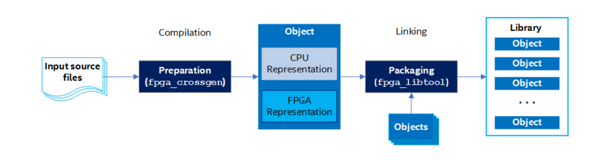
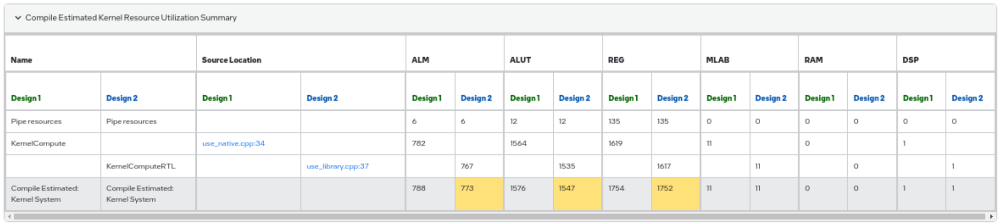

# Using FPGA Cross-Language Libraries

This FPGA tutorial demonstrates how to build SYCL device libraries from RTL sources and use them in your SYCL design.

| Area                  | Description
|:---                   |:---
| What you will learn   | How to integrate Verilog directly into your oneAPI program and emulate it using a C model, as well as pulling the RTL directly into your full system design.
| Time to complete      | 30 minutes
| Category              | Concepts and Functionality
## Purpose

This FPGA tutorial demonstrates how to build SYCL device libraries from RTL sources and use them in your SYCL design. An RTL library is useful for embedding high performance FPGA code, handwritten in Verilog into your oneAPI program.

## Prerequisites
| Optimized for                     | Description
|:---                               |:---
| OS                                | Ubuntu* 20.04 <br> RHEL*/CentOS* 8 <br> SUSE* 15 <br> Windows* 10 <br> Windows Server* 2019
| Hardware                          | Intel® Agilex® 7, Arria® 10, Stratix® 10, and Cyclone® V FPGAs
| Software                          | Intel® oneAPI DPC++/C++ Compiler

> **Note**: Even though the Intel DPC++/C++ OneAPI compiler is enough to compile for emulation, generating reports and generating RTL, there are extra software requirements for the simulation flow and FPGA compiles.
>
> For using the simulator flow, Intel® Quartus® Prime Pro Edition (or Standard Edition when targeting Cyclone® V) and one of the following simulators must be installed and accessible through your PATH:
> - Questa*-Intel® FPGA Edition
> - Questa*-Intel® FPGA Starter Edition
> - ModelSim® SE
>
> When using the hardware compile flow, Intel® Quartus® Prime Pro Edition (or Standard Edition when targeting Cyclone® V) must be installed and accessible through your PATH.
>
> :warning: Make sure you add the device files associated with the FPGA that you are targeting to your Intel® Quartus® Prime installation.


This sample is part of the FPGA code samples.
It is categorized as a Tier 3 sample that demonstrates the usage of a tool.


Find more information about how to navigate this part of the code samples in the [FPGA top-level README.md](/DirectProgramming/C++SYCL_FPGA/README.md).
You can also find more information about [troubleshooting build errors](/DirectProgramming/C++SYCL_FPGA/README.md#troubleshooting), [running the sample on the Intel® DevCloud](/DirectProgramming/C++SYCL_FPGA/README.md#build-and-run-the-samples-on-intel-devcloud-optional), [using Visual Studio Code with the code samples](/DirectProgramming/C++SYCL_FPGA/README.md#use-visual-studio-code-vs-code-optional), [links to selected documentation](/DirectProgramming/C++SYCL_FPGA/README.md#documentation), etc.


### Source Code Description

This tutorial includes two designs, each in separate kernel. Both designs multiply two 27-bit inputs together to produce a 54-bit output. In `NativeMult27x27` functor, a 27x27 multiplication is described with native C++ code. 
In `RtlMult27x27` functor, RTL code is used to customize a DSP block to perform the multiplication more optimally. You can observe the impact on area utilization and performance by comparing the two designs.
This code sample demonstrates how to use a simple RTL library in a simple FPGA IP produced with the Intel® oneAPI DPC++/C++ Compiler, since the area changes in this sample are quite small. You can use the `fpga_crossgen` and `fpga_libtool` commands to generate RTL libraries for multiarchitecture binary kernel (full system) designs as well.
This graphic illustrates the Library Toolchain Creation Process:


### Use of RTL libraries in SYCL

Files needed to create a SYCL target library from RTL source include:
- Verilog, System Verilog, or VHDL files that define the RTL component
- An Object Manifest File (.xml) which contains properties needed to integrate RTL component into SYCL pipeline
- A header file containing valid SYCL kernel language and declares the signatures of functions implemented by the RTL component.
- A SYCL based C++ model file for RTL component

The RTL is used when compiling for hardware and simulation, and the C++ model is used when compiling for the FPGA emulator.
After having created the library file, the function in the library can be called from the SYCL kernel, without the need to know the hardware design or implementation details on underlying functions in the library.

Given a workable RTL module, one may need to apply some modifications in order to integrate it into oneAPI program.
1. An RTL module must use a single Avalon® streaming input interface. Multiple input signals are allowed, but they must synchronize with a single ready/valid handshake.
Your RTL library's interface must include a `clock` port, a `resetn` port, and a single Avalon® streaming interface input and single output port (that is: `ivalid`, `ovalid`, `iready`, `oready`). Your RTL module may have multiple input data signals, but only a single output.

    

    > **Note**: The signal names must match the ones specified in the .xml file. An error occurs during library creation if a signal name is inconsistent.
    > You may find full list of RTL support constraints in [Restrictions and Limitations in RTL Support](https://www.intel.com/content/www/us/en/docs/oneapi/programming-guide/2023-2/restrictions-and-limitations-in-rtl-support.html).

2. The RTL library’s characteristics need to be specified. For example, this tutorial RTL library has specified the latency of the RTL component, that needs to be specified in object manifest file (.xml) under ATTRIBUTES. For other ATTRIBUTES-specific elements, refer to [Object Manifest File Syntax of an RTL Module](https://www.intel.com/content/www/us/en/docs/oneapi/programming-guide/2023-2/object-manifest-file-syntax-of-an-rtl-library.html) for additional information.

    > **Note**: It is challenging to debug an RTL module that works correctly on its own but works incorrectly as part of a SYCL kernel. Double-check all parameters under the ATTRIBUTES element in the object manifest file (.xml).


### Generating a library

To create a library from  source code, use the following steps:

1. `fpga_crossgen` creates object file that contains representations for target devices (FPGA) and FPGA emulator. The following command instructs `fpga_crossgen` to generate SYCL target objects from an RTL source in this tutorial:

   ```bash
   # Linux
   fpga_crossgen lib_rtl_spec.xml --cpp_model lib_rtl_model.cpp -o lib_rtl.o

   # Windows
   fpga_crossgen lib_rtl_spec.xml --cpp_model lib_rtl_model.cpp -o lib_rtl.obj
   ```

   Note that generating an RTL library requires that an `xml` file and a C++ model be provided in addition to the Verilog source code. The RTL is used when compiling for the hardware whereas the C++ model is used when the oneAPI program is run on the FPGA emulator. Examine the tutorial source code and the comments in `use_library.cpp` for more details.

   **Note**: When you use special datatypes (such as ac_int in this sample) in the C++ model, the compiler may warn about "incomplete type which could be incompatible with C". This warning can be disabled with the -Wno-return-type-c-linkage flag.

   ```bash
   warning: 'RtlDSPm27x27u' has C-linkage specified, but returns incomplete type 'MyInt54' (aka 'ac_int<54, false>') which could be incompatible with C [-Wreturn-type-c-linkage]


2. `fpga_libtool` collects one or more objects into a SYCL library archive file. This command creates a single library archive file from one or more object files generated by `fpga_crossgen` in the previous step:

   ```bash
   # Linux
   fpga_libtool lib_rtl.o --create lib_rtl.a

   # Windows
   fpga_libtool lib_rtl.obj --create lib_rtl.lib

   ```

### Using the library

To use the generated library in your project, simply add the generated library archive file to the list of input source files when invoking `icpx`. To compile the `use_library` tutorial, pass both `use_library.cpp` and `lib.a` as inputs.

```bash
# Compile for FPGA emulator
icpx -fsycl -fintelfpga use_library.cpp lib_rtl.a -o use_library_emu.fpga -DFPGA_EMULATOR

# Compile for FPGA Simulator
icpx -fsycl -fintelfpga use_library.cpp lib_rtl.a -o use_library.fpga -Xssimulation -DFPGA_SIMULATOR

# Compile for FPGA hardware
icpx -fsycl -fintelfpga use_library.cpp lib_rtl.a -o use_library.fpga -Xshardware -DFPGA_HARDWARE
```

Note that the library files (\*.a) must be included after all of the cpp files in the `icpx` command.


## Build the `use_library` Sample

>**Note**: When working with the command-line interface (CLI), you should configure the oneAPI toolkits using environment variables. Set up your CLI environment by sourcing the `setvars` script in the root of your oneAPI installation every time you open a new terminal window. This practice ensures that your compiler, libraries, and tools are ready for development.
>
> Linux*:
> - For system wide installations: `. /opt/intel/oneapi/setvars.sh`
> - For private installations: ` . ~/intel/oneapi/setvars.sh`
> - For non-POSIX shells, like csh, use the following command: `bash -c 'source <install-dir>/setvars.sh ; exec csh'`
>
> Windows*:
> - `C:\Program Files(x86)\Intel\oneAPI\setvars.bat`
> - Windows PowerShell*, use the following command: `cmd.exe "/K" '"C:\Program Files (x86)\Intel\oneAPI\setvars.bat" && powershell'`
>
> For more information on configuring environment variables, see [Use the setvars Script with Linux* or macOS*](https://www.intel.com/content/www/us/en/develop/documentation/oneapi-programming-guide/top/oneapi-development-environment-setup/use-the-setvars-script-with-linux-or-macos.html) or [Use the setvars Script with Windows*](https://www.intel.com/content/www/us/en/develop/documentation/oneapi-programming-guide/top/oneapi-development-environment-setup/use-the-setvars-script-with-windows.html).

### On a Linux* System

1. Change to the sample directory.
2. Build the program for Intel® Agilex® 7 device family, which is the default.
   ```
   mkdir build
   cd build
   cmake ..
   ```
   > **Note**: You can change the default target by using the command:
   >  ```
   >  cmake .. -DFPGA_DEVICE=<FPGA device family or FPGA part number>
   >  ```
   >
   > **Note**: The sample is defaultly targeting device Agilex family in `lib_rtl_dsp_spec.xml`. You will need to manually change the parameter in `lib_rtl_dsp_spec.xml` if you wish to target other devices.

3. Compile the design. (The provided targets match the recommended development flow.)

   1. Compile and run for emulation (fast compile time, targets emulates an FPGA device).
      ```
      make fpga_emu
      ```
   2. Generate the HTML optimization reports. (See [Read the Reports](#read-the-reports) below for information on finding and understanding the reports.)
      ```
      make report
      ```
   3. Compile for simulation (fast compile time, targets simulated FPGA device).
      ```
      make fpga_sim
      ```
   4. Compile for FPGA hardware (longer compile time, runs Intel® Quartus® Prime to get accurate area estimates).
      ```
      make fpga
      ```

### On a Windows* System

1. Change to the sample directory.
2. Build the program for the Intel® Agilex® 7 device family, which is the default.
   ```
   mkdir build
   cd build
   cmake -G "NMake Makefiles" ..
   ```
   > **Note**: You can change the default target by using the command:
   >  ```
   >  cmake -G "NMake Makefiles" .. -DFPGA_DEVICE=<FPGA device family or FPGA part number>
   >  ```
   >
   > **Note**: The sample is defaultly targeting device Agilex family in `lib_rtl_dsp_spec.xml`. You will need to manually change the parameter in `lib_rtl_dsp_spec.xml` if you wish to target other devices.

3. Compile the design. (The provided targets match the recommended development flow.)

   1. Compile for emulation (fast compile time, targets emulated FPGA device).
      ```
      nmake fpga_emu
      ```
   2. Generate the optimization report. (See [Read the Reports](#read-the-reports) below for information on finding and understanding the reports.)
      ```
      nmake report
      ```
   3. Compile for simulation (fast compile time, targets simulated FPGA device, reduced problem size).
      ```
      nmake fpga_sim
      ```
   4. Compile for FPGA hardware (longer compile time, runs Intel® Quartus® Prime to get accurate area estimates).
      ```
      nmake fpga
      ```
> **Note**: If you encounter any issues with long paths when compiling under Windows*, you may have to create your ‘build’ directory in a shorter path, for example c:\samples\build.  You can then run cmake from that directory, and provide cmake with the full path to your sample directory.

## Run the `use_library` Sample

### On Linux

1. Run the sample on the FPGA emulator (the kernel executes on the CPU).
   ```
   ./use_library.fpga_emu
   ```
2. Run the sample of the FPGA simulator device (the kernel executes on the CPU).
   ```
   CL_CONTEXT_MPSIM_DEVICE_INTELFPGA=1 ./use_library.fpga_sim
   ```

### On Windows

1. Run the sample on the FPGA emulator (the kernel executes on the CPU).
   ```
   use_library.fpga_emu.exe
   ```
2. Run the sample of the FPGA simulator device (the kernel executes on the CPU).
   ```
   set CL_CONTEXT_MPSIM_DEVICE_INTELFPGA=1
   use_library.fpga_sim.exe
   set CL_CONTEXT_MPSIM_DEVICE_INTELFPGA=
   ```

### Example of Output

```bash
PASSED: result is correct!
```

## Read the Reports

Locate the `report.html` file in `use_library_report.prj` or `use_library.fpga_sim.prj`.

Navigate to **Loop Analysis** (**Throughput Analysis > Loop Analysis**). In this viewer, you can find the latency of loops in the kernel. The latency of `KernelComputeRTL` with customised DSP should be lower than `KernelCompute` design.


Locate the `report.html` file in `use_library.fpga.prj` and `use_library.fpga.prj_1`.

Navigate to **System Resource Utilization Summary** (**Summary > System Resource Utilization Summary**) and compare both reports.

By default, compiler area estimation tools assume that the RTL module area is 0.
Optionally, you may specifiy the FPGA resources that the RTL library use (for example, DSPS value="1") in object manifest file under RESOURCES attribute.
Then, you may find the Compile Estimated: Kernel System used 1 DSP in this table.

The following table shows comparison of the estimated and generated area usage for each design separately.



## License

Code samples are licensed under the MIT license. See [License.txt](https://github.com/oneapi-src/oneAPI-samples/blob/master/License.txt) for details.

Third-party program Licenses can be found here: [third-party-programs.txt](https://github.com/oneapi-src/oneAPI-samples/blob/master/third-party-programs.txt).
