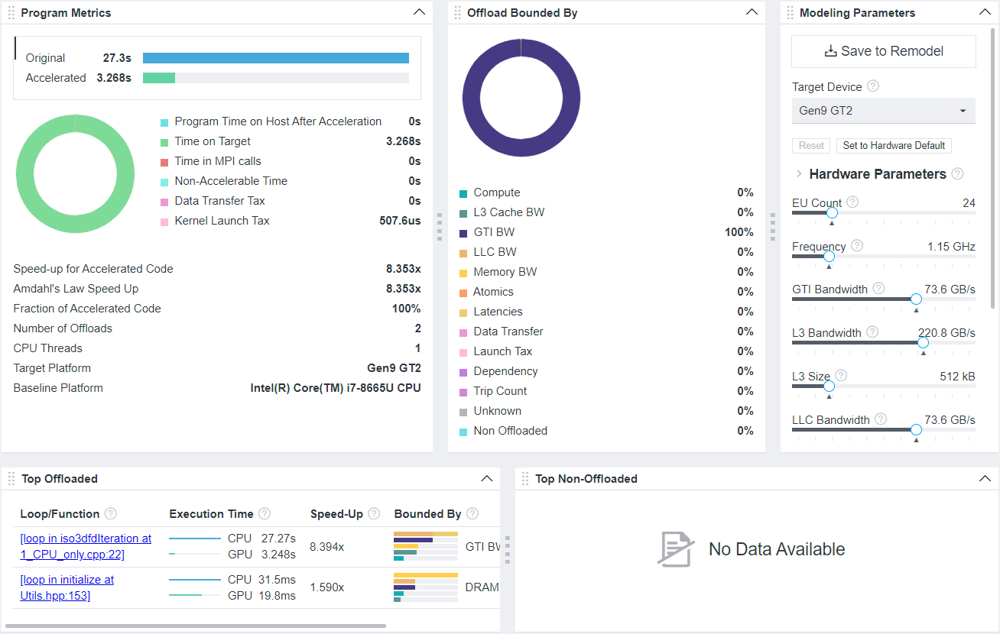
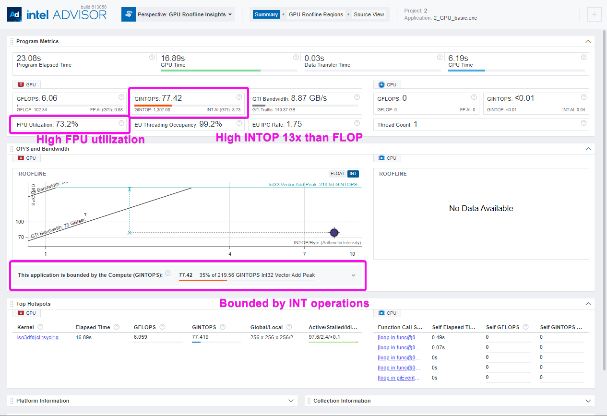
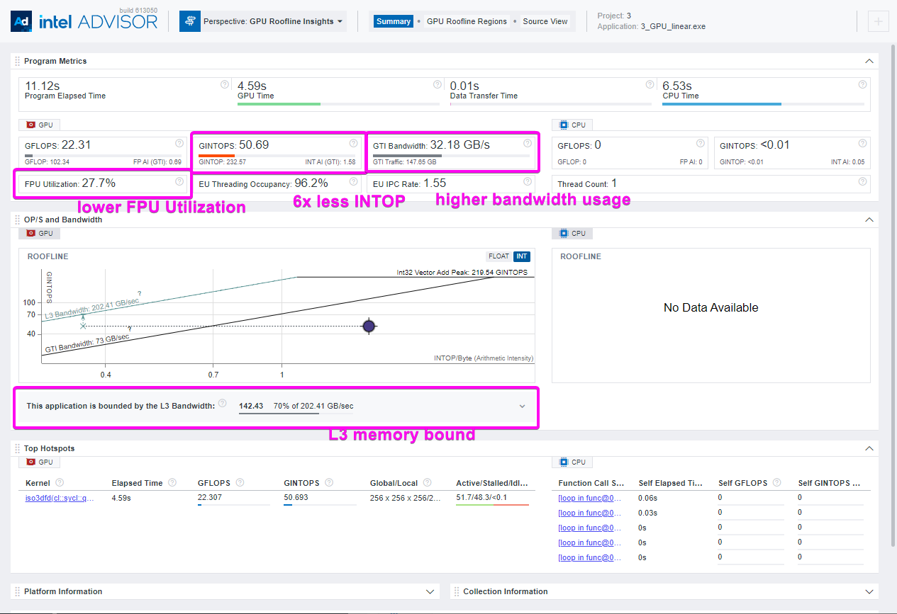
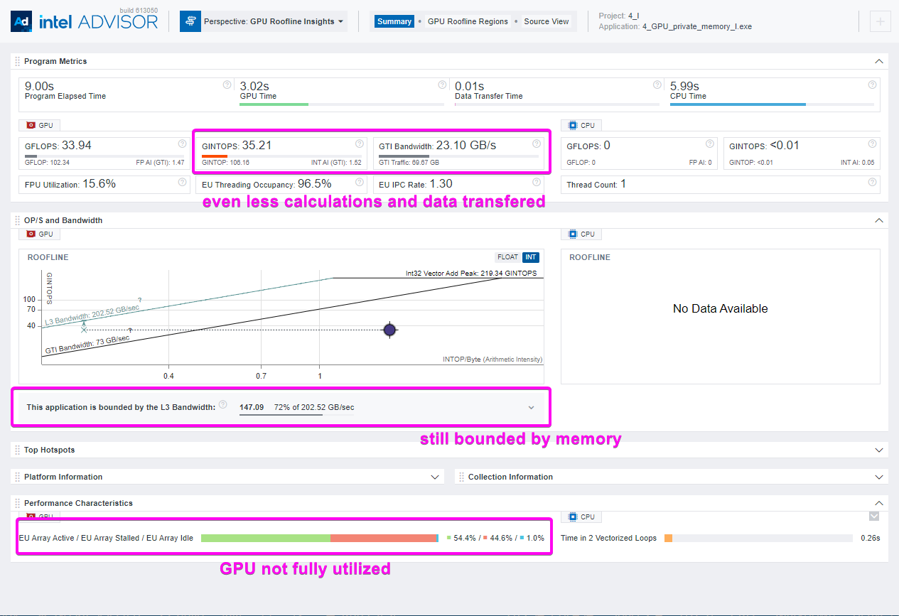
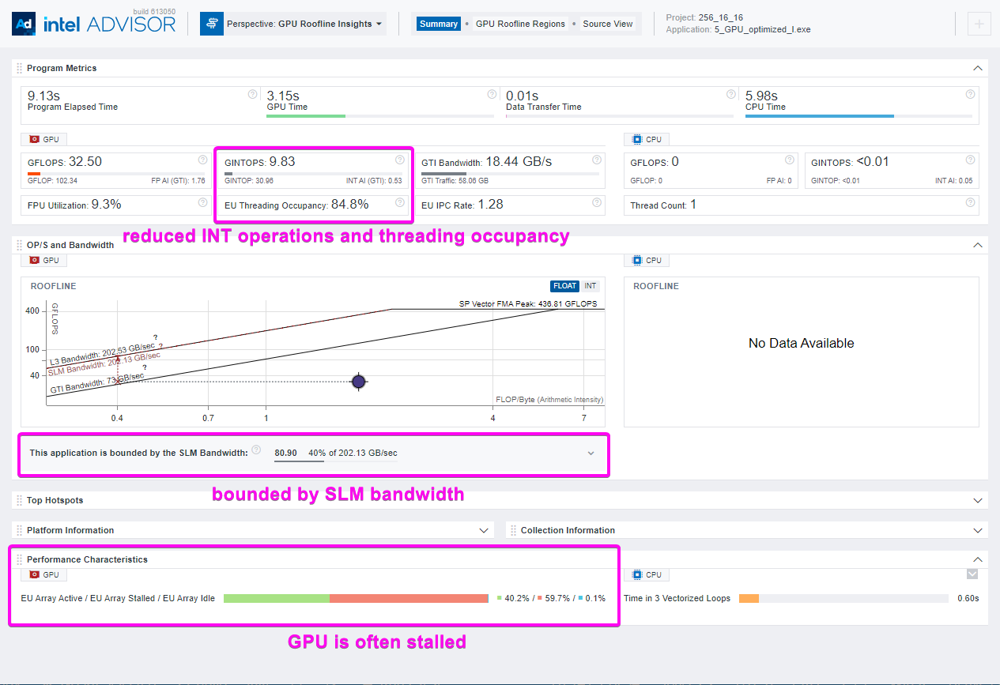
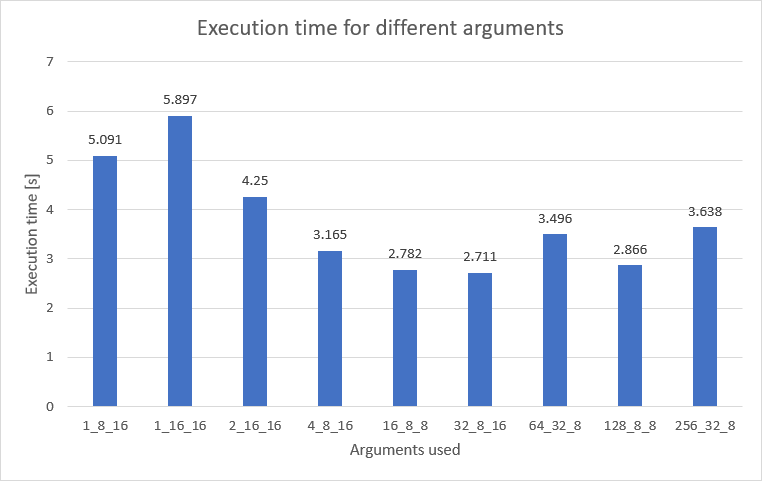
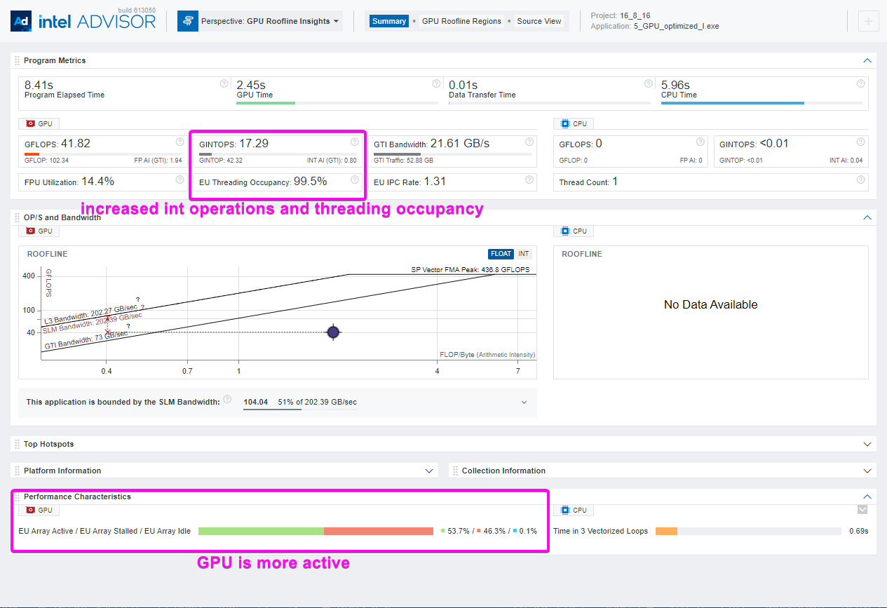
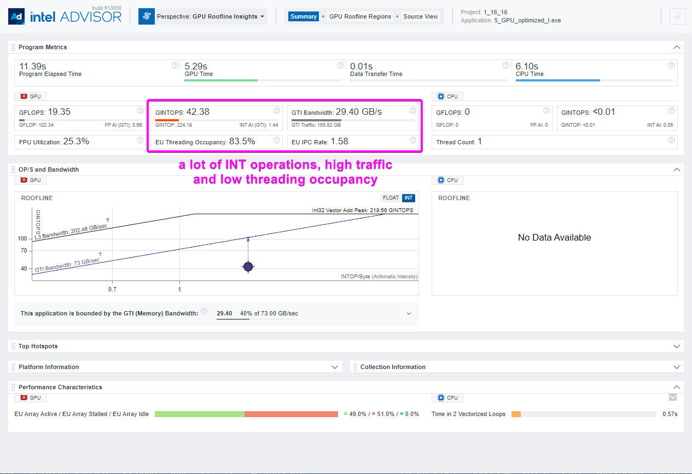

# `Guided ISO3DFD` Sample

The `Guided ISO3DFD` sample demonstrates how to use the Intel&reg; oneAPI Base Toolkit (Base Kit) and tools found in the Base Kit to optimize code for GPU offload. The ISO3DFD sample refers to Three-Dimensional Finite-Difference Wave Propagation in Isotropic Media; it is a three-dimensional stencil to simulate a wave propagating in a 3D isotropic medium.

This sample follows the workflow found in [Optimize Your GPU Application with the Intel&reg; oneAPI Base Toolkit](https://www.intel.com/content/www/us/en/developer/tools/oneapi/gpu-optimization-workflow.html#gs.101gmt2).

For comprehensive instructions, see the [Intel&reg; oneAPI Programming Guide](https://software.intel.com/en-us/oneapi-programming-guide) and search based on relevant terms noted in the comments.

| Property                       | Description
|:---                               |:---
| What you will learn               | How to offload the computation to GPU and iteratively optimize the application performance using Intel&reg; oneAPI DPC++/C++ Compiler
| Time to complete                  | 50 minutes

## Purpose

This sample starts with a CPU oriented application and shows how to use SYCL* and the oneAPI tools to offload regions of the code to the target system GPU. The sample relies heavily on use of the Intel Advisor, which is a design and analysis tool for developing performant code.  We'll use Intel&reg; Advisor to conduct offload modeling and identify code regions that will benefit the most from GPU offload. Once the initial offload is complete, we'll walk through how to develop an optimization strategy by iteratively optimizing the code based on opportunities exposed Intel&reg; Advisor to run roofline analysis.

ISO3DFD is a finite difference stencil kernel for solving the 3D acoustic isotropic wave equation, which can be used as a proxy for propagating a seismic wave. The sample implements kernels as 16th order in space, with symmetric coefficients, and 2nd order in time scheme without boundary conditions.

The sample includes four different versions of the iso3dfd project.

- `1_CPU_only.cpp`: basic serial CPU implementation.
- `2_GPU_basic.cpp`: initial GPU offload version using SYCL.
- `3_GPU_linear.cpp`: first compute optimization by changing indexing patern.
- `4_GPU_private_memory_I.cpp`: memory optimizations with private memory and iterations over first dimension.
- `4_GPU_private_memory_K.cpp`: much slower version where iterations are over third dimension.
- `5_GPU_optimized.cpp`: additional optimizations for memory bound - SLM.

The performance number tabulation is shown below.

| iso3dfd sample                      | Performance data
|:---                               |:---
| Scalar baseline -O2               | 1.0
| SYCL                              | 8x speedup

## Prerequisites
| Optimized for                       | Description
|:---                               |:---
| OS                                | Linux* Ubuntu* 18.04 <br>Windows* 10
| Hardware                          | Skylake with GEN9 or newer
| Software                          | Intel&reg; oneAPI DPC++/C++ Compiler <br>Intel&reg; Advisor


## Key Implementation Details

The basic SYCL* standards implemented in the code include the use of the following:

- SYCL* local buffers and accessors (declare local memory buffers and accessors to be accessed and managed by each workgroup)
- Code for Shared Local Memory (SLM) optimizations
- SYCL* kernels (including parallel_for function and nd-range<3> objects)
- SYCL* queues (including exception handlers)


## Building the `ISO3DFD` Program for CPU and GPU

> **Note**: If you have not already done so, set up your CLI
> environment by sourcing  the `setvars` script located in
> the root of your oneAPI installation.
>
> Linux:
> - For system wide installations: `. /opt/intel/oneapi/setvars.sh`
> - For private installations: `. ~/intel/oneapi/setvars.sh`
>
> Windows:
> - `C:\Program Files(x86)\Intel\oneAPI\setvars.bat`
>
>For more information on environment variables, see Use the setvars Script for [Linux or macOS](https://www.intel.com/content/www/us/en/develop/documentation/oneapi-programming-guide/top/oneapi-development-environment-setup/use-the-setvars-script-with-linux-or-macos.html), or [Windows](https://www.intel.com/content/www/us/en/develop/documentation/oneapi-programming-guide/top/oneapi-development-environment-setup/use-the-setvars-script-with-windows.html).


> **Note**: For GPU Analysis on Linux* enable collecting GPU hardware metrics by setting the value of dev.i915 perf_stream_paranoidsysctl option to 0 as follows. This command makes a temporary change that is lost after reboot:
>
> `sudo sysctl -w dev.i915.perf_stream_paranoid=0`
>
>To make a permanent change, enter:
>
> `sudo echo dev.i915.perf_stream_paranoid=0 > /etc/sysctl.d/60-mdapi.conf`

### Running Samples in Intel&reg; DevCloud

If running a sample in the Intel&reg; DevCloud, you must specify the compute node (CPU, GPU, FPGA) and whether to run in batch or interactive mode. For more information, see the Intel&reg; oneAPI Base Toolkit [Get Started Guide](https://devcloud.intel.com/oneapi/get_started/).

### Using Visual Studio Code*  (Optional)

You can use Visual Studio Code (VS Code) extensions to set your environment, create launch configurations,
and browse and download samples.

The basic steps to build and run a sample using VS Code include:
 - Download a sample using the extension **Code Sample Browser for Intel&reg; oneAPI Toolkits**.
 - Configure the oneAPI environment with the extension **Environment Configurator for Intel oneAPI Toolkits**.
 - Open a Terminal in VS Code (**Terminal>New Terminal**).
 - Run the sample in the VS Code terminal using the instructions below.

To learn more about the extensions and how to configure the oneAPI environment, see
[Using Visual Studio Code with Intel&reg; oneAPI Toolkits User Guide](https://software.intel.com/content/www/us/en/develop/documentation/using-vs-code-with-intel-oneapi/top.html).

### On Linux*
Perform the following steps:
1. Build the program using the following `cmake` commands.
   ```
   $ mkdir build
   $ cd build
   $ cmake ..
   $ make
   ```

2. Run the program.
   ```
   $ make run_all
   ```
   > **Note**: the following run commands are also available and correspond to the specific build targets. You can run all the versions with the run_all or select specific executable with one of the targets, additionally there are targets to run in addition the verify step.

| Basic Invocation                       | Additional versions                 | Verification
|:---                                    |:---                                 |:---
|                                        | make clean                          |
| make run_all                           |                                     | make run_verify_all
| make run_cpu                           |                                     | 
| make run_gpu_basic_offload             |                                     | run_verify_gpu_basic
| make run_gpu_linear                    |                                     | run_verify_gpu_linear
| make run_gpu_private_I                 | make run_gpu_private_K              | run_verify_gpu_private
| make run_gpu_optimized                 | make run_gpu_optimized_good_params  | run_verify_gpu_optimized 
|                                        | make run_gpu_optimized_wrong_params |
 

`run_all` and `run_verify_all` execute all basic commands. Verification commands compares GPU and CPU execution and compares results to ensure accurate calculation.

If an error occurs, you can get more details by running `make` with
the `VERBOSE=1` argument:
```
make VERBOSE=1
```

### Troubleshooting
If you receive an error message, troubleshoot the problem using the Diagnostics Utility for Intel&reg; oneAPI Toolkits, which provides system checks to find missing
dependencies and permissions errors. See [Diagnostics Utility for Intel&reg; oneAPI Toolkits User Guide](https://www.intel.com/content/www/us/en/develop/documentation/diagnostic-utility-user-guide/top.html).


### On Windows* Using Visual Studio* Version 2019 or Newer

- Build the program using VS2019 or VS2022
    - Right-click on the solution file and open using either VS2019 or VS2022 IDE.
    - Right-click on the project in Solution Explorer and select Set as Startup Project
    - Select correct correct configuration from the drop down list in the top menu(5_GPU_optimized has more arguments to choose)
    - Right-click on the project in Solution Explorer and select Rebuild.
    - From the top menu, select Debug -> Start without Debugging.
> **Note**: Remember to use Release mode for better performance.

- Build the program using MSBuild
     - Open "x64 Native Tools Command Prompt for VS2019" or "x64 Native Tools Command Prompt for VS2022"
     - Run the following command: `MSBuild "Optimization Guide.sln" /t:Rebuild /p:Configuration="Release"`

### Application Parameters

You can run individual ISO3DFD executables and modify parameters from the command line.

`./<executable_name> <parameters>`

For example:

```
$ ./src/5_GPU_optimized 256 256 256 100 256 16 16
```
Where:

    n1 n2 n3               : Defines the 3 dimensional grid sizes for the stencil
    Iterations             : Number of timesteps to compute.
    kernel_iterations      : Number of cells which one kernel iterates over - (only for 5_GPU_optimized)
    n2_WGS n3_WGS          : work group size in second and third dimension (only for 5_GPU_optimized)
    [verify]               : Optional: Compare results with CPU version

Usage: `./src/5_GPU_optimized n1 n2 n3 Iterations kernel_iterations n1_WGS n2_WGS [verify]`

Parameters are described if used incorrectly.

## Guided Builds

Below is the step by step guide that shows how to optimize iso3dfd. We'll start with code that runs on the CPU, then a basic implementation of GPU offload, then make several iterations to optimize the code. The below uses the Intel&reg; Advisor analysis tool to provide performance analysis of the built applications. 

> **Note**: The actual results and measurements may vary depending on your actual hardware.

Each analysis run will create a separate dataset and report in a corresponding folder in `iso_stepbysp/advisor`.


### Offloading modeling

The first step is to run offload modeling on the CPU only version of the application (1_CPU_only) to identify code regions that are good opportunities for GPU offload. Running accurate modeling can take considerable time as Intel&reg; Advisor performs analysis on your project.  There are two commands provided below. The first is fast, but less accurate and should only be used as a proof of concept.  The second will give considerably more helpful and accurate profile information. Depending on your system, modeling may take well **over an hour**.

Run one of the following from the from the `build` directory on Linux or from the `Optimization Guide` on Windows.

Command 1: Fast but not as accurate.\
For Linux:\
`advisor --collect=offload --config=gen9_gt2 --project-dir=./../advisor/1_cpu -- ./src/1_CPU_only 128 128 128 20`\
For Windows:\
`advisor --collect=offload --config=gen9_gt2 --project-dir=.\advisor\1_cpu -- .\x64\Release\1_CPU_only.exe 128 128 128 20`

Command 2: Long running but more accurate performance modeling.\
For Linux:\
`advisor --collect=offload --config=gen9_gt2 --project-dir=./../advisor/1_cpu -- ./src/1_CPU_only 256 256 256 100`\
For Windows:\
`advisor --collect=offload --config=gen9_gt2 --project-dir=.\advisor\1_cpu -- .\x64\Release\1_CPU_only.exe 256 256 256 100`

View the results.
For Linux:\
`advisor-gui ../advisor/1_cpu/e000/e000.advixeexp`\
For Windows:\
`advisor-gui advisor\1_cpu\e000\e000.advixeexp`

> **Note**: If you are connecting to a remote system where the oneAPI tools are installed, you may not be able to launch the Intel&reg; Advisor gui.  You can transfer the html report to a local machine for viewing.


Based on the output provided in the image below, you can see the estimated speed-up if we offload loops identified in the Top Offloaded section of the output. We can get about 8x performance gains from offloading the iso3dfd function, which is bounded by the GTI bandwidth. Using SYCL, we'll offload that function to run as a kernel on the system's GPU.




### GPU basic offloaded version

The 2_GPU_basic_offload version of the sample has implemented the basic offload of the iso3dfd function to an available GPU on the system. We have to create queue (line 106 in `2_GPU_basic.cpp`) and change the iso3dfd function. Instead of iterating over all the cells in the memory, we will create buffers and accessors to move the data to the GPU (lines 18-27 and 33-36) when needed and create a kernel which will do the calculations, each kernel will calculate one cell(lines 41-58).

With the offload implemented in 2_GPU_basic, we'll want to run roofline analysis to look for areas where there is room for performance optimization.

For Linux:\
`advisor --collect=roofline --profile-gpu --project-dir=./../advisor/2_gpu -- ./src/2_GPU_basic 256 256 256 100`\
For Windows:\
`advisor --collect=roofline --profile-gpu --project-dir=.\advisor\2_gpu -- .\x64\Release\2_GPU_basic.exe 256 256 256 100`

View the results.\
For Linux:\
`advisor-gui ../advisor/2_gpu/e000/e000.advixeexp`\
For Windows:\
`advisor-gui advisor\2_gpu\e000\e000.advixeexp`

From the roofline analysis of the `2_GPU_basic_offload.cpp` version, we can see that the performance is close to predicted. As noted in the roofline model, the application is now bounded by compute, specifically that the kernels have high arithmetic intensity and we are bounded by the INT operations which is all about index computations.




### GPU linear indexing

In this next iteration, we'll address the problem being compute bound in kernels by reducing index calculations by changing how we calculate indices.

For index calculations optimization, we can change the 3D indexing to 1D. We need to flatten the buffers (lines 21-22), change how we calculate location in the memory for each kernel(lines 43-49), and change how we are accessing the neighbors(lines 52 and 56-61). 

Run roofline analysis again to gauge the results and look for additional opportunities for optimization based on 3_GPU_linear.

For Linux:\
`advisor --collect=roofline --profile-gpu --project-dir=./../advisor/3_gpu -- ./src/3_GPU_linear 256 256 256 100`\
For Windows:\
`advisor --collect=roofline --profile-gpu --project-dir=.\advisor\3_gpu -- .\x64\Release\3_GPU_linear.exe 256 256 256 100`

View the results.\
For Linux:\
`advisor-gui ../advisor/3_gpu/e000/e000.advixeexp`\
For Windows:\
`advisor-gui advisor\3_gpu\e000\e000.advixeexp`


With the code changes that are in the `3_GPU_linear.cpp` file, we can see in the roofline model that the INT operations decreased about 6x. The kernel now has much lower arithmetic intensity and bandwidth increased more than 3x.  But now we are L3 cache bandwidth bounded.

> **Tip**: Your can compare performance gains by usig the [roofline analaysis compare function](https://www.intel.com/content/www/us/en/develop/documentation/advisor-user-guide/top/analyze-cpu-roofline/explore-cpu-memory-roofline-results/compare-cpu-roofline-results.html). 



We are memory bound but our kernels use a lot of overlapping memory as their neighbor cells. Because of this we can read each memory cell once and re-use the data. To do this we need to change the kernel; now they will not calculate only one cell but will iterate over one of the dimensions. Data reused during iterations will be stored in private memory which could fit in the registers which are many times faster than any type of memory available. 

The question remains, what dimension is the best? Since the required changes are not that big, we provided cpp files for first and third. We run some benchmarks and iterate over first and second dimensions providing similar results. But iterating over third dimension increases execution time significantly, since not all of the vectorization is used.


### GPU private memory

The 4_GPU_private_memory version addresses the memory issue by changing dimensions for kernel_range (lines 18-20) and corresponding id(line 40) in parallel_for, and a small change in index calculations(lines 45-48). The most important change is the addition of private arrays which will contain coefficients since they are used in every iteration and data used to calculate stencil in dimension used to iterate(lines 60-62 create arrays and 64-71 fills them). Next step is to add loop(line 74) in the middle of which we will calculate the cell value increase linear index(line 89) and shift the stencil data(lines 91-100).

Run the analysis again with version 4, which iterates over first dimension, 4_GPU_private_memory.

For Linux:\
`advisor --collect=roofline --profile-gpu --project-dir=./../advisor/4_gpu -- ./src/4_GPU_private_memory 256 256 256 100`\
For Windows:\
`advisor --collect=roofline --profile-gpu --project-dir=.\advisor\4_gpu -- .\x64\Release\4_GPU_private_memory.exe 256 256 256 100`

View the results.\
For Linux:\
`advisor-gui ../advisor/4_gpu/e000/e000.advixeexp`\
For Windows:\
`advisor-gui advisor\4_gpu\e000\e000.advixeexp`

We are still memory bounded but we reduced the data transfer and additional calculations. 



### nd_ranges and SLM

To address the memory constraints, we'll reuse data with cells next to each other. The data can be stored in the Shared Local Memory which from all of the kernels from nd_range have access. Additionally, we will try to modify the number of iterations per kernel to achieve better threading occupancy.

This latest iteraction to includes new arguments for the nd_range size and kernel iterations(lines 177-178, 194-196, 246-247, 17-18), change back the kernel_range to 3d and introduce local_range for work group size(lines 19-24), create SLM accessor(lines 42-49), change parallel_for to use nd_range(lines 52-53), update how indices are calculated with introduction of local index corresponding to position in SLM(lines 58-69), additional flags which checks if kernel should copy items from HALO(lines 92-96), copy the data to the SLM(lines 101-114), add synchronization to ensure that all work item copied what they had to(line 120), use SLM instead of global memory with calculations(lines 127-129) and synchronize one more time(line 153).

Again, run roofline analysis, this time on our 5 version, 5_GPU_optimized with maximum values of arguments - full row per kernel and maximum number of work items per work group.

For Linux:\
`advisor --collect=roofline --profile-gpu --project-dir=./../advisor/5_gpu_bad -- ./src/5_GPU_optimized 256 256 256 100 256 16 16`\
For Windows:\
`advisor --collect=roofline --profile-gpu --project-dir=.\advisor\5_gpu_bad -- .\x64\Release\5_GPU_optimized.exe 256 256 256 100 256 16 16`

View the results.\
For Linux:\
`advisor-gui ../advisor/5_gpu_bad/e000/e000.advixeexp`\
For Windows:\
`advisor-gui advisor\5_gpu_bad\e000\e000.advixeexp`


This time we are bounded by SLM memory, even if we increased data re-usage time increased and reduced int operations even more, the execution time increased. We can see that this time threading occupancy is lower, the offload had wrong size.



### Parameters tweaking

Now we have fast code which is bounded by SLM memory, but we are not using all of the available resources. To help identify the appropriate nd_range size, the best way is to run some benchmarks.

You can run iterative tests on your own and search for the best results, for example changing parameters from 256 16 16 to 16 8 16 gives us better gpu activity time and utilizes all the resources what gives us better time even with increased INT operations. Other example would be 1 16 16 where kernels iterate over one cell and do not use private memory at all and destroys all the performance gains!

Below you can see plot with some different arguments (choosen randomly)


Good use of parameters:\
For Linux:\
`advisor --collect=roofline --profile-gpu --project-dir=./../advisor/5_gpu_good -- ./src/5_GPU_optimized 256 256 256 100 16 8 16`\
For Windows:\
`advisor --collect=roofline --profile-gpu --project-dir=.\advisor\5_gpu_good -- .\x64\Release\5_GPU_optimized.exe 256 256 256 100 16 8 16`

View the results.\
For Linux:\
`advisor-gui ../advisor/5_gpu_good/e000/e000.advixeexp`\
For Windows:\
`advisor-gui advisor\5_gpu_good\e000\e000.advixeexp`





Poor use of paratmeters:\
For Linux:\
`advisor --collect=roofline --profile-gpu --project-dir=./../advisor/5_gpu_worst -- ./src/5_GPU_optimized 256 256 256 100 1 16 16`\
For Windows:\
`advisor --collect=roofline --profile-gpu --project-dir=.\advisor\5_gpu_worst -- .\x64\Release\5_GPU_optimized.exe 256 256 256 100 1 16 16`

View the results.\
For Linux:\
`advisor-gui ../advisor/5_gpu_worst/e000/e000.advixeexp`\
For Windows:\
`advisor-gui advisor\5_gpu_worst\e000\e000.advixeexp`




## Output

```
[ 20%] Built target 2_GPU_basic
[ 40%] Built target 3_GPU_linear
[ 60%] Built target 5_GPU_optimized
[ 80%] Built target 1_CPU_only
[100%] Built target 4_GPU_private_memory_I
Running on CPU serial version
--------------------------------------
time         : 27.937 secs
throughput   : 60.0537 Mpts/s
flops        : 3.66328 GFlops
bytes        : 0.720645 GBytes/s

--------------------------------------

--------------------------------------
 Running GPU basic offload version
 Running on Intel(R) UHD Graphics P630 [0x3e96]
 The Device Max Work Group Size is : 256
 The Device Max EUCount is : 24
--------------------------------------
time         : 13.865 secs
throughput   : 121.004 Mpts/s
flops        : 7.38125 GFlops
bytes        : 1.45205 GBytes/s

--------------------------------------

--------------------------------------
 Running linear indexed GPU version
 Running on Intel(R) UHD Graphics P630 [0x3e96]
 The Device Max Work Group Size is : 256
 The Device Max EUCount is : 24
--------------------------------------
time         : 4.401 secs
throughput   : 381.214 Mpts/s
flops        : 23.254 GFlops
bytes        : 4.57456 GBytes/s

--------------------------------------

--------------------------------------
 Running GPU private memory version with iterations over first dimension
 Running on Intel(R) UHD Graphics P630 [0x3e96]
 The Device Max Work Group Size is : 256
 The Device Max EUCount is : 24
--------------------------------------
time         : 2.758 secs
throughput   : 608.311 Mpts/s
flops        : 37.107 GFlops
bytes        : 7.29973 GBytes/s

--------------------------------------

--------------------------------------
 Running GPU optimized version
 Running on Intel(R) UHD Graphics P630 [0x3e96]
 The Device Max Work Group Size is : 256
 The Device Max EUCount is : 24
--------------------------------------
time         : 2.994 secs
throughput   : 560.361 Mpts/s
flops        : 34.182 GFlops
bytes        : 6.72433 GBytes/s

--------------------------------------

--------------------------------------
[100%] Built target run_all
```
## License

Code samples are licensed under the MIT license. See
[License.txt](https://github.com/oneapi-src/oneAPI-samples/blob/master/License.txt) for details.

Third party program Licenses can be found here: [third-party-programs.txt](https://github.com/oneapi-src/oneAPI-samples/blob/master/third-party-programs.txt).