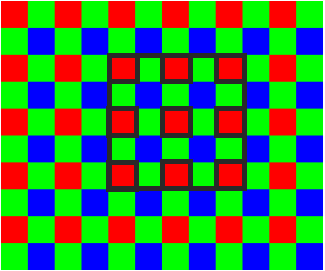
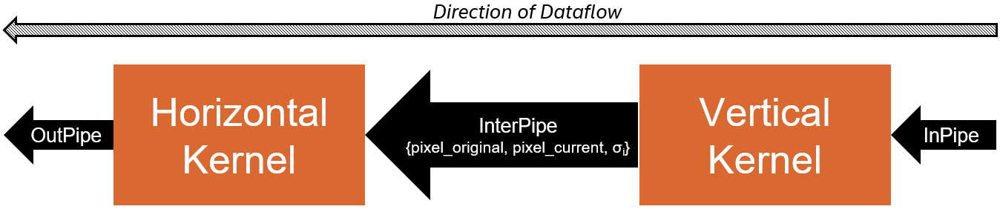
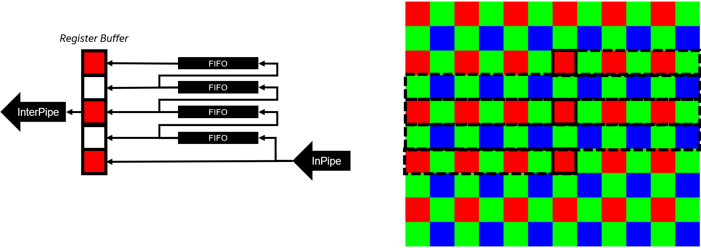
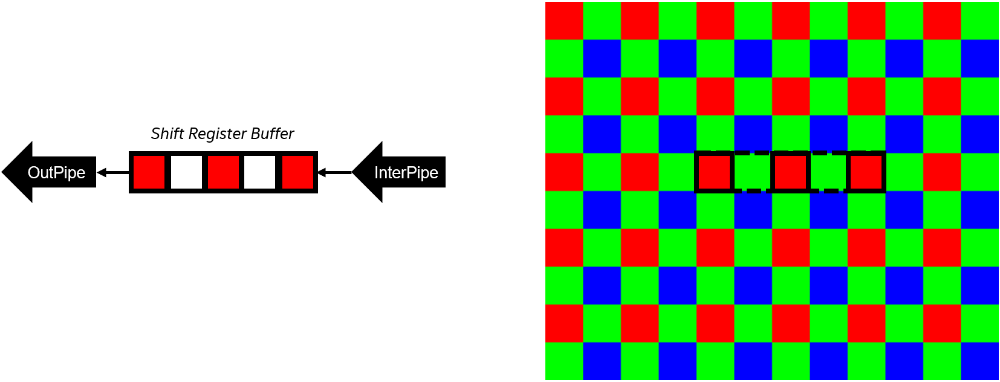
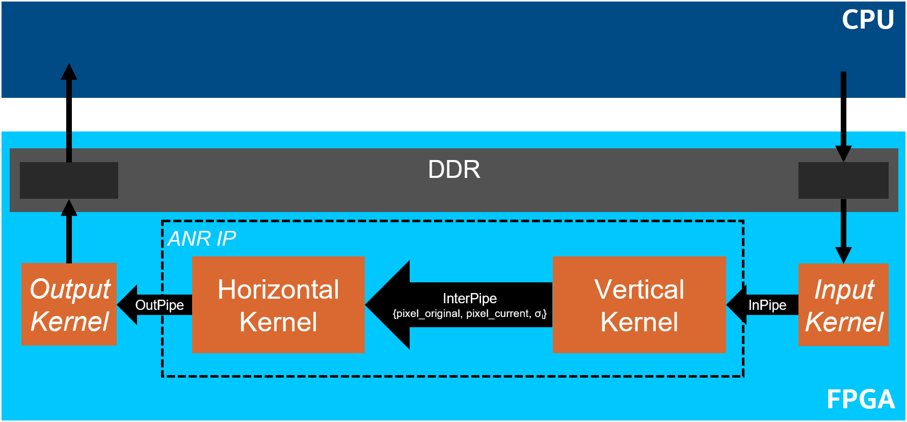

# Adaptive Noise Reduction (ANR)
This DPC++ reference design demonstrates a highly optimized image sensor adaptive noise reduction (ANR) algorithm on an FPGA.

***Documentation***:  
* [DPC++ FPGA Code Samples Guide](https://software.intel.com/content/www/us/en/develop/articles/explore-dpcpp-through-intel-fpga-code-samples.html) helps you to navigate the samples and build your knowledge of DPC++ for FPGA. <br>
* [oneAPI DPC++ FPGA Optimization Guide](https://software.intel.com/content/www/us/en/develop/documentation/oneapi-fpga-optimization-guide) is the reference manual for targeting FPGAs through DPC++. <br>
* [oneAPI Programming Guide](https://software.intel.com/en-us/oneapi-programming-guide) is a general resource for target-independent DPC++ programming. 
 
| Optimized for                     | Description
---                                 |---
| OS                                | Ubuntu* 18.04/20.04, RHEL*/CentOS* 8, SUSE* 15; Windows* 10
| Hardware                          | Intel&reg; Programmable Acceleration Card (PAC) with Intel Arria&reg; 10 GX FPGA <br> Intel&reg; FPGA Programmable Acceleration Card (PAC) D5005 (with Intel Stratix&reg; 10 SX) <br> Intel Xeon&reg; CPU E5-1650 v2 @ 3.50GHz (host machine)
| Software                          | Intel&reg; oneAPI DPC++ Compiler <br> Intel&reg; FPGA Add-On for oneAPI Base Toolkit
| What you will learn               | How to create a parameterizable image processing pipeline to implement an Adaptive Noise Reduction (ANR) algorithm on an FPGA.
| Time to complete                  | 1 hour

## Purpose
This FPGA reference design demonstrates a parameterizable image processing pipeline that implements an Adaptive Noise Reduction (ANR) algorithm using a bilateral filter. See the [Additional Design Information Section](#additional-design-information) for more information on the ANR algorithm itself and how it was implemented for the FPGA.

## License  
Code samples are licensed under the MIT license. See
[License.txt](https://github.com/oneapi-src/oneAPI-samples/blob/master/License.txt) for details.

## Building the Reference Design

### Include Files
The include folder is located at `%ONEAPI_ROOT%\dev-utilities\latest\include` on your development system.

### Running Code Samples in DevCloud
If running a sample in the Intel DevCloud, remember that you must specify the type of compute node and whether to run in batch or interactive mode. Compiles to FPGA are only supported on fpga_compile nodes. Executing programs on FPGA hardware is only supported on fpga_runtime nodes of the appropriate type, such as fpga_runtime:arria10 or fpga_runtime:stratix10.  Neither compiling nor executing programs on FPGA hardware are supported on the login nodes. For more information, see the Intel® oneAPI Base Toolkit Get Started Guide ([https://devcloud.intel.com/oneapi/documentation/base-toolkit/](https://devcloud.intel.com/oneapi/documentation/base-toolkit/)).

When compiling for FPGA hardware, it is recommended to increase the job timeout to 24h.
 
### On a Linux* System
1. Install the design into a directory `build` from the design directory by running `cmake`:

   ```
   mkdir build
   cd build
   ```

   If you are compiling for the Intel® PAC with Intel Arria® 10 GX FPGA, run `cmake` using the command:

   ```
   cmake ..
   ```

   If instead you are compiling for the Intel® FPGA PAC D5005 (with Intel Stratix® 10 SX), run `cmake` using the command:

   ```
   cmake .. -DFPGA_BOARD=intel_s10sx_pac:pac_s10
   ```

2. Compile the design through the generated `Makefile`. The following targets are provided, and they match the recommended development flow:

    * Compile for emulation (fast compile time, targets emulated FPGA device).

       ```
       make fpga_emu
       ```

    * Generate HTML performance report. Find the report in `anr_report.prj/reports/report.html`directory.

       ```
       make report
       ```

    * Compile for FPGA hardware (longer compile time, targets FPGA device).

       ```
       make fpga
       ```

3. (Optional) As the above hardware compile may take several hours to complete, FPGA precompiled binaries (compatible with Linux* Ubuntu* 18.04) can be downloaded <a href="https://iotdk.intel.com/fpga-precompiled-binaries/latest/anr.fpga.tar.gz" download>here</a>.

### On a Windows* System
1. Generate the `Makefile` by running `cmake`.
     ```
   mkdir build
   cd build
   ```
   To compile for the Intel® PAC with Intel Arria® 10 GX FPGA, run `cmake` using the command:  
    ```
    cmake -G "NMake Makefiles" ..
   ```
   Alternatively, to compile for the Intel® FPGA PAC D5005 (with Intel Stratix® 10 SX), run `cmake` using the command:
   ```
   cmake -G "NMake Makefiles" .. -DFPGA_BOARD=intel_s10sx_pac:pac_s10
   ```

2. Compile the design through the generated `Makefile`. The following build targets are provided, matching the recommended development flow:
   * Compile for emulation (fast compile time, targets emulated FPGA device): 
     ```
     nmake fpga_emu
     ```
   * Generate the optimization report: 
     ```
     nmake report
     ``` 
   * An FPGA hardware target is not provided on Windows*. 

*Note:* The Intel® PAC with Intel Arria® 10 GX FPGA and Intel® FPGA PAC D5005 (with Intel Stratix® 10 SX) do not yet support Windows*. Compiling to FPGA hardware on Windows* requires a third-party or custom Board Support Package (BSP) with Windows* support.<br>
*Note:* If you encounter any issues with long paths when compiling under Windows*, you may have to create your ‘build’ directory in a shorter path, for example c:\samples\build.  You can then run cmake from that directory, and provide cmake with the full path to your sample directory.

### In Third-Party Integrated Development Environments (IDEs)

You can compile and run this Reference Design in the Eclipse* IDE (in Linux*) and the Visual Studio* IDE (in Windows*). For instructions, refer to the following link: [Intel® oneAPI DPC++ FPGA Workflows on Third-Party IDEs](https://software.intel.com/en-us/articles/intel-oneapi-dpcpp-fpga-workflow-on-ide)

## Running the Reference Design

 1. Run the sample on the FPGA emulator (the kernel executes on the CPU).
     ```
     ./anr.fpga_emu    (Linux)
     anr.fpga_emu.exe  (Windows)
     ```

2. Run the sample on the FPGA device.
     ```
     ./anr.fpga        (Linux)
     ```

### Example of Output
You should see output similar to the following in the console:
```
Runs:             2
Columns:          1920
Rows:             1436
Frames:           8
Filter Size:      9
Pixels Per Cycle: 2
Maximum Columns:  2048

Execution time: 45.0012 ms
Throughput: 488.876 MB/s
PASSED
```
NOTE: When running on the FPGA emulator, the *Execution time* and *Throughput* do not reflect the design's actual hardware performance.
    

## Additional Design Information
### Source Code Breakdown
The following source files can be found in the `src/` sub-directory.

| File                            | Description 
|:---                             |:---
|`main.cpp`                       | Contains the `main()` function and the top-level launching, validation, and performance measurements.
|`anr_params.hpp`                 | A class for parsing and holding the ANR specific parameters, such as the sigma coefficients, the filter size, and the alpha value.
|`anr.hpp`                        | Contains the logic for submitting all of the ANR kernels to the queue and the top-level description of the bilateral filter (both horizontal and vertical). 
|`column_stencil.hpp`             | A generic library for computing a column stencil (a 1D vertical convolution).
|`constants.hpp`                  | Contains the constants and datatypes for the ANR algorithm.
|`data_bundle.hpp`                | A generic library for bundling data to move between kernels; essentially an array.
|`dma_kernels.hpp`                | Contains kernels that move data between the host and device, as well as reading/writing data between the FPGA and device memory.
|`intensity_sigma_lut.hpp`        | A RAM LUT for the intensity sigma values.
|`mp_math.hpp`                    | Metaprogramming math helper functions.
|`qfp_exp_lut.hpp`                | A ROM LUT for computing exp(-x) on a 32-bit floating-point value (using a QFP).
|`qfp_inv_lut.hpp`                | A ROM LUT for computing 1/x on a 32-bit floating-point value (using a QFP).
|`qfp.hpp`                        | Contains a class with generic static methods for converting between 32-bit floating-point and quantized floating-point (QFP).
|`rom_base.hpp`                   | A generic library for creating a ROM from a `constexpr` class.
|`row_stencil.hpp`                | A generic library for computing a row stencil (a 1D horizontal convolution).
|`shift_reg.hpp`                  | A generic library for a shift register.
|`unrolled_loop.hpp`              | A templated-based loop unroller that unrolls loops in the compiler front end.

### ANR Algorithm
The ANR algorithm works on an input image that is in [Bayer format](https://en.wikipedia.org/wiki/Bayer_filter). Unlike image formats you may be used to (e.g., PNG or JPG), where each pixel has a red, green, **and** blue value (RGB), each pixel in a Bayer format image is either red, green, **or** blue, as shown in the image below. To convert to an RGB image, you take a 4x4 square and generate the RGB pixel by averaging the two green pixels. One purpose of this format is to dedicate more pixels to green, since the human eye is more sensitive to green.


The ANR algorithm uses a [bilateral filter](https://en.wikipedia.org/wiki/Bilateral_filter). Unilateral filters (e.g., a [Box blur](https://en.wikipedia.org/wiki/Box_blur) or [Gaussian blur](https://en.wikipedia.org/wiki/Gaussian_blur)) replace the intensity of a given pixel with a weighted average of the neighbouring pixels, where the weight of each neighouring pixel depends on the spatial distance from the pixel being computed. With bilateral filters, like the one used in this design, the weight of each neighbouring pixel depends on both the spatial distance, and the difference in pixel intensity. This makes bilateral filters much better at preserving sharp edges. <br/>

Bilateral filters are non-linear and therefore non-separable. Note that in the case of a 5x5 window (shown below), only 9 pixels (not 25) are used in the computation; this is an artifact of the Bayer image format. The most accurate approach would produce the bilateral filter window and convolve the entire window of the given pixel colour (for the image below, red) at once to generate the output pixel (the middle pixel). For the 5x5 case, this would result in 9 multiplications that need to be summed. <br/>



This produces a long chain of adders to sum the results of the multiplications. In this design, we approximate the bilateral filter by making it separable. We first apply a 1D vertical filter to the middle pixel, and then a 1D horizontal filter, as shown in the image below. This reduces the number of multiplications that need to be summed together to 3. In our design, we apply the vertical filter to *all* pixels first, and then apply the horizontal filter, which results in the *corner* pixels indirectly applying some weight to the middle pixel.


### ANR FPGA Design
The ANR algorithm is designed as a streaming kernel system with input pixels streaming through the input pipe, and the denoised output pixels streaming out the output pipe, as shown in the figure below. The design consists of two kernels, `Vertical Kernel` and `Horizontal Kernel`, that are connected by an internal SYCL pipe, as shown in the figure below. The `Vertical Kernel` computes an intensity sigma value based on the current pixel, computes the bilateral filter, and applies it to the current window to produce an intermediate pixel value. The `Vertical Kernel` kernel sends three values through the internal pipe: the original pixel value, the current pixel value (i.e., intermediate pixel that was just computed), and the intensity sigma value. The `Horizontal Kernel` streams in these tuples and performs a similar computation but on a horizontal window. It uses the forwarded intensity sigma value to compute the bilateral filer, the new pixel values to perform the bilateral filter computation, and the original pixel to perform *alpha blending*, where the output pixel is a weighted percentage of the original pixel value and the denoised pixel value.



To compute a given pixel, the `Vertical Kernel` must store previous rows (i.e., lines) of the input image. The technique to do so is shown in the image below. The pixels are streamed in from the pipe and used with pixels from previous rows to perform the 1D vertical window operation.



The logic for the `Horizontal Kernel`, shown below, is much simpler since it operates on a single row at a time.



To produce the input data and consume the output, we setup a full system as shown in the figure below. The `Input Kernel` reads input data from device memory and provides it to the ANR design via the input pipe. The `Output Kernel` reads the ANR design's output from the output pipe and writes it to device memory. The oneAPI host code then uses the output data to validate the accuracy of the ANR algorithm against a golden result using the [Peak signal-to-noise ratio (PSNR)](https://en.wikipedia.org/wiki/Peak_signal-to-noise_ratio).



### Quantized Floating-Point (QFP)
Floating-point values consist of a sign bit, an exponent, and a mantissa. In this design, we take [32-bit single-precision](https://en.wikipedia.org/wiki/Single-precision_floating-point_format) floating values and convert them to quantized floating-point (QFP) values which use less bits. All of the QFPs in this design have 10 bits total, but use a different number for the exponent and mantissa. The purpose of this conversion is to be able to create lookup-table (LUT) read-only memories (ROMs) to approximate expensive 32-bit floating-point operations like an exponential (`exp(x)`) and inversion (`1/x`). Creating LUT ROMs for 32-bit floats would require `2^32*4 = 17GB` bytes of on-chip memory. However, if the float can be *quantized* to 10 bits, it requires only `2^10*4 = 4KB` of on-chip memory, at the expense of reduced precision.

### Reusable Header Files
In this design, we use the following generic header files:
  - `ColumnStencil` (*column_stencil.hpp*): A library for generalizing a column stencil (i.e., the vertical filter) using C++ functors for callbacks to perform the filter. This library hides the details of the FIFO line stores and padding logic and allows the user to simply worry about the filter convolution.
  - `DataBundle` (*data_bundle.hpp*): A library for holding multiple pieces of the same data. This class is similar to a C++ `std::array`, but ensures that the constructors and `operator=` are overriden properly to avoid expensive loops.
  - `ROMBase` (*rom_base.hpp*): This library provides a base class for creating a `constexpr` class that results in a ROM in the FPGA.
  - `RowStencil` (*row_stencil.hpp*): A library for generalizing a row stencil (i.e., the horizontal filter) using C++ functors for callbacks to perform the filter. This library hides the details of the shift register and padding logic and allows the user to simply worry about the filter convolution.
  - `ShiftReg` (*shift_reg.hpp*): A library to implement a shift register. This hides the logic necessary to ensure the compiler infers an efficient shift register behind easy-to-use API calls.
  - `UnrolledLoop` (*unrolled_loop.hpp*): A library that implements a front-end unrolled loop using C++ metaprogramming.
  - *mp_math.hpp*: A set of various `constexpr` math functions that are implemented using C++ metaprogramming.

  For more information on the usage and implementation of these header libraries, view the source code (the `.hpp` files), which are well commented for documentation.

