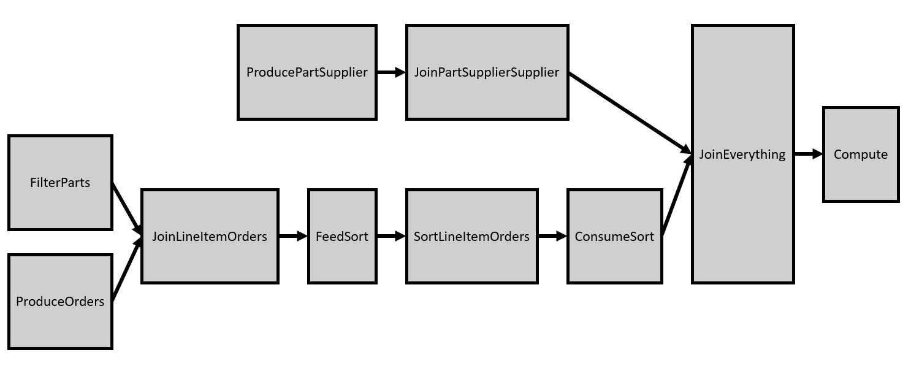
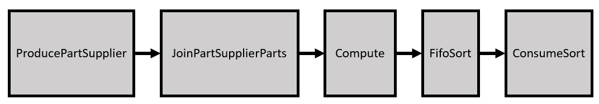
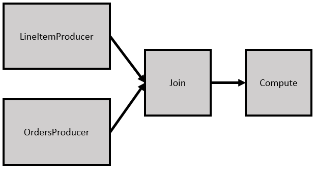

# Database Query Acceleration
This reference design demonstrates how to use an FPGA to accelerate database queries for a data-warehouse schema derived from TPC-H.

***Documentation***:  The [DPC++ FPGA Code Samples Guide](https://software.intel.com/content/www/us/en/develop/articles/explore-dpcpp-through-intel-fpga-code-samples.html) helps you to navigate the samples and build your knowledge of DPC++ for FPGA. <br>
The [oneAPI DPC++ FPGA Optimization Guide](https://software.intel.com/content/www/us/en/develop/documentation/oneapi-fpga-optimization-guide) is the reference manual for targeting FPGAs through DPC++. <br>
The [oneAPI Programming Guide](https://software.intel.com/en-us/oneapi-programming-guide) is a general resource for target-independent DPC++ programming.
 
| Optimized for                     | Description
---                                 |---
| OS                                | Linux* Ubuntu* 18.04; Windows* 10
| Hardware                          | Intel® FPGA Programmable Acceleration Card (PAC) D5005 (with Intel Stratix® 10 SX)
| Software                          | Intel&reg; oneAPI DPC++ Compiler 
| What you will learn               | How to accelerate database queries using an Intel FPGA
| Time to complete                  | 1 hour

_Notice: This example design is only officially supported for the Intel® FPGA PAC D5005 (with Intel Stratix® 10 SX)_

**Performance**
In this design, we accelerate four database queries as *offload accelerators*. In an offload accelerator scheme, the queries are performed by transferring the relevant data from the CPU host to the FPGA, starting the query kernel on the FPGA, and copying the results back. This means that the relevant performance number is the latency (i.e., the wall clock time) from when the query is requested to the time the output data is accessible by the host. This includes the time to transfer data between the CPU and FPGA over PCIe (with an approximate read and write bandwidth of 6877 and 6582 MB/s, respectively). As shown in the table below, most of the total query time is spent transferring the data between the CPU and FPGA, and the query kernels themselves are a small portion of the total latency. 

The performance data below was gathered using the Intel® FPGA PAC D5005 (with Intel Stratix® 10 SX) with a database scale factor (SF) of 1. Please see the [Database files](#database-files) section for more information on generating data for a scale factor of 1.

| Query | Approximate Data Transfer Time (ms) | Measured Total Query Processing Time (ms)
|:---   |:---                                 |:--- 
| 1     | 35                                  | 39
| 9     | 37                                  | 43
| 11    | 5                                   | 11
| 12    | 16                                  | 26

## Purpose
The database in this tutorial has 8-tables and a set of 21 business-oriented queries with broad industry-wide relevance. This reference design shows how four queries can be accelerated using the Intel® FPGA PAC D5005 (with Intel Stratix® 10 SX) and oneAPI. To do so, we create a set of common database operators (found in the `src/db_utils/` directory) that are are combined in different ways to build the four queries.

## Key Implementation Details
To optimize the different database queries, the design leverages concepts discussed in the following FPGA tutorials: 
* **Shannonization to improve Fmax/II** (shannonization)
* **Optimizing Inner Loop Throughput** (optimize_inner_loop)
* **Caching On-Chip Memory to Improve Loop Performance** (onchip_memory_cache)
* **Unrolling Loops** (loop_unroll)
* **Loop `ivdep` Attribute** (loop_ivdep)

 The key optimization techniques used are as follows:
   1. Accelerating complex database queries using an Intel FPGA and oneAPI
   2. Improving code reuse, readability and extendability using C++ templates for FPGA device code
   3. Showcase the usage of advanced FPGA optimizations listed above to improve the performance of a large design

## License  
Code samples are licensed under the MIT license. See
[License.txt](https://github.com/oneapi-src/oneAPI-samples/blob/master/License.txt) for details.

Third party program Licenses can be found here: [third-party-programs.txt](https://github.com/oneapi-src/oneAPI-samples/blob/master/third-party-programs.txt)

## Building the `db` Reference Design

### Include Files
The include folder is located at `%ONEAPI_ROOT%\dev-utilities\latest\include` on your development system.

### Running Code Samples in DevCloud
If running a sample in the Intel DevCloud, remember that you must specify the compute node (fpga_compile, fpga_runtime:arria10, or fpga_runtime:stratix10) and whether to run in batch or interactive mode. For more information, see the Intel® oneAPI Base Toolkit Get Started Guide ([https://devcloud.intel.com/oneapi/documentation/base-toolkit/](https://devcloud.intel.com/oneapi/documentation/base-toolkit/)).

When compiling for FPGA hardware, it is recommended to increase the job timeout to 24h.

### On a Linux* System

1. Generate the `Makefile` by running `cmake`.

   ```
   mkdir build
   cd build
   ```

   Run `cmake` using the command:

   ```
   cmake .. -DQUERY=<QUERY_NUMBER>
   ```

   Where `<QUERY_NUMBER>` can be one of `1`, `9`, `11` or `12`.

2. Compile the design through the generated `Makefile`. The following targets are provided, matching the recommended development flow:

    * Compile for emulation (fast compile time, targets emulated FPGA device).

       ```
       make fpga_emu
       ```

    * Generate the optimization report. Find the report in the `db_report.prj/reports/report.html` directory.

       ```
       make report
       ```
       _Note:_ If you are compiling Query 9 (`-DQUERY=9`), the report generation time is unusually long. Pre-generated reports can be downloaded <a href="https://iotdk.intel.com/fpga-precompiled-binaries/latest/db.fpga.tar.gz" download>here</a>.

    * Compile for FPGA hardware (longer compile time, targets FPGA device).

       ```
       make fpga
       ```
      When building for hardware, the default scale factor is 1. To use the smaller scale factor of 0.01, add the flag `-DSF_SMALL=1` to the original `cmake` command. For example: `cmake .. -DQUERY=9 -DSF_SMALL=1`. See the [Database files](#database-files) for more information.

3. (Optional) As the hardware compile may take several hours to complete, an Intel® FPGA PAC D5005 (with Intel Stratix® 10 SX) precompiled binary (compatible with Linux* Ubuntu* 18.04) can be downloaded <a href="https://iotdk.intel.com/fpga-precompiled-binaries/latest/db.fpga.tar.gz" download>here</a>.

### On a Windows* System

1. Generate the `Makefile` by running `cmake`.

   ```
   mkdir build
   cd build
   ```

   Run `cmake` using the command:

   ```
   cmake -G "NMake Makefiles" .. -DQUERY=<QUERY_NUMBER>
   ```

   Where `<QUERY_NUMBER>` can be one of `1`, `9`, `11` or `12`.

2. Compile the design through the generated `Makefile`. The following targets are provided, matching the recommended development flow:

    * Compile for emulation (fast compile time, targets emulated FPGA device).

       ```
       nmake fpga_emu
       ```

    * Generate the optimization report. Find the report in the `db_report.prj/reports/report.html` directory.

       ```
       nmake report
       ```
       _Note:_ If you are compiling Query 9 (`-DQUERY=9`), the report generation time is unusually long. 

    * An FPGA hardware target is not provided on Windows*.
  
*Note:* The Intel® PAC with Intel Arria® 10 GX FPGA and Intel® FPGA PAC D5005 (with Intel Stratix® 10 SX) do not yet support Windows*. Compiling to FPGA hardware on Windows* requires a third-party or custom Board Support Package (BSP) with Windows* support.

### In Third-Party Integrated Development Environments (IDEs)

You can compile and run this Reference Design in the Eclipse* IDE (in Linux*) and the Visual Studio* IDE (in Windows*). For instructions, refer to the following link: [Intel® oneAPI DPC++ FPGA Workflows on Third-Party IDEs](https://software.intel.com/en-us/articles/intel-oneapi-dpcpp-fpga-workflow-on-ide)

## Running the Reference Design

 1. Run the sample on the FPGA emulator (the kernel executes on the CPU).
     ```
     ./db.fpga_emu --dbroot=../data/sf0.01 --test       (Linux)
     db.q1.fpga_emu.exe --dbroot=../data/sf0.01 --test  (Windows)
     <likewise for queries 9, 11 and 12>
     ```

2. Run the sample on the FPGA device.
     ```
     ./db.fpga --dbroot=../data/sf1 --test              (Linux)
     ```

### Application Parameters
| Argument     | Description                                                                                | Default                               |
|:---          |:---                                                                                        | :---                                  |
|`--help`      | Print help message                                                                         | `false`                               |
|`--dbroot`    | Give the location for the database files (e.g. `--dbroot=../data/sf0.01`)                  | "."                                   |
|`--test`      | Whether to validate the output of the query                                                | `false`                               |
|`--print`     | Print the output of the query to `stdout`                                                  | `false`                               |
|`--args`      | Pass custom arguments to the query, run with the `--help` command for more information     | ""                                    |
|`--runs`      | How many iterations of the query to perform for throughput measurement (e.g. `--runs=5`)   | 1 for emulation, 5 for FPGA hardware  |

### Example of Output
You should see the following output in the console:

1. When running on the FPGA emulator
    ```
    Parsing database files in: ../data/sf0.01
    Parsing LINEITEM table from: ../data/sf0.01/lineitem.tbl
    Finished parsing LINEITEM table with 60175 rows
    Parsing ORDERS table from: ../data/sf0.01/orders.tbl
    Finished parsing ORDERS table with 15000 rows
    Parsing PARTS table from: ../data/sf0.01/part.tbl
    Finished parsing PARTS table with 2000 rows
    Parsing SUPPLIER table from: ../data/sf0.01/supplier.tbl
    Finished parsing SUPPLIER table with 100 rows
    Parsing PARTSUPPLIER table from: ../data/sf0.01/partsupp.tbl
    Finished parsing PARTSUPPLIER table with 8000 rows
    Parsing NATION table from: ../data/sf0.01/nation.tbl
    Finished parsing NATION table with 25 rows
    Database SF = 0.01
    Running Q1 within 90 days of 1998-12-1
    Validating query 1 test results
    PASSED
    ```

2. When running on the FPGA device
    ```
    Parsing database files in: ../data/sf1
    Parsing LINEITEM table from: ../data/sf1
    Finished parsing LINEITEM table with 6001215 rows
    Parsing ORDERS table from: ../data/sf1
    Finished parsing ORDERS table with 1500000 rows
    Parsing PARTS table from: ../data/sf1
    Finished parsing PARTS table with 200000 rows
    Parsing SUPPLIER table from: ../data/sf1
    Finished parsing SUPPLIER table with 10000 rows
    Parsing PARTSUPPLIER table from: ../data/sf1
    Finished parsing PARTSUPPLIER table with 800000 rows
    Parsing NATION table from: ../data/sf1
    Finished parsing NATION table with 25 rows
    Database SF = 1
    Running Q1 within 90 days of 1998-12-1
    Validating query 1 test results
    Running Q1 within 90 days of 1998-12-1
    Validating query 1 test results
    Running Q1 within 90 days of 1998-12-1
    Validating query 1 test results
    Running Q1 within 90 days of 1998-12-1
    Validating query 1 test results
    Running Q1 within 90 days of 1998-12-1
    Validating query 1 test results
    Processing time: 40.2986 ms
    PASSED
    ```
    NOTE: the scale factor 1 (SF=1) database files (`../data/sf1`) are **not** shipped with this reference design. Please refer to the [Database files](#database-files) section for information on how to generate these files yourself.

## Additional Design Information

### Source Code Breakdown
| File                                  | Description 
|:---                                   |:---
|`db.cpp`                               | Contains the `main()` function and the top-level interfaces to the database functions.
|`dbdata.cpp`                           | Contains code to parse the database input files and validate the query output
|`dbdata.hpp`                           | Definitions of database related datastructures and parsing functions
|`query1/query1_kernel.cpp`             | Contains the kernel for Query 1 
|`query9/query9_kernel.cpp`             | Contains the kernel for Query 9
|`query9/pipe_types.cpp`                | All data types and instantiations for pipes used in query 9
|`query11/query11_kernel.cpp`           | Contains the kernel for Query 11
|`query11/pipe_types.cpp`               | All data types and instantiations for pipes used in query 11
|`query12/query12_kernel.cpp`           | Contains the kernel for Query 12
|`query12/pipe_types.cpp`               | All data types and instantiations for pipes used in query 12
|`db_utils/Accumulator.hpp`             | Generalized templated accumulators using registers or BRAMs
|`db_utils/Date.hpp`                    | A class to represent dates within the database
|`db_utils/fifo_sort.hpp`               | An implementation of a FIFO-based merge sorter (based on: D. Koch and J. Torresen, "FPGASort: a high performance sorting architecture exploiting run-time reconfiguration on fpgas for large problem sorting", in FPGA '11: ACM/SIGDA International Symposium on Field Programmable Gate Arrays, Monterey CA USA, 2011. https://dl.acm.org/doi/10.1145/1950413.1950427)
|`db_utils/LikeRegex.hpp`               | Simplified REGEX engine to determine if a string 'Begins With', 'Contains', or 'Ends With'.
|`db_utils/MapJoin.hpp`                 | Implements the MapJoin operator
|`db_utils/MergeJoin.hpp`               | Implements the MergeJoin and DuplicateMergeJoin operators
|`db_utils/Misc.hpp`                    | Miscellaneous utilities used by the operators and the queries
|`db_utils/ShannonIterator.hpp`         | A template based iterator to improve Fmax/II for designs
|`db_utils/StreamingData.hpp`           | A generic datastructure for streaming data between kernels
|`db_utils/Tuple.hpp`                   | A templated tuple that behaves better on the FPGA than the std::tuple
|`db_utils/Unroller.hpp`                | A templated-based loop unroller that unrolls loops in the front end 

### Database files
In the `data/` directory, you will find database files for a scale factor of 0.01. These files were generated manually and can be used to verify the queries in emulation. However, **these files are too small to showcase the true performance of the FPGA hardware**.

To generate larger database files to run on the hardware, you can use TPC's `dbgen` tool. Instructions for downloading, building and running the `dbgen` tool can be found on the [TPC-H website](http://www.tpc.org/tpch/). Note that this reference design currently only supports databases with scale factors of 0.01 or 1.

### Query Implementation
The following sections will describe, at a high level, how queries 1, 9, 11 and 12 are implemented on the FPGA using a set of generalized database operators (found in `db_utils/`). In the block diagrams below, the blocks are oneAPI kernels, and the arrows represent `pipes` that shows the flow of data from one kernel to another.

#### Query 1
Query 1 is the simplest of the four queries and only uses the `Accumulator` database operator. The query streams in each row of the LINEITEM table and performs computation on each row.

#### Query 9
Query 9 is the most complicated of the four queries and utilizes all database operators (`LikeRegex`, `Accumulator`, `MapJoin`, `MergeJoin`, `DuplicateMergeJoin` and `FifoSort`). The block diagram of the design is shown below.



#### Query 11
Query 11 showcases the `MapJoin` and `FifoSort` database operators. The block diagram of the design is shown below.



#### Query 12
Query 12 showcases the `MergeJoin` database operator. The block diagram of the design is shown below.




