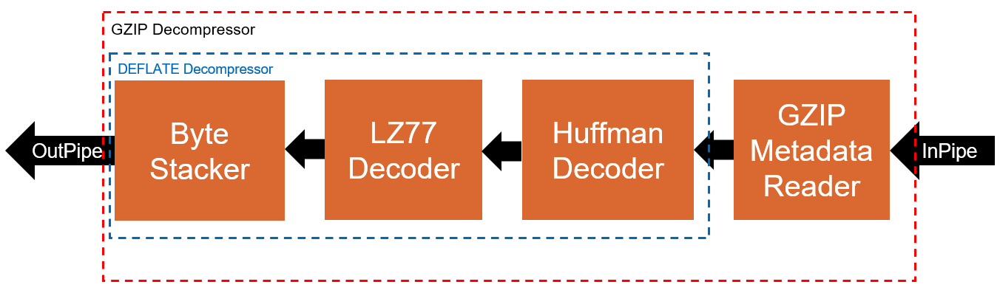

# Decompression
This reference design can be compiled to implement either GZIP or Snappy decompression on an FPGA.

| Optimized for                     | Description
---                                 |---
| OS                                | Ubuntu* 18.04/20.04 <br>RHEL*/CentOS* 8 <br>SUSE* 15 <br> Windows* 10
| Hardware                          | Intel&reg; Programmable Acceleration Card (PAC) with Intel Arria&reg; 10 GX FPGA <br> Intel&reg; FPGA Programmable Acceleration Card (PAC) D5005 (with Intel Stratix&reg; 10 SX) <br> Intel Xeon&reg; CPU E5-1650 v2 @ 3.50GHz (host machine)
| Software                          | Intel&reg; oneAPI DPC++ Compiler <br> Intel&reg; FPGA Add-On for oneAPI Base Toolkit
| What you will learn               | How to implement an efficient GZIP and Snappy decompression engine on an FPGA.
| Time to complete                  | 1 hour


## Purpose
This FPGA reference design demonstrates an efficient GZIP and Snappy decompression engine. See the [Additional Design Information Section](#additional-design-information) for more information on GZIP (DEFLATE) and Snappy compression and decompression.

### Additional Documentation
- [Explore SYCL* Through Intel&reg; FPGA Code Samples](https://software.intel.com/content/www/us/en/develop/articles/explore-dpcpp-through-intel-fpga-code-samples.html) helps you to navigate the samples and build your knowledge of FPGAs and SYCL.
- [FPGA Optimization Guide for Intel&reg; oneAPI Toolkits](https://software.intel.com/content/www/us/en/develop/documentation/oneapi-fpga-optimization-guide) helps you understand how to target FPGAs using SYCL and Intel&reg; oneAPI Toolkits.
- [Intel&reg; oneAPI Programming Guide](https://software.intel.com/en-us/oneapi-programming-guide) helps you understand target-independent, SYCL-compliant programming using Intel&reg; oneAPI Toolkits.

## Building the Reference Design

> **Note**: If you have not already done so, set up your CLI
> environment by sourcing  the `setvars` script located in
> the root of your oneAPI installation.
>
> Linux*:
> - For system wide installations: `. /opt/intel/oneapi/setvars.sh`
> - For private installations: `. ~/intel/oneapi/setvars.sh`
>
> Windows*:
> - `C:\Program Files(x86)\Intel\oneAPI\setvars.bat`
>
>For more information on environment variables, see Use the setvars Script for [Linux or macOS](https://www.intel.com/content/www/us/en/develop/documentation/oneapi-programming-guide/top/oneapi-development-environment-setup/use-the-setvars-script-with-linux-or-macos.html), or [Windows](https://www.intel.com/content/www/us/en/develop/documentation/oneapi-programming-guide/top/oneapi-development-environment-setup/use-the-setvars-script-with-windows.html).


### Include Files
The include folder is located at `%ONEAPI_ROOT%\dev-utilities\latest\include` on your development system.

### Running Code Samples in Intel&reg; DevCloud
If running a sample in the Intel&reg; DevCloud, remember that you must specify the type of compute node and whether to run in batch or interactive mode. Compiles to FPGA are only supported on fpga_compile nodes. Executing programs on FPGA hardware is only supported on fpga_runtime nodes of the appropriate type, such as fpga_runtime:arria10 or fpga_runtime:stratix10.  Neither compiling nor executing programs on FPGA hardware are supported on the login nodes. For more information, see the Intel&reg; oneAPI Base Toolkit Get Started Guide ([https://devcloud.intel.com/oneapi/documentation/base-toolkit/](https://devcloud.intel.com/oneapi/documentation/base-toolkit/)).

When compiling for FPGA hardware, it is recommended to increase the job timeout to 24h.

### Using Visual Studio Code*  (Optional)

You can use Visual Studio Code (VS Code) extensions to set your environment,
create launch configurations, and browse and download samples.

The basic steps to build and run a sample using VS Code include:
 - Download a sample using the extension **Code Sample Browser for Intel&reg; oneAPI Toolkits**.
 - Configure the oneAPI environment with the extension **Environment Configurator for Intel&reg; oneAPI Toolkits**.
 - Open a Terminal in VS Code (**Terminal>New Terminal**).
 - Run the sample in the VS Code terminal using the instructions below.
 - (Linux only) Debug your GPU application with GDB for Intel&reg; oneAPI toolkits using the Generate Launch Configurations extension.

To learn more about the extensions, see the 
[Using Visual Studio Code with Intel&reg; oneAPI Toolkits User Guide](https://software.intel.com/content/www/us/en/develop/documentation/using-vs-code-with-intel-oneapi/top.html).

After learning how to use the extensions for Intel oneAPI Toolkits, return to this readme for instructions on how to build and run a sample.

### On a Linux* System
1. Install the design into a directory `build` from the design directory by running `cmake`:

   ```
   mkdir build
   cd build
   ```

   If you are compiling for the Intel&reg; PAC with Intel Arria&reg; 10 GX FPGA, run `cmake` using the command:

   ```
   cmake ..
   ```

   If instead you are compiling for the Intel&reg; FPGA PAC D5005 (with Intel Stratix&reg; 10 SX), run `cmake` using the command:

   ```
   cmake .. -DFPGA_BOARD=intel_s10sx_pac:pac_s10
   ```

   To select between GZIP and Snappy decompression, use the -DGZIP=1 and -DSNAPPY=1 `cmake` flags, respectively:
   ```
   cmake .. -DGZIP=1
   cmake .. -DSNAPPY=1
   ```

2. Compile the design through the generated `Makefile`. The following targets are provided, and they match the recommended development flow:

    * Compile for emulation (fast compile time, targets emulated FPGA device).

       ```
       make fpga_emu
       ```

    * Generate HTML performance report. Find the report in `gunzip_report.prj/reports/report.html`directory.

       ```
       make report
       ```

    * Compile for FPGA hardware (longer compile time, targets FPGA device).

       ```
       make fpga
       ```

3. (Optional) As the above hardware compile may take several hours to complete, FPGA precompiled binaries (compatible with Linux* Ubuntu* 18.04) can be downloaded from the following URL: <https://iotdk.intel.com/fpga-precompiled-binaries/latest/decompress.fpga.tar.gz>.

### On a Windows* System
1. Generate the `Makefile` by running `cmake`.
     ```
   mkdir build
   cd build
   ```
   To compile for the Intel&reg; PAC with Intel Arria&reg; 10 GX FPGA, run `cmake` using the command:
    ```
    cmake -G "NMake Makefiles" ..
   ```
   Alternatively, to compile for the Intel&reg; FPGA PAC D5005 (with Intel Stratix&reg; 10 SX), run `cmake` using the command:
   ```
   cmake -G "NMake Makefiles" .. -DFPGA_BOARD=intel_s10sx_pac:pac_s10
   ```
   To select between GZIP and Snappy decompression, use the -DGZIP=1 and -DSNAPPY=1 `cmake` flags, respectively:
   ```
   cmake .. -DGZIP=1
   cmake .. -DSNAPPY=1
   ```

2. Compile the design through the generated `Makefile`. The following build targets are provided, matching the recommended development flow:
   * Compile for emulation (fast compile time, targets emulated FPGA device):
     ```
     nmake fpga_emu
     ```
   * Generate the optimization report:
     ```
     nmake report
     ``` 
   * An FPGA hardware target is not provided on Windows*. 

*Note:* The Intel&reg; PAC with Intel Arria&reg; 10 GX FPGA and Intel&reg; FPGA PAC D5005 (with Intel Stratix&reg; 10 SX) do not yet support Windows*. Compiling to FPGA hardware on Windows* requires a third-party or custom Board Support Package (BSP) with Windows* support.<br>
*Note:* If you encounter any issues with long paths when compiling under Windows*, you may have to create your ‘build’ directory in a shorter path, for example c:\samples\build.  You can then run cmake from that directory, and provide cmake with the full path to your sample directory.

## Troubleshooting

If an error occurs, you can get more details by running `make` with
the `VERBOSE=1` argument:
``make VERBOSE=1``
For more comprehensive troubleshooting, use the Diagnostics Utility for
Intel&reg; oneAPI Toolkits, which provides system checks to find missing
dependencies and permissions errors.
[Learn more](https://software.intel.com/content/www/us/en/develop/documentation/diagnostic-utility-user-guide/top.html).

### In Third-Party Integrated Development Environments (IDEs)

You can compile and run this Reference Design in the Eclipse* IDE (in Linux*) and the Visual Studio* IDE (in Windows*). For instructions, refer to the following link: [FPGA Workflows on Third-Party IDEs for Intel&reg; oneAPI Toolkits](https://www.intel.com/content/www/us/en/developer/articles/technical/intel-oneapi-dpcpp-fpga-workflow-on-ide.html).

## Running the Reference Design

 1. Run the sample on the FPGA emulator (the kernel executes on the CPU).
     ```
     ./decompress.fpga_emu    (Linux)
     decompress.fpga_emu.exe  (Windows)
     ```

2. Run the sample on the FPGA device.
     ```
     ./decompress.fpga        (Linux)
     decompress.fpga.exe    (Windows)
     ```

### Example of Output
You should see output similar to the following in the console for the GZIP and Snappy versions, respectively:
#### GZIP Example Output
```
Using GZIP decompression

>>>>> Uncompressed File Test <<<<<
Decompressing '../data/uncompressed.gz' 1 time
Launching kernels for run 0
All kernels have finished for run 0
>>>>> Uncompressed File Test: PASSED <<<<<

>>>>> Statically Compressed File Test <<<<<
Decompressing '../data/static_compressed.gz' 1 time
Launching kernels for run 0
All kernels have finished for run 0
>>>>> Statically Compressed File Test: PASSED <<<<<

>>>>> Dynamically Compressed File Test <<<<<
Decompressing '../data/dynamic_compressed.gz' 1 time
Launching kernels for run 0
All kernels have finished for run 0
>>>>> Dynamically Compressed File Test: PASSED <<<<<

>>>>> Throughput Test <<<<<
Decompressing '../data/tp_test.gz' 5 times
Launching kernels for run 0
All kernels have finished for run 0
Launching kernels for run 1
All kernels have finished for run 1
Launching kernels for run 2
All kernels have finished for run 2
Launching kernels for run 3
All kernels have finished for run 3
Launching kernels for run 4
All kernels have finished for run 4
Execution time: 7.12956 ms
Output Throughput: 561.045 MB/s
Compression Ratio: 1021.26:1
>>>>> Throughput Test: PASSED <<<<<

PASSED
```

The throughput of the GZIP decompression engine is highly dependent on the compression ratio of the input file, more specifically on the amount of LZ77 compression. The file chosen for this test has a very high amount of LZ77 compression and was chosen to demonstrate the maximum throughput achievable with this implementation. When decompressing other files, the throughput might be lower.

#### Snappy Example Output
```
Using SNAPPY decompression

>>>>> Alice In Wonderland Test <<<<<
Launching kernels for run 0
All kernels finished for run 0
>>>>> Alice In Wonderland Test: PASSED <<<<<

>>>>> Only Literal Strings Test <<<<<
Launching kernels for run 0
All kernels finished for run 0
>>>>> Only Literal Strings Test: PASSED <<<<<

>>>>> Many Copies Test <<<<<
Launching kernels for run 0
All kernels finished for run 0
>>>>> Many Copies Test: PASSED <<<<<

>>>>> Mixed Literal Strings and Copies Test <<<<<
Launching kernels for run 0
All kernels finished for run 0
>>>>> Mixed Literal Strings and Copies Test: PASSED <<<<<

>>>>> Throughput Test <<<<<
Launching kernels for run 0
All kernels finished for run 0
Launching kernels for run 1
All kernels finished for run 1
Launching kernels for run 2
All kernels finished for run 2
Launching kernels for run 3
All kernels finished for run 3
Launching kernels for run 4
All kernels finished for run 4
Execution time: 9.41422 ms
Output Throughput: 1699.56 MB/s
Compression Ratio: 0.999943:1
>>>>> Throughput Test: PASSED <<<<<

PASSED
```

**Important**: When running on the FPGA emulator, the *Execution time* and *Throughput* do not reflect the design's actual hardware performance.

## Additional Design Information
### Reference Design Source Files
The following source files can be found in the `src/` sub-directory. The `src/common/` sub-directory contains datatypes, functions, and kernels that are common to the GZIP and Snappy decompression implementations. The `src/gzip/` and `src/snappy/` sub-directories contain kernels and functions that are unique to the GZIP and Snappy decompression implementations.

| File                            | Description
|:---                             |:---
|`main.cpp`                       | Contains the `main()` function which launches the kernels, validates the results, and measures performance.
|`common/byte_stacker.hpp`        | A kernel that accepts between 0 and N elements per cycle and combines them to output N elements at a time.
|`common/common.hpp`              | Contains functions and data structures that are common across the design.
|`common/lz77_decoder.hpp`        | A kernel that implements LZ77 decoding. It streams in a union of a literal (character) or a {length, distance} pair and streams out literals.
|`common/simple_crc32.hpp`        | A simple implementation of CRC-32 calculation. This is used to validate the output of the decompression engine.
|`gzip/byte_bit_stream.hpp`       | A bitstream class that accepts one byte (8 bits) at a time and allows a variable number of bits to be read out on each transaction.
|`gzip/gzip_decompressor.hpp`     | The top-level file for the GZIP decompressor. This file launches all of the GZIP kernels.
|`gzip/gzip_header_data.hpp`      | A class to store the GZIP header data.
|`gzip/gzip_metadata_reader.hpp`  | A kernel that streams in a GZIP file, parses and strips the GZIP header and footer metadata, and streams the payload into the DEFLATE decompressor engine.
|`gzip/huffman_decoder.hpp`       | A kernel that implements Huffman decoding. It streams in DEFLATE blocks, a byte at a time, and streams out either a literal (character) or a {length, distance} pair.
|`snappy/byte_stream.hpp`         | A class to implement a stream of bytes. A compile-time constant amount are streamed in, while a dynamic number can be streamed out.
|`snappy/snappy_data_gen.hpp`     | Contains a function that generates snappy format data for testing the engine.
|`snappy/snappy_decompressor.hpp` | The top-level file for the Snappy decompressor. This file launches all of the Snappy kernels.
|`snappy/snappy_reader.hpp`       | A kernel that reads the snappy format stream and produces either literals or {length, distance} pairs to be consumed by the LZ77 kernel.

For `constexpr_math.hpp`, `memory_utils.hpp`, `metaprogramming_utils.hpp`, `tuple.hpp`, and `unrolled_loop.hpp` see the README file in the `DirectProgramming/DPC++FPGA/include/` directory.

### GZIP and Snappy
This reference designs contains code to implement both GZIP and Snappy decompression. This was done to reduce the amount of duplicated code, since the implementations are very similar. This is shown in the system-level figures below, which illustrate the GZIP and Snappy decompression engines on the FPGA, respectively. The orange kernels on the FPGA in the dashed box make up the streaming decompression engines. The *Producer* and *Consumer* kernels are only used to stream data into and out of the decompression engines from and to device memory, respectively.

##### GZIP Decompression Engine


##### Snappy Decompression Engine


The following sections will first describe the GZIP design, followed by the Snappy design, since the Snappy design is essentially a subset of the GZIP design.

### GZIP and DEFLATE
GZIP is an implementation of the DEFLATE protocol. The structure of a GZIP file is illustrated in the figure that follows. The file starts with a variable length, byte-aligned header of 10 or more bytes. Then follows the data payload, which is 1 or more DEFLATE compressed blocks. After the DEFLATE blocks, there might be some padding to realign to a byte boundary, and finally an 8-byte GZIP footer that contains the CRC-32 and size (in bytes) of the uncompressed data. For more details on the GZIP file format, see the [GZIP Wikipedia entry](https://en.wikipedia.org/wiki/Gzip).

##### GZIP File Structure


The DEFLATE compression algorithm performs LZ77 Encoding followed by Huffman encoding. Therefore, decompression decodes in the opposite order. For more information on the DEFLATE format and LZ77 and Huffman encoding/decoding, start with the [DEFLATE wikipedia entry](https://en.wikipedia.org/wiki/Deflate).

A DEFLATE block is is structured as follows:
- The first bit indicates whether this is the last block in a stream of blocks
- The second and third bits indicate the block compression type
  - 0x0 = **Uncompressed**
  - 0x1 = **Statically compressed**
  - 0x2 = **Dynamically compressed**
  - 0x3 = reserved (N/A)
- The remainder of the block depends on the block type:
  - **Uncompressed blocks** contain some additional bits to realign the block to a byte boundary, followed by a 2-byte `length`, 2-byte `nlength` (where `length = ~nlength`), and finally the uncompressed data. The number of bytes to read is indicated by the 2-byte `length` that was read.
  - **Statically compressed blocks** have a static Huffman table; a table that is defined in the DEFLATE format. Therefore. the remainder of the data in the block is the payload to be decoded using this table.
  - **Dynamically compressed blocks** are illustrated in the figure that follows. The second table is a list of code lengths for the literal and distance symbols. It is used to create the Huffman table for decoding the payload data. The first table is used to encode the second table. So, to decode a dynamically compressed block, the reader must read the first table, then decode the second table using the first table, create the Huffman table from the code lengths of the second table, and finally decode the payload using the Huffman table.

The GZIP decompression engine in this reference design supports all three block types.

##### Dynamically Compressed Block


### GZIP Decompression FPGA Design
The figure below illustrates the GZIP decompression engine in isolation. It delineates the streaming GZIP decompressor from the streaming DEFLATE decompressor. The `GZIPMetaDataReader` kernel parses and strips away the GZIP header and footer data and forwards the consecutive DEFLATE blocks to the DEFLATE decompression engine.



The following subsections will briefly discuss the high-level details of each of the kernels in the GZIP decompression engine.

#### GZIP Metadata Reader Kernel
The GZIP metadata reader kernel streams in the GZIP file a byte at a time, parses and strips away the GZIP header and footer, and forwards the remaining data to the DEFLATE portion of the decompression engine. The output of the GZIP metadata reader kernel is a stream of DEFLATE format compressed blocks.

#### Huffman Decoder Kernel
The Huffman decoder kernel streams in DEFLATE compressed blocks, a byte at a time, and streams out either literals (8-bit characters) or {length, distance} pairs. The Huffman decoder is not byte-aligned. It decodes the input stream bits at a time. To do this efficiently, the decoder uses the `ByteBitStream` class that streams in bytes at a time but gives the decoder access to all of the bits in parallel. This design takes advantage of the fact that the DEFLATE format limits code lengths to at most 15 bits.

The structure of the Huffman decoder is shown in the image that follows. The decoder examines the next 15 bits in the bit stream and checks for matches in the Huffman table of lengths 1-15 in parallel to create a 15-bit valid bitmap, where a 1 at bit `i` indicates that the code of length `i` matches a code in the Huffman table. For example, a value of `0b000000000000101` would indicate that there is a match of length `1` and `3`.

To decode the next symbol, the decoder finds the shortest of the 15 matches that were computed in parallel by performing a CTZ (count trailing zeros) operation on the valid bitmap and adds one to it, which is equivalent to finding the shortest match length.

Once the shortest match length is found, the bit stream is shifted by that many bits, the symbol for that match is read from the Huffman table, and the process repeats. If the decoded symbol is a literal, then the literal is written to the output. If the decoded symbol is a length, then no output is generated in this iteration. The length is saved and the next iteration of the loop decodes the distance and generates the {length, distance} pair output.

##### Huffman Decoder Structure


The Huffman decoder uses two Huffman tables: a 289-element table for literals and lengths, and a 32-element table for distances. The decoder knows that if it decodes a length from the first table that the next symbol must be a distance. 

The Huffman decoder in this design uses an intelligent method for storing the Huffman tables that significantly reduces area and improves performance. The decoder takes advantage of the fact that codes of the same bit lengths are sequential. For the literal and length table, it stores 4 tables:
   * A 289-element table that holds the symbols in increasing order of code length (`lit_map`), with no gaps. That is, it stores all symbols of length 1, followed directly by all symbols of length 2, and so on.
   * A 15-element table to store the first code for each code length (`first_code`).
   * A 15-element table to store the last code for each code length (`last_code`).
   * A 15-element table to store the base index of the first element in the `lit_map` table for each code length (`base_idx`). 

For a code length `L` and the code value `C`, the pseudocode snippet below describes how these tables are used to check for a match and decode the symbol. As described earlier, this pseudocode is done in parallel 15 times for code lengths (`L`) of 1-15 bits.

```
match = (C >= first_code[L]) && (C < last_code[L]);
offset = C - first_code[L];
symbol = lit_map[base_idx[L] + offset]
```

The Huffman decoder decodes a literal in 1 iteration of the main loop, and a {length, distance} pair in 2 iterations. When decoding a {length, distance} pair, the length code can be 1-15 bits and, based on the decoded length, 0-5 extra bits. Similarly, the distance code can be 1-15 bits and 0-15 extra bits. 

To decode a {length, distance} in 2 iterations, the Huffman decoder looks at 30 bits in parallel. The first 15 are examined as described earlier. The decoder also examines the 15x5 and 15x15 different possibilities for the extra length and distance bits. For the extra length bits, the shortest matching code can be 1-15 bits, giving 15 possibilities for where the extra bits could start. There can be 1-5 extra bits, giving 5 possibilities, which yields 15x5 possibilities for the extra length bits. Decoding the extra distance bits uses the same approach but with 0-15 extra bits, yielding 15x15 possibilities.

#### LZ77 Decoder Kernel
The input to the LZ77 decoder kernel is a stream of symbols that are either an 8-bit literal or a {length, distance} pair. The output is a stream of literals (8-bit characters). The LZ77 decoder keeps a 32KB *history buffer* which stores the last 32K literals it has streamed to the output. 

If the incoming command is an 8-bit literal, the LZ77 decoder simply forwards the literal to the output stream and tracks it in the history buffer. For a {length, distance} pair, the decoder goes back `distance` literals in the history buffer and streams `length` of them to the output and back into the history buffer.

The LZ77 decoder can be configured to read `N` elements from the history buffer per cycle, where `N` is a compile time constant (In the source code `N` is called `literals_per_cycle`). Therefore, the output of the LZ77 decoder kernel is an array of literals where the number of valid literals is in the range `[1, N]`, which is indicated by the `valid_count` variable.

The image that follows illustrates the multi-element LZ77 decoder. To read multiple elements from the history buffer at once, the history buffer is cyclically partitioned across `N` buffers. For example, if `N=4`, then the order in which literals are written to the history buffers is `0, 1, 2, 3, 0, 1, 2, 3, ...`. The `Current History Buffer Index` indicates which of the `N` history buffers is the next to be written to. When `N` (or less) elements come in the input, the elements are shuffled to the `N` buffers in the correct order. For example if `Current History Buffer Index` is 2, then the `N=4` incoming elements should be written to history buffers `{2, 3, 0, 1}`, respectively. In general, the order is `{Current History Buffer Index, (Current History Buffer Index + 1) % N, ..., (Current History Buffer Index + N - 1) % N}`.

##### Multi-element LZ77 Decoder Structure


When reading out of the history buffers, the `Current History Buffer Index` is used again to shuffle the output of the `N` buffers so that they are streamed out in the correct order. The following example illustrates reading the history buffer for `N=4`.

For this example, assume that to start the LZ77 decoder received 14 consecutive literals and wrote them to the output and history buffers in cyclical order (that is, to buffers `0, 1, 2, 3, 0, 1, 2, 3, ...`).
```
Characters:    E T H O M E P H O N E
               _ _ _ _ _ _ _ _ _ _ _ _
Buffer index:  0 1 2 3 0 1 2 3 0 1 2 3
```

The `Current History Buffer Index` is 3. That is, the next history buffer to write into is 3. Now, the LZ77 decoder receives a {length, distance} pair of `{4, 9}`, which means copy `H O M E`. To read the `N=4` elements, the LZ77 decoder unconditionally reads from each history buffer in parallel and computes a shuffle vector to reorder the output. 

To compute the shuffle vector, the LZ77 decoder determines which buffer should be read from first: `first_buf_idx = ('Current History Buffer Index' - distance) % N`. In this case `first_buf_idx = (3 - 9) % 4 = 2`. Then, the shuffle vector is computed as: `shuffle_vector = {first_buf_idx, (first_buf_idx + 1) % N, ..., (first_buf_idx + N - 1) % N} = {2, 3, 0, 1}`. The output from the `N=4` history buffers in this case would be `M E H O`, since `M` is in buffer `0`, `E` is in buffer `1`, and so on. Finally, the shuffling happens as follows:
```
input = {'M', 'E', 'H', 'O'}
shuffle_vector = {2, 3, 0, 1}
output = shuffle(input, shuffle_vector)
       = shuffle({'M', 'E', 'H', 'O'}, {2, 3, 0, 1})
       = {'H', 'O', 'M', 'E'}
```

Now, the state looks like this:
```
Characters:    E T H O M E P H O N E H O M E
               _ _ _ _ _ _ _ _ _ _ _ _ _ _ _ _
Buffer index:  0 1 2 3 0 1 2 3 0 1 2 3 0 1 2 0
```

In general, this process is repeated `ceil(length/N)` times. When `length` is not a multiple of `N`, the `valid_count` is used to tell the downstream kernel how many of the `N` literals are valid. There is an edge case when the `distance` in the {length, distance} pair is less than `N`. This is handled in the code, but is omitted in this document for brevity. To see how this edge case is handled, examine the code marked with the "*EDGE CASE!*" comment in the `LZ77DecoderMultiElement` function in `common/lz77_decoder.hpp`.

The history buffers have a read-after-write dependency since the LZ77 decoder both reads and writes back to them. The history buffers are implemented in on-chip RAMs and therefore have a read latency that results in an increased loop II. To fix this II issue, we use a shift-register cache to track in-flight writes to the history buffers. This technique is described in more detail in the *Caching On-Chip Memory to Improve Loop Performance* tutorial, which can be found in [DirectProgramming/DPC++FPGA/Tutorials/DesignPatterns/onchip_memory_cache](https://github.com/oneapi-src/oneAPI-samples/tree/master/DirectProgramming/DPC%2B%2BFPGA/Tutorials/DesignPatterns/onchip_memory_cache).

#### Byte Stacker Kernel
The input to the byte stacker kernel is an array of `N` characters and a `valid_count`, where `valid_count` is the number of valid characters in the range `[0, N]`. The kernel buffers valid characters until it can output `N` valid characters to the downstream kernel. `N` is a compile time constant and is equal to the number of literals the LZ77 decoder can read from the history buffer in a single cycle. The upstream LZ77 decoder kernel can produce less than `N` valid elements in two cases: when the Huffman decoder decodes a literal (that is, not a {length, distance} pair), or when the LZ77 decoder is reading a length that is not a multiple of `N` (for example `N = 4` and `{length, distance} = {7, 30}`).

### Snappy
Snappy is compression format that aims for high throughput compression and decompression, at the expense of compression ratio. It is typically used to compress database files that are stored in column-oriented format because columns are likely to have similar values (unlike rows).

Unlike many compression encodings, like DEFLATE, Snappy encoding is byte oriented. The Snappy format does not use entropy encoding, such as Huffman or range encoding.

Snappy encoding is like LZ77 encoding, which replaces portions of the byte stream with {length, distance} pairs. For more information on the Snappy format, see the [Snappy Wikipedia entry](https://en.wikipedia.org/wiki/Snappy_(compression)) and the [Google Snappy GitHub page](https://github.com/google/snappy).

The basic Snappy format is a *preamble* followed by the *compressed data stream*.

#### Preamble Format
The first bytes of the stream, often called the *preamble*, store the uncompressed file length as a `varint` value, which is in the range [0, 2^32). A `varint` consist of a series of bytes, where the lower 7 bits are data and the upper bit is set if there are more bytes to be read. For example, an uncompressed length of 64 would be stored as 0x40, and an uncompressed length of 2097150 (0x1FFFFE) would be stored as {0xFE, 0xFF, 0x7F}. Thus, the uncompressed length is stored in the first bytes of the stream, using a maximum of 5 bytes.

#### Compressed Data Stream Format
After the 1 to 5 byte preamble is the compressed data stream. The compressed data format contains two types of elements: literal strings and copies. A literal string is a sequence of characters, while a copy is a {length, distance} pair that instructs the decoder to go back *distance* characters in the past and copy *length* of them.

Each element starts with a tag byte, as illustrated in the following figure.

##### Compress Data Stream Element Byte Structure


The lower 2 bits of the tag byte indicate which element follows:

- 00: literal
- 01: copy with a 1-byte distance
- 10: copy with a 2-byte distance
- 11: copy with a 4-byte distance

The interpretation of the remaining 6 bits in the tag byte depend on the element type:

##### Literal Strings
For literal strings up to and including 60 characters, the upper 6 bits in the tag contain `length - 1`. For longer literals, the 6 extra tag bits indicate how many more bytes to read to get the length; `60`, `61`, `62` or `63` for `1`, `2`, `3`, and `4` bytes, respectively. After decoding the length, the literal string itself follows. These two formats are illustrated in the following figures.

##### Literal String Byte Format


##### Copies
This design supports copies with offsets up to 64 kB. Currently, the Snappy format does not produce offsets greater than 32 kB. If the distance is increased beyond 64 kB in the future, then this design will be updated accordingly.

As discussed earlier, there are 3 options for copies depending on the value of the : a 1-, 2-, or 4-byte distance. These three formats are illustrated in the following figure.

##### Copy Byte Format


**1-byte copies** can encode lengths in the range [4, 11], and offsets in the range [0, 2047]. Bits [4:2] of the tag byte stored the `length - 4`. The offset is 11 bits, where the high 3 bits are stored in the bits [7:5] of the tag byte, and the lower 8 bits are stored in the byte following the tag byte.

**2-byte copies** can encode lengths in the range [1, 64], and offsets in the range [0, 65535]. Bits [7:2] of the tag byte store `length - 1`. The distance is 16-bits and is store in the 2 bytes following the tag byte (in little-endian format).

**4-byte copies** are the similar to 2-byte copies but the distance is stored in the 4-bytes following the tag byte and therefore can have offsets in the range [0, 4294967295]. This copy type is not supported in the design because currently the Snappy format works on 32kB blocks and therefore never generates offsets greater than 32 kB.

### Snappy Decompression FPGA Design
The image that follows summarizes the full streaming Snappy decompression design. The orange kernels on the FPGA in the dashed box make up the streaming Snappy decompression engine. The `Producer` and `Consumer` kernels are used only to stream data into and out of the decompression engine from and to device memory.

##### Full Streaming Snappy Decompression FPGA Design


The Snappy Reader kernel reads the input stream and decodes it to stream out either literal strings or {length, distance} pairs to the LZ77 Decoder kernel. It can decode a tag byte and the subsequent extra bytes (at most 4 extra) in a single cycle. Thus, it can provide the downstream LZ77 Decoder kernel with either a literal or a {length, distance} pair every cycle.

You can set the `literals_per_cycle` parameter at compile-time. The parameter controls how many literals the Snappy Reader kernel can read from a literal string per cycle and the number of literals the LZ77 Decoder kernel can read from the history buffer per cycle. For the Snappy version of this design, the default value is `8` (see `main.cpp`) but it can be set at compile time using the `-DLITERALS_PER_CYCLE=<value>` flag.

The details for the [Byte Stacker kernel](#Byte-Stacker-Kernel) and [LZ77 Decoder kernels](#LZ77-Decoder-Kernel) are in the earlier [GZIP and DEFLATE section](#GZIP-and-Deflate).


## License

Code samples are licensed under the MIT license. See [License.txt](https://github.com/oneapi-src/oneAPI-samples/blob/master/License.txt) for details.

Third-party program Licenses can be found here: [third-party-programs.txt](https://github.com/oneapi-src/oneAPI-samples/blob/master/third-party-programs.txt).