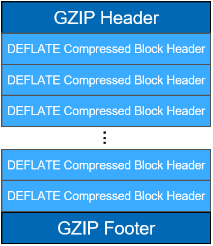
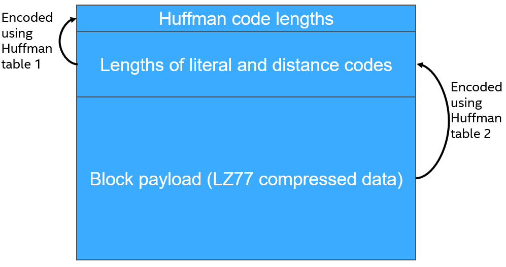
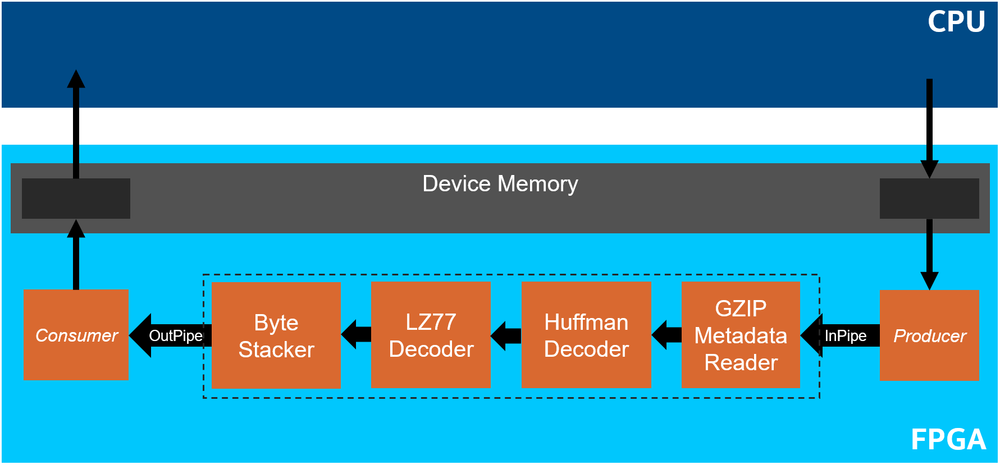
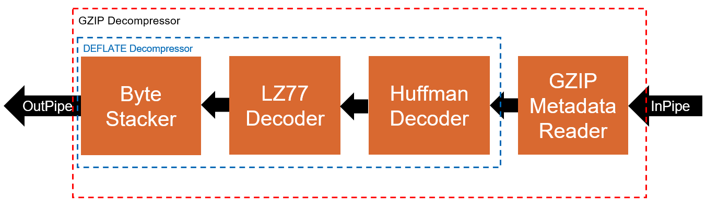
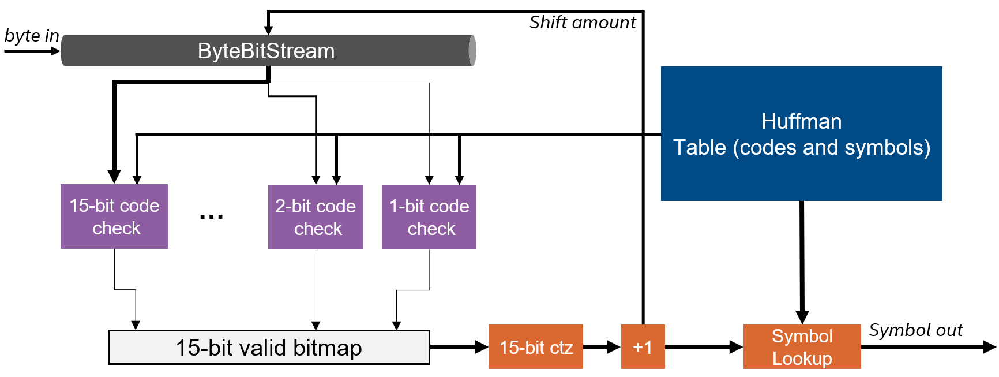
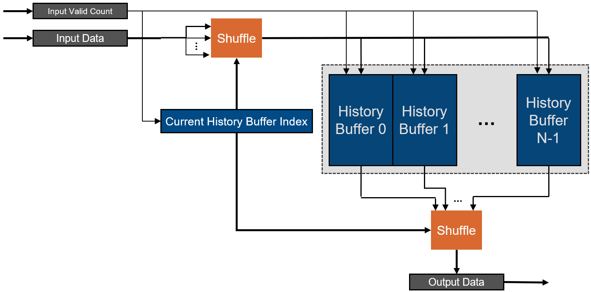

# GZIP Decompression
This DPC++ reference design demonstrates an GZIP decompression design on an FPGA.

***Documentation***:  
* [DPC++ FPGA Code Samples Guide](https://software.intel.com/content/www/us/en/develop/articles/explore-dpcpp-through-intel-fpga-code-samples.html) helps you to navigate the samples and build your knowledge of DPC++ for FPGA. <br>
* [oneAPI DPC++ FPGA Optimization Guide](https://software.intel.com/content/www/us/en/develop/documentation/oneapi-fpga-optimization-guide) is the reference manual for targeting FPGAs through DPC++. <br>
* [oneAPI Programming Guide](https://software.intel.com/en-us/oneapi-programming-guide) is a general resource for target-independent DPC++ programming. 
 
| Optimized for                     | Description
---                                 |---
| OS                                | Ubuntu* 18.04/20.04, RHEL*/CentOS* 8, SUSE* 15; Windows* 10
| Hardware                          | Intel&reg; Programmable Acceleration Card (PAC) with Intel Arria&reg; 10 GX FPGA <br> Intel&reg; FPGA Programmable Acceleration Card (PAC) D5005 (with Intel Stratix&reg; 10 SX) <br> Intel Xeon&reg; CPU E5-1650 v2 @ 3.50GHz (host machine)
| Software                          | Intel&reg; oneAPI DPC++ Compiler <br> Intel&reg; FPGA Add-On for oneAPI Base Toolkit
| What you will learn               | Creating an efficient GZIP decompressor on an FPGA.
| Time to complete                  | 1 hour

## Purpose
This FPGA reference design demonstrates an efficient GZIP decompression engine. See the [Additional Design Information Section](#additional-design-information) for more information on GZIP and DEFLATE de/compression for the FPGA.

## License  
Code samples are licensed under the MIT license. See
[License.txt](https://github.com/oneapi-src/oneAPI-samples/blob/master/License.txt) for details.

## Building the Reference Design

### Include Files
The include folder is located at `%ONEAPI_ROOT%\dev-utilities\latest\include` on your development system.

### Running Code Samples in DevCloud
If running a sample in the Intel DevCloud, remember that you must specify the type of compute node and whether to run in batch or interactive mode. Compiles to FPGA are only supported on fpga_compile nodes. Executing programs on FPGA hardware is only supported on fpga_runtime nodes of the appropriate type, such as fpga_runtime:arria10 or fpga_runtime:stratix10.  Neither compiling nor executing programs on FPGA hardware are supported on the login nodes. For more information, see the Intel® oneAPI Base Toolkit Get Started Guide ([https://devcloud.intel.com/oneapi/documentation/base-toolkit/](https://devcloud.intel.com/oneapi/documentation/base-toolkit/)).

When compiling for FPGA hardware, it is recommended to increase the job timeout to 24h.
 
### On a Linux* System
1. Install the design into a directory `build` from the design directory by running `cmake`:

   ```
   mkdir build
   cd build
   ```

   If you are compiling for the Intel® PAC with Intel Arria® 10 GX FPGA, run `cmake` using the command:

   ```
   cmake ..
   ```

   If instead you are compiling for the Intel® FPGA PAC D5005 (with Intel Stratix® 10 SX), run `cmake` using the command:

   ```
   cmake .. -DFPGA_BOARD=intel_s10sx_pac:pac_s10
   ```

2. Compile the design through the generated `Makefile`. The following targets are provided, and they match the recommended development flow:

    * Compile for emulation (fast compile time, targets emulated FPGA device).

       ```
       make fpga_emu
       ```

    * Generate HTML performance report. Find the report in `gunzip_report.prj/reports/report.html`directory.

       ```
       make report
       ```

    * Compile for FPGA hardware (longer compile time, targets FPGA device).

       ```
       make fpga
       ```

3. (Optional) As the above hardware compile may take several hours to complete, FPGA precompiled binaries (compatible with Linux* Ubuntu* 18.04) can be downloaded <a href="https://iotdk.intel.com/fpga-precompiled-binaries/latest/gunzip.fpga.tar.gz" download>here</a>.

### On a Windows* System
1. Generate the `Makefile` by running `cmake`.
     ```
   mkdir build
   cd build
   ```
   To compile for the Intel® PAC with Intel Arria® 10 GX FPGA, run `cmake` using the command:  
    ```
    cmake -G "NMake Makefiles" ..
   ```
   Alternatively, to compile for the Intel® FPGA PAC D5005 (with Intel Stratix® 10 SX), run `cmake` using the command:
   ```
   cmake -G "NMake Makefiles" .. -DFPGA_BOARD=intel_s10sx_pac:pac_s10
   ```

2. Compile the design through the generated `Makefile`. The following build targets are provided, matching the recommended development flow:
   * Compile for emulation (fast compile time, targets emulated FPGA device): 
     ```
     nmake fpga_emu
     ```
   * Generate the optimization report: 
     ```
     nmake report
     ``` 
   * An FPGA hardware target is not provided on Windows*. 

*Note:* The Intel® PAC with Intel Arria® 10 GX FPGA and Intel® FPGA PAC D5005 (with Intel Stratix® 10 SX) do not yet support Windows*. Compiling to FPGA hardware on Windows* requires a third-party or custom Board Support Package (BSP) with Windows* support.

### In Third-Party Integrated Development Environments (IDEs)

You can compile and run this Reference Design in the Eclipse* IDE (in Linux*) and the Visual Studio* IDE (in Windows*). For instructions, refer to the following link: [Intel® oneAPI DPC++ FPGA Workflows on Third-Party IDEs](https://software.intel.com/en-us/articles/intel-oneapi-dpcpp-fpga-workflow-on-ide)

## Running the Reference Design

 1. Run the sample on the FPGA emulator (the kernel executes on the CPU).
     ```
     ./gunzip.fpga_emu    (Linux)
     gunzip.fpga_emu.exe  (Windows)
     ```

2. Run the sample on the FPGA device.
     ```
     ./gunzip.fpga        (Linux)
     ```

### Example of Output
You should see output similar to the following in the console:
```
TODO
```
NOTE: When running on the FPGA emulator, the *Execution time* and *Throughput* do not reflect the design's actual hardware performance.
    

## Additional Design Information
### Source Code Breakdown
The following source files can be found in the `src/` sub-directory.

| File                            | Description 
|:---                             |:---
|`main.cpp`                       | Contains the `main()` function and the top-level launching, validation, and performance measurements.
|`byte_bit_stream.hpp`            | A bitstream class that has 8-bits (a byte) written in and a dynamic number of bits read.
|`byte_stacker.hpp`               | A kernel that accepts between 0 and N elements per cycle, collects up N elements, and writes out N elements.
|`common.hpp`                     | Functions common across the design.
|`gzip_decompressor.hpp`          | The top-level file for the GZIP decompressor. This file launches all of the GZIP kernels.
|`gzip_header_data.hpp`           | A class to store the GZIP header data.
|`gzip_metadata_reader.hpp`       | A kernel that streams in a GZIP file, parses and strips the GZIP header and footer metadata, and streams the payload into the DEFLATE decompressor engine.
|`huffman_decoder.hpp`            | A kernel that implements Huffman decoding. It streams in DEFLATE blocks, a byte at a time, and streams out either a literal (character) or a {length, distance} pair.
|`lz77_decoder.hpp`               | A kernel that implements LZ77 decoding. It streams in a union of a literal (character) or a {length, distance} pair and streams out literals.
|`simple_crc32.hpp`               | A simple implementation of CRC-32 calculation. This is used to validate the output of the GZIP engine.

### GZIP and DEFLATE
GZIP is specific implementation of the DEFLATE protocol. The structure of a GZIP file is illustrated in the figure below. It starts with a variable length, byte-aligned header of 10 or more bytes. Then follows the data payload, which is 1 or more DEFLATE compressed blocks. After the DEFLATE blocks, there may be some small amount of padding to realign to a byte boundary, and finally an 8-byte GZIP footer, which contains the CRC-32 and size (in bytes) of the uncompressed data. For more details on the GZIP file format, [see here](https://en.wikipedia.org/wiki/Gzip)



The DEFLATE compression algorithm performs LZ77 Encoding followed by Huffman encoding (decompression decodes in the opposite order). For more information on the DEFLATE format and LZ77 and Huffman encoding/decoding, [start here](https://en.wikipedia.org/wiki/Deflate).

A DEFLATE block is is structured as follows:
- The first bit indicates whether this is the last block in a stream of blocks
- The second and third bits indicate the block compression type
  - 0x0 = **Uncompressed**
  - 0x1 = **Statically compressed**
  - 0x2 = **Dynamically compressed**
  - 0x3 = reserved (N/A)
- The remainder of the block depends on the block type:
  - **Uncompressed blocks** contain some additional bits to realign the block to a byte boundary, followed by a 2-byte `length`, 2-byte `nlength` (where `length = ~nlength`), and finally the uncompressed data. The number of bytes to read is indicated by the 2-byte `length` that was read.
  - **Statically compressed** have a *static* Huffman table; a table defined in the DEFLATE format. Therefore the remainder of the data in the block is the payload to be decoded using this table.
  - **Dynamically compressed** is illustrated in the figure below. The second table is a list of code lengths for the literal and distance symbols. It is used to create the Huffman table for decoding the payload data. The first table is used to encode the second table. So, to decode a dynamically compressed block, the reader must read the first table, then decode the second table using the first table, create the Huffman table from the code lengths of the second table, and finally decode the payload using the Huffman table.

The GZIP decompression engine in this reference design fully supports all of the block types listed above.




### GZIP Decompression FPGA Design
The image below summarizes the full streaming GZIP decompression design. The orange kernels on the FPGA in the dashed box are the *actual* streaming GZIP decompression engine. The *Producer* and *Consumer* kernels are only used to stream data into and out of the GZIP decompression engine from device memory, respectively.



The figure below illustrates the GZIP decompression engine in isolation. It delineates the streaming GZIP decompressor from the streaming DEFLATE decompressor. The `GZIPMetaDataReader` kernel parses and strips away the GZIP header and footer data and forwards the consecutive DEFLATE blocks to the DEFLATE decompression engine.



The following subsections will briefly discuss the high-level details of each of the kernels in the GZIP decompression engine.

#### GZIP Metadata Reader
The GZIP metadata reader streams in in the GZIP file, a byte at a time, parses and strips away the GZIP header and footer, and forwards the remaining data to the DEFLATE portion of the decompression engine. The output of the GZIP Metadata Reader is a stream of DEFLATE format compressed blocks.

#### Huffman Decoder
The Huffman decoder streams in DEFLATE compressed blocks, a byte at a time, and streams out either literals (8-bit characters) or {length, distance} pairs. The Huffman decoder is not byte-aligned; it decodes the input stream bits at a time. To do this efficiently, the decoder uses the `ByteBitStream` class, which streams in bytes at a time but gives the decoder access to a configurable number of bits in parallel. This design takes advantage of the fact that the DEFLATE format limits code lengths to at most 15 bits.

The structure of the Huffman decoder is shown in the image below. The decoder examines the next 15 bits in the bit stream and checks for matches of length 1-15 in parallel to create a 15-bit *valid bitmap*, where a 1 at bit `i` indicates that the code of length `i+1` matches one of the codes in the Huffman table. To decode the next symbol, the decoder finds the *shortest* of the 15 matches that were computed in parallel. To do so, it performs a `CTZ` (**c**ount **t**railing **z**eros) operation on the valid bitmap and adds one to it, which is equivalent to finding the *first index with a value of 1*, which, in our case, is equivalent to the shortest match length. Once the shortest match length is found, the bit stream is shifted by that many bits, the symbol for that match is looked up and written to the output, and the process repeats. Since the codes are guaranteed to be at most 15 bits, the decoder will decode a symbol every time this operation is performed.



The Huffman decoder uses two Huffman tables: a 289-element table for literals and lengths, and a 32-element table for distances. The decoder knows that if it decodes a length from the first table, as opposed to a literal, that the next symbol must be a distance. The Huffman decoder in this design uses an intelligent method for storing the Huffman tables that significantly reduces area and improves performance. The decoder takes advantage of the fact that *codes of the same bit lengths are sequential*. For the literal and length table, it stores 4 tables: a 289-element table that holds the symbols in increasing order of code length (`lit_map`), with no gaps. That is, it stores all symbols of length 1, followed directly by all symbols of length 2, and so on. Two 15-element tables store the first and last code for each code length (`first_code` and `last_code`), and another 15-element table stores the base index index of the first element in the `lit_map` table for each code length (`base_idx`). Then, for a code length `L` and the code value `C`, the pseudocode snippet below describes how these tables are used to check for a match and retrieve the symbol. As described earlier, this pseudocode is done in parallel 15 times for code lengths (`L`) of 1-15 bits.

```
match = (C >= first_code[L]) && (C < last_code[L]);
offset = C - first_code[L];
symbol = lit_map[base_idx[L] + offset]
```

The Huffman decoder decodes a literal in 1 iteration of the main loop, and a {length, distance} pair in 2 iterations. When decoding a {length, distance} pair, the length code can be 1-15 bits and, based on the decoded length, 0-5 extra bits. Similarly, the distance code can be 1-15 bits and 0-15 extra bits. To decode a {length, distance} in 2 iterations, the Huffman decoder looks at 30 bits in parallel. The first 15 are examined as described earlier. The decoder also examines the 15x5 and 15x15 different possibilities for the extra length and distance bits, respectively. For the extra length bits, the shortest matching code can be 1-15 bits, giving 15 possibilities for where the extra bits *start*. There can be 1-5 extra bits, giving 5 possibilities, which yields 15x5 possibilities for the extra length bits. Decoding the extra distance bits uses the same approach but with 0-15 extra bits, yielding 15x15 possibilities.

#### LZ77 Decoder
The input to the LZ77 decoder is a stream of commands that are either an 8-bit literal or a {length, distance} pair - the output of the Huffman decoder. The output is a stream of literals (8-bit characters). The LZ77 decoder keeps a 32K *history buffer*; a history of the last 32K literals it has streamed to the output. 

If the incoming command is an 8-bit literal, the LZ77 decoder simply forwards the literal to the output stream and tracks it in the history buffer. For a {length, distance} pair, the LZ77 kernel goes back `distance` literals in the history buffer and streams `length` of them to the output (and back into the history buffer).

The LZ77 decoder can be configured to read `N` elements from the history buffer per cycle, where `N` is a compile time constant (NOTE: in the source code `N` is called `literals_per_cycle`). Therefore, the output of the LZ77 decoder kernels is actually an array of literals where the number of valid literals is in the range `[1, N]`, which is indicated by the `valid_count` variable.

The image below illustrates the multi-element LZ77 decoder. To read multiple elements from the history buffer at once, the history buffer is cyclically partitioned across `N` buffers. For example, if `N=4`, then the order in which you write to the history buffers is `0, 1, 2, 3, 0, 1, 2, 3, ...` and so on. The *Current History Buffer Index* indicates which of the `N` history buffers is the *next* to be written to. When `N` (or less) elements come in the input, the elements are shuffled to the `N` buffers in the correct order. For example if *Current History Buffer Index* is 2, then the `N=4` incoming elements should be written to history buffers `{2, 3, 0, 1}`, respectively. In general, the order is `{Current History Buffer Index, (Current History Buffer Index + 1) % N, ..., (Current History Buffer Index + N - 1) % N}`.



When reading out of the history buffers, the *Current History Buffer Index* is again used to shuffle the output of the `N` buffers so that they are streamed out in the correct order. The following example illustrates reading the history buffer for `N=4`.

Let's assume that to start the LZ77 decoder received 14 consecutive literals and wrote them to the output and history buffers in cyclical order (i.e. to buffers `0, 1, 2, 3, 0, 1, 2, 3, ...`).
```
Characters:    E T H O M E P H O N E
               _ _ _ _ _ _ _ _ _ _ _ _
Buffer index:  0 1 2 3 0 1 2 3 0 1 2 3
```

The *Current History Buffer Index* is 3, that is the next history buffer to write into is 3. Now the LZ77 decoder receives a {length, distance} pair of `{4, 9}`, which means copy "H O M E". To read the `N=4` elements, the LZ77 decoder unconditionally reads from each history buffer in parallel and computes a shuffle vector to reorder the output. To compute the shuffle vector, the LZ77 decoder determines which buffer should be read from first: `first_buf_idx = ('Current History Buffer Index' - distance) % N`. In this case `first_buf_idx = (3 - 9) % 4 = 2`. Then, the shuffle vector is computed as: `shuffle_vector = {first_buf_idx, (first_buf_idx + 1) % N, ..., (first_buf_idx + N - 1) % N} = {2, 3, 0, 1}`. The output from the `N=4` history buffers in this case would be "M E H O", since "M" is in buffer 0, "E" is in buffer 1, and so on. Finally, the shuffling happens as follows:
```
input = {'M', 'E', 'H', 'O'}
shuffle_vector = {2, 3, 0, 1}
output = shuffle(input, shuffle_vector)
       = shuffle({'M', 'E', 'H', 'O'}, {2, 3, 0, 1})
       = {'H', 'O', 'M', 'E'}
```

Now, the state looks like this:
```
Characters:    E T H O M E P H O N E H O M E
               _ _ _ _ _ _ _ _ _ _ _ _ _ _ _ _
Buffer index:  0 1 2 3 0 1 2 3 0 1 2 3 0 1 2 0
```

In general, this process is repeated `ceil(length/N)` times. When `length` is not a multiple of `N`, the `valid_count` is used to tell the downstream kernel how many of the `N` literals are valid. There is an edge case when the `distance` in the {length, distance} pair is less than `N`. This is handled in the code, but is omitted in this document for brevity.

The history buffers have a read-after-write dependency since, when reading from the history buffers, the LZ77 decoder is also writing back to them. The history buffers are implemented in on-chip RAMs and therefore have a read latency that results in an increased loop II. To fix this II issue, we use a shift-register cache to track in-flight writes to the history buffers. This technique is described in more detail in the **Caching On-Chip Memory to Improve Loop Performance** (onchip_memory_cache) tutorial.

#### Byte Stacker
The input to the byte stacker is an array of `N` characters and a `valid_count`, where `valid_count` is the number of valid characters in the range `[0, N]`. The kernel buffers valid characters until it can output `N` valid characters to the downstream kernel. `N` is a compile time constant and is equal to the number of literals the LZ77 decoder can read from the history buffer in a single cycle. The upstream LZ77 decoder kernel can produce less than `N` valid elements in two cases: when the Huffman decoder decodes a literal (i.e., not a {length, distance} pair), or when the LZ77 decoder is reading a length that is not a multiple of `N` (e.g. `N = 4` and `{length, distance} = {7, 30}`).