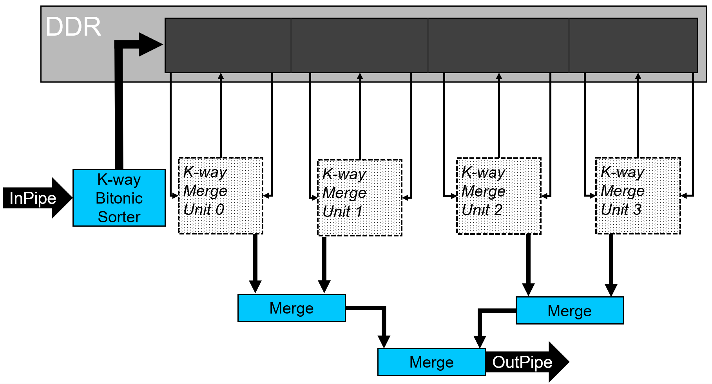

# Merge Sort
This DPC++ reference design demonstrates a highly paramaterizable merge sort algorithm on an FPGA.

***Documentation***:
* [DPC++ FPGA Code Samples Guide](https://software.intel.com/content/www/us/en/develop/articles/explore-dpcpp-through-intel-fpga-code-samples.html) helps you to navigate the samples and build your knowledge of DPC++ for FPGA. <br>
* [oneAPI DPC++ FPGA Optimization Guide](https://software.intel.com/content/www/us/en/develop/documentation/oneapi-fpga-optimization-guide) is the reference manual for targeting FPGAs through DPC++. <br>
* [oneAPI Programming Guide](https://software.intel.com/en-us/oneapi-programming-guide) is a general resource for target-independent DPC++ programming.

| Optimized for                     | Description
---                                 |---
| OS                                | Ubuntu* 18.04/20.04, RHEL*/CentOS* 8, SUSE* 15; Windows* 10
| Hardware                          | Intel&reg; Programmable Acceleration Card (PAC) with Intel Arria&reg; 10 GX FPGA <br> Intel&reg; FPGA Programmable Acceleration Card (PAC) D5005 (with Intel Stratix&reg; 10 SX) <br> Intel Xeon&reg; CPU E5-1650 v2 @ 3.50GHz (host machine)
| Software                          | Intel&reg; oneAPI DPC++ Compiler <br> Intel&reg; FPGA Add-On for oneAPI Base Toolkit
| What you will learn               | How to use the spatial compute of the FPGA to create a merge sort design that takes advantage of thread- and SIMD-level parallelism.
| Time to complete                  | 1 hour

## Purpose
This FPGA reference design demonstrates a highly paramaterizable merge sort design that utilizes the spatial computing of the FPGA. The basic merge sort algorithm is described [here](https://en.wikipedia.org/wiki/Merge_sort). See the [Additional Design Information Section](#additional-design-information) for more information on how the merge sort algorithm was implemented on the FPGA.

## License
Code samples are licensed under the MIT license. See
[License.txt](https://github.com/oneapi-src/oneAPI-samples/blob/master/License.txt) for details.

## Building the Reference Design

### Include Files
The include folder is located at `%ONEAPI_ROOT%\dev-utilities\latest\include` on your development system.

### Running Code Samples in DevCloud
If running a sample in the Intel DevCloud, remember that you must specify the type of compute node and whether to run in batch or interactive mode. Compiles to FPGA are only supported on fpga_compile nodes. Executing programs on FPGA hardware is only supported on fpga_runtime nodes of the appropriate type, such as fpga_runtime:arria10 or fpga_runtime:stratix10.  Neither compiling nor executing programs on FPGA hardware are supported on the login nodes. For more information, see the Intel® oneAPI Base Toolkit Get Started Guide ([https://devcloud.intel.com/oneapi/documentation/base-toolkit/](https://devcloud.intel.com/oneapi/documentation/base-toolkit/)).

When compiling for FPGA hardware, it is recommended to increase the job timeout to 24h.


### Using Visual Studio Code*  (Optional)

You can use Visual Studio Code (VS Code) extensions to set your environment, create launch configurations,
and browse and download samples.

The basic steps to build and run a sample using VS Code include:
 - Download a sample using the extension **Code Sample Browser for Intel oneAPI Toolkits**.
 - Configure the oneAPI environment with the extension **Environment Configurator for Intel oneAPI Toolkits**.
 - Open a Terminal in VS Code (**Terminal>New Terminal**).
 - Run the sample in the VS Code terminal using the instructions below.

To learn more about the extensions and how to configure the oneAPI environment, see
[Using Visual Studio Code with Intel® oneAPI Toolkits](https://software.intel.com/content/www/us/en/develop/documentation/using-vs-code-with-intel-oneapi/top.html).

After learning how to use the extensions for Intel oneAPI Toolkits, return to this readme for instructions on how to build and run a sample.

### On a Linux* System
1. Install the design into a directory `build` from the design directory by running `cmake`:

   ```
   mkdir build
   cd build
   ```

   If you are compiling for the Intel® PAC with Intel Arria® 10 GX FPGA, run `cmake` using the command:

   ```
   cmake ..
   ```

   If instead you are compiling for the Intel® FPGA PAC D5005 (with Intel Stratix® 10 SX), run `cmake` using the command:

   ```
   cmake .. -DFPGA_BOARD=intel_s10sx_pac:pac_s10
   ```

2. Compile the design through the generated `Makefile`. The following targets are provided, and they match the recommended development flow:

    * Compile for emulation (fast compile time, targets emulated FPGA device).

       ```
       make fpga_emu
       ```

    * Generate HTML performance report. Find the report in `merge_sort_report.prj/reports/report.html`directory.

       ```
       make report
       ```

    * Compile for FPGA hardware (longer compile time, targets FPGA device).

       ```
       make fpga
       ```

3. (Optional) As the above hardware compile may take several hours to complete, FPGA precompiled binaries (compatible with Linux* Ubuntu* 18.04) can be downloaded <a href="https://iotdk.intel.com/fpga-precompiled-binaries/latest/merge_sort.fpga.tar.gz" download>here</a>.

### On a Windows* System
1. Generate the `Makefile` by running `cmake`.
     ```
   mkdir build
   cd build
   ```
   To compile for the Intel® PAC with Intel Arria® 10 GX FPGA, run `cmake` using the command:
    ```
    cmake -G "NMake Makefiles" ..
   ```
   Alternatively, to compile for the Intel® FPGA PAC D5005 (with Intel Stratix® 10 SX), run `cmake` using the command:
   ```
   cmake -G "NMake Makefiles" .. -DFPGA_BOARD=intel_s10sx_pac:pac_s10
   ```

2. Compile the design through the generated `Makefile`. The following build targets are provided, matching the recommended development flow:
   * Compile for emulation (fast compile time, targets emulated FPGA device):
     ```
     nmake fpga_emu
     ```
   * Generate the optimization report:
     ```
     nmake report
     ```
   * An FPGA hardware target is not provided on Windows*.

*Note:* The Intel® PAC with Intel Arria® 10 GX FPGA and Intel® FPGA PAC D5005 (with Intel Stratix® 10 SX) do not yet support Windows*. Compiling to FPGA hardware on Windows* requires a third-party or custom Board Support Package (BSP) with Windows* support.<br>
*Note:* If you encounter any issues with long paths when compiling under Windows*, you may have to create your ‘build’ directory in a shorter path, for example c:\samples\build.  You can then run cmake from that directory, and provide cmake with the full path to your sample directory.

### In Third-Party Integrated Development Environments (IDEs)

You can compile and run this Reference Design in the Eclipse* IDE (in Linux*) and the Visual Studio* IDE (in Windows*). For instructions, refer to the following link: [Intel® oneAPI DPC++ FPGA Workflows on Third-Party IDEs](https://software.intel.com/en-us/articles/intel-oneapi-dpcpp-fpga-workflow-on-ide)

## Running the Reference Design

 1. Run the sample on the FPGA emulator (the kernel executes on the CPU).
     ```
     ./merge_sort.fpga_emu    (Linux)
     merge_sort.fpga_emu.exe  (Windows)
     ```

2. Run the sample on the FPGA device.
     ```
     ./merge_sort.fpga        (Linux)
     ```

### Example of Output
You should see output similar to the following in the console:
```
Running sort 17 times for an input size of 16777216 using 8 4-way merge units
Streaming data from device memory
Execution time: 24.7522 ms
Throughput: 646.408 Melements/s
PASSED
```
NOTE: The performance numbers above were achieved using the Intel&reg; FPGA Programmable Acceleration Card (PAC) D5005 (with Intel Stratix&reg; 10 SX); your results may vary. <br/>
NOTE: When running on the FPGA emulator, the *Execution time* and *Throughput* do not reflect the design's actual hardware performance.

## Additional Design Information
### Source Code Breakdown
The following source files can be found in the `src/` sub-directory.

| File                           | Description
|:---                            |:---
|`main.cpp`                      | Contains the `main()` function and the top-level interfaces.
|`merge_sort.hpp`                | The function to submit all of the merge sort kernels (`SortingNetwork`, `Produce`, `Merge`, and `Consume`).
|`consume.hpp`                   | The `Consume` kernel for the merge unit. This kernel reads from an input pipe and writes out to either a different output pipe, or to device memory.
|`impu_math.hpp`                 | Metaprogramming math helper functions (*impu* = Intel Metaprogramming Utilities)
|`merge.hpp`                     | The `Merge` kernel for the merge unit and the merge tree. This kernel streams in two sorted lists, merges them into a single sorted list of double the size, and streams the data out a pipe.
|`pipe_utils.hpp`                | Header file containing the definition of an array of pipes. This header can be found in the DirectProgramming/DPC++FPGA/include/ directory of this repository.
|`produce.hpp`                   | The `Produce` kernel for the merge unit. This kernel reads from input pipes or performs strided reads from device memory and writes the data to an output pipe.
|`sorting_networks.hpp`          | Contains all of the code relevant to sorting networks, including the `SortingNetwork` kernel, as well as the `BitonicSortingNetwork` and `MergeSortNetwork` helper functions.
|`unrolled_loop.hpp`             | A templated-based loop unroller that unrolls loops in the compiler front end.

### Merge Sort Details
This section will describe how the merge sort design is structured and how it takes advantage of the spatial compute of the FPGA. <br/>

The figure below shows the conceptual view of the merge sort design to the user. The user streams data into a SYCL pipe (`InPipe`) and, after some delay, the elements are streamed out of a SYCL pipe (`OutPipe`), in sorted order. The number of elements that the merge sort design is capable of sorting is a runtime parameter, but it must be a power of 2. However, this restriction can be worked around by padding the input stream with min/max elements, depending on the direction of the sort (smallest-to-largest vs largest-to-smallest). This technique is demonstrated in this design (see the `fpga_sort` function in *main.cpp*).


The basis of the merge sort design is what we call a *merge unit*, which is shown in the figure below. A single merge unit streams in two sorted lists of size `count` in parallel and merges them into a single sorted list of size `2*count`. The lists are streamed in from device memory (e.g., DDR or HBM) by two `Produce` kernels. The `Consume` kernel can stream data out to either a SYCL pipe or to device memory.


A single merge unit requires `lg(N)` iterations to sort `N` elements. This requires the host to enqueue `lg(N)` iterations of the merge unit kernels that merge sublists of size {`1`, `2`, `4`, ...} into larger lists of size {`2`, `4`, `8`, ...}, respectively. This results in a timeline that looks like the figure below.


To achieve SIMD-level (**S**ingle **I**nstruction **M**ultiple **D**ata) parallelism, we enhance the merge unit to merge `k` elements per cycle. The figure below illustrates how this is done. In the following discussion, we will assume that we are sorting from smallest-to-largest, but the logic is very similar for sorting largest-to-smallest and is easily configurable at compile time in this design. <br/>

The merge unit looks at the two inputs of size `k` coming from the `ProduceA` and `ProduceB` kernels (in the figure below, `k=4`) and compares the first elements of each set; remember, these set of `k` elements are already sorted, so we are comparing the smallest elements of the set. Whichever set of elements has the *smaller of the smallest elements* is chosen and combined with `k` other elements from the `feedback` path. These `2*k` elements go through a merge sort network that sorts them in a single cycle. After the `2*k` elements are sorted, the smallest `k` elements are sent to the output (to the `Consume` kernel) and the largest `k` elements are fed back into the sorting network (the `feedback` path in the figure below), and the process repeats. This allows the merge unit to process `k` elements per cycle in the steady state. Note that `k` must be a power of 2. <br/>

More information on this design can be found in this paper by [R. Kobayashi and K. Kise](https://www.researchgate.net/publication/316604001_A_High_Performance_FPGA-Based_Sorting_Accelerator_with_a_Data_Compression_Mechanism).


To achieve thread-level parallelism, the merge sort design accepts a template parameter, `units`, which allows one to instantiate multiple instances of the merge unit, as shown in the figure below. Before the merge units start processing data, the incoming data coming from the input pipe is sent through a bitonic sorting network and written to the temporary buffer partitions in device memory. This sorting network sorts `k` elements per cycle in the steady state. Choosing the number of merge units is an area-performance tradeoff (note: the number of instantiated merge units must be a power of 2). Each merge unit sorts an `N/units`-sized partition of the input data in parallel.



After the merge units sort their `N/units`-sized partition, the partitions of each unit must be reduced into a single sorted list. There are two options to do this: (1) reuse the merge units to perform `lg(units)` more iterations to sort the partitions, or (2) create a merge tree to reduce the partitions into a single sorted list. Option (1) saves area at the expense of performance, since it has to perform additional sorting iterations. Option (2), which we choose for this design, improves performance by creating a merge tree to reduce the final partitions into a single sorted list. The `Merge` kernels in the merge tree (shown in the figure above) use the same kernel code that is used in the `Merge` kernel of the merge unit, which means they too can merge `k` elements per cycle. Once the merge units perform their last iteration, they output to a pipe (instead of writing to device memory) that feeds the merge tree.
