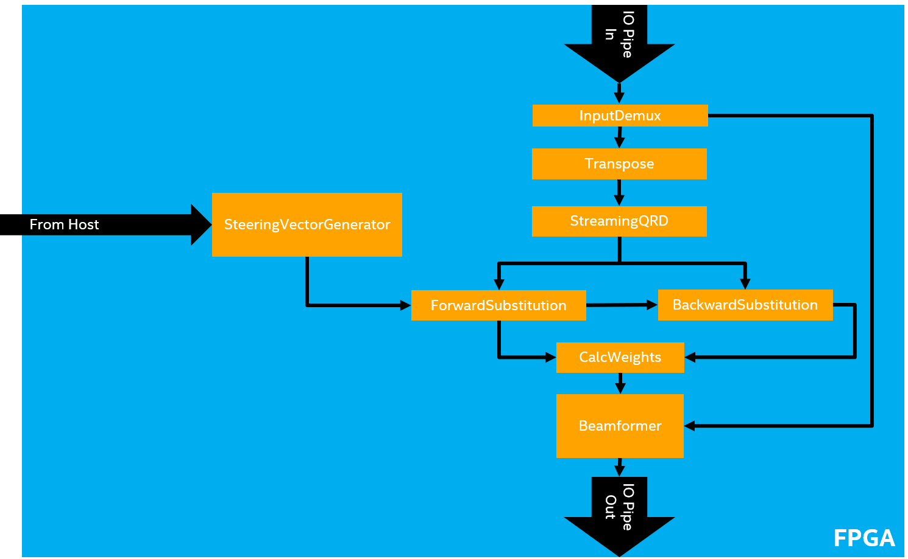
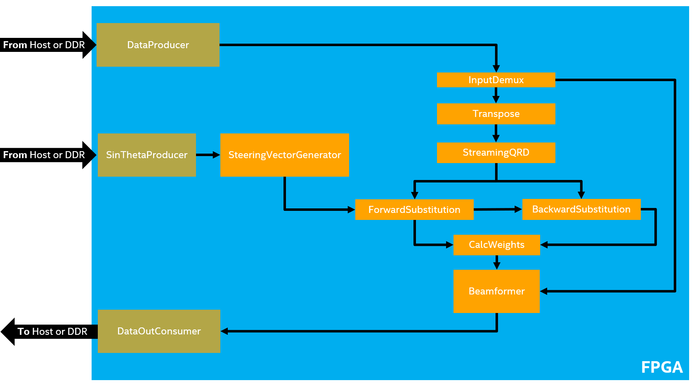

# MVDR Beamforming
This reference design demonstrates IO streaming in DPC++ on an FPGA for a large sytem.  The IO streaming is 'faked' using data from the host. 

***Documentation***:  
* [DPC++ FPGA Code Samples Guide](https://software.intel.com/content/www/us/en/develop/articles/explore-dpcpp-through-intel-fpga-code-samples.html) helps you to navigate the samples and build your knowledge of DPC++ for FPGA. <br>
* [oneAPI DPC++ FPGA Optimization Guide](https://software.intel.com/content/www/us/en/develop/documentation/oneapi-fpga-optimization-guide) is the reference manual for targeting FPGAs through DPC++. <br>
* [oneAPI Programming Guide](https://software.intel.com/en-us/oneapi-programming-guide) is a general resource for target-independent DPC++ programming. 
 
| Optimized for                     | Description
---                                 |---
| OS                                | Linux* Ubuntu* 18.04; Windows* 10
| Hardware                          | Intel&reg; Programmable Acceleration Card (PAC) with Intel Arria&reg; 10 GX FPGA <br> Intel&reg; FPGA Programmable Acceleration Card (PAC) D5005 (with Intel Stratix&reg; 10 SX) <br> Intel Xeon&reg; CPU E5-1650 v2 @ 3.50GHz (host machine)
| Software                          | Intel&reg; oneAPI DPC++ Compiler <br> Intel&reg; FPGA Add-On for oneAPI Base Toolkit
| What you will learn               | How to create a full, complex system that performs IO streaming in DPC++ using the IO pipes DPC++ extension.
| Time to complete                  | 1 hour

## Purpose
The purpose of this reference design is to implement a high-performance streaming IO design using DPC++. In this reference design, we implement an MVDR-beamforming algorithm using oneAPI. More details on the algorithm can be found in the [Additional Design Information](#additional-design-information) Section.

## Key Implementation Details
This reference design code sample leverages concepts that are discussed in the following FPGA tutorials: 
* **IO Streaming** (io_streaming)
* **Explicit Pipelining with `fpga_reg`** (fpga_reg)
* **Loop `ivdep` Attribute** (loop_ivdep)
* **Triangular Loop Optimization** (triangular_loop)
* **Unrolling Loops** (loop_unroll)
* **Pipe Arrays** (pipe_array)

Notably, we strongly suggest reviewing the **IO Streaming** code sample as this reference design is a direct extension of the concepts it describes.  That code sample clearly illustrates the concept of 'fake' IO Pipes, which is used heavily in this reference design.

## License  
Code samples are licensed under the MIT license. See
[License.txt](https://github.com/oneapi-src/oneAPI-samples/blob/master/License.txt) for details.

Third party program Licenses can be found here: [third-party-programs.txt](https://github.com/oneapi-src/oneAPI-samples/blob/master/third-party-programs.txt)

## Building the Reference Design

### Include Files
The include folder is located at `%ONEAPI_ROOT%\dev-utilities\latest\include` on your development system.

### Running Code Samples in DevCloud
If running a sample in the Intel DevCloud, remember that you must specify the compute node (fpga_compile, fpga_runtime:arria10, or fpga_runtime:stratix10) and whether to run in batch or interactive mode. For more information, see the Intel&reg; oneAPI Base Toolkit Get Started Guide ([https://devcloud.intel.com/oneapi/documentation/base-toolkit/](https://devcloud.intel.com/oneapi/documentation/base-toolkit/)).

When compiling for FPGA hardware, it is recommended to increase the job timeout to 24h.
 
### On a Linux* System
1. Install the design into a directory `build` from the design directory by running `cmake`:

   ```
   mkdir build
   cd build
   ```

   If you are compiling for the Intel&reg; PAC with Intel Arria&reg; 10 GX FPGA, run `cmake` using the command:

   ```
   cmake ..
   ```

   If instead you are compiling for the Intel&reg; FPGA PAC D5005 (with Intel Stratix&reg; 10 SX), run `cmake` using the command:

   ```
   cmake .. -DFPGA_BOARD=intel_s10sx_pac:pac_s10
   ```

2. Compile the design through the generated `Makefile`. The following targets are provided, and they match the recommended development flow:

    * Compile for emulation (fast compile time, targets emulated FPGA device).

       ```
       make fpga_emu
       ```

    * Generate optimization report. Find the report in `mvdr_beamforming_report.prj/reports/report.html` directory.

       ```
       make report
       ```

    * Compile for FPGA hardware (longer compile time, targets FPGA device).

       ```
       make fpga
       ```

3. (Optional) As the above hardware compile may take several hours to complete, FPGA precompiled binaries (compatible with Linux* Ubuntu* 18.04) can be downloaded <a href="https://iotdk.intel.com/fpga-precompiled-binaries/latest/mvdr_beamforming.fpga.tar.gz" download>here</a>.

### On a Windows* System
1. Generate the `Makefile` by running `cmake`.
     ```
   mkdir build
   cd build
   ```
   To compile for the Intel&reg; PAC with Intel Arria&reg; 10 GX FPGA, run `cmake` using the command:  
    ```
    cmake -G "NMake Makefiles" ..
   ```
   Alternatively, to compile for the Intel&reg; FPGA PAC D5005 (with Intel Stratix&reg; 10 SX), run `cmake` using the command:
   ```
   cmake -G "NMake Makefiles" .. -DFPGA_BOARD=intel_s10sx_pac:pac_s10
   ```

2. Compile the design through the generated `Makefile`. The following build targets are provided, matching the recommended development flow:
   * Compile for emulation (fast compile time, targets emulated FPGA device): 
     ```
     nmake fpga_emu
     ```
   * Generate the optimization report: 
     ```
     nmake report
     ``` 
   * An FPGA hardware target is not provided on Windows*. 

*Note:* The Intel&reg; PAC with Intel Arria&reg; 10 GX FPGA and Intel&reg; FPGA PAC D5005 (with Intel Stratix&reg; 10 SX) do not yet support Windows*. Compiling to FPGA hardware on Windows* requires a third-party or custom Board Support Package (BSP) with Windows* support.

### In Third-Party Integrated Development Environments (IDEs)

You can compile and run this Reference Design in the Eclipse* IDE (in Linux*) and the Visual Studio* IDE (in Windows*). For instructions, refer to the following link: [Intel® oneAPI DPC++ FPGA Workflows on Third-Party IDEs](https://software.intel.com/en-us/articles/intel-oneapi-dpcpp-fpga-workflow-on-ide)

## Running the Reference Design

 1. Run the sample on the FPGA emulator (the kernel executes on the CPU).
     ```
     ./mvdr_beamforming.fpga_emu 1024 ../data .          (Linux)
     ./mvdr_beamforming.fpga_emu.exe 1024 ../data .      (Windows)
     ```

2. Run the sample on the FPGA device.
     ```
     ./mvdr_beamforming.fpga 1024 ../data .              (Linux)
     ```

### Application Parameters

| Argument Index        | Description
|---                    |---
| 0                     | The number of matrices (default=`1024`)
| 1                     | The input directory (default=`../data`)
| 2                     | The output directory (default=`.`)

### Example of Output
You should see the following output in the console:

```
Matrices:         1024
Input Directory:  '../data'
Output Directory: '.'

Reading training data from '../data/A_real.txt and ../data/A_imag.txt
Reading input data from ../data/X_real.txt and ../data/X_imag.txt

*** Launching throughput test of 1024 matrices ***
Sensor inputs                 : 16
Training matrix rows          : 48
Data rows per training matrix : 48
Steering vectors              : 25
Throughput: 34.6133 matrices/second
Throughput: 82.5219 matrices/second
Checking output data against ../data/small_expected_out_real.txt and ../data/small_expected_out_imag.txt
Output data check succeeded
PASSED
```

## Additional Design Information

### Source Code Breakdown
| File                           | Description 
|:---                            |:---
|`mvdr_beamforming.cpp`          | Contains the `main()` function and the top-level interfaces to the MVDR functions
|`BackwardSubstitution.hpp`      | Backward Substitution kernel
|`Beamformer.hpp`                | Beamformer kernel, multiplies input vectors by each weight vector to generate final output
|`CalcWeights.hpp`               | CalcWeights kernel, multiplies BackwardSubstitution output by steering vectors
|`Constants.hpp`                 | Defines constants used throught the design, some can be overridden from the command line during compiliation
|`FakeIOPipes.hpp`               | Implements 'fake' IO pipes, which interface to the host
|`ForwardSubstitution.hpp`       | Forward Substitution kernel
|`InputDemux.hpp`                | InputDemux kernel, separates training and processing data
|`mvdr_complex.hpp`              | Definition of ComplexType, used throughout this design
|`MVDR.hpp`                      | Function to launch all MVDR kernels and define the pipes that connect them together
|`ParallelCopyArray.hpp`         | Defines the ParallelCopyArray class, an array that supports unrolled copy / assign operations
|`pipe_array.hpp`                | Header file containing the definition of an array of pipes
|`pipe_array_internal.hpp`       | Helper for pipe_array.hpp
|`PipeDuplicator.hpp`            | Defines the PipeDuplicator class, creates multiple copies of a pipe for fan-out
|`SteeringVectorGenerator.hpp`   | SteeringVectorGenerator kernel, generates steering vectors based on data from the host
|`StreamingQRD.hpp`              | StreamingQRD kernel, performs Q-R Decompostion on a matrix
|`Transpose.hpp`                 | Transpose kernel, reorders data for the StreamingQRD kernel
|`Tuple.hpp`                     | A templated tuple that defines the NTuple class which is used for pipe interfaces
|`udp_loopback_test.cpp`         | Contains the `main()` function for the loopback test. This code is only relevant for use with real IO pipes
|`UDP.hpp`                       | This code is **only** relevant for using the real IO pipes (i.e. not in the devcloud). This is discussed later in the [Using Real IO-pipes Section](#using-real-io-pipes)
|`UnrolledLoop.hpp`              | A templated-based loop unroller that unrolls loops in the compiler front end

### MVDR Beamforming
This reference design is built upon the **IO Streaming** code sample.

The images below show the dataflow in the MVDR beamforming design. The first image shows the "real" dataflow when IO pipes are used at the inputs and outputs. The second image shows the data flow in this reference design where we don't have access to a BSP with IO pipes. The `XrxTrainingProducer` and `XrxDataProducer` are the kernels that replace the input IO pipe in the first image. Note that the splitting of data (shown as a black dot with two outward arrows in the first image) is done by the host using `XrxTrainingProducer` and `XrxDataProducer`. The `DataOutConsumer` kernel replaces the output IO pipe in the first image. The data for the `SteeringVectorGenerator` kernel still comes from the host through the `SinThetaProducer` kernel. This kernel does not replace an IO pipe but simplifies and modularizes the host's data streaming to the device.




### Using Real IO-pipes
This section describes how to build and run this reference design on a BSP with real IO pipes. The real IO pipes version does **not** work on Windows and requires a specific system setup and BSP.

#### Getting access to the BSP
This design requires a specific board support package (BSP) with a distinct hardware configuration.  For access to this BSP or general customer support, submit a case through Intel&reg; Premier Support (IPS) or contact your Intel or Distribution Sales Representative.

#### Building the loopback test and Reference Design with real IO pipes
Use the following commands to generate a Makefile for building both the loopback test and reference design:
```
mkdir build
cd build

cmake .. -DREAL_IO_PIPES=1 -DFPGA_BOARD=pac_s10_usm_udp
```

The `REAL_IO_PIPES` cmake flag defines a variable that is used *exclusively* in `mvdr_beamforming.cpp` to create a kernel system using real IO pipes, as opposed to the fake IO pipes described earlier in this document.

To build the loopback test, use the following command:
```
make udp_loopback_test
```

To build the MVDR reference design, use the following command:
```
make fpga
```

#### Running the loopback test and reference design with real IO pipes
To run the loopback test, use the following command:
```
./udp_loopback_test.fpga 64:4C:36:00:2F:20 192.168.0.11 34543 255.255.255.0 94:40:C9:71:8D:10 192.168.0.10 34543 10000000
```

| Argument Index        | Description
|---                    |---
| 1                     | FPGA MAC Address
| 2                     | FPGA IP Address
| 3                     | FPGA UDP Port
| 4                     | FPGA Netmask
| 5                     | Host MAC Address
| 6                     | Host IP Address
| 7                     | Host UDP Port
| 8                     | Number of packets (optional, default=`100000000`)

To run the MVDR reference design with real IO pipes, use the following command:
```
./mvdr_beamforming.fpga 64:4C:36:00:2F:20 192.168.0.11 34543 255.255.255.0 94:40:C9:71:8D:10 192.168.0.10 34543 1024 ../data .
```

| Argument Index        | Description
|---                    |---
| 1                     | FPGA MAC Address
| 2                     | FPGA IP Address
| 3                     | FPGA UDP Port
| 4                     | FPGA Netmask
| 5                     | Host MAC Address
| 6                     | Host IP Address
| 7                     | Host UDP Port
| 8                     | The number of matrices (optional, default=`1024`)
| 9                     | The input directory (optional, default=`../data`)
| 10                    | The output directory (optional, default=`.`)
