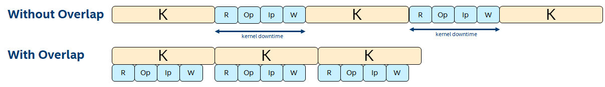

# Double Buffering to Overlap Kernel Execution with Buffer Transfers and Host Processing
This FPGA tutorial demonstrates how to parallelize host-side processing and buffer transfers between host and device with kernel execution, which can improve overall application performance.

***Documentation***:  The [DPC++ FPGA Code Samples Guide](https://software.intel.com/content/www/us/en/develop/articles/explore-dpcpp-through-intel-fpga-code-samples.html) helps you to navigate the samples and build your knowledge of DPC++ for FPGA. <br>
The [oneAPI DPC++ FPGA Optimization Guide](https://software.intel.com/content/www/us/en/develop/documentation/oneapi-fpga-optimization-guide) is the reference manual for targeting FPGAs through DPC++. <br>
The [oneAPI Programming Guide](https://software.intel.com/en-us/oneapi-programming-guide) is a general resource for target-independent DPC++ programming.

| Optimized for                     | Description
---                                 |---
| OS                                | Linux* Ubuntu* 18.04; Windows* 10
| Hardware                          | Intel® Programmable Acceleration Card (PAC) with Intel Arria® 10 GX FPGA; <br> Intel® FPGA Programmable Acceleration Card (PAC) D5005 (with Intel Stratix® 10 SX)
| Software                          | Intel® oneAPI DPC++ Compiler <br> Intel® FPGA Add-On for oneAPI Base Toolkit 
| What you will learn               | How and when to implement the double buffering optimization technique
| Time to complete                  | 30 minutes


## Purpose
In an application where the FPGA kernel is executed multiple times, the host must perform the following processing and buffer transfers before each kernel invocation.
1. The output data from the *previous* invocation must be transferred from the device to the host and then processed by the host. Examples of this processing include: 
   * Copying the data to another location
   * Rearranging the data 
   * Verifying it in some way
2. The input data for the *next* invocation must be processed by the host and then transferred to the device. Examples of this processing include: 
   * Copying the data from another location 
   * Rearranging the data for kernel consumption 
   * Generating the data in some way

Without double buffering, host processing and buffer transfers occur *between* kernel executions. Therefore, there is a gap in time between kernel executions, which you can refer to as kernel *downtime* (see diagram below). If these operations overlap with kernel execution, the kernels can execute back-to-back with minimal downtime, thereby increasing overall application performance.

### Determining When is Double Buffering Possible

Let's define the required variables:
* **R** = Time to transfer the kernel's output buffer from device to host.
* **Op** = Host-side processing time of kernel output data (*output processing*)
* **Ip** = Host-side processing time for kernel input data (*input processing*)
* **W** = Time to transfer the kernel's input buffer from host to device.
* **K** = Kernel execution time



In general, **R**, **Op**, **Ip**, and **W** operations must all complete before the next kernel is launched. To maximize performance, while one kernel is executing on the device, these operations should execute simultaneously on the host and operate on a second set of buffer locations. They should complete before the current kernel completes, allowing the next kernel to be launched immediately with no downtime. In general, to maximize performance, the host must launch a new kernel every **K**.

This leads to the following constraint:

```c++
R + Op + Ip + W <= K, in order to minimize kernel downtime.
```
If the above constraint is not satisfied, a performance improvement may still be observed because *some* overlap (perhaps not complete overlap) is still possible. Further improvement is possible by extending the double buffering concept to N-way buffering (see the corresponding tutorial).

### Measuring the Impact of Double Buffering

You must get a sense of the kernel downtime to identify the degree to which this technique can help improve performance.

This can be done by querying the total kernel execution time from the runtime and comparing it to the overall application execution time. In an application where kernels execute with minimal downtime, these two numbers will be close. However, if kernels have a lot of downtime, the overall execution time will notably exceed kernel execution time. The tutorial code exemplifies how to do this.

### Tutorial Implementation Notes

The basic idea is to: 
1. Perform the input processing for the first two kernel executions and queue them both. 
2. Immediately call the `process_output()` method (automatically blocked by the SYCL* runtime) on the first kernel completing because of the implicit data dependency. 
3. When the first kernel completes, the second kernel begins executing immediately because it was already queued. 
4. While the second kernel runs, the host processes the output data from the first kernel and prepares the third kernel's input data. 
5. As long as the above operations complete before the second kernel completes, the third kernel is queued early enough to allow it to be launched immediately after the second kernel. 

The process then repeats.

The impact of double buffering on the total runtime of the tutorial program will be analyzed in the "Running the Sample" section below.

## Key Concepts
* The double buffering optimization technique 
* Determining when double buffering is beneficial
* How to measure the impact of double buffering

## License  
Code samples are licensed under the MIT license. See
[License.txt](https://github.com/oneapi-src/oneAPI-samples/blob/master/License.txt) for details.

Third party program Licenses can be found here: [third-party-programs.txt](https://github.com/oneapi-src/oneAPI-samples/blob/master/third-party-programs.txt)

## Building the `double_buffering` Tutorial

### Include Files
The included header `dpc_common.hpp` is located at `%ONEAPI_ROOT%\dev-utilities\latest\include` on your development system.

### Running Samples in DevCloud
If running a sample in the Intel DevCloud, remember that you must specify the compute node (fpga_compile, fpga_runtime:arria10, or fpga_runtime:stratix10) and whether to run in batch or interactive mode. For more information, see the Intel® oneAPI Base Toolkit Get Started Guide ([https://devcloud.intel.com/oneapi/documentation/base-toolkit/](https://devcloud.intel.com/oneapi/documentation/base-toolkit/)).

When compiling for FPGA hardware, it is recommended to increase the job timeout to 12h.

### On a Linux* System

1. Generate the `Makefile` by running `cmake`.
     ```
   mkdir build
   cd build
   ```
   To compile for the Intel® PAC with Intel Arria® 10 GX FPGA, run `cmake` using the command:  
    ```
    cmake ..
   ```
   Alternatively, to compile for the Intel® FPGA PAC D5005 (with Intel Stratix® 10 SX), run `cmake` using the command:

   ```
   cmake .. -DFPGA_BOARD=intel_s10sx_pac:pac_s10
   ```

2. Compile the design through the generated `Makefile`. The following build targets are provided, matching the recommended development flow:

   * Compile for emulation (fast compile time, targets emulated FPGA device): 
      ```
      make fpga_emu
      ```
   * Generate the optimization report: 
     ```
     make report
     ``` 
   * Compile for FPGA hardware (longer compile time, targets FPGA device): 
     ```
     make fpga
     ``` 
3. (Optional) As the above hardware compile may take several hours to complete, FPGA precompiled binaries (compatible with Linux* Ubuntu* 18.04) can be downloaded <a href="https://iotdk.intel.com/fpga-precompiled-binaries/latest/double_buffering.fpga.tar.gz" download>here</a>.

### On a Windows* System

1. Generate the `Makefile` by running `cmake`.
     ```
   mkdir build
   cd build
   ```
   To compile for the Intel® PAC with Intel Arria® 10 GX FPGA, run `cmake` using the command:  
    ```
    cmake -G "NMake Makefiles" ..
   ```
   Alternatively, to compile for the Intel® FPGA PAC D5005 (with Intel Stratix® 10 SX), run `cmake` using the command:

   ```
   cmake -G "NMake Makefiles" .. -DFPGA_BOARD=intel_s10sx_pac:pac_s10
   ```

2. Compile the design through the generated `Makefile`. The following build targets are provided, matching the recommended development flow:

   * Compile for emulation (fast compile time, targets emulated FPGA device): 
     ```
     nmake fpga_emu
     ```
   * Generate the optimization report: 
     ```
     nmake report
     ``` 
   * An FPGA hardware target is not provided on Windows*. 

*Note:* The Intel® PAC with Intel Arria® 10 GX FPGA and Intel® FPGA PAC D5005 (with Intel Stratix® 10 SX) do not yet support Windows*. Compiling to FPGA hardware on Windows* requires a third-party or custom Board Support Package (BSP) with Windows* support.
 
 ### In Third-Party Integrated Development Environments (IDEs)

You can compile and run this tutorial in the Eclipse* IDE (in Linux*) and the Visual Studio* IDE (in Windows*). For instructions, refer to the following link: [Intel® oneAPI DPC++ FPGA Workflows on Third-Party IDEs](https://software.intel.com/en-us/articles/intel-oneapi-dpcpp-fpga-workflow-on-ide)

## Examining the Reports
Locate `report.html` in the `double_buffering_report.prj/reports/` or `double_buffering_s10_pac_report.prj/reports/` directory. Open the report in any of Chrome*, Firefox*, Edge*, or Internet Explorer*.

Note that because the optimization described in this tutorial occurs at the *runtime* level, the FPGA compiler report will not show a difference between the optimized and unoptimized cases.


## Running the Sample

 1. Run the sample on the FPGA emulator (the kernel executes on the CPU):
     ```
     ./double_buffering.fpga_emu     (Linux)
     double_buffering.fpga_emu.exe   (Windows)
     ```
2. Run the sample on the FPGA device:
     ```
     ./double_buffering.fpga         (Linux)
     ```

### Example of Output

```
Platform name: Intel(R) FPGA SDK for OpenCL(TM)
Device name: pac_a10 : Intel PAC Platform (pac_ee00000)


Executing kernel 100 times in each round.

*** Beginning execution, without double buffering
Launching kernel #0
Launching kernel #10
Launching kernel #20
Launching kernel #30
Launching kernel #40
Launching kernel #50
Launching kernel #60
Launching kernel #70
Launching kernel #80
Launching kernel #90

Overall execution time without double buffering = 29742 ms
Total kernel-only execution time without double buffering = 17856 ms
Throughput = 35.255249 MB/s


*** Beginning execution, with double buffering.
Launching kernel #0
Launching kernel #10
Launching kernel #20
Launching kernel #30
Launching kernel #40
Launching kernel #50
Launching kernel #60
Launching kernel #70
Launching kernel #80
Launching kernel #90

Overall execution time with double buffering = 17967 ms
Total kernel-only execution time with double buffering = 17869 ms
Throughput = 58.35976 MB/s


Verification PASSED
```

### Discussion of Results

A test compile of this tutorial design achieved a maximum frequency (f<sub>MAX</sub>) of approximately 340 MHz on the Intel® Programmable Acceleration Card with Intel® Arria® 10 GX FPGA. The results with and without double buffering are shown in the following table:

Configuration | Overall Execution Time (ms) | Total Kernel Execution time (ms)
-|-|-
Without double buffering | 23462 | 15187
With double buffering | 15145 | 15034

In both runs, the total kernel execution time is similar, as expected. However, without double buffering, the overall execution time notably exceeds the total kernel execution time, implying there is downtime between kernel executions. With double buffering, the overall execution time is close to the total kernel execution time.
