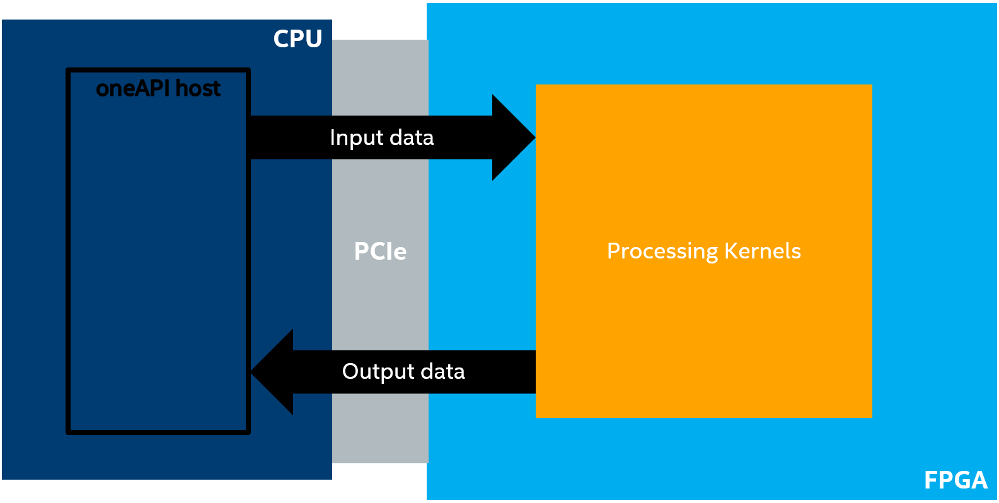
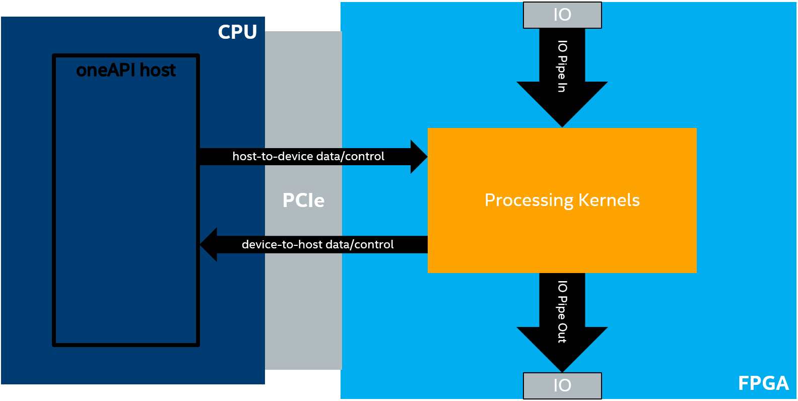
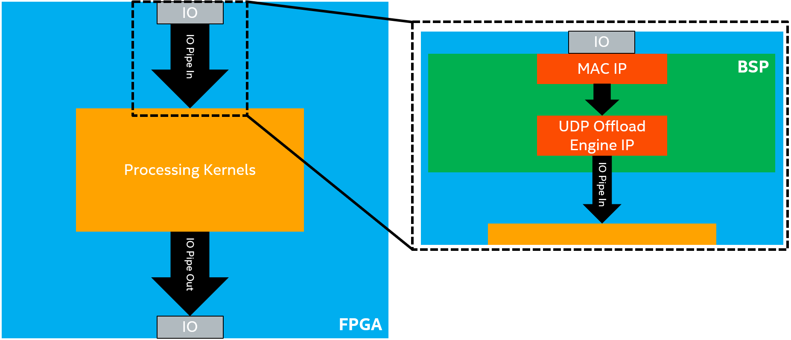
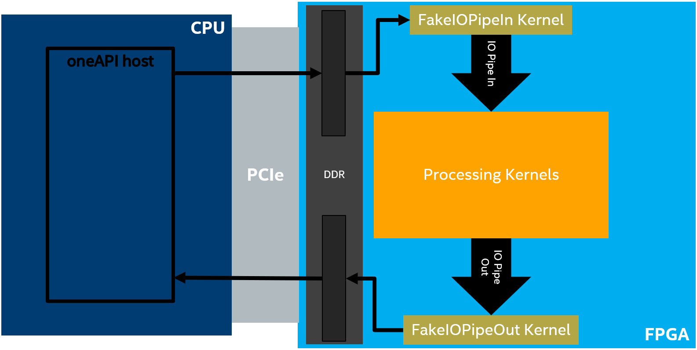
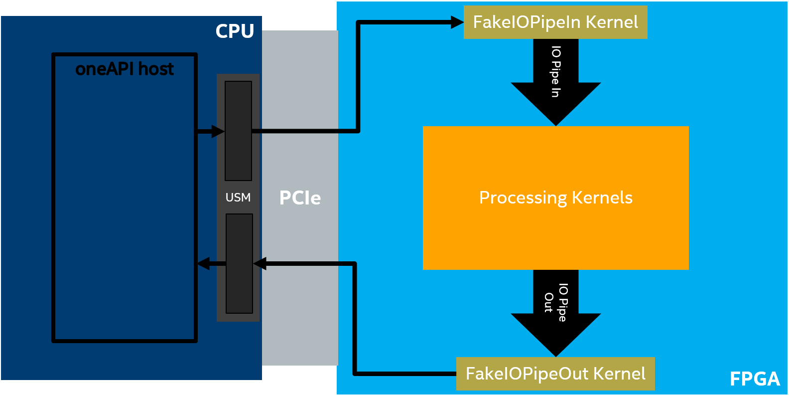
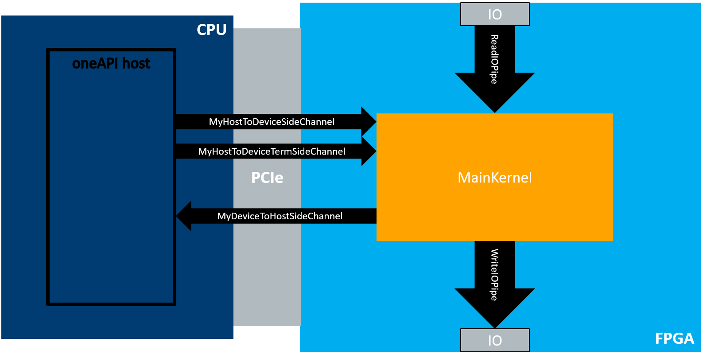

# IO Streaming
An FPGA code sample describing how to use DPC++ IO pipes to stream data through the FPGA's IO.

***Documentation***:  The [DPC++ FPGA Code Samples Guide](https://software.intel.com/content/www/us/en/develop/articles/explore-dpcpp-through-intel-fpga-code-samples.html) helps you to navigate the samples and build your knowledge of DPC++ for FPGA. <br>
The [oneAPI DPC++ FPGA Optimization Guide](https://software.intel.com/content/www/us/en/develop/documentation/oneapi-fpga-optimization-guide) is the reference manual for targeting FPGAs through DPC++. <br>
The [oneAPI Programming Guide](https://software.intel.com/en-us/oneapi-programming-guide) is a general resource for target-independent DPC++ programming.

| Optimized for                     | Description
---                                 |---
| OS                                | Linux* Ubuntu* 18.04; Windows* 10
| Hardware                          | Intel® Programmable Acceleration Card (PAC) with Intel Arria® 10 GX FPGA; <br> Intel® FPGA Programmable Acceleration Card (PAC) D5005 (with Intel Stratix® 10 SX)
| Software                          | Intel® oneAPI DPC++ Compiler <br> Intel® FPGA Add-On for oneAPI Base Toolkit 
| What you will learn               | How to stream data through the FPGA's IO using DPC++ IO pipes.
| Time to complete                  | 30 minutes

## Purpose
The purpose of this code sample is to demonstrate how to do trivial Input/Output (IO) streaming with DPC++ IO pipes. The following sections will describe IO streaming and IO pipes in more detail and will conclude with a description of the trivial design used to demonstrate these concepts and features.

### IO Streaming
In many of the other code samples designs, the FPGA device is treated as an accelerator, as illustrated in the figure below. The main computation (and therefore the data to be computed) resides on the host (i.e., the CPU) and we accelerate some compute intensive task using oneAPI kernels on the device. The host must move the data to the device, perform the calculation, and move the data back. Other code samples show how the FPGA can effectively offload compute intensive tasks from the CPU host.



However, a key feature of FPGAs is their rich input-output (IO) capabilities (e.g., Ethernet). Taking advantage of these capabilities within the oneAPI programming environment requires a different programming model than the accelerator model described in the previous section. In this model, which is illustrated in the figure below, we will create a oneAPI kernel (or kernels) where some of the kernels are connected to the FPGA's IO via IO pipes and the main data flow is *through* the FPGA device, rather than from CPU to FPGA and back.

There are 4 possible directions of data flow: IO-to-device, device-to-IO, device-to-host, and host-to-device. The direction and amount of data flowing in the system is application dependent. In this code sample, the main source of data is IO; data streams into the device from IO (IO-to-device) and out of the device to IO (device-to-IO). However, the host and device exchange low-bandwidth control signals using a host-to-device and device-to-host connection (or *side channel*).



### IO Pipes
IO-pipes have the same interface API as inter-kernel pipes (see the **Pipes** (pipes) code sample for more information). This abstraction is implemented in the Board Support Package (BSP) and provides a much simpler programming model for accessing the FPGAs IO. More information on the oneAPI IO pipe interface can be found [here](https://software.intel.com/content/www/us/en/develop/documentation/oneapi-fpga-optimization-guide/top/fpga-optimization-flags-attributes-pragmas-and-extensions/kernel-controls/pipes-extension/i-o-pipes.html).

For example, imagine that we want the oneAPI kernel to be able to receive UDP packets through the FPGA's Ethernet interface. Implementing the necessary hardware to process the data coming from the Ethernet pins in oneAPI would be both extremely difficult and inefficient. Moreover, there are already many RTL solutions for doing this. So instead we implement this low-level logic with RTL in the BSP. We expose this flow of data as a much simpler IO pipe interface to the processing kernels.

This example is illustrated in the figure below, where the BSP connects the Ethernet IO pins to a MAC IP, the MAC IP to a UDP offload engine IP, and finally the UDP offload engine IP to an IO pipe. This IO pipe can then be simply connected to the processing kernels. The details of these connections are abstracted from the oneAPI kernel developer. The figure below only shows an input IO pipe. The process is similar for an output IO pipe, but the data flows in the opposite direction.



### Faking IO Pipes
Unfortunately, designs that use these IO pipes are confined to BSPs that support that specific IO pipe, which makes prototyping and testing the processing kernels difficult. To address these concerns, we have created a library to _fake_ IO pipes. With this library, you can create kernels that behave like IO pipes without having a BSP that actually supports them. This allows you to start prototyping and testing your processing kernels without a BSP that supports IO pipes.

There are currently two options for faking IO pipes:
 * **Device memory allocations**: This option requires no special BSP support.
 * **Universal Shared Memory (USM) host allocations**: This option requires USM support in the BSP.

These options are illustrated in the figures below, respectively.




You can create _fake_ input data in either device or host memory. Then, the API kernel (`FakeIOPipeIn`) will read this data and produce it into a SYCL inter-kernel pipe (`IO Pipe In`). On the other end, an API kernel (`FakeIOPipeOut`) will read from an inter-kernel pipe (`IO Pipe Out`) and write to DDR or a USM host allocation so that you can analyze the output. In this tutorial, the `cmake` file (*src/CMakeLists.txt*) detects whether USM host allocations are supported and chooses to fake the streaming of data with DDR or USM host allocations automatically.

Since IO pipes and inter-kernel pipes have the same interface, the oneAPI kernels that implement the core algorithm are agnostic to whether they are reading from or writing to an IO pipe or a fake IO pipe. That is, the processing kernels will *always* stream data from `IO Pipe In` and to `IO Pipe Out`, which could be real or fake IO pipes. It is up to the system developer (i.e., the one connecting the oneAPI host and device) to instantiate the kernels and connect them to the correct pipes, which can be done easily using C++ templates and metaprogramming, as shown in *src/LoopbackTest.hpp* and *src/SideChannelTest.hpp* in this code sample. This allows the oneAPI kernel developer to prototype and test their kernel system without a BSP that supports IO pipes. Once the BSP is ready and available, swapping out the fake IO pipes for real IO pipes requires no changes to the processing kernels.

More information on IO pipes can be found [here](https://software.intel.com/content/www/us/en/develop/documentation/oneapi-fpga-optimization-guide/top/fpga-optimization-flags-attributes-pragmas-and-extensions/kernel-controls/pipes-extension/i-o-pipes.html).

### Code Details
In this code sample, we demonstrate the concepts described in the previous section in a trivial way. The first test, in *src/LoopbackTest.hpp*, contains a simple loopback test that demonstrates how to use the fake IO pipes and steam data through a simple main processing kernel.

The second test, in *src/SideChannelTest.hpp* has a main processing kernel (`SideChannelMainKernel`) that constantly streams data in from the input IO pipe and streams the data out the output IO pipe. The main processing kernel sends an update to the host anytime it sees a value that matches a given value (`match_num`) through a device-to-host side channel (`MyDeviceToHostSideChannel`). The host can use a host-to-device side channel to update `match_num` as the kernel is processing without exiting and restarting the kernel (`MyHostToDeviceTermSideChannel`). The host also uses a host-to-device side channel to terminate the main processing kernel (`MyHostToDeviceSideChannel`). This is illustrated in the figure below.



Notice that the main kernel in the `SubmitSideChannelKernels` function in *src/SideChannelTest.cpp* is templated on the IO pipes and side channels. This means that the kernel developer of the main processing kernel does not care whether the IO pipes are real or fake. Using real or fake IO pipes is determined by the system developer when creating the full system, which is done in the `RunSideChannelsSystem` function in *src/SideChannelTest.hpp* and simply requires changing some template parameters.

## Key Concepts
* FPGA IO Streaming with IO pipes
 
## License  
Code samples are licensed under the MIT license. See
[License.txt](https://github.com/oneapi-src/oneAPI-samples/blob/master/License.txt) for details.

Third party program Licenses can be found here: [third-party-programs.txt](https://github.com/oneapi-src/oneAPI-samples/blob/master/third-party-programs.txt)

## Building the `io_streaming` Code Sample

### Include Files
The included header `dpc_common.hpp` is located at `%ONEAPI_ROOT%\dev-utilities\latest\include` on your development system.

### Running Samples in DevCloud
If running a sample in the Intel DevCloud, remember that you must specify the compute node (fpga_compile, fpga_runtime:arria10, or fpga_runtime:stratix10) and whether to run in batch or interactive mode. For more information, see the Intel® oneAPI Base Toolkit Get Started Guide ([https://devcloud.intel.com/oneapi/documentation/base-toolkit/](https://devcloud.intel.com/oneapi/documentation/base-toolkit/)).

When compiling for FPGA hardware, it is recommended to increase the job timeout to 12h.

### On a Linux* System

1. Generate the `Makefile` by running `cmake`.
     ```
   mkdir build
   cd build
   ```
   To compile for the Intel® PAC with Intel Arria® 10 GX FPGA, run `cmake` using the command:  
    ```
    cmake ..
   ```
   Alternatively, to compile for the Intel® FPGA PAC D5005 (with Intel Stratix® 10 SX), run `cmake` using the command:

   ```
   cmake .. -DFPGA_BOARD=intel_s10sx_pac:pac_s10
   ```

2. Compile the design through the generated `Makefile`. The following build targets are provided, matching the recommended development flow:

   * Compile for emulation (fast compile time, targets emulated FPGA device): 
      ```
      make fpga_emu
      ```
   * Generate the optimization report: 
     ```
     make report
     ``` 
   * Compile for FPGA hardware (longer compile time, targets FPGA device): 
     ```
     make fpga
     ``` 
3. (Optional) As the above hardware compile may take several hours to complete, FPGA precompiled binaries (compatible with Linux* Ubuntu* 18.04) can be downloaded <a href="https://iotdk.intel.com/fpga-precompiled-binaries/latest/io_streaming.fpga.tar.gz" download>here</a>.

### On a Windows* System

1. Generate the `Makefile` by running `cmake`.
     ```
   mkdir build
   cd build
   ```
   To compile for the Intel® PAC with Intel Arria® 10 GX FPGA, run `cmake` using the command:  
    ```
    cmake -G "NMake Makefiles" ..
   ```
   Alternatively, to compile for the Intel® FPGA PAC D5005 (with Intel Stratix® 10 SX), run `cmake` using the command:

   ```
   cmake -G "NMake Makefiles" .. -DFPGA_BOARD=intel_s10sx_pac:pac_s10
   ```

2. Compile the design through the generated `Makefile`. The following build targets are provided, matching the recommended development flow:

   * Compile for emulation (fast compile time, targets emulated FPGA device): 
     ```
     nmake fpga_emu
     ```
   * Generate the optimization report: 
     ```
     nmake report
     ``` 
   * An FPGA hardware target is not provided on Windows*. 

*Note:* The Intel® PAC with Intel Arria® 10 GX FPGA and Intel® FPGA PAC D5005 (with Intel Stratix® 10 SX) do not yet support Windows*. Compiling to FPGA hardware on Windows* requires a third-party or custom Board Support Package (BSP) with Windows* support.
 
 ### In Third-Party Integrated Development Environments (IDEs)

You can compile and run this tutorial in the Eclipse* IDE (in Linux*) and the Visual Studio* IDE (in Windows*). For instructions, refer to the following link: [Intel® oneAPI DPC++ FPGA Workflows on Third-Party IDEs](https://software.intel.com/en-us/articles/intel-oneapi-dpcpp-fpga-workflow-on-ide)

## Examining the Reports
Locate `report.html` in the `io_streaming_report.prj/reports/` directory. Open the report in any of Chrome*, Firefox*, Edge*, or Internet Explorer*.

## Running the Sample
 
 1. Run the sample on the FPGA emulator (the kernel executes on the CPU):
     ```
     ./io_streaming.fpga_emu     (Linux)
     io_streaming.fpga_emu.exe   (Windows)
     ```
2. Run the sample on the FPGA device:
     ```
     ./io_streaming.fpga         (Linux)
     ```
 
### Example of Output
You should see the following output in the console:
  ```
  Running loopback test
  Running side channel test
  Checking for values matching '715', expecting 7918 matches.
  Checking for values matching '770', expecting 7945 matches
  Checking for values matching '1333', expecting 8073 matches.
  PASSED
  ```
