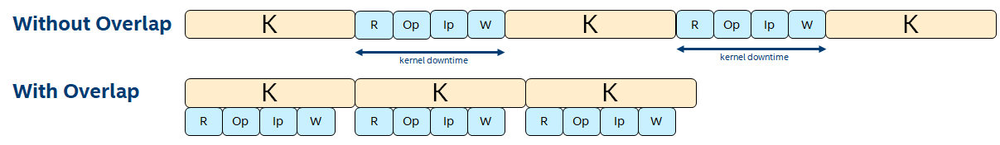

# N-Way Buffering to Overlap Kernel Execution with Buffer Transfers and Host Processing

This FPGA tutorial demonstrates how to parallelize host-side processing and buffer transfers between host and device with kernel execution to improve overall application performance. It is a generalization of the  'double buffering' technique, and can be used to perform this overlap even when the host-processing time exceeds kernel execution time.
 
***Documentation***: The [FPGA Optimization Guide](https://software.intel.com/content/www/us/en/develop/documentation/oneapi-fpga-optimization-guide)  provides comprehensive instructions for targeting FPGAs through DPC++. The [oneAPI Programming Guide](https://software.intel.com/en-us/oneapi-programming-guide) is a resource for general target-independent DPC++ programming. 
 
| Optimized for                     | Description
---                                 |---
| OS                                | Linux* Ubuntu* 18.04; Windows* 10
| Hardware                          | Intel® Programmable Acceleration Card (PAC) with Intel Arria® 10 GX FPGA; <br> Intel® Programmable Acceleration Card (PAC) with Intel Stratix® 10 SX FPGA
| Software                          | Intel® oneAPI DPC++ Compiler (Beta) <br> Intel® FPGA Add-On for oneAPI Base Toolkit 
| What you will learn               | How and when to apply the N-way buffering optimization technique
| Time to complete                  | 30 minutes
 
_Notice: Limited support in Windows*; compiling for FPGA hardware is not supported in Windows*_

## Purpose
N-Way buffering is a generalization of the double buffering optimization technique (see the "Double Buffering" FPGA tutorial). This system-level optimization enables kernel execution to occur in parallel with host-side processing and buffer transfers between host and device, improving application performance. N-way buffering can achieve this overlap even when the host-processing time exceeds kernel execution time.

### Background

In an application where the FPGA kernel is executed multiple-times, the host must perform the following processing and buffer transfers before each kernel invocation: 
1. The output data from the *previous* invocation must be transferred from the device to host and then processed by the host. Examples of this processing include the following: 
   * Copying the data to another location
   * Rearranging the data 
   * Verifying it in some way
2. The input data for the *next* invocation must be processed by the host and then transferred to the device. Examples of this processing include: 
   * Copying the data from another location
   * Rearranging the data for kernel consumption
   * Generating the data in some way

Without the technique described in this tutorial, host processing and buffer transfers occur *between* kernel executions. Therefore, there is a gap in time between kernel executions, which you can refer to as kernel "downtime" (see diagram below). If these operations overlap with kernel execution, the kernels can execute back-to-back with minimal downtime, thereby increasing overall application performance.

### N-Way Buffering

This technique is referred to as *N-Way Buffering*,  but is frequently called *double buffering* in the most common case where N=2.

Let's first define some variables:

| Variable | Description |
| ------ | ------ |
| **R** | Time to transfer the kernel's output buffer from device to host. |
| **Op** | Host-side processing time of kernel output data (*output processing*). | 
| **Ip** | Host-side processing time for kernel input data (*input processing*). | 
| **W** | Time to transfer the kernel's input buffer from host to device. | 
| **K** | Kernel execution time. | 
| **N** | Number of buffer sets used. | 
| **C** | Number of host-side CPU cores. | 




In general, the **R**, **Op**, **Ip**, and **W** operations must all complete before the next kernel is launched. To maximize performance, while one kernel is executing on the device, these operations should run in parallel and operate on a separate set of buffer locations. You should complete before the current kernel completes, thus allowing the next kernel to be launched immediately with no downtime. In general, to maximize performance, the host must launch a new kernel every **K**.

If these host-side operations are executed serially, this leads to the following constraint:

```c++
R + Op + Ip + W <= K, to minimize kernel downtime.
```

In the above example, if the constraint is satisfied, the application requires two sets of buffers. In this case, **N**=2.

However, the above constraint may not be satisfied in some applications (i.e., if host-processing takes longer than the kernel execution time).

**NOTE**: A performance improvement may still be observed because kernel downtime may still be reduced (though perhaps not maximally reduced). 

In this case, to further improve performance, the reduce host-processing time through multi-threading. Rather than executing the above operations serially, perform the input- and output-processing operations in parallel using two threads, leading to the following constraint:

```c++
Max (R+Op, Ip+W) <= K
and
R + W <= K, to minimize kernel downtime.
````

If the above constraint is still unsatisfied, the technique can be extended beyond two sets of buffers to **N** sets of buffers to help improve the degree of overlap. In this case, the constraint becomes:

```c++
Max (R + Op, Ip + W) <= (N-1)*K
and
R + W <= K, to minimize kernel downtime.
```

The idea of N-way buffering is to prepare **N** sets of kernel input buffers, launch **N** kernels, and when the first kernel completes, begin the subsequent host-side operations. These operations may take a long time (longer than **K**), but they do not cause kernel downtime because an additional **N**-1 kernels have already been queued and can launch immediately. By the time these first **N** kernels complete, the aforementioned host-side operations would have also completed and the **N**+1 kernel can be launched with no downtime. As additional kernels complete, corresponding host-side operations are launched on the host, in a parallel fashion, using multiple threads. Although the host operations take longer than **K**, if **N** is chosen correctly, they will complete with a period of **K**, which is required to ensure we can launch a new kernel every **K**. To reiterate, this scheme requires multi-threaded host-operations because the host must perform processing for up to **N** kernels in parallel in order to keep up. 

The above formula can be used to calculate the **N** required to minimize downtime. However, there are some practical limits: 
* **N** sets of buffers are required on both the host and device, therefore both must have the capacity for this many buffers. 
* If the input and output processing operations are launched in separate threads, then (**N**-1)*2 cores are required, so **C** can be become the limiting factor.

### Measuring the Impact of N-Way Buffering

You must get a sense of the kernel downtime to identify the degree to which this technique can help improve performance.

This can be done by querying total kernel execution time from the runtime and comparing it to with overall application execution time. In an application where kernels execute with minimal downtime, these two numbers are close. However, if kernels have a lot of downtime, overall execution time notably exceeds the kernel execution time. The tutorial code exemplifies how to do this.

### Tutorial Implementation Notes

The example code runs with multiple iterations to illustrate how performance improves as **N** increases and as multi-threading is used.

It is useful to think of the execution space as having **N** slots where the slots execute in chronological order, and each slot has its own set of buffers on the host and device. At the beginning of execution, the host prepares the kernel input data for the **N** slots and launches **N** kernels. When slot-0 completes, slot-1 begins executing immediately because it was already queued. The host begins both the output and input processing for slot-0. These two operations must complete before the host can queue another kernel into slot-0. The same is true for all slots. 

After each kernel is launched, the host-side operations (that occur *after* the kernel in that slot completes) are launched immediately from the `main()` program. They block until the kernel execution for that slot completes (this is enforced by the runtime).


## Key Concepts
* The N-way buffering optimization technique as a generalization of double buffering
* Determining when N-way buffering is practical and beneficial
* How to measure the impact of N-way buffering

## License  
This code sample is licensed under MIT license.


## Building the `n_way_buffering` Tutorial

### Include Files
The included header `dpc_common.hpp` is located at `%ONEAPI_ROOT%\dev-utilities\latest\include` on your development system.

### Running Samples in DevCloud
If running a sample in the Intel DevCloud, remember that you must specify the compute node (fpga_compile or fpga_runtime) as well as whether to run in batch or interactive mode. For more information see the Intel® oneAPI Base Toolkit Get Started Guide ([https://devcloud.intel.com/oneapi/get-started/base-toolkit/](https://devcloud.intel.com/oneapi/get-started/base-toolkit/)).

When compiling for FPGA hardware, it is recommended to increase the job timeout to 12h.

### On a Linux* System

1. Generate the `Makefile` by running `cmake`.
     ```
   mkdir build
   cd build
   ```
   To compile for the Intel® PAC with Intel Arria® 10 GX FPGA, run `cmake` using the command:  
    ```
    cmake ..
   ```
   Alternatively, to compile for the Intel® PAC with Intel Stratix® 10 SX FPGA, run `cmake` using the command:

   ```
   cmake .. -DFPGA_BOARD=intel_s10sx_pac:pac_s10
   ```

2. Compile the design through the generated `Makefile`. The following build targets are provided, matching the recommended development flow:

   * Compile for emulation (fast compile time, targets emulated FPGA device): 
      ```
      make fpga_emu
      ```
   * Generate the optimization report: 
     ```
     make report
     ``` 
   * Compile for FPGA hardware (longer compile time, targets FPGA device): 
     ```
     make fpga
     ``` 
3. (Optional) As the above hardware compile may take several hours to complete, an Intel® PAC with Intel Arria® 10 GX FPGA precompiled binary can be downloaded <a href="https://iotdk.intel.com/fpga-precompiled-binaries/latest/n_way_buffering.fpga.tar.gz" download>here</a>.

### On a Windows* System
Note: `cmake` is not yet supported on Windows. A build.ninja file is provided instead. 

1. Enter the source file directory.
   ```
   cd src
   ```

2. Compile the design. The following build targets are provided, matching the recommended development flow:

   * Compile for emulation (fast compile time, targets emulated FPGA device): 
      ```
      ninja fpga_emu
      ```

   * Generate the optimization report:

     ```
     ninja report
     ```
     If you are targeting Intel® PAC with Intel Stratix® 10 SX FPGA, instead use:
     ```
     ninja report_s10_pac
     ```     
   * Compiling for FPGA hardware is not yet supported on Windows.
 
 ### In Third-Party Integrated Development Environments (IDEs)
 
You can compile and run this tutorial in the Eclipse* IDE (in Linux*) and the Visual Studio* IDE (in Windows*). For instructions, refer to the following link: [Intel® oneAPI DPC++ FPGA Workflows on Third-Party IDEs](https://software.intel.com/en-us/articles/intel-oneapi-dpcpp-fpga-workflow-on-ide)

## Examining the Reports
Locate `report.html` in the `n_way_buffering_report.prj/reports/` or `n_way_buffering_s10_pac_report.prj/reports/` directory. Open the report in any of Chrome*, Firefox*, Edge*, or Internet Explorer*.

Note that because the optimization described in this tutorial takes place at the *runtime* level, the FPGA compiler report will not show a difference between the optimized and unoptimized cases.


## Running the Sample

 1. Run the sample on the FPGA emulator (the kernel executes on the CPU):
     ```
     ./n_way_buffering.fpga_emu     (Linux)
     n_way_buffering.fpga_emu.exe   (Windows)
     ```
2. Run the sample on the FPGA device:
     ```
     ./n_way_buffering.fpga         (Linux)
     ```

### Example of Output

```
Platform name: Intel(R) FPGA SDK for OpenCL(TM)
Device name: pac_a10 : Intel PAC Platform (pac_ec00000)


Executing kernel 100 times in each round.

*** Beginning execution, 1-way buffering, single-threaded host operations
Launching kernel #0
Launching kernel #10
Launching kernel #20
Launching kernel #30
Launching kernel #40
Launching kernel #50
Launching kernel #60
Launching kernel #70
Launching kernel #80
Launching kernel #90

Overall execution time = 65915 ms
Total kernel-only execution time = 17852 ms
Throughput = 15.907802 MB/s


*** Beginning execution, 1-way buffering, multi-threaded host operations.
Launching kernel #0
Launching kernel #10
Launching kernel #20
Launching kernel #30
Launching kernel #40
Launching kernel #50
Launching kernel #60
Launching kernel #70
Launching kernel #80
Launching kernel #90

Overall execution time = 51814 ms
Total kernel-only execution time = 17852 ms
Throughput = 20.237082 MB/s


*** Beginning execution, 2-way buffering, multi-threaded host operationss
Launching kernel #0
Launching kernel #10
Launching kernel #20
Launching kernel #30
Launching kernel #40
Launching kernel #50
Launching kernel #60
Launching kernel #70
Launching kernel #80
Launching kernel #90

Overall execution time = 26109 ms
Total kernel-only execution time = 17852 ms
Throughput = 40.160442 MB/s


*** Beginning execution, N=5-way buffering, multi-threaded host operations
Launching kernel #0
Launching kernel #10
Launching kernel #20
Launching kernel #30
Launching kernel #40
Launching kernel #50
Launching kernel #60
Launching kernel #70
Launching kernel #80
Launching kernel #90

Overall execution time with N-way buffering = 18763 ms
Total kernel-only execution time with N-way buffering = 17851 ms
Throughput = 55.884682 MB/s


Verification PASSED
```

### Discussion of Results

A test compile of this tutorial design achieved an f<sub>MAX</sub> of approximately 340 MHz on the Intel® Programmable Acceleration Card with Intel® Arria® 10 GX FPGA. The results are shown in the following table:

Configuration | Overall Execution Time (ms) | Total Kernel Execution time (ms)
-|-|-
1-way buffering, single-threaded | 64401 | 15187
1-way buffering, multi-threaded | 53540 | 15187
2-way buffering, multi-threaded | 27281 | 15187
5-way buffering, multi-threaded | 16284 | 15188

In all runs, the total kernel execution time is similar, as expected. In the first three configurations, the overall execution time notably exceeds the total kernel execution time, implying there is downtime between kernel executions. However, as we switch from single-threaded to multi-threaded host operations and increase the number of buffer sets used, the overall execution time approaches the kernel execution time.
