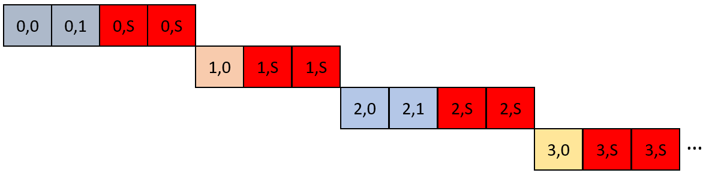

# Optimizing Inner Loop Throughput
This FPGA tutorial discusses optimizing the throughput of an inner loop with a low trip count.
 
***Documentation***:  The [DPC++ FPGA Code Samples Guide](https://software.intel.com/content/www/us/en/develop/articles/explore-dpcpp-through-intel-fpga-code-samples.html) helps you to navigate the samples and build your knowledge of DPC++ for FPGA. <br>
The [oneAPI DPC++ FPGA Optimization Guide](https://software.intel.com/content/www/us/en/develop/documentation/oneapi-fpga-optimization-guide) is the reference manual for targeting FPGAs through DPC++. <br>
The [oneAPI Programming Guide](https://software.intel.com/en-us/oneapi-programming-guide) is a general resource for target-independent DPC++ programming.
 
| Optimized for                     | Description
---                                 |---
| OS                                | Linux* Ubuntu* 18.04; Windows* 10
| Hardware                          | Intel® Programmable Acceleration Card (PAC) with Intel Arria® 10 GX FPGA <br> Intel® FPGA Programmable Acceleration Card (PAC) D5005 (with Intel Stratix® 10 SX)
| Software                          | Intel® oneAPI DPC++ Compiler 
| What you will learn               | How to optimize the throughput of an inner loop with a low trip.
| Time to complete                  | 45 minutes
 

 
## Purpose
This tutorial will show how to optimize the throughput of an inner loop with a low trip count. A *low* trip count is relative. In this tutorial, we will consider *low* to be on the order of 100 or fewer iterations.

### Suggested Prerequisites
This is an advanced tutorial that relies on understanding f<sub>MAX</sub>/II and *speculated iterations*. We suggest first completing the **Speculated Iterations** (speculated_iterations) tutorial.

### Low Trip Count Inner Loops
Consider the following snippet of pseudocode:
```c++
for (int i; i < kOuterLoopBound; i++) {
  int inner_loop_iterations = rand() % kInnerLoopBound;
  for (int j; j < inner_loop_iterations; j++) {
    /* ... */
  }
}
```

In this tutorial, we will focus on optimizing inner loops with low trip counts, so let's assume that the code snippet above `kOuterLoopBound` is some large number (>1 million) and that `kInnerLoopBound` is 3. This means that the value of `inner_loop_iterations` is *dynamic*, but we know it is in the range `[0,3)`. Furthermore, let's assume that the II of the inner loop is 1, which means that a new inner loop iteration can start every cycle. This means that the outer loop II is *dynamic* and depends on how many inner loop iterations need to be started by the previous outer loop iteration. A possible timing diagram for this loop structure is shown in the figure below, where the numbers in the squares are the values of `i` and `j`, respectively.


In general, the compiler optimizes loops for throughput with the assumption that the loop has a high trip count. These optimizations include (but are not limited to) speculating iterations and inserting pipeline registers in the circuit that starts loops. The next two subsections will describe how these optimizations can substantially *decrease* throughput and how you can disable them to improve your design when applied to inner loops with low trip counts.

#### Speculated Iterations
Loop speculation enables loop iterations to be initiated before determining whether they should have been initiated. *Speculated iterations* are the iterations of a loop that launch before the exit condition computation has been completed. This is beneficial when the computation of the exit condition is preventing effective loop pipelining. However, when an inner loop has a low trip count, speculating iterations results in a relatively high proportion of invalid loop iterations.

For example, suppose we speculated 2 inner loop iterations for the earlier code snippet. In that case, our timing diagram may look like the figure below, where the red blocks with the `S` denote an invalid speculated iteration.



In our case, where the inner loop iteration count is in the range `[0,3)`, speculating 2 iterations can cause up to a 3x **reduction** in the design's throughput. This happens when each outer loop iteration launches 1 inner loop iteration (i.e., `inner_loop_iterations` is always 1), but 2 iterations are speculated. For this reason, **it is advised to force the compiler to not speculate iterations for inner loops with known small trip counts using the `[[intelfpga::speculated_iterations(0)]]` attribute**.

For more information on speculated iterations, see the **Speculated Iterations** (speculated_iterations) tutorial.

#### Dynamic Trip Counts
As mentioned earlier, the compiler's default behavior is to optimize loops for throughput. However, as we saw in the previous section, loops with low trip counts have unique throughput characteristics that lead to the compiler making different optimizations. The compiler will try its best to determine if a loop has a high or low trip count and optimizes accordingly. However, in some circumstances, we may need to provide it with more information to make a better decision.

In the previous section, this additional information was the `speculated_iterations` attribute. However, it's not just speculated iterations that cause delays in the launching of inner loops. The compiler has other heuristics at play. For example, the compiler may attempt to improve the f<sub>MAX</sub> of a loop circuit by adding a pipeline register on the circuit path that starts a loop, which results in a 1 cycle delay in starting the loop. For outer loops with large trip counts, this 1 cycle delay is negligible. However, for inner loops with small trip counts, this 1 cycle delay can cause throughput degradation. Like the speculated iteration case discussed in the previous section, this 1 cycle delay can result in up to a 2x **reduction** in the design's throughput.

If the inner loop bounds are known to the compiler, it will decide whether to turn on/off this delay register depending on the (known) trip count. However, in the earlier pseudocode snippet, the inner loop's trip count is not a constant (`inner_loop_iterations` is a random number at runtime). **In cases like this, we suggest explicitly bounding the trip count of the inner loop**. This is illustrated in the pseudocode snippet below, where we have added the `j < kInnerLoopBound` exit condition to the inner loop. This gives the compiler more explicit information about the loop's trip count and allows it to optimize accordingly. 

```c++
for (int i; i < kOuterLoopBound; i++) {
  int inner_loop_iterations = rand() % kInnerLoopBound;
  for (int j; j < inner_loop_iterations && j < kInnerLoopBound; j++) {
    /* ... */
  }
}
```

### Code Sample Details
The sample code finds the sum of an array, albeit in a roundabout way, to better illustrate the optimizations. The `Producer` kernel performs the logic in the pseudocode below. We fill the `input_array` array with random values in the range `[0,3]`. As a result, the number of inner loop iterations will be in the range `[0,3]` for all outer loop iterations.

```c++
for (int i = 0; i < input_array.size(); i++) {
  // write a true to the pipe 'inner_loop_iterations' times
  // this is the inner loop with the low trip count
  int inner_loop_iterations = input_array[i];
  for (int j = 0; j < inner_loop_iterations; j++) {
    Pipe::write(true);
  }
}

// tells the consumer that the data is done
Pipe::write(false);
```

The `Consumer` kernel reads from the pipe, tracks the number of valid reads, and returns it as output data, as shown in the pseudocode below. The result is the sum of the values in `input_array`. Again, this is a roundabout way to sum the values in an array, but it is a simple way to showcase the inner loop optimizations discussed in this tutorial.

```c++
int result = 0;
while (Pipe::read()) {
  result++;
}
```

## Key Concepts
* Optimizing the throughput of inner loops with low trip counts by using the `speculated_iterations` attribute and explicit loop bounding

## License
Code samples are licensed under the MIT license. See
[License.txt](https://github.com/oneapi-src/oneAPI-samples/blob/master/License.txt) for details.

Third party program Licenses can be found here: [third-party-programs.txt](https://github.com/oneapi-src/oneAPI-samples/blob/master/third-party-programs.txt)

## Building the `optimize_inner_loop` Tutorial
### Include Files
The included header `dpc_common.hpp` is located at `%ONEAPI_ROOT%\dev-utilities\latest\include` on your development system.

### Running Samples in DevCloud
If running a sample in the Intel DevCloud, remember that you must specify the compute node (fpga_compile, fpga_runtime:arria10, or fpga_runtime:stratix10) and run in batch or interactive mode. For more information, see the Intel® oneAPI Base Toolkit Get Started Guide ([https://devcloud.intel.com/oneapi/documentation/base-toolkit/](https://devcloud.intel.com/oneapi/documentation/base-toolkit/)).

When compiling for FPGA hardware, it is recommended to increase the job timeout to 12h.
 
### On a Linux* System
 
1. Generate the `Makefile` by running `cmake`.
   ```
   mkdir build
   cd build
   ```
   To compile for the Intel® PAC with Intel Arria® 10 GX FPGA, run `cmake` using the command:  
    ```
    cmake ..
   ```
   Alternatively, to compile for the Intel® FPGA PAC D5005 (with Intel Stratix® 10 SX), run `cmake` using the command:
 
   ```
   cmake .. -DFPGA_BOARD=intel_s10sx_pac:pac_s10
   ```
 
2. Compile the design through the generated `Makefile`. The following build targets are provided, matching the recommended development flow:
 
   * Compile for emulation (fast compile time, targets emulated FPGA device): 
     ```
     make fpga_emu
     ```
   * Generate the optimization report: 
     ```
     make report
     ```
   * Compile for FPGA hardware (longer compile time, targets FPGA device): 
     ```
     make fpga
     ```
3. (Optional) As the above hardware compile may take several hours to complete, FPGA precompiled binaries (compatible with Linux* Ubuntu* 18.04) can be downloaded <a href="https://iotdk.intel.com/fpga-precompiled-binaries/latest/optimize_inner_loop.fpga.tar.gz" download>here</a>.
 
### On a Windows* System

1. Generate the `Makefile` by running `cmake`.
     ```
   mkdir build
   cd build
   ```
   To compile for the Intel® PAC with Intel Arria® 10 GX FPGA, run `cmake` using the command:  
    ```
    cmake -G "NMake Makefiles" ..
   ```
   Alternatively, to compile for the Intel® FPGA PAC D5005 (with Intel Stratix® 10 SX), run `cmake` using the command:

   ```
   cmake -G "NMake Makefiles" .. -DFPGA_BOARD=intel_s10sx_pac:pac_s10
   ```

2. Compile the design through the generated `Makefile`. The following build targets are provided, matching the recommended development flow:

   * Compile for emulation (fast compile time, targets emulated FPGA device): 
     ```
     nmake fpga_emu
     ```
   * Generate the optimization report: 
     ```
     nmake report
     ``` 
   * An FPGA hardware target is not provided on Windows*. 

*Note:* The Intel® PAC with Intel Arria® 10 GX FPGA and Intel® FPGA PAC D5005 (with Intel Stratix® 10 SX) do not yet support Windows*. Compiling to FPGA hardware on Windows* requires a third-party or custom Board Support Package (BSP) with Windows* support.
 
### In Third-Party Integrated Development Environments (IDEs)

You can compile and run this tutorial in the Eclipse* IDE (in Linux*) and the Visual Studio* IDE (in Windows*). For instructions, refer to the following link: [Intel® oneAPI DPC++ FPGA Workflows on Third-Party IDEs](https://software.intel.com/en-us/articles/intel-oneapi-dpcpp-fpga-workflow-on-ide).
 
## Examining the Reports
Locate `report.html` in the `optimize_inner_loop.prj/reports/` or `optimize_inner_loop_s10_pac_report.prj/reports/report.html` directory. Open the report in any of Chrome*, Firefox*, Edge*, or Internet Explorer*.

Open the reports and look at the *Loop Analysis* pane. Examine the loop attributes for the three different versions of the `Producer` kernel (`Producer<0>`, `Producer<1>` and `Producer<2>`). Note that each has an outer loop with an II of 1 and an inner loop with an II of 1. As discussed earlier in this tutorial, the II of the outer loop will be *dynamic* and depend on the inner loop's execution for each outer loop iteration. Also, note the *Speculated Iterations* column, which should show 2 speculated loop iterations on the inner loop for `Producer<0>` and 0 for `Producer<1>` and `Producer<2>`. At this time, there is no information in the reports indicating whether there will be a 1 cycle delay in starting the loop. We are working on improving our reports to help you better debug throughput bottlenecks! 

### Version 0
Version 0 of the kernel (`Producer<0>`) does **not** bound the inner loop trip count and speculates 2 iterations. Since we expect 1 inner loop iteration for every outer loop iteration. This results in 3 invalid iterations for every 1 valid inner loop iteration; 2 (invalid) speculated iterations are launched, and there is a 1 cycle delay starting the inner loop. Therefore, this version only achieves ~1/4 the maximum throughput.

### Version 1
Version 1 of the kernel (`Producer<1>`) does **not** bound the inner loop trip count but explicitly turns off speculation for the inner loop (using the `[[intelfpga::speculated_iterations(0)]]` attribute). Compared to version 0, we have removed 2 of the 3 invalid iterations. However, since we did not bound the inner loop's trip count, the compiler will still insert a pipeline register in the path that starts it. This results in a 1 cycle delay starting the inner loop and up to a 50% drop in the design's throughput.

### Version 2
Version 2 of the kernel (`Producer<2>`) explicitly bounds the inner loop trip count and turns off loop speculation for the inner loop. This version maximizes throughput by removing the delay in launching inner loop iterations for consecutive outer loop iterations, as shown later in the [Example of Output](#example-of-output) section.

## Running the Sample
 
 1. Run the sample on the FPGA emulator (the kernel executes on the CPU):
     ```
     ./optimize_inner_loop.fpga_emu    (Linux)
     optimize_inner_loop.fpga_emu.exe  (Windows)
     ```
2. Run the sample on the FPGA device:
     ```
     ./optimize_inner_loop.fpga        (Linux)
     ```

### Example of Output
You should see the following output in the console:

1. When running on the FPGA emulator
    ```
    generating 5000 random numbers in the range [0,3)
    Running kernel 0
    Running kernel 1
    Running kernel 2
    PASSED
    ```

2. When running on the FPGA device
    ```
    generating 5000000 random numbers in the range [0,3]
    Running kernel 0
    Running kernel 1
    Running kernel 2
    Kernel 0 throughput: 192.19 MB/s 
    Kernel 1 throughput: 359.47 MB/s 
    Kernel 2 throughput: 636.29 MB/s 
    PASSED
    ```
    NOTE: These throughput numbers were collected using the Intel® PAC with Intel Arria® 10 GX FPGA.
