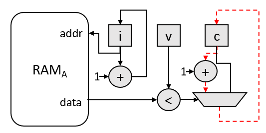
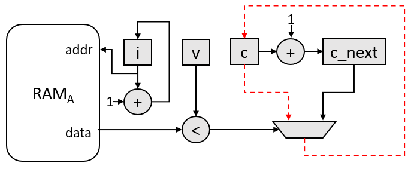

# Shannonization to Improve f<sub>MAX</sub>/II
This tutorial describes the process of _Shannonization_ (named after [Claude Shannon](https://en.wikipedia.org/wiki/Claude_Shannon)) for a simple FPGA design. This optimization improves the f<sub>MAX</sub>/II of a design by precomputing operations in a loop to remove them from the critical path.

***Documentation***: The [oneAPI DPC++ FPGA Optimization Guide](https://software.intel.com/content/www/us/en/develop/documentation/oneapi-fpga-optimization-guide)  provides comprehensive instructions for targeting FPGAs through DPC++. The [oneAPI Programming Guide](https://software.intel.com/en-us/oneapi-programming-guide) is a general resource for target-independent DPC++ programming. 
 
| Optimized for                     | Description
---                                 |---
| OS                                | Linux* Ubuntu* 18.04; Windows* 10
| Hardware                          | Intel® Programmable Acceleration Card (PAC) with Intel Arria® 10 GX FPGA <br> Intel® Programmable Acceleration Card (PAC) with Intel Stratix® 10 SX FPGA
| Software                          | Intel&reg; oneAPI DPC++ Compiler (Beta)
| What you will learn               | How to make FPGA-specific optimizations to remove computation from the critical path and improve f<sub>MAX</sub>/II
| Time to complete                  | 45 minutes

## Purpose
Demonstrate a loop optimization to improve the f<sub>MAX</sub>/II of an FPGA design.

### What is Shannonization?
Shannonization is the process of removing operations from the critical path of a circuit by precomputation. To demonstrate, consider the trivial case below, which counts the number of elements in an array `A` that are less than some runtime value `v`.
```c++
int A[SIZE] = {/*...*/};
int v = /*some dynamic value*/
int c = 0;
for (int i = 0; i < SIZE; i++) {
  if (A[i] < v) {
    c++;
  }
}
```
A possible circuit diagram for this algorithm is shown in the image below, where the dotted red line represents a possible critical path in the circuit.



The goal of the shannonization optimization is to remove operations from the critical path. In this case, we can precompute the _next_ value of `c` (fittingly named `c_next`) for a latter iteration of the loop to use when needed (i.e. the next time `A[i] < v`). This optimization is shown in the code below.

```c++
int A[SIZE] = {/*...*/};
int v = /*some dynamic value*/
int c = 0;
int c_next = 1;
for (int i = 0; i < SIZE; i++) {
  if (A[i] < v) {
    // these operations can happen in parallel!
    c = c_next;
    c++;
  }
}
```

A possible circuit diagram for this optimized algorithm is shown in the image below, where the dotted red line represents a possible critical path in the circuit. Notice that we have removed the `+` operation from the critical path. This assumes that the critical path delay through the multiplexer is higher than through the adder. This may not be the case and the critical path could be from the `c` register to the `c_next` register through the adder, in which case we would have removed the multiplexer from the critical path. Regardless of which operation has the longer critical path delay (the adder or the multiplexer) we have removed an operation from the critical path by precomputing and storing the _next_ value of `c`. This allows us to reduce the critical path delay at the expense of area (in this case, a single 32-bit register).



### Code Sample Details
The purpose of this tutorial is to show methods for improving the f<sub>MAX</sub>/II of a design by removing computation from the critical path. This optimization is widely applicable, but for demonstration we will optimize a design that finds the size of the intersection (denoted by the `∩` symbol) between two sorted arrays. We will look at a special case where one array (`A`) **cannot** have duplicates, while the second array (`B`) **can** have duplicates and the output intersection contains the entire intersection (including the duplicates). An example is shown below:

```
A = {2,5,6,7,9}
B = {2,4,6,6,8,9,10}

A ∩ B = {2,6,6,9}
|A ∩ B| = 4
```

For the FPGA, we will create three kernels: two kernels which stream array `A` and `B` from global memory through SYCL pipes and a third kernel that performs the intersection logic. The kernel diagram is shown below:
```
-----------------              ------------------------
|   ProduceA    |------------->|                      |
-----------------              |                      |
                               |     Intersection     |
-----------------              |                      | 
|   ProduceB    |------------->|                      |
-----------------              ------------------------
```

The FPGA pseudocode for the `Intersection` kernel is shown below:

```c++
void intersection(int A_size, int B_size, int& intersection_size) {
  int a, b;
  int A_count, B_count;
  intersection_size = 0;

  // initialize first elements
  a = APipe::read();
  b = BPipe::read();
  A_count = 1;
  B_count = 1;

  while (A_count < A_size || B_count < B_size) {
    // values match increment counter
    if (a == b) {
      intersection_size++;
    }

    // read in new element
    if (a < b && A_count < A_size) {
      a = APipe::read();
      A_count++;
    } else if (B_count < B_size) {
      b = BPipe::read();
      B_count++;
    }
  };

  // check the last values
  if (a == b) {
    intersection_size++;
  }
}
```

To achieve an II of 1 for the main `while` loop in the FPGA code shown above, the compiler must schedule three 32-bit Compare Operations, a 32-bit Add Operation, a 32-bit Select Operation (i.e. a pipe read), and a 1-bit And Operation into a single cycle. This is necessary since the actions of the *next* iteration of the loop depend on the result of the current iteration of the loop. More specifically, the current iteration must: compare the current values of `a` and `b`, compare the number of elements read from the pipes (i.e. `A_count < A_size` and `B_count < B_size`), increment `A_count` or `B_count`, and then update either `a` or `b` by reading the respective pipe before the next iteration of the loop can enter the same block of code. This creates a long critical path that requires a tradeoff in f<sub>MAX</sub> or II (i.e. either f<sub>MAX</sub> must decrease or II must increase). This tutorial will explain optimizations that remove these operations from the critical path (at the expense of some area) and improve the f<sub>MAX</sub>/II tradeoff and therefore the throughput.

## License
This code sample is licensed under MIT license.

## Building the `shannonization` Tutorial
### Include Files
The included header `dpc_common.hpp` is located at `%ONEAPI_ROOT%\dev-utilities\latest\include` on your development system.

### Running Samples in DevCloud
If running a sample in the Intel DevCloud, remember that you must specify the compute node (fpga_compile or fpga_runtime) as well whether to run in batch or interactive mode. For more information see the Intel® oneAPI Base Toolkit Get Started Guide ([https://devcloud.intel.com/oneapi/get-started/base-toolkit/](https://devcloud.intel.com/oneapi/get-started/base-toolkit/)).

When compiling for FPGA hardware, it is recommended to increase the job timeout to 12h.

### On a Linux* System
 
1. Generate the `Makefile` by running `cmake`.
     ```
   mkdir build
   cd build
   ```
   To compile for the Intel® PAC with Intel Arria® 10 GX FPGA, run `cmake` using the command:  
    ```
    cmake ..
   ```
   Alternatively, to compile for the Intel® PAC with Intel Stratix® 10 SX FPGA, run `cmake` using the command:
 
   ```
   cmake .. -DFPGA_BOARD=intel_s10sx_pac:pac_s10
   ```
 
2. Compile the design through the generated `Makefile`. The following build targets are provided, matching the recommended development flow:
 
   * Compile for emulation (fast compile time, targets emulated FPGA device): 
     ```
     make fpga_emu
     ```
   * Generate the optimization report: 
     ```
     make report
     ```
   * Compile for FPGA hardware (longer compile time, targets FPGA device): 
     ```
     make fpga
     ```
3. (Optional) As the above hardware compile may take several hours to complete, an Intel® PAC with Intel Arria® 10 GX FPGA precompiled binary can be downloaded <a href="https://iotdk.intel.com/fpga-precompiled-binaries/latest/shannonization.fpga.tar.gz" download>here</a>.
 
### On a Windows* System
Note: `cmake` is not yet supported on Windows. A build.ninja file is provided instead. 
 
1. Enter the source file directory.
   ```
   cd src
   ```
 
2. Compile the design. The following build targets are provided, matching the recommended development flow:
 
   * Compile for emulation (fast compile time, targets emulated FPGA device): 
      ```
      ninja fpga_emu
      ```
 
   * Generate the optimization report:
 
     ```
     ninja report
     ```

     If you are targeting Intel® PAC with Intel Stratix® 10 SX FPGA, instead use:
     ```
     ninja report_s10_pac
     ```

   * Compiling for FPGA hardware is not yet supported on Windows.
 
### In Third-Party Integrated Development Environments (IDEs)

You can compile and run this tutorial in the Eclipse* IDE (in Linux*) and the Visual Studio* IDE (in Windows*). For instructions, refer to the following link: [Intel® oneAPI DPC++ FPGA Workflows on Third-Party IDEs](https://software.intel.com/en-us/articles/intel-oneapi-dpcpp-fpga-workflow-on-ide).

## Examining the Reports
This section will walk through how the HTML reports show the result of the optimizations we made in each version of the kernel, the definition of which can be found in `src/IntersectionKernel.hpp`. Start by locating `report.html` in the `shannonization_report.prj/reports/` or `shannonization_s10_pac_report.prj/reports/` directory. Open the report in any of Chrome*, Firefox*, Edge*, or Internet Explorer*. The f<sub>MAX</sub> numbers mentioned in these sections assume that the Arria® 10 GX FPGA is the target. However, the discussion is similar for the Stratix® 10 SX FPGA.

#### Version 0
The first version of the kernel, `Intersection<0>`, is the baseline implementation of the intersection kernel. Check the *Details* pane in the *Loop Analysis* tab for the `while` loop in the `Intersection<0>` kernel. You will notice that the *Block Scheduled f<sub>MAX</sub>* for the `Intersection<0>` kernel is far lower than the target (e.g. ~140 MHz). The *Details* pane shows that the most critical path contains the operations mentioned earlier at the end of the [Algorithm Details](#algorithm-details) Section.

#### Version 1
The second version of the kernel, `Intersection<1>`, uses the shannonization optimization to remove the increment of `A_count` and `B_count` from the critical path. To do this, we create two new variables, `A_count_next` and `B_count_next` which will store the value of `A_count` and `B_count` **for the next iteration of the loop**. The code snippet below shows how `A_count` and `B_count` are updated using `A_count_next` and `B_count_next`:
```c++
  ...
  if (a < b && A_count < A_size) {
    a = APipe::read();
    A_count = A_count_next;
    A_count_next++;
  } else if (B_count < B_size) {
    b = BPipe::read();
    B_count = B_count_next;
    B_count_next++;
  }
  ...
```

Now, the assignments of `A_count = A_count_next` and `B_count = B_count_next` can be done **in parallel to the increment of the counts for the next iteration of the loop** (i.e. in parallel to `A_count_next++` and `B_count_next++`). This removes the 32-bit Integer Add Operation from the critical path, as can be seen in the *Details* pane of the *Loop Analysis* report for the `Intersection<1>` kernel. The *Loop Analysis* pane will show an increase in the *Block Scheduled f<sub>MAX</sub>* (e.g. ~190 MHz).

#### Version 2
The third version of the kernel, `Intersection<2>`, extends the previous optimization by removing the 32-bit Integer Compare Operation from the critical path. The first step is to precompute the comparisons for the next loop iteration (`A_count_inrange` and `B_count_inrange`) and the next iteration (`A_count_next_inrange` and `B_count_next_inrange`), as we did for the accumulations. This is shown in the code snippet below:

```c++
  ...
  if (a < b && A_count_inrange) {
    a = APipe::read();

    A_count = A_count_next;
    A_count_next++;

    A_count_inrange = A_count_next_inrange;
    A_count_next_inrange = A_count_next < A_size;
  } else if (B_count_inrange) {
    b = BPipe::read();

    B_count = B_count_next;
    B_count_next++;

    B_count_inrange = B_count_next_inrange;
    B_count_next_inrange = B_count_next < B_size;
  }
  ...
```
However, this places a 32-bit Integer Add Operation back into the critical path (e.g. `A_count_next++` must computed before before computing `A_count_next_inrange = A_count_next < A_size`). To remove this addition from the critical path, we do the same optimization as version 1. That is, we now precompute the additions for the next **two** iterations of the loop (`A_count_next_next` and `B_count_next_next`), which again removes the addition from the critical path. This is shown in the code snippet below:

```c++
  ...
  if (a < b && A_count_inrange) {
    a = APipe::read();

    A_count_inrange = A_count_next_inrange;
    A_count_next_inrange = A_count_next_next < A_size;

    A_count = A_count_next;
    A_count_next = A_count_next_next;
    A_count_next_next++;
  } else if (B_count_inrange) {
    b = BPipe::read();

    B_count_inrange = B_count_next_inrange;
    B_count_next_inrange = B_count_next_next < B_size;

    B_count = B_count_next;
    B_count_next = B_count_next_next;
    B_count_next_next++;
  }
  ...
```

In general, these shannonization optimizations create a shift-register that precomputes and *passes* values (additions and comparisons) to latter iterations of the loop. The size of the shift-register determines how many *future* iterations we precompute for. In version 1, we precompute for one iteration, in this version we precompute for 2 iterations. The reports for the `Intersection<2>` should show a critical path with: a single 32-bit Integer Compare Operation (`a < b`), a 32-bit Select Operation (`::read`) and a 1-bit And Operation (`a < b && A_count_inrange`). Thus, we have managed to remove two 32-bit Compare Operations and one 32-bit Add Operation from the critical path. Looking at the *Loop Analysis* pane, you will see that the *Block Scheduled f<sub>MAX</sub>* is highest for `Intersection<2>` (e.g. 240 MHz).

#### Version 3
As a consequence of the fabric architecture of the Intel Stratix® 10 SX FPGA, the hardware implementation of pipes for the Intel Stratix® 10 SX FPGA has a longer latency for blocking pipe reads and writes. In version 3 of the kernel, `Intersection<3>`, we transform the code to use non-blocking pipe reads. For the Intel® Arria® 10 GX FPGA, this does not have a noticeable difference. However, this transformation allows the design to reach an II of 1 for the Intel Stratix® 10 SX FPGA.

## Running the Sample
 
 1. Run the sample on the FPGA emulator (the kernel executes on the CPU):
     ```
     ./shannonization.fpga_emu          (Linux)
     shannonization.fpga_emu.exe        (Windows)
     ```
2. Run the sample on the FPGA device:
     ```
     ./shannonization.fpga              (Linux)
     ```

### Application Parameters
The following table explains the command line arguments that can be passed to the `shannonization` program.
| Argument name | Description                                         | Default                                     |
| :---          | :---                                                | :---                                        |
| `--A`         | Set the size of array A                             | 128 for emulation, 131072 for FPGA          |
| `--B`         | Set the size of array B                             | 256 for emulation, 262144 for FPGA          |
| `--help`      | Print the help message                              | N/A                                         |

### Example of Output
You should see the following output in the console:

1. When running on the FPGA emulator
    ```
    Generating input data
    Computing golden result
    Running 1 iteration of kernel 0 with |A|=128 and |B|=256
    Running 1 iteration of kernel 1 with |A|=128 and |B|=256
    Running 1 iteration of kernel 2 with |A|=128 and |B|=256
    Running 1 iteration of kernel 3 with |A|=128 and |B|=256
    PASSED
    ```

2. When running on the FPGA device
    ```
    Generating input data
    Computing golden result
    Running 5 iterations of kernel 0 with |A|=16384 and |B|=32768
    Kernel 0 average throughput: 248.460 MB/s
    Running 5 iterations of kernel 1 with |A|=16384 and |B|=32768
    Kernel 1 average throughput: 372.191 MB/s
    Running 5 iterations of kernel 2 with |A|=16384 and |B|=32768
    Kernel 2 average throughput: 372.279 MB/s
    Running 5 iterations of kernel 3 with |A|=16384 and |B|=32768
    Kernel 2 average throughput: 742.257 MB/s
    PASSED
    ```
    NOTE: These throughput numbers were collected using the Intel® PAC with Intel Stratix® 10 SX FPGA.
