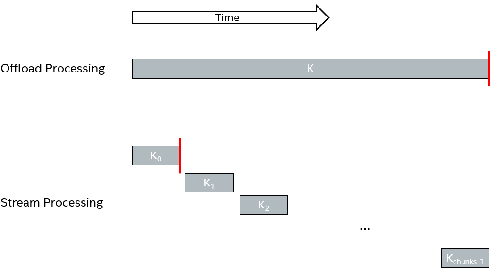
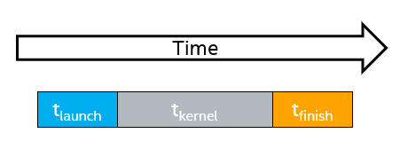
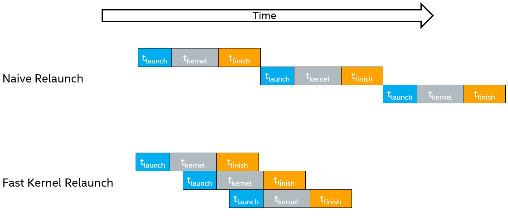
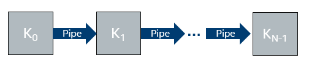
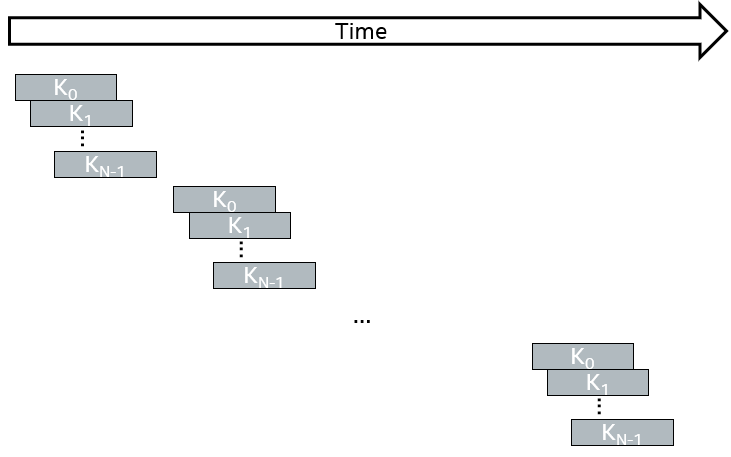
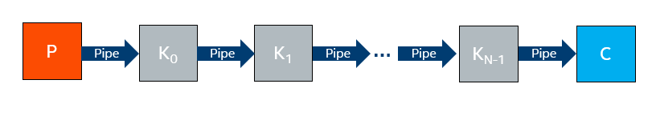
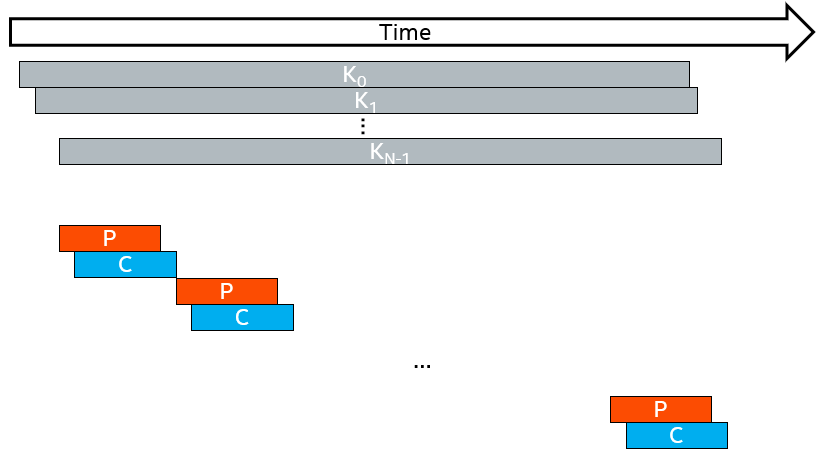

# Simple Host-Device Streaming
This tutorial demonstrates how to use SYCL Universal Shared Memory (USM) to stream data between the host and FPGA device and achieve low latency while maintaining throughput.

***Documentation***:  The [DPC++ FPGA Code Samples Guide](https://software.intel.com/content/www/us/en/develop/articles/explore-dpcpp-through-intel-fpga-code-samples.html) helps you to navigate the samples and build your knowledge of DPC++ for FPGA. <br>
The [oneAPI DPC++ FPGA Optimization Guide](https://software.intel.com/content/www/us/en/develop/documentation/oneapi-fpga-optimization-guide) is the reference manual for targeting FPGAs through DPC++. <br>
The [oneAPI Programming Guide](https://software.intel.com/en-us/oneapi-programming-guide) is a general resource for target-independent DPC++ programming.

| Optimized for                     | Description
---                                 |---
| OS                                | Linux* Ubuntu* 18.04; Windows* 10
| Hardware                          | Intel&reg; FPGA Programmable Acceleration Card (PAC) D5005 (with Intel Stratix&reg; 10 SX)
| Software                          | Intel&reg; oneAPI DPC++ Compiler
| What you will learn               | How to achieve low-latency host-device streaming while maintaining throughput
| Time to complete                  | 45 minutes

_Notice: SYCL USM host allocations (and therefore this tutorial) are only supported for the Intel&reg; FPGA PAC D5005 (with Intel Stratix&reg; 10 SX)_
_Notice: This tutorial demonstrates an implementation of host streaming that will be supplanted by better techniques in a future release. See the [Drawbacks and Future Work](#drawbacks-and-future-work)_

## Purpose
The purpose of this tutorial is to show you how to take advantage of SYCL USM host allocations and zero-copy host memory to implement a streaming host-device design with low latency and high throughput. Before starting this tutorial, we recommend first reviewing the **Pipes** (pipes) and **Zero-Copy Data Transfer** (zero_copy_data_transfer) FPGA tutorials, which will teach you more about SYCL pipes and SYCL USM and zero-copy data transfers, respectively.

This tutorial includes three designs:
1. An offload design that maximizes throughput with no optimization for latency (`DoWorkOffload` in *simple_host_streaming.cpp*)
2. A single-kernel design that uses the methods described below to achieve a much lower latency while maintaining throughput (`DoWorkSingleKernel` in *simple_host_streaming.cpp* and *single_kernel.hpp*)
3. A multi-kernel design that uses the methods described below to achieve a much lower latency while maintaining throughput (`DoWorkMultiKernel` in *simple_host_streaming.cpp* and *multi_kernel.hpp*)

### Offload Processing
Typical SYCL designs perform _offload processing_. All of the input data is prepared by the CPU, and then transferred to the device (in our case, an FPGA). Kernels are started on the device to process the data. When the kernels finish, the CPU copies the output data from the FPGA back to its memory. Memory synchronization is achieved on the host after the device kernel signals its completion.

Offload processing achieves excellent throughput when the memory transfers and kernel computation are performed on large data sets, as the CPU's kernel management overhead is minimized. Data transfer overhead can be concealed using *double buffering* or *n-way buffering* to maximize kernel throughput. However, a significant shortcoming of this design pattern is latency. The coarse grain synchronization of waiting for the entire set of data to processed results in a latency that is equal to the processing time of the entire data.

This tutorial will demonstrate a simple host-device streaming design that reduces latency and maintains throughput. 

### Host-Device Streaming Processing
The method for achieving lower latency between the host and device is to break data set into smaller chunks and, instead of enqueueing a single long-running kernel, launch a set of shorter-running kernels. Together, these shorter-running kernels process the data in smaller batches. As memory synchronization occurs upon kernel completion, this strategy makes the output data available to the CPU in a more granular way. This is illustrated in the figure below. The red lines show the time when the first set of data is available in the host.



In the streaming version, the first piece of data is available in the host earlier than in the offload version. How much earlier? Say we have `total_size` elements of data to process and we break the computation into `chunks` chunks of size `chunk_size=total_size/chunks` (as is the case in the figure above). Then, in an perfect world, the streaming design will achieve a latency that is `chunks` times better than the offload version.

#### Setting the `chunk_size`
Why not set `chunk_size` to 1 (i.e. `chunks=total_size`) to minimize the latency? In the figure above, you may notice small gaps between the kernels in the streaming design (e.g. between K<sub>0</sub> and K<sub>1</sub>). This is caused by the overhead of launching kernels and detecting kernel completion on the host. These gaps increase the total processing time and therefore decrease the throughput of the design (i.e. compared to the offload design, it takes more time to process the same amount of data). If these gaps are negligible, then the throughput is negligibly affected. 

In the streaming design, the choice of the `chunk_size` is thus a tradeoff between latency (a smaller chunk size results in a smaller latency) and throughput (a smaller chunk size increases the relevance of the inter-kernel latency).

#### Lower bounds on latency
Lowering the `chunk_size` can reduce latency, sometimes at the expense of throughput. However, even if you aren't concerned with throughput, there still exists a lower-bound on the latency of a kernel. In the figure below, t<sub>launch</sub> is the time for a kernel launch signal to go from the host to the device, t<sub>kernel</sub> is the time for the kernel to execute on the device, and t<sub>finish</sub> is the time for the finished signal to go from the device to the host. Even if we set `chunk_size` to 0 (i.e. launch a kernel that does *nothing*) and therefore t<sub>kernel</sub> ~= 0, the latency is still t<sub>launch</sub> + t<sub>finish</sub>. In other words, the lower bound on kernel latency is the time needed for the "start "signal to get from the host to the device and for the "finished" signal to get from the device to the host.



In the previous section, we discussed how gaps between kernel invocations can degrade throughput. In the figure above, there appears to be a mininum t<sub>launch</sub> + t<sub>finish</sub> gap between kernel invocations. This is illustrated as the *Naive Relaunch* timeline in the figure below. Fortunately, this overhead is circumvented by an automatic runtime kernel launch scheme that buffers kernel arguments on the device before the previous kernel finishes. This enables kernels queue **on the device** and to begin execution without waiting for the previous kernel's "finished" to propagate back to the host. We call this *Fast Kernel Relaunch* and it is also illustrated in the figure below. While the details of fast kernel relaunch are beyond the scope of this tutorial, if suffices to understand that it reduces the gap between kernel invocations and allows you to achieve lower latency while maintaining throughput.



#### Multiple kernel pipeline
More complicated FPGA designs often instantiate multiple kernels connected by SYCL pipes (for examples, see the FPGA Reference Designs). Suppose you have a kernel system of `N` kernels connected by pipes, as in the figure below.



With the goal of achieving lower latency, you use the technique described in the previous section to launch multiple invocations of your `N` kernels to process chunks of data. This would give you a timeline like the figure below.



Notice the gaps between the start times of the `N` kernels for a single `chunk`. This is the t<sub>launch</sub> time discussed in the previous section. However, the multi-kernel design introduces a potential new lower bound on the latency for a single chunk because processing a single chunk of data requires launching `N` kernels, which takes `N` x t<sub>launch</sub>. If `N` (the number of kernels in your system) is sufficiently large, this will limit your achievable latency.

For designs with `N > 2`, a different approach is recommended. The idea is to enqueue your system of `N` kernels **once**, and to introduce Producer (`P`) and Consumer (`C`) kernels to handle the production and consumption of data from and to the host, respectively. This method is illustrated in the figure below. The Producer streams data from the host and presents it to the kernel system through a SYCL pipe. The output of the kernel system is consumed by the Consumer and written back into host memory.



To achieve low latency, we still process the data in chunks, but instead of having to enqueue `N` kernels for each chunk, we only have to enqueue a single Producer and Consumer kernel per chunk. This enables us to reduce the lower bound on the latency to MAX(2 x t<sub>launch</sub>, t<sub>launch</sub> + t<sub>finish</sub>). Notice that this lower bound does not depend on the number of kernels in our system (`N`). 

**This method should only be used when `N > 2`**. FPGA area is sacrificed to implement the Producer and Consumer and their pipes in order to achieve lower overall processing latency.



### Drawbacks and Future Work
Fundamentally, the ability to stream data between the host and device is built around SYCL USM host allocations. The underlying problem is how to efficiently synchronize between the host and device to signal that _some_ data is ready to be processed, or has been processed. In other words, how does the host signal to the device that some data is ready to be processed? Conversely, how does the device signal to the host that some data is done being processed?

One method to achieve this signalling is to use the start of a kernel to signal to the device that data is ready to be processed, and the end of a kernel to signal to the host that data has been processed. This is the approach taken in this tutorial. However, this method has two notable drawbacks. First, the latency to start and end kernels is high (as of now, roughly 50us). To maintain high throughput, we must size the `chunk_size` sufficiently large to hide the inter-kernel latency, resulting in a latency increase. Second, the programming model to achieve this performance is non-trivial as you must intelligently manage the SYCL device queue.

We are currently working on an API and tutorial to address both of these drawbacks. This API will decrease the latency to synchronize between the host and device and therefore enable lower latency with maintained throughput. It will also dramatically improve the usability of the programming model to achieve this performance.

## Key Concepts
* Runtime kernel management
* Host-device streaming designs
 
## License
Code samples are licensed under the MIT license. See
[License.txt](https://github.com/oneapi-src/oneAPI-samples/blob/master/License.txt) for details.

Third party program Licenses can be found here: [third-party-programs.txt](https://github.com/oneapi-src/oneAPI-samples/blob/master/third-party-programs.txt)

 
## Building the `simple_host_streaming` Tutorial
### Include Files
The included header `dpc_common.hpp` is located at `%ONEAPI_ROOT%\dev-utilities\latest\include` on your development system.
 
### Running Samples in DevCloud
If running a sample in the Intel DevCloud, remember that you must specify the compute node (fpga_compile, fpga_runtime:arria10, or fpga_runtime:stratix10) and whether to run in batch or interactive mode. For more information see the Intel&reg; oneAPI Base Toolkit Get Started Guide ([https://devcloud.intel.com/oneapi/documentation/base-toolkit/](https://devcloud.intel.com/oneapi/documentation/base-toolkit/)).
 
When compiling for FPGA hardware, it is recommended to increase the job timeout to 12h.
 
### On a Linux* System
 
1. Generate the `Makefile` by running `cmake`.
     ```
   mkdir build
   cd build
   ```
   To compile for the Intel&reg; FPGA PAC D5005 (with Intel Stratix&reg; 10 SX), run `cmake` using the command:   
    ```
    cmake ..
   ```

2. Compile the design through the generated `Makefile`. The following build targets are provided, matching the recommended development flow:
 
   * Compile for emulation (fast compile time, targets emulated FPGA device): 
     ```
     make fpga_emu
     ```
   * Generate the optimization report: 
     ```
     make report
     ```
   * Compile for FPGA hardware (longer compile time, targets FPGA device): 
     ```
     make fpga
     ```
3. (Optional) As the above hardware compile may take several hours to complete, an Intel&reg; PAC with Intel Stratix&reg; 10 SX FPGA precompiled binary can be downloaded <a href="https://iotdk.intel.com/fpga-precompiled-binaries/latest/simple_host_streaming.fpga.tar.gz" download>here</a>.
 
### On a Windows* System
1. Generate the `Makefile` by running `cmake`.
     ```
   mkdir build
   cd build
   ```
   To compile for the Intel&reg; FPGA PAC D5005 (with Intel Stratix&reg; 10 SX), run `cmake` using the command:  
    ```
    cmake -G "NMake Makefiles" ..
   ```

2. Compile the design through the generated `Makefile`. The following build targets are provided, matching the recommended development flow:

   * Compile for emulation (fast compile time, targets emulated FPGA device): 
     ```
     nmake fpga_emu
     ```
   * Generate the optimization report: 
     ```
     nmake report
     ``` 
   * An FPGA hardware target is not provided on Windows*. 

*Note:* The Intel&reg; PAC D5005 (with Intel Stratix&reg; 10 SX FPGA) does not yet support Windows*. Compiling to FPGA hardware on Windows* requires a third-party or custom Board Support Package (BSP) with Windows* support.
 
### In Third-Party Integrated Development Environments (IDEs)

You can compile and run this tutorial in the Eclipse* IDE (in Linux*) and the Visual Studio* IDE (in Windows*). For instructions, refer to the following link: [Intel&reg; oneAPI DPC++ FPGA Workflows on Third-Party IDEs](https://software.intel.com/en-us/articles/intel-oneapi-dpcpp-fpga-workflow-on-ide).

## Examining the Reports
Locate `report.html` in the `simple_host_streaming_report.prj/reports/` directory. Open the report in any of Chrome*, Firefox*, Edge*, or Internet Explorer*.

## Running the Sample
 
 1. Run the sample on the FPGA emulator (the kernel executes on the CPU):
     ```
     ./simple_host_streaming.fpga_emu     (Linux)
     simple_host_streaming.fpga_emu.exe   (Windows)
     ```
2. Run the sample on the FPGA device:
     ```
     ./simple_host_streaming.fpga         (Linux)
     ```
 
### Example of Output
You should see the following output in the console:

1. When running on the FPGA emulator
    ```
    # Chunks:             16
    Chunk count:          256
    Total count:          4096
    Iterations:           1

    Running the basic offload kernel
    Offload average latency:          0.1892 ms
    Offload average throughput:       1385.3707 MB/s

    Running the latency optimized single-kernel design
    Single-kernel average latency:          0.0447 ms
    Single-kernel average throughput:       188.3596 MB/s

    Running the latency optimized multi-kernel design
    Multi-kernel average latency:          0.2674 ms
    Multi-kernel average throughput:       39.0021 MB/s

    PASSED
    ```
    NOTE: The FPGA emulator does not accurately represent the performance (throughput or latency) of the kernels.

2. When running on the FPGA device
    ```
    # Chunks:             512
    Chunk count:          32768
    Total count:          16777216
    Iterations:           4

    Running the basic offload kernel
    Offload average latency:          99.6709 ms
    Offload average throughput:       107772.8673 MB/s

    Running the latency optimized single-kernel design
    Single-kernel average latency:          0.2109 ms
    Single-kernel average throughput:       10689.9578 MB/s

    Running the latency optimized multi-kernel design
    Multi-kernel average latency:          0.2431 ms
    Multi-kernel average throughput:       10674.7123 MB/s

    PASSED
    ```
    NOTE: The experimentally measured bandwidth of the PCIe is ~11 GB/s (bi-directional, ~22 MB/s total). The FPGA device performance numbers above show that the offload, single-kernel, and multi-kernel designs are all able to saturate the PCIe bandwidth (since this design reads and writes over PCIe, a design throughput of 10.7 GB/s uses 10.7 x 2 = 21.4 GB/s of total PCIe bandwidth). However, the single-kernel and multi-kernel designs saturate the PCIe bandwidth with a latency that is ~473x lower than the offload kernel.
