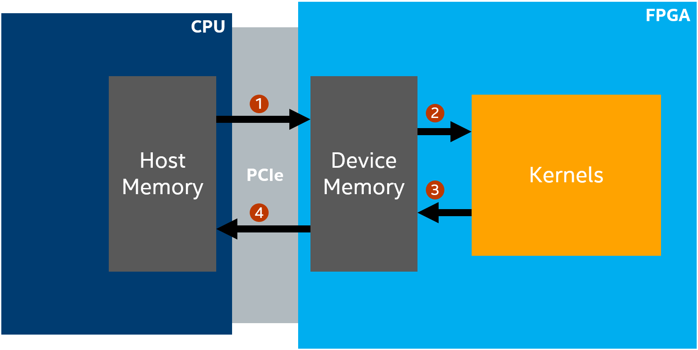
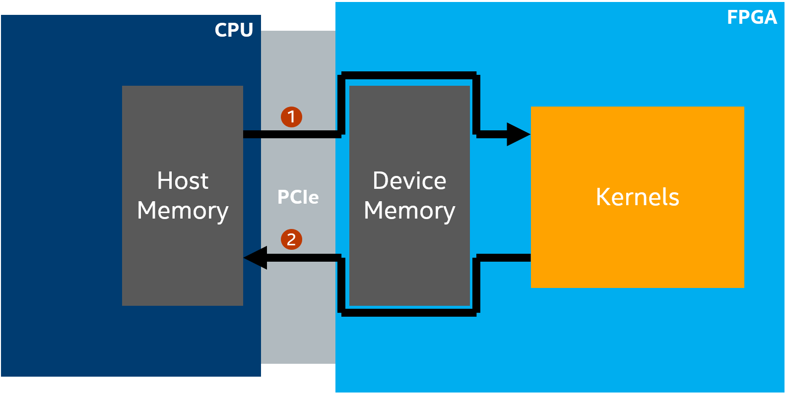

# Zero-copy Data Transfer
This tutorial demonstrates how to use zero-copy host memory via the SYCL Unified Shared Memory (USM) to improve your FPGA design's performance.

***Documentation***:  The [DPC++ FPGA Code Samples Guide](https://software.intel.com/content/www/us/en/develop/articles/explore-dpcpp-through-intel-fpga-code-samples.html) helps you to navigate the samples and build your knowledge of DPC++ for FPGA. <br>
The [oneAPI DPC++ FPGA Optimization Guide](https://software.intel.com/content/www/us/en/develop/documentation/oneapi-fpga-optimization-guide) is the reference manual for targeting FPGAs through DPC++. <br>
The [oneAPI Programming Guide](https://software.intel.com/en-us/oneapi-programming-guide) is a general resource for target-independent DPC++ programming.

| Optimized for                     | Description
---                                 |---
| OS                                | Linux* Ubuntu* 18.04/20.04, RHEL*/CentOS* 8, SUSE* 15; Windows* 10
| Hardware                          | Intel® FPGA Programmable Acceleration Card (PAC) D5005 (with Intel Stratix® 10 SX) <br> Intel® FPGA 3rd party / custom platforms with oneAPI support (and SYCL USM support) <br> *__Note__: Intel® FPGA PAC hardware is only compatible with Ubuntu 18.04*
| Software                          | Intel&reg; oneAPI DPC++ Compiler
| What you will learn               | How to use SYCL USM host allocations for the FPGA
| Time to complete                  | 15 minutes

*Notice: SYCL USM host allocations (and therefore this tutorial) are only supported for the Intel&reg; FPGA PAC D5005 (with Intel Stratix&reg; 10 SX) with USM support (i.e., intel_s10sx_pac:pac_s10_usm)*

## Purpose
The purpose of this tutorial is to show you how to take advantage of zero-copy host memory for the FPGA to improve the performance of your design. On FPGA, DPC++ implements all host and shared allocations as *zero-copy* data in host memory. This means that the FPGA will access the data directly over PCIe, which can improve performance in cases where there is little or no temporal reuse of data in the FPGA kernel. This tutorial includes two different kernels: one using traditional SYCL buffers (`src/buffer_kernel.hpp`) and one using USM host allocations (`src/zero_copy_kernel.hpp`) that takes advantage of zero-copy host memory. Before completing this tutorial, it is suggested you review the **Explicit USM** (explicit_usm) tutorial.

### USM host allocations
USM host allocations allows the host and device to share their respective memories. A typical SYCL design, which transfers data using either SYCL buffers/accessors or USM device allocations, copies its input data from the Host Memory to the FPGA's Device Memory. To do this, the data is sent to the FPGA board over PCIe. Once all the data is copied to the FPGA's Device Memory, the FPGA kernel is run and produces output that is also stored in Device Memory. Finally, the output data is transferred from the FPGA's Device Memory back to the CPU's Host Memory over PCIe. This model is shown in the figure below.



Consider a kernel that simply performs computation for each entry in a buffer independently. Using SYCL buffers or explicit USM, we would bulk transfer the data from the Host Memory to the FPGA's Device Memory, run the kernel that performs the computation on each entry in the buffer, and then bulk transfer the buffer back to the host.

However, a better approach would simply stream the data from the host memory to the FPGA over PCIe, perform the computation on each piece of data, and then stream it back to host memory over PCIe. The desired structure is illustrated below. This would enable us to eliminate the overhead of copying the data to and from the Host Memory and the FPGA's Device Memory. This is done by using zero-copy host memory via the SYCL USM host allocations. This technique is demonstrated in `src/zero_copy_kernel.hpp`.



This approach is not considered host streaming since the CPU and FPGA cannot (reliably) access the input/output data simultaneously. In other words, the host must wait until all the FPGA kernels have finished before accessing the output data. However, we did avoid copying the data to and from the FPGA's Device Memory and therefore, we get overall savings in total latency. This savings can be seen by running the sample on FPGA hardware or the example output later in the [Example of Output](#example-of-output) section. Another FPGA tutorial, **Simple Host Streaming** (simple_host_streaming), describes how to achieve true host streaming using USM host allocations.

## Key Concepts
* How to use USM host allocations for the FPGA
* The performance benefits of using host allocations over traditional SYCL buffers or device allocations.

## License
Code samples are licensed under the MIT license. See
[License.txt](https://github.com/oneapi-src/oneAPI-samples/blob/master/License.txt) for details.

Third party program Licenses can be found here: [third-party-programs.txt](https://github.com/oneapi-src/oneAPI-samples/blob/master/third-party-programs.txt)

## Building the `zero_copy_data_transfer` Tutorial
### Include Files
The included header `dpc_common.hpp` is located at `%ONEAPI_ROOT%\dev-utilities\latest\include` on your development system.

### Running Samples in DevCloud
If running a sample in the Intel DevCloud, remember that you must specify the type of compute node and whether to run in batch or interactive mode. Compiles to FPGA are only supported on fpga_compile nodes. Executing programs on FPGA hardware is only supported on fpga_runtime nodes of the appropriate type, such as fpga_runtime:arria10 or fpga_runtime:stratix10.  Neither compiling nor executing programs on FPGA hardware are supported on the login nodes. For more information, see the Intel® oneAPI Base Toolkit Get Started Guide ([https://devcloud.intel.com/oneapi/documentation/base-toolkit/](https://devcloud.intel.com/oneapi/documentation/base-toolkit/)).

When compiling for FPGA hardware, it is recommended to increase the job timeout to 12h.


### Using Visual Studio Code*  (Optional)

You can use Visual Studio Code (VS Code) extensions to set your environment, create launch configurations,
and browse and download samples.

The basic steps to build and run a sample using VS Code include:
 - Download a sample using the extension **Code Sample Browser for Intel oneAPI Toolkits**.
 - Configure the oneAPI environment with the extension **Environment Configurator for Intel oneAPI Toolkits**.
 - Open a Terminal in VS Code (**Terminal>New Terminal**).
 - Run the sample in the VS Code terminal using the instructions below.

To learn more about the extensions and how to configure the oneAPI environment, see
[Using Visual Studio Code with Intel® oneAPI Toolkits](https://software.intel.com/content/www/us/en/develop/documentation/using-vs-code-with-intel-oneapi/top.html).

After learning how to use the extensions for Intel oneAPI Toolkits, return to this readme for instructions on how to build and run a sample.

### On a Linux* System

1. Generate the `Makefile` by running `cmake`.
     ```
   mkdir build
   cd build
   ```

   To compile for the Intel&reg; FPGA PAC D5005 (with Intel Stratix&reg; 10 SX), run `cmake` using the command:
    ```
    cmake ..
   ```
   You can also compile for a custom FPGA platform with SYCL USM support. Ensure that the board support package is installed on your system. Then run `cmake` using the command:
   ```
   cmake .. -DFPGA_BOARD=<board-support-package>:<board-variant> -DUSM_HOST_ALLOCATIONS_ENABLED=1
   ```

2. Compile the design through the generated `Makefile`. The following build targets are provided, matching the recommended development flow:

   * Compile for emulation (fast compile time, targets emulated FPGA device):
     ```
     make fpga_emu
     ```
   * Generate the optimization report:
     ```
     make report
     ```
   * Compile for FPGA hardware (longer compile time, targets FPGA device):
     ```
     make fpga
     ```

3. (Optional) As the above hardware compile may take several hours to complete, an Intel&reg; FPGA PAC D5005 (with Intel Stratix&reg; 10 SX) precompiled binary (compatible with Linux* Ubuntu* 18.04) can be downloaded <a href="https://iotdk.intel.com/fpga-precompiled-binaries/latest/zero_copy_data_transfer.fpga.tar.gz" download>here</a>.

### On a Windows* System

1. Generate the `Makefile` by running `cmake`.
     ```
   mkdir build
   cd build
   ```
   To compile for the Intel&reg; FPGA PAC D5005 (with Intel Stratix&reg; 10 SX), run `cmake` using the command:
    ```
    cmake -G "NMake Makefiles" ..
   ```
   You can also compile for a custom FPGA platform with SYCL USM support. Ensure that the board support package is installed on your system. Then run `cmake` using the command:
   ```
   cmake -G "NMake Makefiles" .. -DFPGA_BOARD=<board-support-package>:<board-variant> -DUSM_HOST_ALLOCATIONS_ENABLED=1
   ```

2. Compile the design through the generated `Makefile`. The following build targets are provided, matching the recommended development flow:

   * Compile for emulation (fast compile time, targets emulated FPGA device):
     ```
     nmake fpga_emu
     ```
   * Generate the optimization report:
     ```
     nmake report
     ```
   * Compile for FPGA hardware (longer compile time, targets FPGA device):
     ```
     nmake fpga
     ```

*Note:* The Intel® FPGA PAC D5005 (with Intel Stratix® 10 SX) does not support Windows*. Compiling to FPGA hardware on Windows* requires a third-party or custom Board Support Package (BSP) with Windows* support.<br>
*Note:* If you encounter any issues with long paths when compiling under Windows*, you may have to create your ‘build’ directory in a shorter path, for example c:\samples\build.  You can then run cmake from that directory, and provide cmake with the full path to your sample directory.

### In Third-Party Integrated Development Environments (IDEs)

You can compile and run this tutorial in the Eclipse* IDE (in Linux*) and the Visual Studio* IDE (in Windows*). For instructions, refer to the following link: [Intel&reg; oneAPI DPC++ FPGA Workflows on Third-Party IDEs](https://software.intel.com/en-us/articles/intel-oneapi-dpcpp-fpga-workflow-on-ide).

## Examining the Reports
Locate `report.html` in the `zero_copy_data_transfer_report.prj/reports/` directory. Open the report in any of Chrome*, Firefox*, Edge*, or Internet Explorer*.

## Running the Sample

 1. Run the sample on the FPGA emulator (the kernel executes on the CPU):
     ```
     ./zero_copy_data_transfer.fpga_emu     (Linux)
     zero_copy_data_transfer.fpga_emu.exe   (Windows)
     ```
2. Run the sample on the FPGA device:
     ```
     ./zero_copy_data_transfer.fpga         (Linux)
     ```

### Example of Output
You should see the following output in the console:

1. When running on the FPGA emulator
    ```
    Running the buffer kernel version with size=10000
    Running the zero-copy kernel version with size=10000
    PASSED
    ```

2. When running on the FPGA device
    ```
    Running the buffer kernel with size=100000000
    Running the zero-copy kernel version with size=100000000
    Average latency for the buffer kernel: 479.713 ms
    Average latency for the zero-copy kernel: 310.734 ms
    PASSED
    ```
