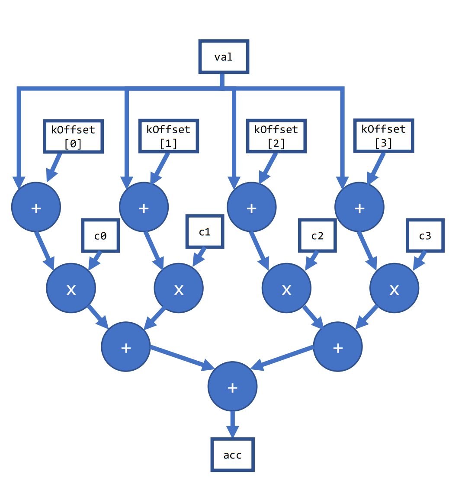
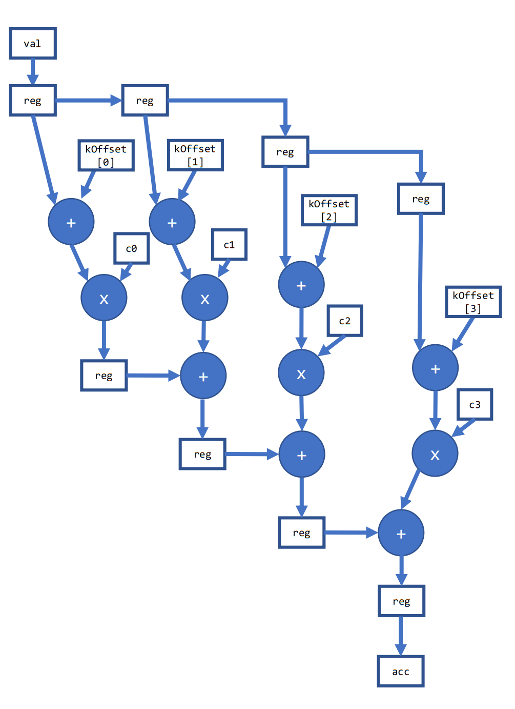

# Explicit Pipeline Register Insertion with `fpga_reg`

This FPGA tutorial demonstrates how a power user can apply the DPC++ extension  `INTEL::fpga_reg` to tweak the hardware generated by the compiler.

***Documentation***: The [oneAPI DPC++ FPGA Optimization Guide](https://software.intel.com/content/www/us/en/develop/documentation/oneapi-fpga-optimization-guide) provides comprehensive instructions for targeting FPGAs through DPC++. The [oneAPI Programming Guide](https://software.intel.com/en-us/oneapi-programming-guide) is a general resource for target-independent DPC++ programming.

| Optimized for                     | Description
---                                 |---
| OS                                | Linux* Ubuntu* 18.04; Windows* 10
| Hardware                          | Intel® Programmable Acceleration Card (PAC) with Intel Arria® 10 GX FPGA; <br> Intel® Programmable Acceleration Card (PAC) with Intel Stratix® 10 SX FPGA
| Software                          | Intel® oneAPI DPC++ Compiler (Beta) <br> Intel® FPGA Add-On for oneAPI Base Toolkit
| What you will learn               | How to use the `INTEL::fpga_reg` extension <br> How `INTEL::fpga_reg` can be used to re-structure the compiler-generated hardware <br> Situations in which applying  `INTEL::fpga_reg` might be beneficial
| Time to complete                  | 20 minutes

_Notice: Limited support in Windows*; compiling for FPGA hardware is not supported in Windows*_

## Purpose

This FPGA tutorial demonstrates an example of using the `INTEL::fpga_reg` extension to:

* Help reduce the fanout of specific signals in the DPC++ design
* Improve the overall f<sub>MAX</sub> of the generated hardware

Note that this is an advanced tutorial for FPGA power users.

### Simple Code Example

The signature of `INTEL::fpga_reg` is as follows:

```cpp
template <typenameT>
T INTEL::fpga_reg(T input)
```

To use this function in your code, you must include the following header:

```cpp
#include <CL/sycl/INTEL/fpga_extensions.hpp>
```

When you use this function on any value in your code, the compiler will insert at least one register stage between the input and output of `INTEL::fpga_reg` function. For example:

```cpp
int func (int input) {
  int output = INTEL::fpga_reg(input)
  return output;
}
```

This forces the compiler to insert a register between the input and output. You can observe this in the optimization report's System Viewer.

### Understanding the Tutorial Design

The basic function performed by the tutorial kernel is a vector dot product with a pre-adder. The loop is unrolled so that the core part of the algorithm is a feed-forward datapath. The coefficient array is implemented as a circular shift register and rotates by one for each iteration of the outer loop.

The optimization applied in this tutorial impacts the system f<sub>MAX</sub> or the maximum frequency that the design can run at. Since the compiler implements all kernels in a common clock domain, f<sub>MAX</sub> is a global system parameter. To see the impact of the `INTEL::fpga_reg` optimization in this tutorial, you will need to compile the design twice.

Part 1 compiles the kernel code without setting the `USE_FPGA_REG` macro, whereas Part 2 compiles the kernel while setting this macro. This chooses between two code segments that are functionally equivalent, but the latter version makes use of `INTEL::fpga_reg`. In the `USE_FPGA_REG` version of the code, the compiler is guaranteed to insert at least one register stage between the input and output of each of the calls to `INTEL::fpga_reg` function.

#### Part 1: Without `USE_FPGA_REG`

The compiler will generate the following hardware for Part 1. The diagram below has been simplified for illustration.



Note the following:

* The compiler automatically infers a tree structure for the series of adders.
* There is a large fanout (of up to 4 in this simplified example) from `val` to each of the adders.

The fanout grows linearly with the unroll factor in this tutorial. In FPGA designs, signals with large fanout can sometimes degrade system f<sub>MAX</sub>. This happens because the FPGA placement algorithm cannot place *all* of the fanout logic elements physically close to the fanout source, leading to longer wires.  In this situation, it can be helpful to add explicit fanout control in your DPC++ code via `INTEL::fpga_reg`. This is an advanced optimization for FPGA power-users.

#### Part 2: with `USE_FPGA_REG`

In this part, we added two sets of `INTEL::fpga_reg` within the unrolled loop. The first is added to pipeline `val` once per iteration. This reduce the fanout of `val` from 4 in the example in Part 1 to just 2. The second `INTEL::fpga_reg` is inserted between accumulation into the `acc` value. This generates the following structure in hardware.



In this version, the adder tree has been transformed into a vine-like structure. This increases latency, but it helps us achieve our goal of reducing the fanout and improving f<sub>MAX</sub>.
Since the outer loop in this tutorial is pipelined and has a high trip count, the increased latency of the inner loop has negligible impact on throughput. The tradeoff pays off, as the f<sub>MAX</sub> improvement yields a higher performing design.

## Key Concepts

* How to use the `INTEL::fpga_reg` extension
* How `INTEL::fpga_reg` can be used to re-structure the compiler-generated hardware
* Situations in which applying  `INTEL::fpga_reg` might be beneficial

## License

This code sample is licensed under MIT license.

## Building the `fpga_reg` Design

### Include Files

The included header `dpc_common.hpp` is located at `%ONEAPI_ROOT%\dev-utilities\latest\include` on your development system.

### Running Samples in DevCloud

If running a sample in the Intel DevCloud, remember that you must specify the compute node (fpga_compile or fpga_runtime) as well as whether to run in batch or interactive mode. For more information see the Intel® oneAPI Base Toolkit Get Started Guide ([https://devcloud.intel.com/oneapi/get-started/base-toolkit/](https://devcloud.intel.com/oneapi/get-started/base-toolkit/)).

When compiling for FPGA hardware, it is recommended to increase the job timeout to 12h.

### On a Linux* System

1. Install the design in `build` directory from the design directory by running `cmake`:

   ```bash
   mkdir build
   cd build
   ```

   If you are compiling for the Intel® PAC with Intel Arria® 10 GX FPGA, run `cmake` using the command:

   ```bash
   cmake ..
   ```

   Alternatively, to compile for the Intel® PAC with Intel Stratix® 10 SX FPGA, run `cmake` using the command:

   ```bash
   cmake .. -DFPGA_BOARD=intel_s10sx_pac:pac_s10
   ```

2. Compile the design using the generated `Makefile`. The following four build targets are provided that match the recommended development flow:

   * Compile and run for emulation (fast compile time, targets emulates an FPGA device) using:

     ```bash
     make fpga_emu
     ```

   * Generate HTML optimization reports using:

     ```bash
     make report
     ```

   * Compile and run on FPGA hardware (longer compile time, targets an FPGA device) using:

     ```bash
     make fpga
     ```

3. (Optional) As the above hardware compile may take several hours to complete, an Intel® PAC with Intel Arria® 10 GX FPGA pre-compiled binary can be downloaded <a href="https://iotdk.intel.com/fpga-precompiled-binaries/latest/fpga_reg.fpga.tar.gz" download>here</a>.

### On a Windows* System

Note: `cmake` is not yet supported on Windows, a build.ninja file is provided instead.

1. Enter source file directory.

    ```bash
    cd src
    ```

2. Compile the design. The following four build targets are provided that match the recommended development flow:

   * Compile and run for emulation (fast compile time, targets emulates an FPGA device) using:

     ```bash
     ninja fpga_emu
     ```

   * Generate HTML optimization reports.

     ```bash
     ninja report
     ```

     If you are targeting Intel® PAC with Intel Stratix® 10 SX FPGA, instead use:
     ```
     ninja report_s10_pac
     ```

   * **Not supported yet:** Compile and run on FPGA hardware.

### In Third-Party Integrated Development Environments (IDEs)

You can compile and run this tutorial in the Eclipse* IDE (in Linux*) and the Visual Studio* IDE (in Windows*).
For instructions, refer to the following link: [Intel® oneAPI DPC++ FPGA Workflows on Third-Party IDEs](https://software.intel.com/en-us/articles/intel-oneapi-dpcpp-fpga-workflow-on-ide)

## Examining the Reports

Locate the pair of `report.html` files in either:

* **Report-only compile**:  `fpga_reg_report.prj` and `fpga_reg_registered_report.prj`
* **FPGA hardware compile**: `fpga_reg.prj` and `fpga_reg_registered.prj`

Open the reports in any of Chrome*, Firefox*, Edge*, or Internet Explorer*. Observe the structure of the design in the optimization report's System Viewer and notice the changes within `Cluster 2` of the `SimpleMath.B1` block. You can notice that in the report for Part 1, the viewer shows a much more shallow graph as compared to the one in Part 2. This is because the operations are performed much closer to one another in Part 1 as compared to Part 2. By transforming the code in Part 2, with more register stages, the compiler was able to achieve an higher f<sub>MAX</sub>.

>**NOTE**: Only the report generated after the FPGA hardware compile will reflect the performance benefit of using the `fpga_reg` extension. The difference is *not* apparent in the reports generated by `make report` because a design's f<sub>MAX</sub> cannot be predicted. The final achieved f<sub>MAX</sub> can be found in `fpga_reg.prj/reports/report.html` and `fpga_reg_registered.prj/reports/report.html` (after `make fpga` completes).

## Running the Sample

1. Run the sample on the FPGA emulator (the kernel executes on the CPU):

   ```bash
   ./fpga_reg.fpga_emu    # Linux
   fpga_reg.fpga_emu.exe  # Windows
   ```

2. Run the sample on the FPGA device

   ```bash
   ./fpga_reg.fpga             # Linux
   ./fpga_reg_registered.fpga  # Linux
   ```

### Example of Output

```txt
Throughput for kernel with input size 1000000 and coefficient array size 64: 2.819272 GFlops
PASSED: Results are correct.
```

### Discussion of Results

You will be able to observe the improvement in the throughput going from Part 1 to Part 2. You will also note that the f<sub>MAX</sub> of Part 2 is significantly larger than of Part 1.
