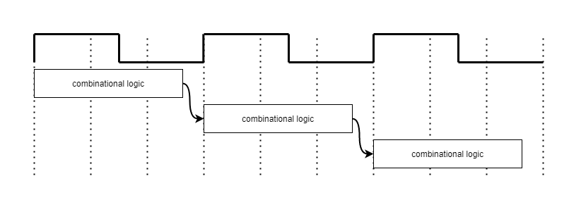

# Loop `initiation_interval` attribute

This FPGA tutorial demonstrates how a user can use the `intel::initiation_interval` attribute to change the initiation interval (II) of a loop in scenarios that this feature improves performance.

***Documentation***:  The [DPC++ FPGA Code Samples Guide](https://software.intel.com/content/www/us/en/develop/articles/explore-dpcpp-through-intel-fpga-code-samples.html) helps you to navigate the samples and build your knowledge of DPC++ for FPGA. <br>
The [oneAPI DPC++ FPGA Optimization Guide](https://software.intel.com/content/www/us/en/develop/documentation/oneapi-fpga-optimization-guide) is the reference manual for targeting FPGAs through DPC++. <br>
The [oneAPI Programming Guide](https://software.intel.com/en-us/oneapi-programming-guide) is a general resource for target-independent DPC++ programming.

| Optimized for                     | Description
---                                 |---
| OS                                | Linux* Ubuntu* 18.04; Windows* 10
| Hardware                          | Intel® Programmable Acceleration Card (PAC) with Intel Arria® 10 GX FPGA; <br> Intel® Programmable Acceleration Card (PAC) D5005 (with Intel Stratix® 10 SX FPGA)
| Software                          | Intel® oneAPI DPC++ Compiler (Beta) <br> Intel® FPGA Add-On for oneAPI Base Toolkit
| What you will learn               | The f<sub>MAX</sub>-II tradeoff <br>Default behaviour of the compiler when scheduling loops <br> How to use `intel::initiation_interval` to attempt to set the II for a loop <br> Scenarios in which `intel::initiation_interval` can be helpful in optimizing kernel performance
| Time to complete                  | 20 minutes

## Purpose

This FPGA tutorial demonstrates how to use the `intel::initiation_interval` attribute to set the II for a loop. The attribute serves two purposes:

* Relax the II of a loop with a loop-carried dependency in order to achieve a higher kernel f<sub>MAX</sub>
* Enforce the II of a loop such that the compiler will error out if it cannot achieve the specified II

The `intel::initiation_interval` attribute is useful when optimizing kernels with loop-carried dependencies in loops with a short trip count, to prevent the compiler from scheduling the loop with a f<sub>MAX</sub>-II combination that results in low system-wide f<sub>MAX</sub>, decreasing throughput.

The reader is assumed to be familiar with the concepts of [loop-carried dependencies](https://software.intel.com/content/www/us/en/develop/documentation/oneapi-fpga-optimization-guide/top/optimize-your-design/throughput-1/single-work-item-kernels/loops/single-work-item-kernel-design-guidelines.html#single-work-item-kernel-design-guidelines_SECTION_3A389B8F1FE3452C84F44F07FA2C813E) and [initiation interval (II)](https://software.intel.com/content/www/us/en/develop/documentation/oneapi-fpga-optimization-guide/top/fpga-optimization-flags-attributes-pragmas-and-extensions/loop-directives/ii-attribute.html). 

* A **loop-carried dependency** refers to a situation where an operation in a loop iteration cannot proceed until an operation from a previous loop iteration has completed.
* The **initiation interval**, or **II**, is the number of clock cycles between the launch of successive loop iterations. 

### The f<sub>MAX</sub>-II tradeoff

Generally, striving for the lowest possible II of 1 is preferred. However, in some cases, it may be suboptimal for the scheduler to do so.

For example, consider a loop with loop-carried dependencies. The compiler must ensure that these dependencies are satisfied. To achieve an II of 1, the compiler must schedule all of the operations necessary to compute loop-carried dependencies within a single clock cycle. As the number of operations in a clock cycle increases, the circuit's clock frequency (f<sub>MAX</sub>) must decrease. The lower clock frequency slows down the entire circuit, not just the single loop. This is the f<sub>MAX</sub>-II tradeoff. Sometimes, the benefits of achieving an II of 1 for a particular loop may not outweigh the negative impact of reducing f<sub>MAX</sub> for the entire system.

In the presence of loop-carried dependencies, it may be impossible for the compiler to schedule a given loop with II = 1 while respecting a target f<sub>MAX</sub>.


In this case, the compiler can either:
* Increase the cycle time (trading off f<sub>MAX</sub>) to allow operations with loop-carried dependencies to be executed in one clock cycle in order to achieve an II of 1

   
* Maintain the cycle time such that the loop body is executed in multiple clock cycles, while increasing the number of clock cycles between subsequent loop iterations (trading off II), until the next loop iteration is able to execute after the last operation of a loop-carried dependency has finished

   

The `intel::initiation_interval` attribute gives the user explicit control over the f<sub>MAX</sub>-II tradeoff.

### Compiler Default Heuristics and Overrides

By default, the compiler attempts to schedule each loop with the optimal minimum product of the II and cycle time (1/f<sub>MAX</sub>), while ensuring that all loop carried dependencies are fulfilled. The resulting loop block might not necessarily achieve the targeted f<sub>MAX</sub> as the f<sub>MAX</sub>-II heuristic depends on low II or high f<sub>MAX</sub>. A combination of f<sub>MAX</sub> and II may have the best heuristic but might not necessarily achieve the target f<sub>MAX</sub>. This might cause performance bottlenecks as f<sub>MAX</sub> is a global constraint and II is a local constraint.

The `intel::initiation_interval` attribute can be used to specify an II for a particular loop. It informs the compiler to ignore the default heuristic and to try and schedule the loop that the attribute is applied to with the specific II the user provides. 

The targeted f<sub>MAX</sub> can be specified using the [-Xsclock](https://software.intel.com/content/www/us/en/develop/documentation/oneapi-fpga-optimization-guide/top/fpga-optimization-flags-attributes-pragmas-and-extensions/optimization-flags/specify-schedule-fmax-target-for-kernels-xsclock-clock-target.html) compiler argument. The argument determines the pipelining effort of the compiler, which uses an internal model of the FPGA fabric to estimate f<sub>MAX</sub>. The true f<sub>MAX</sub> is known only after compiling to hardware. Without the argument, the default target f<sub>MAX</sub> is 240MHz for the Intel® PAC with Intel Arria® 10 GX FPGA and 480MHz for the Intel® PAC D5005 (with Intel Stratix® 10 SX FPGA), but the compiler will not strictly enforce reaching that default target when scheduling loops.

>**Note:** The scheduler prioritizes II over f<sub>MAX</sub> if **both** *-Xsclock* and `intel::initiation_interval` are used. Your kernel may be able to achieve a lower II for the loop with the `intel::initiation_interval` attribute while targeting a specific f<sub>MAX</sub>, but the loop will not be scheduled with the lower II.

### Syntax

To let the compiler attempt to set the II for a loop to a positive constant expression of integer type *n*, declare the attribute above the loop. For example:

```cpp
[[intel::initiation_interval(n)]] // n is required
for (int i = 0; i < N; i++) {
  s *= a;
  s += b;
}
```

### Use cases of `intel::initiation_interval`

1. Allow users to assert an II for a loop. 
 
   This is useful during development when making changes that could potentially compromise the previously achieved II. Upon finding out that a loop can be scheduled with a specific II, one can use the `intel:ii` attribute to set the achieved II as the II the compiler must achieve. If the compiler is unable to schedule the loop with the same II as before after some new changes during development, it will produce an error. This allows changes causing throughput drops to be easily identified in larger designs.

2. Alter the compiler's default f<sub>MAX</sub>-II tradeoff, usually by relaxing II. 

   An in-depth example is given in this code sample.

### Code Sample: Overriding the compiler's f<sub>MAX</sub>-II heuristic

The code sample gives a trivial kernel in which the compiler's decision is suboptimal and the `intel::initiation_interval` attribute can be used to improve performance.

This tutorial contains two distinct pipelineable loops:

* A short-running initialization loop that has a long feedback path as a result loop-carried dependence
* A long-running loop that does the bulk of the processing, with a feedback path

>**Note:** The operations performed in the short and long-running loops are for illustrative purposes only. 

Since the tutorial shows performance impacts in terms of f<sub>MAX</sub>, and all kernels are implemented by the compiler in a common clock domain, the results cannot be shown in two kernels that are compiled once. To see the impact of the `intel::initiation_interval` optimization in this tutorial, the design needs to be compiled twice.

Part 1 compiles the kernel code without setting the `ENABLE_II` macro, whereas Part 2 compiles the kernel while setting this macro. The macro chooses between two code segments that are functionally equivalent, but the `ENABLE_II` version of the code demonstrates the two use cases of `intel::initiation_interval`. 

#### Part 1: Without `ENABLE_II`

According to the default behaviour, the compiler does not know that the initialization loop has a smaller impact on the overall throughput. Thus, the compiler schedules the loop using the minimum II/f<sub>MAX</sub> ratio. Because the initialization loop has a loop-carried dependence, it has a feedback path in the generated hardware. The targeted clock frequency might not be achieved by the scheduler when optimizing for the minimum II/f<sub>MAX</sub>. 

Depending on the feedback path in the long-running loop, the rest of the kernel could have run at a higher f<sub>MAX</sub>, which is the case in this design. The long-running loop is able to achieve an II of 1 while targeting the default f<sub>MAX</sub> but will be bottlenecked by the highest f<sub>MAX</sub> achieved by all blocks, resulting in lowered throughput.

#### Part 2: With `ENABLE_II`

In this part, `intel::initiation_interval` is used for both the short and long running loops to show the two scenarios where using the attribute is appropriate.

The first `intel::initiation_interval` declaration sets an II value of 3 for the Intel® PAC with Intel Arria® 10 GX FPGA, and an II value of 5 for the Intel® PAC D5005 (with Intel Stratix® 10 SX FPGA). Since the initialization loop has a low trip count compared to the long-running loop, a higher II for the initialization loop is a reasonable tradeoff to allow for a higher overall f<sub>MAX</sub> for the entire kernel. 

>**Note:** For Intel® PAC D5005 (with Intel Stratix® 10 SX FPGA), the estimated f<sub>MAX</sub> of the long-running loop is not able to reach the default targeted f<sub>MAX</sub> of 480MHz while maintaining an II of 1. This is due to the nature of the feedback path that exists in the long running loop. Setting the II of the initialization loop to 5 ensures that the initialization loop is not the bottleneck when finding the maximum operating frequency.

The second `intel::initiation_interval` declaration sets an II of 1 for the long-running loop. Since we might not want to compromise the II of 1 achieved for this loop while performing optimizations on other parts of the kernel; by declaring that the loop should have an II of 1, the compiler will produce an error if it cannot schedule this loop with that II, implying that the other optimization will have a negative performance impact on this loop. This makes it easier to find the cause of any throughput drops in larger designs.

## Key Concepts

* The f<sub>MAX</sub>-II tradeoff
* Default behaviour of the compiler when scheduling loops
* How to use `intel::initiation_interval`  to set the II for a loop
* Scenarios in which `intel::initiation_interval` can be helpful in optimizing kernel performance

## License

This code sample is licensed under MIT license.

## Building the `loop_initiation_interval` Tutorial

### Include Files

The included header `dpc_common.hpp` is located at `%ONEAPI_ROOT%\dev-utilities\latest\include` on your development system.

### Running Samples in DevCloud

If running a sample in the Intel DevCloud, remember that you must specify the compute node (fpga_compile, fpga_runtime:arria10, or fpga_runtime:stratix10) as well as whether to run in batch or interactive mode. For more information see the Intel® oneAPI Base Toolkit Get Started Guide ([https://devcloud.intel.com/oneapi/documentation/base-toolkit/](https://devcloud.intel.com/oneapi/documentation/base-toolkit/)).

When compiling for FPGA hardware, it is recommended to increase the job timeout to 12h.

### On a Linux* System

1. Generate the `Makefile` by running `cmake`:

   ```bash
   mkdir build
   cd build
   ```

   To compile for the Intel® PAC with Intel Arria® 10 GX FPGA, run `cmake` using the command:

   ```bash
   cmake ..
   ```

   Alternatively, to compile for the Intel® PAC D5005 (with Intel Stratix® 10 SX FPGA), run `cmake` using the command:

   ```bash
   cmake .. -DFPGA_BOARD=intel_s10sx_pac:pac_s10
   ```

2. Compile the design using the generated `Makefile`. The following build targets are provided, matching the recommended development flow:

   * Compile for emulation (fast compile time, targets emulated FPGA device):

     ```bash
     make fpga_emu
     ```

   * Generate the optimization reports:

     ```bash
     make report
     ```

   * Compile for FPGA hardware (longer compile time, targets an FPGA device) using:

     ```bash
     make fpga
     ```

3. (Optional) As the above hardware compile may take several hours to complete, FPGA precompiled binaries (compatible with Linux* Ubuntu* 18.04) can be downloaded <a href="https://iotdk.intel.com/fpga-precompiled-binaries/latest/loop_ii.fpga.tar.gz" download>here</a>.

### On a Windows* System

1. Generate the `Makefile` by running `cmake`.
   ```
   mkdir build
   cd build
   ```
   To compile for the Intel® PAC with Intel Arria® 10 GX FPGA, run `cmake` using the command:  
   ```
   cmake -G "NMake Makefiles" ..
   ```
   Alternatively, to compile for the Intel® PAC D5005 (with Intel Stratix® 10 SX FPGA), run `cmake` using the command:

   ```
   cmake -G "NMake Makefiles" .. -DFPGA_BOARD=intel_s10sx_pac:pac_s10
   ```

2. Compile the design through the generated `Makefile`. The following build targets are provided, matching the recommended development flow:

   * Compile for emulation (fast compile time, targets emulated FPGA device): 
     ```
     nmake fpga_emu
     ```
   * Generate the optimization reports: 
     ```
     nmake report
     ``` 
   * An FPGA hardware target is not provided on Windows*. 

>**Note:** The Intel® PAC with Intel Arria® 10 GX FPGA and Intel® PAC D5005 (with Intel Stratix® 10 SX FPGA) do not yet support Windows*. Compiling to FPGA hardware on Windows* requires a third-party or custom Board Support Package (BSP) with Windows* support.

### In Third-Party Integrated Development Environments (IDEs)

You can compile and run this tutorial in the Eclipse* IDE (in Linux*) and the Visual Studio* IDE (in Windows*). For instructions, refer to the following link: [Intel® oneAPI DPC++ FPGA Workflows on Third-Party IDEs](https://software.intel.com/en-us/articles/intel-oneapi-dpcpp-fpga-workflow-on-ide)

## Examining the Reports

Locate the pair of `report.html` files in either:

* **Report-only compile**:  `loop_ii_report.prj` and `loop_ii_enable_ii_report.prj`
* **FPGA hardware compile**: `loop_ii.prj` and `loop_ii_enable_ii.prj`

Open the reports in any of Chrome*, Firefox*, Edge*, or Internet Explorer*. Looking at the reports for the design without the `intel::initiation_interval` attribute, navigate to the *Loop Analysis* report (*Throughput Analysis* > *Loop Analysis*). Click on the *SimpleMath* kernel in the *Loop List* panel and using the *Bottlenecks* viewer panel in the bottom left, you will see that a throughput bottleneck exists in the *SimpleMath* kernel. 

Select the bottleneck. The report shows that the estimated f<sub>MAX</sub> is significantly lower than the target f<sub>MAX</sub> and shows the feedback path responsible, which is the feedback path in the initialization loop.

The *Loop Analysis* report shows that the long-running loop achieves the target f<sub>MAX</sub> with an II of 1.

Compare the results to the report for the version of the design using the `intel::initiation_interval` attribute. Here both loops achieve the target f<sub>MAX</sub>.

>**Note:** Only the report generated after the FPGA hardware compile will reflect the true performance benefit of using the `initiation_interval` extension. The difference is **not** apparent in the reports generated by `make report` because a design's f<sub>MAX</sub> cannot be predicted. The final achieved f<sub>MAX</sub> can be found in `loop_ii.prj/reports/report.html` and `loop_ii_enable_ii.prj/reports/report.html` (after `make fpga` completes), in *Clock Frequency Summary* on the main page of the report.

## Running the Sample

1. Run the sample on the FPGA emulator (the kernel executes on the CPU):

   ```bash
   ./loop_ii.fpga_emu    # Linux
   loop_ii.fpga_emu.exe  # Windows
   ```

2. Run the sample on the FPGA device (Linux only)

   ```bash
   ./loop_ii.fpga            # Sample without intel::initiation_interval attribute
   ./loop_ii_enable_ii.fpga  # Sample with intel::initiation_interval attribute
   ```

### Example of Output
Output of sample without the `intel::initiation_interval` attribute:
```txt
Kernel Throughput: 0.0635456MB/s
Exec Time: 60.0309s , InputMB: 3.8147MB
PASSED
```
Output of sample with the `intel::initiation_interval` attribute:
```txt
Kernel_ENABLE_II Throughput: 0.117578MB/s
Exec Time: 32.4439s , InputMB: 3.8147MB
```
### Discussion of Results

Total throughput improved with the use of the `intel::initiation_interval` attribute because the increase in kernel f<sub>MAX</sub> is more significant than the II relaxation of the low trip-count loop.

This performance difference will be apparent only when running on FPGA hardware. The emulator, while useful for verifying functionality, will generally not reflect differences in performance.
