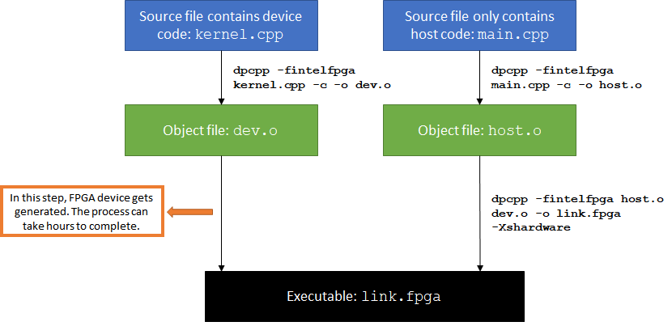

# Separating Host and Device Code Compilation
This FPGA tutorial demonstrates how to separate the compilation of a program's host code and device code to save development time.

***Documentation***: The [oneAPI DPC++ FPGA Optimization Guide](https://software.intel.com/content/www/us/en/develop/documentation/oneapi-fpga-optimization-guide)  provides comprehensive instructions for targeting FPGAs through DPC++. The [oneAPI Programming Guide](https://software.intel.com/en-us/oneapi-programming-guide) is a general resource for target-independent DPC++ programming. 

| Optimized for                     | Description
---                                 |---
| OS                                | Linux* Ubuntu* 18.04; Windows* 10
| Hardware                          | Intel® Programmable Acceleration Card (PAC) with Intel Arria® 10 GX FPGA; <br> Intel® Programmable Acceleration Card (PAC) with Intel Stratix® 10 SX FPGA
| Software                          | Intel® oneAPI DPC++ Compiler (Beta) <br> Intel® FPGA Add-On for oneAPI Base Toolkit 
| What you will learn               | Why to separate host and device code compilation in your FPGA project <br> How to use the `-reuse-exe` and device link methods <br> Which method to choose for your project
| Time to complete                  | 15 minutes

_Notice: Limited support in Windows*; compiling for FPGA hardware is not supported in Windows*_

## Purpose
Intel® oneAPI DPC++ Compiler (Beta) only supports ahead-of-time (AoT) compilation for FPGA, which means that an FPGA device image is generated at compile time. The FPGA device image generation process can take hours to complete. If you make a change that is exclusive to the host code, it is more efficient to recompile your host code only, re-using the existing FPGA device image and circumventing the time-consuming device compilation process.

The Intel® oneAPI DPC++ Compiler (Beta) provides two different mechanisms to separate device code and host code compilation.
* Passing `-reuse-exe=<exe_name>` flag to `dpcpp` instructs the compiler to attempt to reuse the existing FPGA device image.
* The more explicit "device link" method requires you to separate the host and device code into separate files. When a code change only applies to host-only files, an FPGA device image is not regenerated. 

This tutorial explains both mechanisms and the pros and cons of each. The included code sample demonstrates the device link method.

### Using the `-reuse-exe` flag

If the device code and options affecting the device have not changed since the previous compilation, passing the `-reuse-exe=<exe_name>` flag to `dpcpp` instructs the compiler to extract the compiled FPGA binary from the existing executable and package it into the new executable, saving the device compilation time.

**Sample usage:**

```
# Initial compilation
dpcpp <files.cpp> -o out.fpga -Xshardware -fintelfpga 
```
The initial compilation generates an FPGA device image, which takes several hours. Now, make some changes to the host code.
```
# Subsequent recompilation
dpcpp <files.cpp> -o out.fpga -reuse-exe=out.fpga -Xshardware -fintelfpga 
```
If `out.fpga` does not exist, `-reuse-exe` is ignored and the FPGA device image is regenerated. This will always be the case the first time a project is compiled.

If `out.fpga` is found, the compiler verifies that no changes that affect the FPGA device code have been made since the last compilation. If so, the compiler reuses the existing FPGA binary and only the host code is recompiled. The recompilation process takes a few minutes. Note that the device code is *partially* re-compiled (the equivalent of a report flow compile) in order to check that the FPGA binary can safely be reused.

### Using the device link method

The program accompanying this tutorial is separated into two files, `main.cpp` and `kernel.cpp`. Only the `kernel.cpp` file contains device code. 

In the normal compilation process, FPGA device image generation happens at link time. As a result, any change to either `main.cpp` or `kernel.cpp` will trigger the regeneration of an FPGA device image. 

```
# normal compile command
dpcpp -fintelfpga main.cpp kernel.cpp -Xshardware -o link.fpga
```

The following graph depicts this compilation process:




If you want to iterate on the host code and avoid long compile time for your FPGA device, consider using a device link to separate device and host compilation:

```
# device link command
dpcpp -fintelfpga -fsycl-link=image <input files> [options]
```

The compilation is a 3-step process:

1. Compile the device code: 

   ```
   dpcpp -fintelfpga -fsycl-link=image kernel.cpp -o dev_image.a -Xshardware
   ```
   Input files should include all source files that contain device code. This step may take several hours.


2. Compile the host code:
   
   ``` 
   dpcpp -fintelfpga main.cpp -c -o host.o
   ```
   Input files should include all source files that only contain host code. This takes seconds.


3. Create the device link:

   ```
   dpcpp -fintelfpga host.o dev_image.a -o fast_recompile.fpga
   ```
   The input should have N (N >= 0) host object files *(.o)* and one device image file *(.a)*. This takes seconds.

**NOTE:** You only need to perform steps 2 and 3 when modifying host-only files.

The following graph depicts device link compilation process:


### Which method to use?
Of the two methods described, `-reuse-exe` is easier to use. It also allows you to keep your host and device code as single source, which is preferred for small programs. 

For larger and more complex projects, the device link method has the advantage of giving you complete control over the compiler's behavior.
* When using `-reuse-exe`, the compiler must spend time partially recompiling and then analyzing the device code to ensure that it is unchanged. This takes several minutes for larger designs. Compiling separate files does not incur this time.
* When using `-reuse-exe`, you may occasionally encounter a "false positive" where the compiler wrongly believes that it must recompile your device code. In a single source file, the device and host code are coupled, so certain changes to the host code can change the compiler's view of the device code. The compiler will always behave conservatively and trigger a full recompilation if it cannot prove that reusing the previous FPGA binary is safe. Compiling separate files eliminates this possibility.


## Key Concepts
* Why to separate host and device code compilation in your FPGA project 
* How to use the `-reuse-exe` and device link methods
* Which method to choose for your project

## License  
This code sample is licensed under MIT license.


## Building the `fast_recompile` Tutorial

### Include Files
The included header `dpc_common.hpp` is located at `%ONEAPI_ROOT%\dev-utilities\latest\include` on your development system.

### Running Samples in DevCloud
If running a sample in the Intel DevCloud, remember that you must specify the compute node (fpga_compile or fpga_runtime) as well as whether to run in batch or interactive mode. For more information see the Intel® oneAPI Base Toolkit Get Started Guide ([https://devcloud.intel.com/oneapi/get-started/base-toolkit/](https://devcloud.intel.com/oneapi/get-started/base-toolkit/)).

When compiling for FPGA hardware, it is recommended to increase the job timeout to 12h.

### On a Linux* System

1. Generate the `Makefile` by running `cmake`.
     ```
   mkdir build
   cd build
   ```
   To compile for the Intel® PAC with Intel Arria® 10 GX FPGA, run `cmake` using the command:  
    ```
    cmake ..
   ```
   Alternatively, to compile for the Intel® PAC with Intel Stratix® 10 SX FPGA, run `cmake` using the command:

   ```
   cmake .. -DFPGA_BOARD=intel_s10sx_pac:pac_s10
   ```
     **NOTE:** For the FPGA emulator target and the FPGA target, the device link method is used. 
2. Compile the design through the generated `Makefile`. The following build targets are provided:

   * Compile for emulation (fast compile time, targets emulated FPGA device): 
      ```
      make fpga_emu
      ```
   * Compile for FPGA hardware (longer compile time, targets FPGA device): 
     ```
     make fpga
     ``` 
3. (Optional) As the above hardware compile may take several hours to complete, an Intel® PAC with Intel Arria® 10 GX FPGA precompiled binary can be downloaded <a href="https://iotdk.intel.com/fpga-precompiled-binaries/latest/fast_recompile.fpga.tar.gz" download>here</a>.

### On a Windows* System
Note: `cmake` is not yet supported on Windows. A build.ninja file is provided instead. 

1. Enter the source file directory.
   ```
   cd src
   ```

2. Compile the design. The following build targets are provided, matching the recommended development flow:

   * Compile for emulation (fast compile time, targets emulated FPGA device): 
      ```
      ninja fpga_emu
      ```
      **NOTE:** For the FPGA emulator target, the device link method is used. 
   * Generate the optimization report:

     ```
     ninja report
     ```
     If you are targeting Intel® PAC with Intel Stratix® 10 SX FPGA, instead use:
     ```
     ninja report_s10_pac
     ```     
   * Compiling for FPGA hardware is not yet supported on Windows.
 
 ### In Third-Party Integrated Development Environments (IDEs)

You can compile and run this tutorial in the Eclipse* IDE (in Linux*) and the Visual Studio* IDE (in Windows*). For instructions, refer to the following link: [Intel® oneAPI DPC++ FPGA Workflows on Third-Party IDEs](https://software.intel.com/en-us/articles/intel-oneapi-dpcpp-fpga-workflow-on-ide)


## Running the Sample

 1. Run the sample on the FPGA emulator (the kernel executes on the CPU):
     ```
     ./fast_recompile.fpga_emu     (Linux)
     fast_recompile.fpga_emu.exe   (Windows)
     ```
2. Run the sample on the FPGA device:
     ```
     ./fast_recompile.fpga         (Linux)
     ```

### Example of Output
```
PASSED: results are correct
```
### Discussion of Results
Try modifying `main.cpp` to produce a different output message. Then, perform a host-only recompile via the device link method to see how quickly the design is recompiled.
