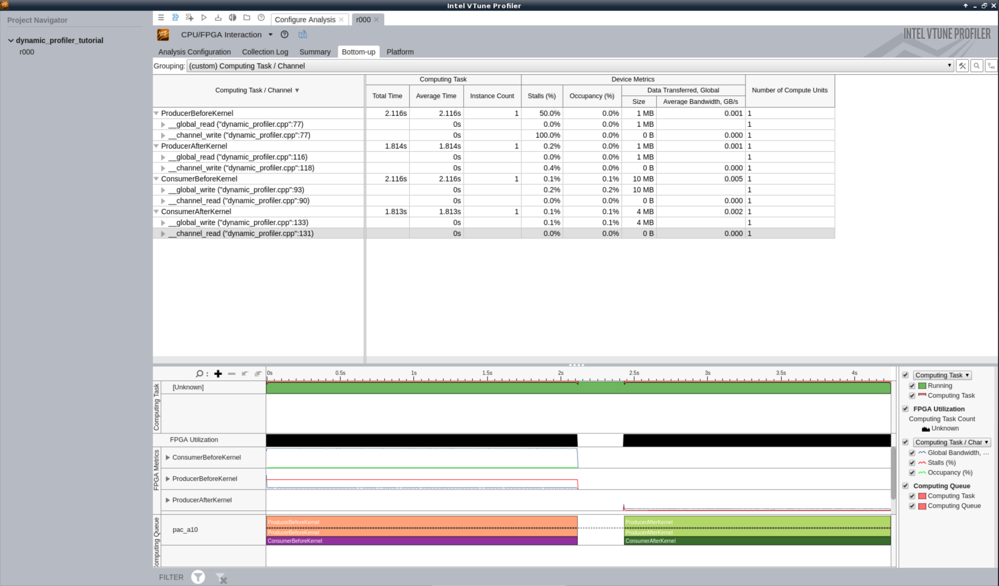
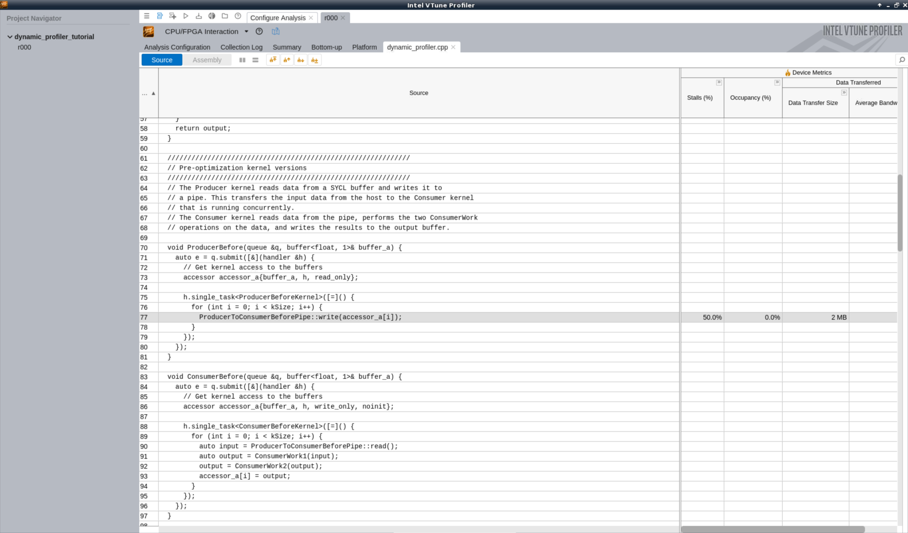
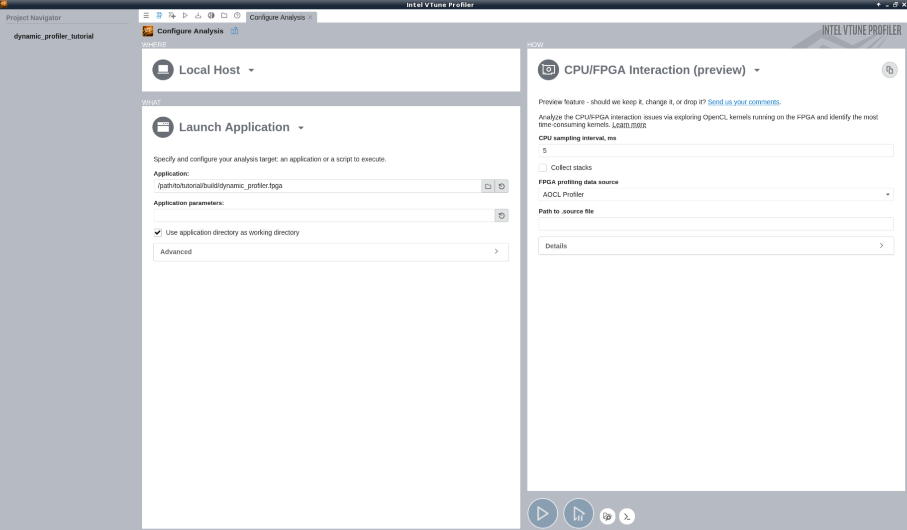

# Using the Intel® FPGA Dynamic Profiler for DPC++

This FPGA tutorial demonstrates how to use the Intel® FPGA Dynamic Profiler for DPC++ to dynamically collect performance data from an FPGA design and reveal areas for optimization and improvement.

***Documentation***: The [DPC++ FPGA Code Samples Guide](https://software.intel.com/content/www/us/en/develop/articles/explore-dpcpp-through-intel-fpga-code-samples.html) helps you to navigate the samples and build your knowledge of DPC++ for FPGA. <br>
The [Intel® oneAPI DPC++ FPGA Optimization Guide](https://software.intel.com/content/www/us/en/develop/documentation/oneapi-fpga-optimization-guide) provides complete documentation for the use of this tool as well as comprehensive instructions for targeting FPGAs through DPC++. <br>
The [oneAPI Programming Guide](https://software.intel.com/en-us/oneapi-programming-guide) is a general resource for target-independent DPC++ programming.

| Optimized for                     | Description
---                                 |---
| OS                                | Linux* Ubuntu* 18.04
| Hardware                          | Intel® Programmable Acceleration Card (PAC) with Intel Arria® 10 GX FPGA <br> Intel® FPGA Programmable Acceleration Card (PAC) D5005 (with Intel Stratix® 10 SX)
| Software                          | Intel® oneAPI DPC++ Compiler <br> Intel® FPGA Add-On for oneAPI Base Toolkit 
| What you will learn               | About the Intel® FPGA Dynamic Profiler for DPC++ <br> How to set up and use this tool <br> A case study of using this tool to identify performance bottlenecks in pipes.
| Time to complete                  | 15 minutes

_Notice: This code sample is not yet supported in Windows*_

## Purpose

This FPGA tutorial demonstrates how to use the Intel® FPGA Dynamic Profiler for DPC++ to collect performance data from a design running on FPGA hardware and how to use the Intel® VTune™ Profiler to analyze the collected data. This tutorial focuses on optimizing the usage of loops and pipes within an FPGA design using stall and occupancy kernel performance data.

###  Profiling Tools

Intel® oneAPI provides two runtime profiling tools to help you analyze your DPC++ design for FPGA:

1. The **Intel® FPGA Dynamic Profiler for DPC++** is a profiling tool used to collect fine-grained device side data during DPC++ kernel execution. When used within the Intel® VTune™ Profiler, some host side performance data is also collected. However, note that the VTune Profiler is not designed to collect detailed system level host-side data. 

2. The **Intercept Layer for OpenCL\*** is a profiling tool used to obtain detailed system-level information. 

This tutorial introduces the Intel® FPGA Dynamic Profiler for DPC++. To learn more about the Intercept Layer, refer to the FPGA tutorial "[Using the OpenCL Intercept Layer to Profile Designs running on the FPGA](https://github.com/oneapi-src/oneAPI-samples/blob/master/DirectProgramming/DPC%2B%2BFPGA/Tutorials/Tools/system_profiling)".

#### The Intel® FPGA Dynamic Profiler for DPC++

Work-item execution stalls can occur at various stages of a kernel pipeline. Applications that use many pipes or memory accesses might frequently stall to enable the completion of memory transfers. The Dynamic Profiler collects various performance metrics such as stall, occupancy, idle, and bandwidth data at these points in the pipeline to make it easier to identify the memory or pipe operations, creating stalls. 

Consider the following DPC++ program:

```c++
// Vector Add Kernel
h.single_task<VectorAdd>([=]() {
  for (int i = 0; i < kSize; ++i) {
    r[i] = a[i] + b[i];
  }
});
```
During the above program's compilation, the Dynamic Profiler adds performance counters to the three memory operations present. Then during the execution of the program, these counters measure:
- how often the operation prevents the execution pipeline from continuing (stall)
- the number of valid reads/writes occurring (occupancy)
- how often the memory access point is unused (idle)
- how much data gets written/read from memory at this access (bandwidth).

Once the run completes, the data is stored in a `profile.json` file and can be displayed using the Intel® VTune™ Profiler.

### Using the FPGA Dynamic Profiler

#### Enabling Dynamic Profiling During Compilation

The Intel® FPGA Dynamic Profiler for DPC++ comes as part of the Intel® oneAPI Base Toolkit.

To instrument the kernel pipeline with performance counters, add the `-Xsprofile` flag to your FPGA hardware compile command. 

For this tutorial, the `-Xsprofile` flag has already been added to the cmake command for your convenience.

#### Obtaining Dynamic Profiling Data During Runtime

There are two ways of obtaining data from a DPC++ program containing performance counters:

1. Run the design in the Intel® VTune™ Profiler via the CPU/FPGA Interaction viewpoint.
  
    Instructions on installing, configure and opening the Intel® VTune™ Profiler can be found in the [Intel® Vtune™ Profiler User Guide](https://software.intel.com/content/www/us/en/develop/documentation/vtune-help/top/installation.html). Further instructions on setting up the Dynamic Profiler via the CPU/FPGA Interaction View can be found in the [CPU/FPGA Interaction Analysis](https://software.intel.com/content/www/us/en/develop/documentation/vtune-help/top/analyze-performance/accelerators-group/cpu-fpga-interaction-analysis-preview.html) section of the Intel® VTune™ Profiler User Guide. To extract device performance counter data, please ensure the source for the FPGA profiling data is set to "AOCL Profiler".

2. Run the design from the command line using the Profiler Runtime Wrapper.
  The Profiler Runtime Wrapper comes as part of the DPC++ Compiler and can be run as follows:
   ```
   aocl profile <executable>
   ```
   More details and options can be found in the "[Invoke the Profiler Runtime Wrapper to Obtain Profiling Data](https://software.intel.com/content/www/us/en/develop/documentation/oneapi-fpga-optimization-guide/top/analyze-your-design/analyze-the-fpga-image/intel-fpga-dynamic-profiler-for-dpc/obtain-profiling-data-during-runtime/invoke-the-profiler-runtime-wrapper-to-obtain-profiling-data.html)" section of the oneAPI FPGA Optimization Guide. 
   
    Upon execution completion, a `profile.json` file will have been generated. This file contains all of the data collected by the Dynamic Profiler. It can either be viewed manually or imported into the Intel® VTune™ Profiler, as explained in the [Import FPGA Data collected with Profiler Runtime Wrapper](https://software.intel.com/content/www/us/en/develop/documentation/vtune-help/top/analyze-performance/accelerators-group/cpu-fpga-interaction-analysis-preview.html#cpu-fpga-interaction-analysis-preview_GUID-31737EA6-79AB-41BB-8361-0DA583109015) section of the [CPU FPGA Interaction Analysis](https://software.intel.com/content/www/us/en/develop/documentation/vtune-help/top/analyze-performance/accelerators-group/cpu-fpga-interaction-analysis-preview.html) document. 

To run this tutorial example, refer to the "[Running the Sample](#running-the-sample)" section. 

#### Viewing the Performance Data

After running the executable and opening the `profile.json` file in the Intel® VTune™ Profiler (done automatically when run in the VTune Profiler), the VTune Profiler will display the performance results collected from the DPC++ kernel pipelines.

The CPU/FPGA Interaction viewpoint is comprised of four windows:
- The **Summary window** displays statistics on the overall application execution. It can be used to identify CPU time and processor utilization, and the execution time for DPC++ kernels. 
- The **Bottom-up window** displays details about the kernels in a bottom-up tree. This tree contains computing task information such as total time and instance count and device metrics such as overall stall, occupancy, and bandwidth. This data is also displayed in a timeline. 
- The **Platform window** displays over-time performance data for the kernels, memory transfers, CPU context switches, FPU utilization, and CPU threads with FPGA kernels.
- The **Source window** displays device-side data at the corresponding source line. Unlike the other three windows, which are accessible via tabs, the Source window is opened on a per-kernel basis by double-clicking the kernel name in the Bottom-up view.

### Understanding the Performance Metrics 

For this tutorial, the focus will be on a few specific types of device metrics obtained by the Dynamic Profiler. For explanation and more information on other device metrics obtained by the Dynamic Profiler and the Intel® VTune™ Profiler please review the [Intel® oneAPI DPC++ FPGA Optimization Guide](https://software.intel.com/content/www/us/en/develop/documentation/oneapi-fpga-optimization-guide) and the [Intel® VTune™ Profiler User Guide](https://software.intel.com/content/www/us/en/develop/documentation/vtune-help/top.html). 

For additional design scenario examples demonstrating how to use other performance data for optimization, refer to the [Profiler Analyses of Example DPC++ Design Scenarios](https://software.intel.com/content/www/us/en/develop/documentation/oneapi-fpga-optimization-guide/top/analyze-your-design/analyze-the-fpga-image/intel-fpga-dynamic-profiler-for-dpc/profiler-analyses-of-example-dpc-design-scenarios.html) section of the [Intel® oneAPI DPC++ FPGA Optimization Guide](https://software.intel.com/content/www/us/en/develop/documentation/oneapi-fpga-optimization-guide). 

#### FPGA Metrics for this Tutorial

The following device metrics are important in this tutorial:

| Device Metric                     | Description
---                                 |---
| Pipe Stall %                      | The percentage of time the pipe is causing the pipeline to stall. It measures the ability of the pipe to fulfill an access request.
| Pipe Occupancy %                  | The percentage of time when a valid work-item executes a pipe access.

When analyzing performance data to optimize a design, the goal is to get as close to an ideal kernel pipeline as possible. Pipes in an ideal pipeline should have no stalls, occupancy of 100%, and an average pipe depth close to the maximum possible depth. If memory or pipe access is far from the ideal, it may be a candidate for an investigation into what went wrong. For example, if the stall percentage of a pipe write is high, it may indicate that the kernel controlling the pipe's read side is slower than the write side kernel, causing the pipe to fill up, leading to a performance bottleneck.

#### Analyzing Stall and Occupancy Metrics

In this tutorial, there are two design scenarios defined in dynamic_profiler.cpp. One showing a naive pre-optimized design, and a second showing the same design optimized based on data collected through the Intel® FPGA Dynamic Profiler for DPC++.

##### Pre-optimization Version #####

The first scenario contains two kernels: 
- a producer DPC++ kernel (ProducerBefore) that reads data from a buffer and writes it to a pipe (ProducerToConsumerBeforePipe), and 
- a consumer DPC++ kernel (ConsumerBefore) that reads data from the pipe (ProducerToConsumerBeforePipe), performs two computation operations on the pipe data and then outputs the result to a buffer.

After compiling and running dynamic_profiler.cpp with the Dynamic Profiler (see [Running the Sample](#running-the-sample) for more information), open the Bottom-Up window of the CPU/FPGA Interaction viewpoint in the Intel® VTune™ Profiler to view the overall kernel performance data. You should see that ProducerBefore's pipe write (on line 68) has a stall percentage of nearly 100%. This shows that the ProducerBefore kernel is writing so much data to the pipe that it is filling up and stalling. From this, it can be concluded that the consumer kernel is reading data more slowly than the producer is writing it, causing the bottleneck. This is likely because the consumer kernel is performing several compute heavy operations on the data from the pipe, causing a large time delay before the next datapoint can be read. Recalling the ideal kernel described earlier, this would indicate that this design is not optimized and can possibly be improved.

##### Post-optimization Version #####

The second scenario is an example of what the design might look like after being optimized to reduce the high stall values. Like before, the design contains two DPC++ kernels:
- a producer DPC++ kernel (ProducerAfter) that reads data from a buffer, performs the first computation on the data and writes this value to a pipe (ProducerToConsumerAfterPipe), and
- a consumer DPC++ kernel (ConsumerAfter) that reads from the pipe (ProducerToConsumerAfterPipe), does the second set of computations and fills up the output buffer. 

When looking at the performance data for the two "after optimization" kernels in the Bottom-Up view, you should see that ProducerAfter's pipe write (on line 105) and the ConsumerAfter's pipe read (line 120) both have stall percentages near 0%. This indicates the pipe is being used more effectively - now the read and write side of the pipe are being used at similar rates, so the pipe operations are not creating stalls in the pipeline. This also speeds up the overall design execution - the two "after" kernels take less time to execute than the two before kernels.





## Key Concepts

- A summary of profiling tools available for performance optimization
- About the Intel® FPGA Dynamic Profiler for DPC++
- How to set up and use this tool within the Intel® VTune™ Profiler
- How to use performance data to identify performance bottlenecks in a design's kernel pipeline

## License

Code samples are licensed under the MIT license. See
[License.txt](https://github.com/oneapi-src/oneAPI-samples/blob/master/License.txt) for details.

Third party program Licenses can be found here: [third-party-programs.txt](https://github.com/oneapi-src/oneAPI-samples/blob/master/third-party-programs.txt)

## Building the Tutorial

### Include Files
The included header `dpc_common.hpp` is located at `%ONEAPI_ROOT%\dev-utilities\latest\include` on your development system.

### Running Samples in DevCloud
If running a sample in the Intel DevCloud, remember that you must specify the compute node (fpga_compile, fpga_runtime:arria10, or fpga_runtime:stratix10) and whether to run in batch or interactive mode. For more information, see the [Intel® oneAPI Base Toolkit Get Started Guide](https://devcloud.intel.com/oneapi/documentation/base-toolkit/).

When compiling for FPGA hardware, it is recommended to increase the job timeout to 12h.

### On a Linux* System

1. Generate the `Makefile` by running `cmake`.
     ```
   mkdir build
   cd build
   ```
   To compile for the Intel® PAC with Intel Arria® 10 GX FPGA, run `cmake` using the command:  
    ```
    cmake ..
   ```
   Alternatively, to compile for the Intel® FPGA PAC D5005 (with Intel Stratix® 10 SX), run `cmake` using the command:
   ```
   cmake .. -DFPGA_BOARD=intel_s10sx_pac:pac_s10
   ```

2. Compile the design through the generated `Makefile`. The following build target is provided to compile for FPGA hardware:

     ```
     make fpga
     ``` 
3. (Optional) As the above hardware compile may take several hours to complete, FPGA precompiled binaries (compatible with Linux* Ubuntu* 18.04) can be downloaded [here](https://iotdk.intel.com/fpga-precompiled-binaries/latest/dynamic_profiler.fpga.tar.gz).
Alternatively, if you wish to view the dynamic profiler data in the VTune Profiler, you can download a sample `dynamic_profiler_tutorial.json` file [here](https://iotdk.intel.com/fpga-precompiled-binaries/latest/dynamic_profiler_tutorial.json).

### In Third-Party Integrated Development Environments (IDEs)

You can compile this tutorial in the Eclipse* IDE (in Linux*). For instructions, refer to the following link: [Intel® oneAPI DPC++ FPGA Workflows on Third-Party IDEs](https://software.intel.com/en-us/articles/intel-oneapi-dpcpp-fpga-workflow-on-ide)

## Running the Sample

To collect dynamic profiling data, choose one of the following methods:

**Within the Intel® VTune™ Profiler (Recommended)**

1. Open the Intel® VTune™ Profiler on a machine with installed and configured FPGA hardware.

2. Create a new VTune Profiler project.

3. In the Configure Analysis tab, configure a Dynamic Profiler run by:
    1. setting "How" pane to "CPU/FPGA Interaction"
    2. in the "How" pane, changing the "FPGA profiling data source" to "AOCL Profiler"
    3. in the "What" pane, set the application to your compiled FPGA hardware executable (dynamic_profiler.fpga)

4. Run the Dynamic Profiler by clicking the run button in the lower right corner (below the "How" pane). The VTune Profiler will open up the profiling results once the execution finishes.



**At the Command Line**
1. Run the design using the following build target in the makefile generated in "[On a Linux* System](#on-a-linux-system)":
     ```
     make run
     ``` 
    This target runs the executable with the Profiler Runtime Wrapper, creating a `profile.json` data file in the current directory.

2. Open the Intel® VTune™ Profiler.

3. Follow the instructions in [Import FPGA Data collected with Profiler Runtime Wrapper](https://software.intel.com/content/www/us/en/develop/documentation/vtune-help/top/analyze-performance/accelerators-group/cpu-fpga-interaction-analysis-preview.html#cpu-fpga-interaction-analysis-preview_GUID-31737EA6-79AB-41BB-8361-0DA583109015) to import the `profile.json` file. The VTune Profiler will open up the profiling results once the import completes.

### Example of Output

The expected command line output after running the design is
```
Setting profiler start cycle from environment variable: 1
*** Beginning execution before optimization.
Verification PASSED for run before optimization
*** Beginning execution after optimization.
Verification PASSED for run after optimization
Verification PASSED
Starting post-processing of the profiler data...
Post-processing complete.
```

*Note: You can ignore warnings about pipe data resulting in a division by zero. These are the result of pipes not yet receiving data resulting in metrics being zero.

An example output, `dynamic_profiler_tutorial.json`, can be downloaded from [here](https://iotdk.intel.com/fpga-precompiled-binaries/latest/dynamic_profiler_tutorial.json). Without needing to run the design, you can import this data file in the VTune Profiler, as described in the [Import FPGA Data collected with Profiler Runtime Wrapper](https://software.intel.com/content/www/us/en/develop/documentation/vtune-help/top/analyze-performance/accelerators-group/cpu-fpga-interaction-analysis-preview.html#cpu-fpga-interaction-analysis-preview_GUID-31737EA6-79AB-41BB-8361-0DA583109015) documentation, to observe the kind of data the Dynamic Profiler can collect.

## Examining the Reports
In the tab containing the data from your run, ensure the view is set to "CPU/FPGA Interaction". There should be three windows for viewing:

1. Summary
2. Bottom-up
3. Platform

This tutorial focuses on the Bottom-Up window. To navigate there, click on the Bottom-Up window and set the grouping to "Computing Task / Channel / Compute Unit". Initially, all profiling data in the Bottom-Up and Source windows will be summed over all DPC++ kernel runs. To view data from a particular point in a kernel's run, click and drag to select a portion of data in the execution timeline in the lower half of the Bottom-Up window and choose "Filter In by Selection". Then all data in the table or Source window will only be from the current selected timeslice.
