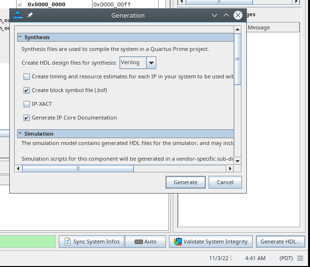
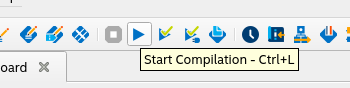

# Platform Designer

This example design shows how to use an FPGA IP produced with Intel® oneAPI FPGA design with the rest of the Intel FPGA software suite..

| Optimized for                     | Description
|:---                               |:---
| OS                                | Linux* Ubuntu* 18.04/20.04 <br> RHEL*/CentOS* 8 <br> SUSE* 15 <br> Windows* 10
| Hardware                          | Intel® Arria 10 SoC Development Kit
| Software                          | Intel® oneAPI DPC++ Compiler <br> Intel® Quartus Prime Pro Edition <br> Intel® Platform Designer Prime Pro Edition <br> Siemens® Questa® Intel® FPGA Starter Edition
| What you will learn               | How to add a oneAPI kernel to an Intel Quartus Prime project
| Time to complete                  | 1 hour

## Purpose

This example design demonstrates how to add a simple oneAPI kernel to an Intel® Platform Designer system, and how run it on a hardware board. It uses a JTAG to Avalon MM Agent IP to expose a oneAPI IP Authoring kernel to the JTAG control interface. This lets the user control and observe the behavior of the kernel using the System Console application.

This example is intended for users interested in creating standalone modules that can be included in Intel® Quartus Prime projects. It serves as a minimal example, and while it targets a very specific board, a user familiar with the Intel Quartus Prime suite should be able to easily port this design to other hardware.

### Board-specific Considerations

This design is intended to work with the [Arria 10 SoC Development Kit](https://rocketboards.org/foswiki/Documentation/Arria10SoCGSRD). The board specific configurations are:
1. Choose `10AS066N3F40E2SG` device to match the devkit
2. Choose pin `AP20 - CLKUSR` to drive the `i_clk` signal
3. Use `jtag.sdc` from the Arria 10 SoC Golden Hardware Reference Design (GHRD) [source code](https://github.com/altera-opensource/ghrd-socfpga).

## Building the `platform_designer` Tutorial

> **Note**: If you have not already done so, set up your CLI
> environment by sourcing  the `setvars` script located in
> the root of your oneAPI installation.
>
> Linux*:
> - For system wide installations: `/opt/intel/oneapi/setvars.sh`
> - For private installations: `~/intel/oneapi/setvars.sh`
>
> Windows*:
> - `C:\Program Files(x86)\Intel\oneAPI\setvars.bat`
> - For PowerShell*, use the following command: `cmd.exe "/K" '"C:\Program Files (x86)\Intel\oneAPI\setvars.bat" && powershell'`
>
>For more information on environment variables, see **Use the setvars Script** for [Linux or macOS](https://www.intel.com/content/www/us/en/develop/documentation/oneapi-programming-guide/top/oneapi-development-environment-setup/use-the-setvars-script-with-linux-or-macos.html), or [Windows](https://www.intel.com/content/www/us/en/develop/documentation/oneapi-programming-guide/top/oneapi-development-environment-setup/use-the-setvars-script-with-windows.html).

Follow these steps to compile and test the design:
1. Compile oneAPI code to RTL using a Windows or Linux machine. 

   Linux:

   ```bash
   mkdir build
   cd build
   cmake ..
   make fpga_ip_export
   ```

   Windows:

   ```bash
   mkdir build
   cd build
   cmake -G "NMake Makefiles" ..
   nmake fpga_ip_export
   ```

   For more details, see the Readme in the `add-oneapi` directory.

2. Copy the oneAPI-generated IP to the Quartus project. Since this design uses host pipes and the `-fsycl-device-code-split=per_kernel` flag, you will need to hunt for the `.prj_X` directory that contains the IP you want to use in your design. 

   You can identify the correct `.prj_X` folder by looking for the one that contains a `*_di_inst.v` whose interfaces match your kernel. For example, in this project, `add_xample.fpga_ip.prj_1` and `add_xample.fpga_ip.prj_5` are the correct `.prj_x` directories, because `add_example_fpga_ip_1_di_inst.v` and `add_example_fpga_ip_5_di_inst.v` both contain only a CSR Agent interface in addition to the clock/reset signals:
   
   ```
   add_example_fpga_ip_1_di add_example_fpga_ip_1_di_inst (
     // Interface: clock (clock end)
     .clock                          ( ), // 1-bit clk input
     // Interface: clock2x (clock end)
     .clock2x                        ( ), // 1-bit clk input
     // Interface: resetn (conduit end)
     .resetn                         ( ), // 1-bit data input
     // Interface: device_exception_bus (conduit end)
     .device_exception_bus           ( ), // 64-bit data output
     // Interface: kernel_irqs (interrupt end)
     .kernel_irqs                    ( ), // 1-bit irq output
     // Interface: csr_ring_root_avs (avalon end)
     .csr_ring_root_avs_read         ( ), // 1-bit read input
     .csr_ring_root_avs_readdata     ( ), // 64-bit readdata output
     .csr_ring_root_avs_readdatavalid( ), // 1-bit readdatavalid output
     .csr_ring_root_avs_write        ( ), // 1-bit write input
     .csr_ring_root_avs_writedata    ( ), // 64-bit writedata input
     .csr_ring_root_avs_address      ( ), // 5-bit address input
     .csr_ring_root_avs_byteenable   ( ), // 8-bit byteenable input
     .csr_ring_root_avs_waitrequest  ( )  // 1-bit waitrequest output
   );
   ```

   Linux:

   ```
   cp -r add-oneapi/build/add.fpga_ip_export.prj_1/ add-quartus/
   cp -r add-oneapi/build/add.fpga_ip_export.prj_5/ add-quartus/
   ```

   Windows:

   ```
   xcopy add-oneapi\build\add.fpga_ip_export.prj_1\ add-quartus\add.fpga_ip_export.prj_1 /e /s /i
   xcopy add-oneapi\build\add.fpga_ip_export.prj_5\ add-quartus\add.fpga_ip_export.prj_5 /e /s /i
   ```

3. Correct the generated `_hw.tcl` file by running the `*_di_hw_tcl_adjustment_script.py` script in the generated .prj directory.

   Linux/Windows:

   ```
   $> cd add.fpga_ip_export.prj_1
   $> python add_fpga_ip_export_1_di_hw_tcl_adjustment_script.py 
   Success! Adjusted add_fpga_ip_export_1_di_hw.tcl file!
   The adjustment log is in: adjustments_di_hw_tcl.log
   The original file is in: add_fpga_ip_export_1_di_hw.tcl_original
   $> cd ..
   $> cd add.fpga_ip_export.prj_5
   $> python add_fpga_ip_export_5_di_hw_tcl_adjustment_script.py 
   Success! Adjusted add_fpga_ip_export_5_di_hw.tcl file!
   The adjustment log is in: adjustments_di_hw_tcl.log
   The original file is in: add_fpga_ip_export_5_di_hw.tcl_original
   ```

4. **From a shell with oneAPI environment**, launch the Quartus GUI with the included Quartus project file. It's easiest to use the same shell you used to compile the `add_example` oneAPI design.
   > **NOTE**: You may have to add a path to Quartus to your system's `PATH` environment variable. Directions for this are available in the Quartus documentation [Section 4.5: Setting Quartus Prime Environment Variables](https://www.intel.com/content/www/us/en/docs/programmable/683472/current/setting-environment-variables.html).

   Linux:
   
   ```
   source /opt/intel/oneapi/setvars.sh
   ...
   cd add-quartus
   quartus AddCSRDemo.qpf
   ```

   Windows:
   
   ```
   C:\Program Files(x86)\Intel\oneAPI\setvars.bat
   ...
   cd add-quartus
   quartus.exe AddCSRDemo.qpf
   ```

> **NOTE**: You can skip steps 5-9 by running the following commands:
> ```
> qsys-script --script=add_kernels.tcl --quartus-project=AddCSRDemo.qpf
> qsys-generate add_kernels.qsys --synthesis --quartus-project=AddCSRDemo.qpf --rev=add
> quartus_sh --flow compile AddCSRDemo.qpf -c add
> ```

5. Open platform designer from the Quartus GUI:

   

6. Add the following IPs to your system:
   * Basic Functions > Bridges and Adaptors > Clock > Clock Bridge Intel FPGA IP
   * Basic Functions > Bridges and Adaptors > Reset > Reset Bridge Intel FPGA IP
   * Basic Functions > Bridges and Adaptors > Memory Mapped > JTAG to Avalon Master Bridge Intel FPGA IP

7. Add the oneAPI IPs to your system and connect them as shown:

   

   

   Don't forget to export the `IRQ` and `Exception Data Bus` signals, and update the base address to prevent overlap errors.

8. Save the system by clicking `File > Save`, then click `Generate HDL...` and in the window that appears, click `Generate`.

   

9. When generation is complete, close platform designer, then click the 'Start Compilation' button to compile the design.

   

### Additional Documentation
- [Explore SYCL* Through Intel® FPGA Code Samples](https://software.intel.com/content/www/us/en/develop/articles/explore-dpcpp-through-intel-fpga-code-samples.html) helps you to navigate the samples and build your knowledge of FPGAs and SYCL.
- [FPGA Optimization Guide for Intel® oneAPI Toolkits](https://software.intel.com/content/www/us/en/develop/documentation/oneapi-fpga-optimization-guide) helps you understand how to target FPGAs using SYCL and Intel® oneAPI Toolkits.
- [Intel® oneAPI Programming Guide](https://software.intel.com/en-us/oneapi-programming-guide) helps you understand target-independent, SYCL-compliant programming using Intel® oneAPI Toolkits.
- [Intel® Quartus® Prime Pro Edition User Guide: Getting Started](https://www.intel.com/content/www/us/en/docs/programmable/683463/current/faq.html) introduces you to the Intel® Quartus® Prime Pro software.
- [Intel® FPGA Software Installation and Licensing](https://www.intel.com/content/www/us/en/docs/programmable/683472/current/faq.html) describes how to license Intel® Quartus® Prime Pro software.
- [Intel® Quartus® Prime Pro Edition User Guide: Platform Designer](https://www.intel.com/content/www/us/en/docs/programmable/683609/current/faq.html) describes the Intel® Platform Designer software.
- [Intel® Quartus® Prime Pro Edition User Guide: Programmer](https://www.intel.com/content/www/us/en/docs/programmable/683039/current/programmer-user-guide.html) describes the Intel® Quartus® Prime Pro Programmer software.

## Running the Sample

Use the `test.bat` script in the `add-quartus/system_console` directory to flash the design to your development board, and launch the system console. The included `.tcl` scripts demonstrate how to use the System Console to interact with your IP through the JTAG Avalon Master IP on the FPGA.

If you need to move the design to a different computer, make sure you copy the `system_console` and `output_files` directories from the `add-quartus` directory.

See output:

```bash
% source jtag_avmm.tcl
% source load_vals_functor.tcl
Store with functor...
% source read_outputs_functor.tcl
functor members input:
  Data: 0x00000015 0x00000000
  Valid: 0x00000000 0x00000000
  status: 0x00040002
  finish0 0x00000001
  finish1 0x00000000
% source read_outputs_host-pipes.tcl
host-pipes input:
  Data: 0x00000000 0x00000000
  Valid: 0x00000000 0x00000000
  status: 0x00040000
  finish0 0x00000000
  finish1 0x00000000
% source load_vals_host-pipes.tcl
Store to host pipes...
% source read_outputs_functor.tcl
functor members input:
  Data: 0x00000015 0x00000000
  Valid: 0x00000000 0x00000000
  status: 0x00040000
  finish0 0x00000000
  finish1 0x00000000
% source load_vals_functor.tcl
Store with functor...
% source read_outputs_host-pipes.tcl
host-pipes input:
  Data: 0x0000006f 0x00000000
  Valid: 0x00000000 0x00000000
  status: 0x00040002
  finish0 0x00000001
  finish1 0x00000000
% source read_outputs_functor.tcl
functor members input:
  Data: 0x00000015 0x00000000
  Valid: 0x00000000 0x00000000
  status: 0x00040002
  finish0 0x00000001
  finish1 0x00000000
% source read_inputs.tcl
host-pipes input
  a = 0x00000000 0x00000000
  b = 0x00000000 0x00000000
functor members input
  a = 0x00000000
  b = 0x00000000
%
```

## License
Code samples are licensed under the MIT license. See
[License.txt](https://github.com/oneapi-src/oneAPI-samples/blob/master/License.txt) for details.

Third party program Licenses can be found here: [third-party-programs.txt](https://github.com/oneapi-src/oneAPI-samples/blob/master/third-party-programs.txt).