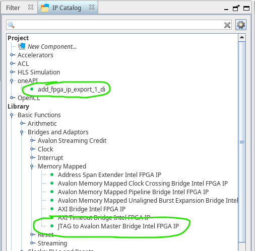
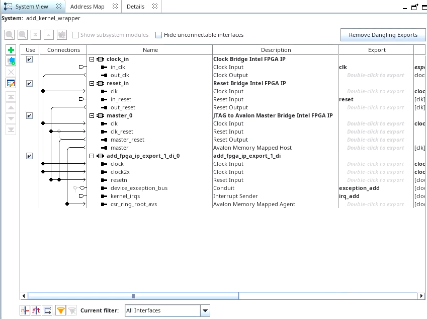

# Platform Designer Pro

This example design shows how to use an FPGA IP produced with the Intel® oneAPI DPC++/C++ Compiler with the rest of the Intel® FPGA software suite.

| Optimized for                     | Description
|:---                               |:---
| OS                                | Linux* Ubuntu* 18.04/20.04 <br> RHEL*/CentOS* 8 <br> SUSE* 15 <br> Windows* 10
| Hardware                          | This process applies to any Intel® FPGA that is supported by the oneAPI compiler, but the sample Intel® Quartus® Prime Pro Edition project targets the [Intel® Arria 10 SX SoC Development Kit](https://www.intel.com/content/www/us/en/products/details/fpga/development-kits/arria/10-sx.html)
| Software                          | Intel® oneAPI DPC++/C++ Compiler <br> Intel® Quartus® Prime Pro Edition 21.4 or later <br> Python 3.8.10 or later **OR** <br> Python 2.7.13 or later
| What you will learn               | How to integrate an RTL IP generated from a SYCL kernel to an Intel® Quartus® Prime Pro Edition project
| Time to complete                  | 1 hour

## Purpose

This sample demonstrates how to add a oneAPI kernel to an Intel® Platform Designer system, and how to run it on a hardware board. It uses a JTAG to Avalon MM Agent IP to expose a oneAPI IP Authoring kernel to the JTAG control interface. This lets the user control and observe the behavior of the kernel using the System Console application.


This example is intended for users interested in creating standalone modules that can be included in Intel® Quartus® Prime projects. It serves as a minimal example, and while it targets a very specific board, a user familiar with the Intel® Quartus® Prime suite should be able to easily port this design to other hardware.

### Board-specific Considerations

This design is intended to work with the Intel® Arria® 10 SX SoC Development Kit. The board specific configurations are:
1. Choose `10AS066N3F40E2SG` device to match the devkit
2. Choose pin `PIN_AM10` to drive the `i_clk` signal
3. Choose pin `PIN_AR23` to drive the `fpga_led` signal
4. Choose pin `PIN_AV21` to drive the `reset_button_n` signal
5. Use `jtag.sdc` from the Intel® Arria® 10 SoC Golden Hardware Reference Design (GHRD) [source code](https://github.com/altera-opensource/ghrd-socfpga).

## Building the `platform_designer` Tutorial

> **Note**: If you have not already done so, set up your CLI
> environment by sourcing  the `setvars` script located in
> the root of your oneAPI installation.
>
> Linux*:
> - For system wide installations: `/opt/intel/oneapi/setvars.sh`
> - For private installations: `~/intel/oneapi/setvars.sh`
>
> Windows*:
> - `C:\Program Files(x86)\Intel\oneAPI\setvars.bat`
> - For PowerShell*, use the following command: `cmd.exe "/K" '"C:\Program Files (x86)\Intel\oneAPI\setvars.bat" && powershell'`
>
>For more information on environment variables, see **Use the setvars Script** for [Linux or macOS](https://www.intel.com/content/www/us/en/develop/documentation/oneapi-programming-guide/top/oneapi-development-environment-setup/use-the-setvars-script-with-linux-or-macos.html), or [Windows](https://www.intel.com/content/www/us/en/develop/documentation/oneapi-programming-guide/top/oneapi-development-environment-setup/use-the-setvars-script-with-windows.html).

Follow these steps to compile and test the design:
1. Compile the SYCL code to RTL using a Windows or Linux machine. 

   Linux:

   ```bash
   $> cd add-oneapi
   $> mkdir build
   $> cd build
   $> cmake ..
   $> make fpga_ip_export
   ```

   Windows:

   ```bash
   > cd add-oneapi
   > mkdir build
   > cd build
   > cmake -G "NMake Makefiles" ..
   > nmake fpga_ip_export
   ```

   For more details, see the Readme in the `add-oneapi` directory.

2. **From the same terminal**, launch the Intel® Quartus® Prime Pro Edition GUI, and create a new Intel® Quartus® Prime project using the 'New Project' wizard. 

   Linux:
   
   ```
   $> cd ../../add-quartus
   $> quartus
   ```

   Windows:
   
   ```
   > cd ../../add-quartus
   > quartus.exe
   ```

   1. Set the project directory to be the `add-quartus` directory of this code sample.

   2. Set the top-level entity to be `add` to make project management easier.

      

   4. Choose **Empty Project** when prompted to select a project type.

   5. Add the source file `add.v` and `jtag.sdc` to the design when the wizard prompts you.

      

   4. Make sure you choose an appropriate device. See **Board-specific Considerations** above.

3. Copy the oneAPI-generated IP to the Intel Quartus® Prime project. This design uses host pipes, which generates additional internal SYCL kernels. The `fpga_export` build target uses the `-fsycl-device-code-split=per_kernel` flag to separate these additional kernels from your kernel, but these kernels will have their own reports and associated RTL. You will therefore need to hunt for the `.prj_X` directory that contains the IP you want to use in your design.

   You can identify the correct `.prj_X` folder by looking for the one that contains a `*_di_inst.v` whose interfaces match your kernel. For example, in this project, `add_xample.fpga_ip.prj_1` is the correct `.prj_x` directory, because `add_example_fpga_ip_1_di_inst.v` contains only a CSR Agent interface in addition to the clock/reset signals:
   
   ```
   add_example_fpga_ip_1_di add_example_fpga_ip_1_di_inst (
     // Interface: clock (clock end)
     .clock                          ( ), // 1-bit clk input
     // Interface: clock2x (clock end)
     .clock2x                        ( ), // 1-bit clk input
     // Interface: resetn (conduit end)
     .resetn                         ( ), // 1-bit data input
     // Interface: device_exception_bus (conduit end)
     .device_exception_bus           ( ), // 64-bit data output
     // Interface: kernel_irqs (interrupt end)
     .kernel_irqs                    ( ), // 1-bit irq output
     // Interface: csr_ring_root_avs (avalon end)
     .csr_ring_root_avs_read         ( ), // 1-bit read input
     .csr_ring_root_avs_readdata     ( ), // 64-bit readdata output
     .csr_ring_root_avs_readdatavalid( ), // 1-bit readdatavalid output
     .csr_ring_root_avs_write        ( ), // 1-bit write input
     .csr_ring_root_avs_writedata    ( ), // 64-bit writedata input
     .csr_ring_root_avs_address      ( ), // 5-bit address input
     .csr_ring_root_avs_byteenable   ( ), // 8-bit byteenable input
     .csr_ring_root_avs_waitrequest  ( )  // 1-bit waitrequest output
   );
   ```

   Linux:

   ```
   $> cd .. # navigate to project root if not there already
   $> cp -r add-oneapi/build/add.fpga_ip_export.prj_1/ add-quartus/
   ```

   Windows:

   ```
   > cd .. # navigate to project root if not there already
   > xcopy add-oneapi\build\add.fpga_ip_export.prj_1\ add-quartus\add.fpga_ip_export.prj_1 /e /s /i
   ```

4. Correct the generated `_hw.tcl` file by running the `*_di_hw_tcl_adjustment_script.py` script in the .prj directory.

   Linux/Windows:

   ```
   $> cd add.fpga_ip_export.prj_1
   $> python add_fpga_ip_export_1_di_hw_tcl_adjustment_script.py 
   Success! Adjusted add_fpga_ip_export_1_di_hw.tcl file!
   The adjustment log is in: adjustments_di_hw_tcl.log
   The original file is in: add_fpga_ip_export_1_di_hw.tcl_original
   ```

5. Create the Platform Designer system.

   1. Open Platform Designer from the Intel® Quartus® Prime GUI:

      

      Create a new system by clicking the 'New Platform Designer System' button () and name it `add_kernel_wrapper.qsys`.

   2. Add the following JTAG to Avalon Master Bridge Intel® FPGA IP to your system:

      * Basic Functions > Bridges and Adaptors > Memory Mapped > JTAG to Avalon Master Bridge Intel® FPGA IP

      * oneAPI > add_fpga_ip_expor_1_di

      

   3. Connect the modules as shown:

      

      Don't forget to export the `irq_add` and `exception_add` signals. We provided a top-level RTL file (`add.v`) that uses the generated IP. Following these naming conventions allows you to connect the oneAPI kernel to this handwritten RTL.

   4. Save the system by clicking `File` > `Save`, then close Platform Designer. 
   
6. In the Intel® Quartus® Prime window, run Analysis and Elaboration by clicking 'Start analysis and Elaboration'.

   

7. Now, we will select pins for the `i_clk` and `reset_button_n` inputs and `fpga_led` output. The JTAG to Avalon Agent IP will handle the connection between your design and the JTAG pins on your board automatically.

   1. Open the pin planner using `Assignments` > `Pin Planner` in the main Intel® Quartus® Prime GUI. Consult the data sheet for your board to choose an appropriate clock input. In this project, the `PIN_AM10` was chosen because it is used for supplying a 100MHz clock signal in the the GHRD source code (see link in **Board-specifc Considerations**).

   2. Assign pins for the `fpga_led` and `reset_button_n` signals using the same methodology:
   
      *Pin planner from GHRD:*

      

      *Final pin planner configuration:*

      

8. Now we will add the timing constraints. 

   1. If you are using the Intel® Arria® 10 SX SoC Dev Kit, you can find a timing constraints file for the JTAG interface (jtag.sdc) in the GHRD. This was added in step 2.5.

   2. Create a new Synopsis Design Constraints (SDC) file named `add.sdc` and insert a new clock called `i_clk` to match the clock you defined in `add.v`. Set the period to be 10ns:

      ```
      set_time_format -unit ns -decimal_places 3
      create_clock -name i_clk -period 10 [get_ports {i_clk}]
      ```

   3. Cut the clock paths for asynchronous I/O:
      
      ```
      set_false_path -from [get_ports {reset_button_n}] -to * 
      set_false_path -from [get_ports {fpga_led}] -to *
      set_false_path -from * -to [get_ports {fpga_led}]
      ```

9. Compile the full design by clicking the 'Start Compilation' button in the Intel® Quartus® Prime GUI.

      

### Additional Documentation
- [Explore SYCL* Through Intel® FPGA Code Samples](https://software.intel.com/content/www/us/en/develop/articles/explore-dpcpp-through-intel-fpga-code-samples.html) helps you to navigate the samples and build your knowledge of FPGAs and SYCL.
- [FPGA Optimization Guide for Intel® oneAPI Toolkits](https://software.intel.com/content/www/us/en/develop/documentation/oneapi-fpga-optimization-guide) helps you understand how to target FPGAs using SYCL and Intel® oneAPI Toolkits.
- [Intel® Arria® 10 SoC Golden System Reference Design](https://rocketboards.org/foswiki/Documentation/Arria10SoCGSRD) describes a reference design you can use with your Intel® Arria® 10 SX SoC Developer kit.
- [Intel® Arria 10 SX SoC Development Kit](https://www.intel.com/content/www/us/en/products/details/fpga/development-kits/arria/10-sx.html) describes the Intel® Arria® 10 SX SoC Development kit in greater detail.
- [Intel® FPGA Software Installation and Licensing](https://www.intel.com/content/www/us/en/docs/programmable/683472/current/faq.html) describes how to license Intel® Quartus® Prime Pro software.
- [Intel® oneAPI Programming Guide](https://software.intel.com/en-us/oneapi-programming-guide) helps you understand target-independent, SYCL-compliant programming using Intel® oneAPI Toolkits.
- [Intel® Quartus® Prime Pro Edition User Guide: Getting Started](https://www.intel.com/content/www/us/en/docs/programmable/683463/current/faq.html) introduces you to the Intel® Quartus® Prime Pro software.
- [Intel® Quartus® Prime Pro Edition User Guide: Platform Designer](https://www.intel.com/content/www/us/en/docs/programmable/683609/current/faq.html) describes the Intel® Platform Designer software.
- [Intel® Quartus® Prime Pro Edition User Guide: Programmer](https://www.intel.com/content/www/us/en/docs/programmable/683039/current/programmer-user-guide.html) describes the Intel® Quartus® Prime Pro Programmer software.

## Running the Sample

Use the `test.bat` script in the `add-quartus/system_console` directory to flash the design to your development board, and launch the system console. The included `.tcl` scripts in the `system_console` directory demonstrate how to use the System Console to interact with your IP through the JTAG Avalon Master IP on the FPGA.

If you need to move the design to a different computer, make sure you copy the `system_console` and `output_files` directories from the `add-quartus` directory.

See output:

```
> test.bat
<output from Intel® Quartus® Prime programmer>
---------------------------------------
---------------------------------------
 Welcome to Intel's FPGA System Console

<etc.>
---------------------------------------
% source jtag_avmm.tcl
% source read_outputs.tcl
Outputs:
  Data (0x78): 0x00000000 0x00000000
  Status (0x00): 0x00040000
  finish (0x28): 0x00000000 0x00000000
% source load_inputs.tcl
Store 5 to address 0x88
Store 3 to address 0x8c
Set 'Start' bit to 1
% source read_outputs.tcl
Outputs:
  Data (0x78): 0x00000008 0x00000000
  Status (0x00): 0x00040002
  finish (0x28): 0x00000001 0x00000000
% source read_outputs.tcl
Outputs:
  Data (0x78): 0x00000008 0x00000000
  Status (0x00): 0x00040000
  finish (0x28): 0x00000000 0x00000000
```

## License
Code samples are licensed under the MIT license. See
[License.txt](https://github.com/oneapi-src/oneAPI-samples/blob/master/License.txt) for details.

Third party program Licenses can be found here: [third-party-programs.txt](https://github.com/oneapi-src/oneAPI-samples/blob/master/third-party-programs.txt).