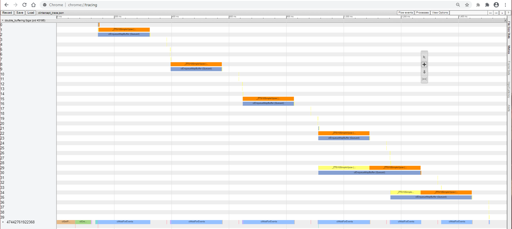
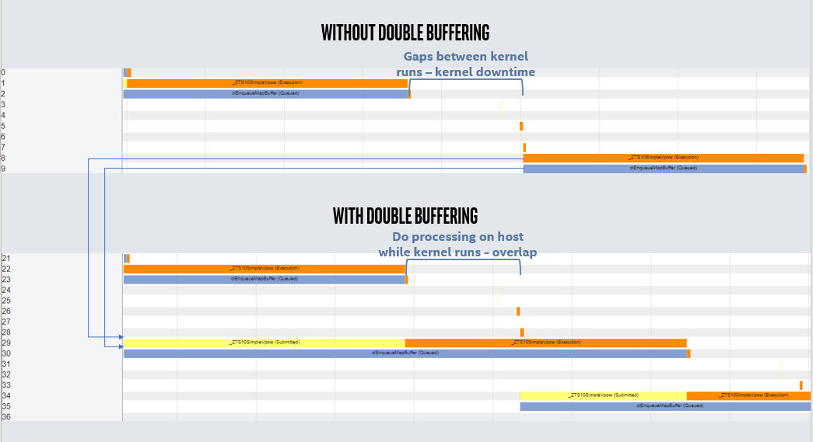

# Using the Intercept Layer for OpenCL* Applications to Identify Optimization Opportunities
This FPGA tutorial demonstrates how to use the Intercept Layer for OpenCL* Applications to perform system-level profiling on a design and reveal areas for improvement.

***Documentation***: The [Intercept Layer for OpenCL* Applications](https://github.com/intel/opencl-intercept-layer) GitHub provides complete documentation for the use of this tool. The [oneAPI DPC++ FPGA Optimization Guide](https://software.intel.com/content/www/us/en/develop/documentation/oneapi-fpga-optimization-guide)  provides comprehensive instructions for targeting FPGAs through DPC++. The [oneAPI Programming Guide](https://software.intel.com/en-us/oneapi-programming-guide) is a general resource for target-independent DPC++ programming.


| Optimized for                     | Description
---                                 |---
| OS                                | Linux* Ubuntu* 18.04
| Hardware                          | Intel® Programmable Acceleration Card (PAC) with Intel Arria® 10 GX FPGA <br> Intel® Programmable Acceleration Card (PAC) with Intel Stratix® 10 SX FPGA
| Software                          | Intel® oneAPI DPC++ Compiler (Beta) <br> Intel® FPGA Add-On for oneAPI Base Toolkit
| What you will learn               | Summary of profiling tools available for performance optimization <br> About the Intercept Layer for OpenCL* Applications <br> How to set up and use this tool <br> A case study of using this tool to identify when the double buffering system-level optimization is beneficial
| Time to complete                  | 30 minutes

_Notice: Tutorial is not supported  on  Windows* as compiling  to FPGA hardware  is  not  yet supported  in  Windows*_

## Purpose
This FPGA tutorial demonstrates how to use the Intercept Layer for OpenCL* Applications, an open-source tool, to perform system-level profiling on a design and reveal areas for improvement.

### Profiling Techniques
The following code snippet uses standard SYCL* and C++ language features to extract profiling information from DPC++ code.

```c++
void profiling_example(const std::vector<float>& vec_in,
                             std::vector<float>& vec_out ) {

  // Start the timer (using std::chrono)
  dpc_common::TimeInterval exec_time;

  // Host performs pre-processing of input data
  std::vector<float> vec_pp = PreProcess(vec_in);

  // FPGA device performs additional processing
  INTEL::fpga_selector selector;
  queue q(selector, dpc_common::exception_handler,
          property::queue::enable_profiling{});

  buffer buf_in(vec_pp);
  buffer buf_out(vec_out);

  event e = q.submit([&](handler &h) {
    auto acc_in = buf_in.get_access<access::mode::read>(h);
    auto acc_out = buf_out.get_access<access::mode::discard_write>(h);

    h.single_task<class Kernel>([=]() [[intel::kernel_args_restrict]] {
      DeviceProcessing(acc_in, acc_out);
    });
  });

  // Query event e for kernel profiling information
  // (blocks until command groups associated with e complete)
  double kernel_time_ns =
    e.get_profiling_info<info::event_profiling::command_end>() -
    e.get_profiling_info<info::event_profiling::command_start>();

  // Stop the timer.
  double total_time_s = exec_time.Elapsed();

  // Report profiling info
  std::cout << "Kernel compute time:  " << kernel_time_ns * 1e-6 << " ms\n";
  std::cout << "Total compute time:   " << total_time_s   * 1e3  << " ms\n";
}
```

This tutorial introduces the Intercept Layer for OpenCL* Applications, a profiling tool that extracts and visualizes system-level profiling information for DPC++ programs.  This tool can extract the same profiling data (and more) as the code snippet above, without requiring any code-level profiling directives.

The Intercept Layer for OpenCL* provides coarse-grained, system-level profiling information. A complementary tool, the Intel® FPGA Dynamic Profiler for DPC++, provides fine-grained profiling information for the kernels executing on the device. Together, these two tools can be used to optimize both host and device side execution. However these tools should not be used at the same time, as the Intercept Layer for OpenCL* may slow down the runtime execution, rendering the Dynamic Profiler data less accurate. 

### The Intercept Layer for OpenCL* Applications

The Intercept Layer for OpenCL* Applications is an open-source tool that you can use to profile DPC++ designs at a system-level. Although it is not part of the oneAPI Base Toolkit installation, it is freely available on GitHub.

This tool serves the following purpose:
* Intercept host calls before they reach the device in order to gather performance data and log host calls.
* Provide data to visualize the calls through time, and can separate them into *queued*, *submitted*, and *execution* sections for a better understanding of the execution.
* Identify gaps (using visualization) in the runtime that may be leading to inefficient execution and throughput drops.

The Intercept Layer for OpenCL* Applications has several different options for capturing different aspects of the host run. These options are described in its [documentation](https://github.com/intel/opencl-intercept-layer). This tutorial uses the call-logging and device timeline features that print information about the calls made by the host during execution.

### Data Visualization

You can visualize the data generated by the Intercept Layer for OpenCL* Applications in the following ways:
* __Google* Chrome* trace event profiling tool__: JSON files generated by the Intercept Layer for OpenCL Applications contain device timeline information. You can open these JSON files in the [Google* Chrome* trace event profiling tool](chrome://tracing/) to generate visual representation of the profiling data.
* __Microsoft* Excel*__: The Intercept Layer for OpenCL* Applications contains a Python script that parses the timeline information into a Microsoft* Excel* file, where it is presented both in a table format and in a bar graph.

This tutorial will use the Google* Chrome trace event profiling tool for visualization.

Use the visualized data to identify gaps in the runtime where events are waiting for something else to finish executing. These gaps represent potential opportunities for system-level optimization. While it is not possible to eliminate all such gaps, you might be able to eliminate those caused by dependencies that can be avoided.

### Tutorial Example: Double Buffering

This tutorial is based on the *double-buffering* optimization. Double-buffering allows host data processing and host transfers to the device-side buffer to occur in parallel with the kernel execution on the FPGA device. This parallelization is useful when the host performs any combination of the following actions between consecutive kernel runs:
* Preprocessing
* Postprocessing
* Writes to the device buffer

By running host and device actions in parallel, execution gaps between kernels are removed as they no longer have to wait for the host to finish its operation. You can clearly see the benefits of double-buffering with the visualizations provided by the Intercept Layer output.

### Setting up the Intercept Layer for OpenCL* Applications
The Intercept Layer for OpenCL* Applications is available on GitHub at the following URL: <https://github.com/intel/opencl-intercept-layer>

To set up the Intercept Layer for OpenCL* Applications, perform the following steps:

1) [Download](https://github.com/intel/opencl-intercept-layer) the Intercept Layer for OpenCL* Applications version 2.2.1 or later from GitHub.


2) Build the Intercept Layer according to the instructions provided in [How to Build the Intercept Layer for OpenCL* Applications](https://github.com/intel/opencl-intercept-layer/blob/master/docs/build.md).
     *  __Run `cmake`__: Ensure that you set `ENABLE_CLILOADER=1` when running cmake.
      (i.e. `cmake -DENABLE_CLILOADER=1 ..` )
    * __Run `make`__: After the cmake step, `make` must be run in the build directory. This step builds the `cliloader` loader utility.
    * __Add to your `PATH`__:    The `cliloader` executable should now exist in `<path to opencl-intercept-layer-master download>/<build dir>/cliloader/` directory. Add this directory to your `PATH` environment variable if you wish to run multiple designs using `cliloader`.

    You can now pass your executables to `cliloader` to run them with the intercept layer. For details about the `cliloader` loader utility, see [cliloader: A Intercept Layer for OpenCL* Applications Loader](https://github.com/intel/opencl-intercept-layer/blob/master/docs/cliloader.md).

3) Set `cliloader` and other Intercept Layer options.

    If you run multiple designs with the same options, set up a `clintercept.conf` file in your home directory. You can also set the options as environment variables by prefixing the option name with `CLI_`. For example, the `DllName` option can be set through the `CLI_DllName` environment variable. For a list of options, see *Controls* in [How to Use the Intercept Layer for OpenCL Applications](https://github.com/intel/opencl-intercept-layer/blob/master/docs/controls.md).

    For this tutorial, set the following options:

| Options/Variables                                                                       | Description                                                                                                         |
| ---                                                                                     | ---                                                                                                                 |
| `DllName=$CMPLR_ROOT/linux/lib/libOpenCL.so`                  | The intercept layer must know where `libOpenCL.so` file from the original oneAPI build is. If using this option in a conf file, expand `$CMPLR_ROOT` and pass in the absolute path.                           |
| `DevicePerformanceTiming=1` and `DevicePerformanceTimelineLogging=1`                    | These options print out runtime timeline information in the output of the executable run.                           |
| `ChromePerformanceTiming=1`, `ChromeCallLogging=1`, `ChromePerformanceTimingInStages=1` | These variables set up the chrome tracer output, and ensure the output has Queued, Submitted, and Execution stages. |


These instructions set up the `cliloader` executable, which provides some flexibility by allowing for more control over when the layer is used or not used. If you prefer a local installation (for a single design) or a global installation (always ON for all designs), follow the instructions at [How to Install the Intercept Layer for OpenCL Applications](https://github.com/intel/opencl-intercept-layer/blob/master/docs/install.md).

### Running the Intercept Layer for OpenCL* Applications

To run a compiled DPC++ program using the Intercept Layer for OpenCL* Applications, use the command:
`cliloader <executable> [executable args]`

To run the tutorial example, refer to the "[Running the Sample](#running-the-sample)" section.

When you run the host executable with the `cliloader` command, the `stderr` output contains lines as shown in the following example:
```
Device Timeline for clEnqueueMapBuffer (enqueue 1) = 145810154237969 ns (queued), 145810156546459 ns (submit), 145810156552270 ns (start), 145810159109587 ns (end)
```

These lines give the timeline information about a variety of oneAPI runtime calls. After the host executable finishes running, there is also a summary of the performance information for the run.

### Viewing the Performance Data

After the executable runs, the data collected will be placed in the `CLIntercept_Dump` directory, which is in the home directory by default. Its location can be adjusted using the `DumpDir=<directory where you want the output files>` `cliloader` option (if you are using the option inline, remember to use `CLI_DumpDir`). `CLIntercept_Dump` contains a folder named after the executable with a file called `clintercept_trace.json`. You can load this JSON file in the [Google* Chrome trace event profiling tool](chrome://tracing/) to visualize the timeline data collected by the run.

For this tutorial, this visualization appears as shown in the following example:



This visualization shows different calls executed through time. The X-axis is time, with the scale shown near the top of the page. The Y-axis shows different calls that are split up in several ways.

The left side (Y-axis) has two different types of numbers:
* Numbers that contain a decimal point.
   * The part of the number before the decimal point orders the calls approximately by start time.
   * The part of the number after the decimal point represents the queue number the call was made in.
* Numbers that do not contain a decimal point. These numbers represent the thread ID of the thread being run on in the operating system.

The colors in the trace represent different stages of execution:
* Blue during the *queued* stage
* Yellow during the *submitted* stage
* Orange for the *execution* stage

Look for gaps between consecutive execution stages and kernel runs to identify possible areas for optimization.


### Applying Double-Buffering Using the Intercept Layer for OpenCL* Applications

The double-buffering optimization can help minimize or remove gaps between consecutive kernels as they wait for host processing to finish. These gaps are minimized or removed by having the host perform processing operations on a second set of buffers while the kernel executes. With this execution order, the host processing is done by the time the next kernel can run, so kernel execution is not held up waiting for the host.

For a more detailed explanation of the optimization, refer to the FPGA tutorial "Double Buffering to Overlap Kernel Execution with Buffer Transfers and Host Processing".

In this tutorial, the first three kernels are run without the double-buffer optimization, and the next three are run with it. The kernels were run on an Intel® Programmable Acceleration Card with Intel® Arria® 10 GX FPGA when the intercept layer data was collected. The change made by this optimization can be clearly seen in the Intercept Layer for OpenCL* Applications trace:



Here, the kernel runs named `_ZTS10SimpleVpow` can be recognized as the bars with the largest execution time (the large orange bars). Double buffering removes the gaps between the kernel executions that can be seen in the top trace image. This optimization improves the throughput of the design, as explained in the `double_buffering` tutorial.

The Intercept Layer for OpenCL* Applications makes it clear why the double buffering optimization will benefit this design, and shows the performance improvement it achieves. Use the Intercept Layer tool on your designs to identify scenarios where you can apply double buffering and other system-level optimizations.


## Key Concepts
* A brief summary of the key profiling tools available for DPC++ performance optimization
* Understanding the Intercept Layer for OpenCL* Applications tool
* How to set up and use the Intercept Layer for OpenCL* Applications tool
* How to use the resulting information to identify opportunities for system-level optimizations such as double buffering

## License
This code sample is licensed under MIT license.

## Building the Tutorial

### Include Files
The included header `dpc_common.hpp` is located at `%ONEAPI_ROOT%\dev-utilities\latest\include` on your development system.

### Running Samples in DevCloud
If running a sample in the Intel DevCloud, remember that you must specify the compute node (fpga_compile or fpga_runtime) as well as whether to run in batch or interactive mode. For more information see the Intel® oneAPI Base Toolkit Get Started Guide ([https://devcloud.intel.com/oneapi/get-started/base-toolkit/](https://devcloud.intel.com/oneapi/get-started/base-toolkit/)).

When compiling for FPGA hardware, it is recommended to increase the job timeout to 12h.

### On a Linux* System

1. Generate the `Makefile` by running `cmake`.
     ```
   mkdir build
   cd build
   ```
   To compile for the Intel® PAC with Intel Arria® 10 GX FPGA, run `cmake` using the command:
    ```
    cmake ..
   ```
   Alternatively, to compile for the Intel® PAC with Intel Stratix® 10 SX FPGA, run `cmake` using the command:

   ```
   cmake .. -DFPGA_BOARD=intel_s10sx_pac:pac_s10
   ```

2. Compile the design through the generated `Makefile`. The following build targets are provided:

   * Compile for emulation (fast compile time, targets emulated FPGA device):
      ```
      make fpga_emu
      ```
   * Compile for FPGA hardware (longer compile time, targets FPGA device):
     ```
     make fpga
     ```
3. (Optional) As the above hardware compile may take several hours to complete, an Intel® PAC with Intel Arria® 10 GX FPGA precompiled binary can be downloaded <a href="https://iotdk.intel.com/fpga-precompiled-binaries/latest/system_profiling.fpga.tar.gz" download>here</a>.

 ### In Third-Party Integrated Development Environments (IDEs)

You can compile and run this tutorial in the Eclipse* IDE (in Linux*) and the Visual Studio* IDE (in Windows*). For instructions, refer to the following link: [Intel® oneAPI DPC++ FPGA Workflows on Third-Party IDEs](https://software.intel.com/en-us/articles/intel-oneapi-dpcpp-fpga-workflow-on-ide)


## Running the Sample

 1. Run the sample on the FPGA emulator (the kernel executes on the CPU):
     ```
     ./double_buffering.fpga_emu     (Linux)
     ```
2. Run the sample on the FPGA device:
     ```
     ./double_buffering.fpga         (Linux)
     ```
3. Follow the instructions in the "[Setting up the Intercept Layer for OpenCL* Applications](#setting-up-the-intercept-layer-for-opencl-applications)" section to install and configure the `cliloader` tool.
4. Run the sample using the Intercept Layer for OpenCL* Applications to obtain system-level profiling information:
     ```
     cliloader ./double_buffering.fpga   (Linux)
     ```
5. Follow the instructions in the "[Viewing the Performance Data](#viewing-the-performance-data)" section to visualize the results.

### Example of Output
__Intercept Layer for OpenCL* Applications results:__
Your visualization results should resemble the screenshots in sections "[Viewing the Performance Data](#viewing-the-performance-data)" and "[Applying Double-Buffering Using the Intercept Layer for OpenCL* Applications](#applying-double-buffering-using-the-intercept-layer-for-opencl-applications)".

__Command line `stdout`:__
When run without `cliloader`, the tutorial output should resemble the result below.
```
Platform name: Intel(R) FPGA SDK for OpenCL(TM)
Device name: pac_a10 : Intel PAC Platform (pac_ee00000)

Executing kernel 3 times in each round.

*** Beginning execution, without double buffering
Launching kernel #0

Overall execution time without double buffering = 3597 ms
Total kernel-only execution time without double buffering = 534 ms
Throughput = 8.7433481 MB/s

*** Beginning execution, with double buffering.
Launching kernel #0

Overall execution time with double buffering = 620 ms
Total kernel-only execution time with double buffering = 534 ms
Throughput = 50.684795 MB/s

Verification PASSED
```
