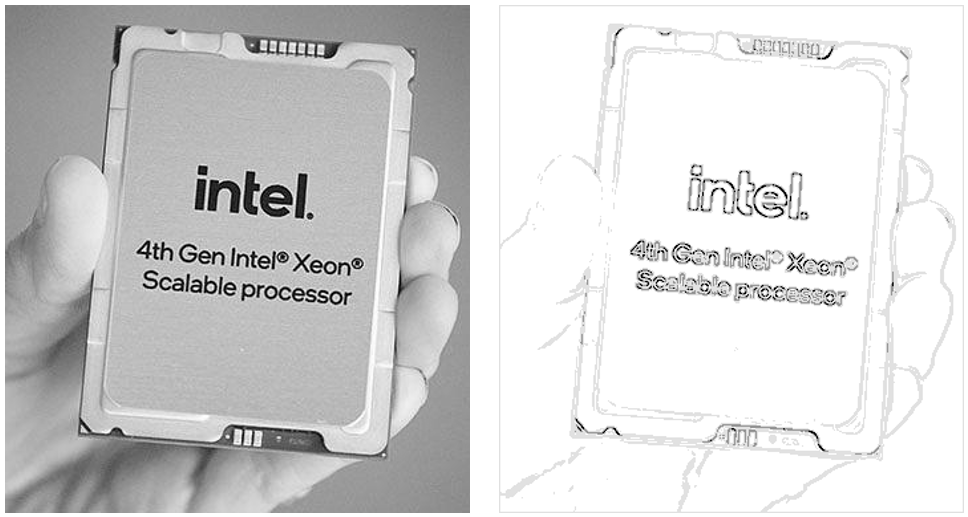

# Sobel Edge Detection Sample
Segmentation is a common operation in image processing to find the boundaries of objects in an image.
This sample implements the Sobel edge detection algorithm to find object boundaries in a PPM format image.
However, this sample is more about offloading Fortran code to a GPU than it is about edge detection.
The algorithm is implemented in three, data-parallel steps: image smoothing, edge detection, and edge
highlighting. Two different but functionally equivalent samples are included. First, it is implemented
using ordinary nested for-loops that are parallelized using OpenMP directives. Second, it is implemented
using DO CONCURRENT loops, which are parallelized using the OpenMP backend. In either case, the
Intel&reg; OpenMP runtime library is capable of offloading the loops to a GPU.

| Optimized for       | Description
|:---                 |:---
| OS                  | Linux* Ubuntu* 18.04 or newer
| Hardware            | Intel&reg; CPUs and GPUs
| Software            | Intel&reg; Fortran Compiler
| What you will learn | How to offload Fortran loops to a GPU
| Time to complete    | 15 minutes

## Purpose
This sample demonstrates two Fortran implementations of Sobel edge detection. The following files are
provided:

 1. sobel_omp_target.F90 implements edge detection using ordinary for-loops and OpenMP target directives
 2. sobel_do_concurrent.F90 implements edge detection using DO CONCURRENT loops
 3. ppm_image_io.F90 contains utility functions to process PPM images in ASCII format
 4. xeon_4gen.ppm is a small PPM input image to use for testing
 5. xeon_4gen_edges.ppm is an example of the expected output in PPM format

The input and output images can be displayed with any image viewer that accepts PPM format
(e.g., [IrfanView](https://www.irfanview.com/)).

The for-loop and DO CONCURRENT implementations are functionally equivalent. In both cases, the OpenMP
runtime library is used to parallelize the code, regardless of whether they are run on the CPU or
offloaded to a GPU.

## Key Implementation Details
[The Case for OpenMP Target Offloading](https://www.intel.com/content/www/us/en/developer/articles/technical/the-case-for-openmp-target-offloading.html) provides more detailed descriptions of each example code, and discusses the relative merits of the two approaches.

## Using Visual Studio Code* (Optional)

You can use Visual Studio Code (VS Code) extensions to set your environment, create launch configurations,
and browse and download samples.

The basic steps to build and run a sample using VS Code include:
 - Download a sample using the extension **Code Sample Browser for Intel oneAPI Toolkits**.
 - Configure the oneAPI environment with the extension **Environment Configurator for Intel oneAPI Toolkits**.
 - Open a Terminal in VS Code (**Terminal>New Terminal**).
 - Run the sample in the VS Code terminal using the instructions below.
 - (Linux only) Debug your GPU application with GDB for Intel® oneAPI toolkits using the **Generate Launch Configurations** extension.

To learn more about the extensions, see
[Using Visual Studio Code with Intel® oneAPI Toolkits](https://www.intel.com/content/www/us/en/develop/documentation/using-vs-code-with-intel-oneapi/top.html).

After learning how to use the extensions for Intel oneAPI Toolkits, return to this readme for instructions on how to build and run a sample.

## Building and Running this sample

> **Note**: If you have not already done so, set up your CLI
> environment by sourcing  the `setvars` script located in
> the root of your oneAPI installation.
>
> Linux Sudo: . /opt/intel/oneapi/setvars.sh
>
> Linux User: . ~/intel/oneapi/setvars.sh
>
>For more information on environment variables, see Use the setvars Script for [Linux or macOS](https://www.intel.com/content/www/us/en/develop/documentation/oneapi-programming-guide/top/oneapi-development-environment-setup/use-the-setvars-script-with-linux-or-macos.html).

### On a Linux System
Run `make` to build and run the sample. Six programs are generated:

 1. sobel_seq runs the for-loop implementation sequentially on the CPU
 2. sobel_omp_cpu runs the for-loops in parallel on the CPU using OpenMP directives
 3. sobel_omp_gpu offloads the for-loop in parallel on the GPU using OpenMP target directives
 4. sobel_do_conc_cpu_seq runs the DO CONCURRENT implementation sequentially on the CPU
 5. sobel_do_conc_cpu_par runs the DO CONCURRENT loop in parallel on the CPU
 6. sobel_do_conc_gpu offloads the DO CONCURRENT loop to the GPU using the OpenMP backend

You can remove all generated files with `make clean`.

### Example of Output
If everything is working correctly, each example program will read the sample input image, xeon_4gen.ppm, 
and output the edge highlights of this image, e.g.:

Note that the sample image is too small to merit accelerator offload. It is included for testing, not
benchmarking. A suitably large image (e.g., 8K resolution) should be used for performance measurements.

### Troubleshooting
If an error occurs, troubleshoot the problem using the Diagnostics Utility for Intel® oneAPI Toolkits.
[Learn more](https://www.intel.com/content/www/us/en/develop/documentation/diagnostic-utility-user-guide/top.html)

## License
Code samples are licensed under the MIT license. See [License.txt](https://github.com/oneapi-src/oneAPI-samples/blob/master/License.txt) for details.

Third party program Licenses can be found here: [third-party-programs.txt](https://github.com/oneapi-src/oneAPI-samples/blob/master/third-party-programs.txt).
