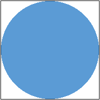

# `Coarray` Sample

The `Coarray` sample provides a guided approach to build and run a serial Fortran application, and then convert it to run in parallel using coarrays. The sample is a simple program that estimates the value of the mathematical constant π (Pi) using a Monte Carlo method.

| Area                      | Description
|:---                       |:---
| What you will learn       | How to use coarray feature in Fortran
| Time to complete          | 10-15 minutes

## Purpose

The `Coarray` sample demonstrates the use of the Fortran coarray feature. The sample program estimates the value of the mathematical constant π (Pi) using a Monte Carlo method (named Monte Carlo after the game that uses random numbers). 

Imagine a square piece of paper two units across (the actual unit doesn’t matter). On this paper draw a circle whose diameter is two units (radius one unit). 



The area of the circle is πr2. But since the radius (r) is 1 and the area of the square is 4 (2r x 2r), the ratio of the area of the circle to that of the area of the square is π/4.

To get the area of the circle, you can pick random points on the paper and count the points that are within the circle. To make this easier, use the center of the square as the origin and generate random values for X and Y coordinates between zero and 1, so you are looking at a quarter of the circle/square. Sqrt(X2+Y2) is the distance between the point and the origin. You are interested only in the points that are within that distance. Since r=1 when X2+Y2 is less than or equal to 1, the point is within the circle. Count the number of random points that are within the circle and divide that by the total number of points and the result is π/4. 

## Prerequisites

| Optimized for             | Description
|:---                       |:---
| OS                        | Linux, Windows
| Hardware                  | Intel® and Intel-compatible CPU
| Software                  | Intel® Fortran Compiler

## Key Implementation Details

This sample contains two versions of the program:

| File Name                   | Description
|:---                         |:---
| `01_mcpi_sequential.F90`    | This example shows a sequential implementation of the program
| `02_mcpi_coarray_final.F90` | A working version of the converted program that uses coarray 

Key coarray concepts explained in the code are images, shared variables, codimensions, and cobounds. 

Read the [Intel® Fortran Compiler Developer Guide and Reference](https://www.intel.com/content/www/us/en/docs/fortran-compiler/developer-guide-reference/current/overview.html) for more information about features and options mentioned in this sample. 

## Set Environment Variables

When working with the command-line interface (CLI), you should configure the oneAPI toolkits using environment variables. Set up your CLI environment by sourcing the `setvars` script every time you open a new terminal window. This practice ensures that your compiler, libraries, and tools are ready for development.

## Build and Run the Sequential Program

> **Note**: If you have not already done so, set up your CLI
> environment by sourcing  the `setvars` script in the root of your oneAPI installation.
>
> Linux*:
> - For system wide installations: `. /opt/intel/oneapi/setvars.sh`
> - For private installations: ` . ~/intel/oneapi/setvars.sh`
> - For non-POSIX shells, like csh, use the following command: `bash -c 'source <install-dir>/setvars.sh ; exec csh'`
>
> Windows*:
> - `C:\Program Files (x86)\Intel\oneAPI\setvars.bat`
> - Windows PowerShell*, use the following command: `cmd.exe "/K" '"C:\Program Files (x86)\Intel\oneAPI\setvars.bat" && powershell'`
>
> For more information on configuring environment variables, see *[Use the setvars Script with Linux* or macOS*](https://www.intel.com/content/www/us/en/develop/documentation/oneapi-programming-guide/top/oneapi-development-environment-setup/use-the-setvars-script-with-linux-or-macos.html)* or *[Use the setvars Script with Windows*](https://www.intel.com/content/www/us/en/develop/documentation/oneapi-programming-guide/top/oneapi-development-environment-setup/use-the-setvars-script-with-windows.html)*.


### On Linux*

1. Change to the sample directory.
2. Build the program.
   ```
   ifx -o seq mcpi_sequential.F90
   ```
3. Run the program.
   ```
   ./seq
   ```

Alternately, use the `Makefile` to compile and run the program:

1. Change to the sample directory.
2. Remove any leftover files from a previous compilation.
   ```
   make clean
   ```
3. Compile and run the program.
   ```
   make seq
   ```

### On Windows* 

1. Open an Intel oneAPI command window.
2. Change to the sample directory.
3. Build the program.
   ```
   ifx /exe:seq mcpi_sequential.F90
   ```
4. Run the program.
   ```
   seq.exe
   ```

### Example Sequential Program Output

The sequential program output will be similar to the following due to the use of a random number generator:

```
Computing pi using 600000000 trials sequentially
Computed value of pi is 3.1415794, Relative Error: .422E-05
```

When the program is run again, a different computed value is given due to the different random number sequence: 

```
Computing pi using 600000000 trials sequentially
Computed value of pi is 3.1415488, Relative Error: .139E-04
```

## Modify the Program to Use Coarrays

The Intel® Fortran Compiler (ifx) and the Intel® Fortran Compiler Classic (ifort) support parallel programming using coarrays as defined in the Fortran 2008 Standard and extended by Fortran 2018. An application using coarrays runs the same program, called an image, multiple times in parallel. A Fortran program containing coarrays is interpreted as if it were replicated a fixed number of times and all copies were executed asynchronously. 

Coarray variables are shared across all images in a model called Partitioned Global Address Space (PGAS). 

In this sample, coarrays are used to split the trials across multiple images. Each image has its own local variables, plus a portion of the coarrays shared variables (using PGAS). 

A coarray can be a scalar and can be thought of as having extra dimensions, referred to as codimensions. To declare a coarray, either add the `CODIMENSION` attribute, or specify the cobounds alongside the variable name. The cobounds are always enclosed in square brackets. The following example shows the use of codimensions and cobounds:

``` 
real, dimension(100), codimension[*] :: A
integer :: B[3,*]
```

When specifying cobounds in a declaration, the last cobound must be an `*`. This indicates that it depends on the number of images in the application. The total number of subscripts plus cosubscripts is 15. As with array bounds, it is possible to have a lower cobound that is not 1, though this is not common. 

In the sample program, since the work with estimating π will be split across the images, a coarray is needed to keep track of each image's subtotal of points within the circle. At the end, the subtotals are added to create a grand total, which is then divided by the number of trials as in the sequential version. 

### Edit the Program

1. Open the file `mcpi_sequential.F90` and save it as `mcpi_coarray.F90`. 
2. In `mcpi_coarray.F90`, edit the existing declaration of `total` to be a coarray: 

   ```
   ! Declare scalar coarray that will exist on each image
   integer(K_BIGINT) :: total[*] ! Per-image subtotal
   ```

   An important aspect of coarrays is that individual images have local variables which can also be accessed by other images using PGAS. To read the value of `total` on image 3, use the syntax `total[3]`. To reference the local copy, the coindex in brackets is omitted. For best performance, minimize touching the storage of other images. 

3. Update the output to show the number of images doing the work and define image 1 to manage timing.

   In a coarray application, each image has its own set of I/O units. The standard input is preconnected only on image 1. The standard output is preconnected on all images. The standard encourages the implementations to merge output, but the order is unpredictable. Intel Fortran supports this merging. 

   It is typical to have image 1 do any setup and terminal I/O. Change the initial output to show how many images are doing the work and verify that the number of trials is evenly divisible by the number of images (by default, this is the number of cores times threads-per-core). Image 1 does all the timing. 

   Replace:

   ```
   print '(A,I0,A)', "Computing pi using ",num_trials," trials sequentially"
   ! Start timing
   call SYSTEM_CLOCK(clock_start)
   ```

   with the following `IF` code block:

   ```
   ! Image 1 initialization
   if (THIS_IMAGE() == 1) then
       ! Make sure that num_trials is divisible by the number of images
       if (MOD(num_trials,INT(NUM_IMAGES(),K_BIGINT)) /= 0_K_BIGINT) &
           error stop "num_trials not evenly divisible by number of images!"
       print '(A,I0,A,I0,A)', "Computing pi using ",num_trials," trials across ",NUM_IMAGES()," images"
       call SYSTEM_CLOCK(clock_start)
   end if
   ```

   The new `IF` code block implements the following logic:

   1. Execute this `IF` code block only on image 1. 

      Add the test for the image number using the intrinsic function `THIS_IMAGE()`. When `THIS_IMAGE()` is called without arguments, it returns the index of the invoking image. 
   2. Ensure that the number of trials is evenly divisible by the number of images.

      The intrinsic function `NUM_IMAGES` returns this value. `error_stop` is similar to stop except that it forces all images in a coarray application to exit. 
   3. Print the number of trials and the number of images. 
   4. Start the timing. 

   Images other than image 1 skip this `IF` code block and proceed to the next part of the code. In more complex applications you may want other images to wait until the initialization is done. If that is desired, insert a `sync all` statement. The execution does not continue until all images have reached the `sync all` statement. 
4. Modify the main compute `DO` loop to split the work among the images. Replace: 
   
   ``` 
   do bigi=1_K_BIGINT,num_trials
   ```

   with the following:

   ``` 
   do bigi=1_K_BIGINT,num_trials/int(NUM_IMAGES(),K_BIGINT)
   ```
5. Add sync after the `DO` loop, to wait for all images to get to this point in the code. Insert the following after the `DO` loop: 

   ```
   ! Wait for everyone
   sync all
   ```
6. After the main compute `DO` loop, sum the image-specific totals (sub-totals), compute π, and display the result. Note that this computation is done only on image 1. Replace:

   ```
   ! total/num_trials is an approximation of pi/4
   computed_pi = 4.0_K_DOUBLE*(REAL(total,K_DOUBLE)/REAL(num_trials,K_DOUBLE))
   print '(A,G0.8,A,G0.3)', "Computed value of pi is ", computed_pi, &
       ", Relative Error: ",ABS((computed_pi-actual_pi)/actual_pi)! Show elapsed time
   call SYSTEM_CLOCK(clock_end,clock_rate)
   print '(A,G0.3,A)', "Elapsed time is ", &
     REAL(clock_end-clock_start)/REAL(clock_rate)," seconds"
   ```

   with the following `IF` code block:

   ```
   ! Image 1 end processing
   if (this_image() == 1) then
       ! Sum subtotals of all images
       do i=2,num_images()
           total = total + total[i]
       end do
       ! total/num_trials is an approximation of pi/4
       computed_pi = 4.0_K_DOUBLE* REAL(total,K_DOUBLE) / REAL(num_trials,K_DOUBLE))
       print '(A,G0.8,A,G0.3)', "Computed value of pi is ", computed_pi, &
           ", Relative Error: ",ABS((computed_pi-actual_pi)/actual_pi)
       ! Show elapsed time
       call SYSTEM_CLOCK(clock_end,clock_rate)
       print '(A,G0.3,A)', "Elapsed time is ", &
           REAL(clock_end-clock_start)/REAL(clock_rate)," seconds"
   end if
   ```

   The new `IF` code block implements the following logic:

   1. Execute this `IF` code block only on image 1. 
   2. `total` (without a coindex) has the count from image 1. Add in the values of `total` from the other images. Note the `[i]` coindex. 

   (The rest of the code should be the same as the sequential version.)

   All images exit after this code block. 

## Build and Run the Coarray Program

The Intel Fortran Compiler requires that coarray features are enabled by specifying the compiler option `-coarray` on Linux or `/Qcoarray` on Windows. These compiler options enable the shared memory implementation of coarrays.

### On Linux

1. Change to the sample directory.
2. Build the program using the `-coarray` option.
   ```
   ifx -o coarray -coarray mcpi_coarray.F90
   ```
3. Run the program.
   ```
   ./coarray
   ```

Alternately, use the `Makefile` to compile and run the program:

1. Change to the sample directory.
2. Remove any leftover files from a previous compilation.
   ```
   make clean
   ```
3. Compile and run the program.
   ```
   make coarray
   ```

### On Windows

1. Open an Intel oneAPI command window.
2. Change to the sample directory.
3. Build the program using the `/Qcoarray` option.
   ```
   ifx /exe:coarray /Qcoarray mcpi_coarray.F90
   ```
4. Run the program.
   ```
   coarray.exe
   ```

### Example Coarray Program Output

On a four-core, eight-thread processor, the coarray program output will be similar to the following:

```
Computing pi using 600000000 trials across 8 images
Computed value of pi is 3.1416575, Relative Error: .206E-04
```

When the program is run again, a different computed value is given due to the different random number sequence: 

```
Computing pi using 600000000 trials across 8 images
Computed value of pi is 3.1416903, Relative Error: .311E-04
```

> **Note**: This sample program is a functional demonstration of using Fortran coarrays. There may not be a performance improvement.

## Change the Number of Images Used by the Program

The program can be run with a different number of images; the default is determined by the system configuration. There are two ways to do this: at compile-time using an option or at runtime by setting an environment variable.

### On Linux

1. Change to the sample directory.
2. Build the program using `-coarray-num-images` to set the number of images to four:
   ```
   ifx -o coarray -coarray-num-images=4 mcpi_coarray.F90
   ```
3. Run the program.
   ```
   ./coarray
   ```

Alternately, set the environment variable `FOR_COARRAY_NUM_IMAGES` to the desired number of images and run the program. The environment variable overrides the compiler option setting. For example: 

```
export FOR_COARRAY_NUM_IMAGES=4
```

### On Windows

1. Open an Intel oneAPI command window.
2. Change to the sample directory.
3. Build the program using `/Qcoarray-num-images` to set the number of images to four:
   ```
   ifx -o /Qcoarray /Qcoarray-num-images:4 mcpi_coarray.F90
   ```
4. Run the program.
   ```
   coarray.exe
   ```

Alternately, set the environment variable `FOR_COARRAY_NUM_IMAGES` to the desired number of images and run the program. The environment variable overrides the compiler option setting. For example: 

```
set FOR_COARRAY_NUM_IMAGES=4
```

### Example Coarray Program Output with Four Images

With four images specified, the coarray program output will be similar to the following:

```
Computing pi using 600000000 trials across 4 images
Computed value of pi is 3.1415352, Relative Error: .183E-04
```

Note the elapsed time differences when you change the number of images. 

> **Note**: This sample program is a functional demonstration of using Fortran coarrays. There may not be a performance improvement.

## Additional Information

For more information about using coarrays with Intel Fortran, refer to the [Coarrays topic in the Intel® Fortran Compiler Classic and Intel® Fortran Compiler Developer Guide and Reference](https://www.intel.com/content/www/us/en/develop/documentation/fortran-compiler-oneapi-dev-guide-and-reference/top/language-reference/data-types-constants-and-variables/variables-1/coarrays.html).

The following articles provide additional information about using coarrays on distributed memory systems:

- [Essential Guide to Distributed Memory Coarray Fortran with the Intel Fortran Compiler for Linux](https://www.intel.com/content/www/us/en/developer/articles/technical/distributed-memory-coarray-fortran-with-the-intel-fortran-compiler-for-linux-essential.html)

- [Distributed Memory Coarray Programs with Process Pinning](https://www.intel.com/content/www/us/en/developer/articles/technical/distributed-memory-coarray-programs-with-process-pinning.html)

- [Use MPICH to Support Coarrays for the Intel® Fortran Compiler](https://www.intel.com/content/www/us/en/developer/articles/technical/use-mpich-to-support-coarrays-for-the-intel--fortran-compiler.html)


## License

Code samples are licensed under the MIT license. See [License.txt](https://github.com/oneapi-src/oneAPI-samples/blob/master/License.txt) for details.

Third-party program Licenses can be found here: [third-party-programs.txt](https://github.com/oneapi-src/oneAPI-samples/blob/master/third-party-programs.txt).