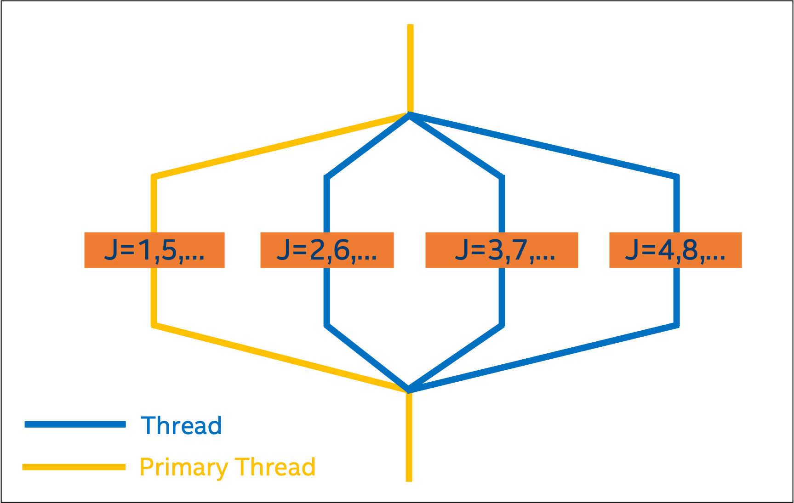
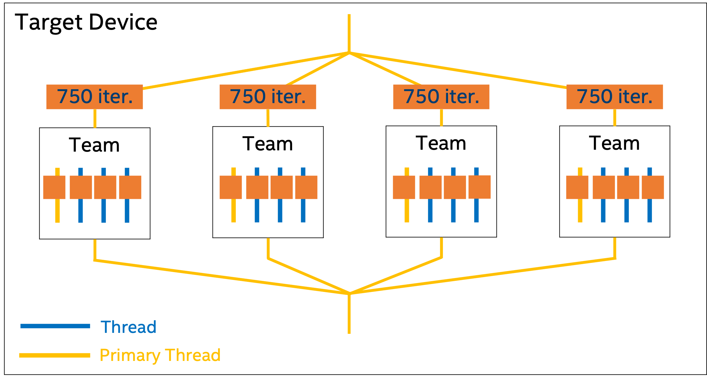

# `Matrix Multiply` Sample 

The `Matrix Multiply` sample provides a guided approach to modify a simple Fortran program to offload computations to an Intel® GPU using OpenMP* with the Intel® Fortran Compiler. The sample program is a simple matrix multiply algorithm.

| Area                      | Description
|:---                       |:---
| What you will learn       | How to use OpenMP directives with Fortran to offload computations to an Intel GPU
| Time to complete          | 10-15 minutes

## Purpose

The `Matrix Multiply` sample demonstrates the steps to modify a simple Fortran program to use OpenMP* directives to offload the compute kernel from the host to an Intel® GPU using the Intel® Fortran Compiler. 

Three working versions of the matrix multiply program are provided with the sample:

* `01_mm_CPU_sequential.f90`: the working sequential version of the matrix multiply program.
* `02_mm_CPU_parallel.f90`: the working  parallel version of the matrix multiply program, modified to use OpenMP directives to parallelize the program for CPU.
* `03_mm_GPU.f90`: the working parallel version of the  matrix multiply program, modified to use OpenMP directives for GPU.

The instructions in this sample show the steps to modify the original sequential version of the program (`01_mm_CPU_sequential.f90`) into the OpenMP parallel processing versions for CPU and GPU. In this sample, you will create your own version of the CPU parallel and GPU programs.

You can compare your modified programs against the provided working versions of the programs.

## Prerequisites

| Optimized for             | Description
|:---                       |:---
| OS                        | Linux, Windows
| Hardware                  | Intel® GPU
| Software                  | Intel® Fortran Compiler, Intel GPU driver

## Key Implementation Details

This guided sample shows how to use OpenMP on the CPU host as well as using target offload capabilities.

The sample program multiplies two matrices to produce a result matrix. To do the multiplication the number of columns in the first matrix must be equal to the number of rows in the second matrix. The result matrix has the number of rows of the first matrix and the number of columns of the second matrix. For a deeper refresh on this linear algebra algorithm, refer to the [Wikipedia Matrix multiplication article](https://en.wikipedia.org/wiki/Matrix_multiplication). The sample program multiplies square matrices; the number of rows equals the number of columns.

In the sample program, the following practical and performance concepts are given
particular attention:

- *Loop ordering.* Pay attention to the loop ordering, particularly the innermost loop, as the pattern of memory usage impacts performance. Fortran stores arrays in memory in column-major order (the left-most index changes first between the matrix elements stored consecutively in physical memory).
- *Variable and array declaration, initialization, and definition.*
  - Use IMPLICIT NONE to ensure all variables and arrays are declared.
  - Initialize variables and arrays to zero.
  - OpenMP defines defaults for variables and arrays. Explicitly define SHARED, PRIVATE, and REDUCTION variables and arrays for clarity.

Read the [Intel® Fortran Compiler Developer Guide and Reference](https://www.intel.com/content/www/us/en/docs/fortran-compiler/developer-guide-reference/current/overview.html) for more information about features and options mentioned in this sample.

## Set Environment Variables

When working with the command-line interface (CLI), you should configure the oneAPI toolkits using environment variables. Set up your CLI environment by sourcing the `setvars` script every time you open a new terminal window. This practice ensures that your compiler, libraries, and tools are ready for development.

## Build and Run the Sequential Program

> **Note**: If you have not already done so, set up your CLI
> environment by sourcing  the `setvars` script in the root of your oneAPI installation.
>
> Linux*:
> - For system wide installations: `. /opt/intel/oneapi/setvars.sh`
> - For private installations: ` . ~/intel/oneapi/setvars.sh`
> - For non-POSIX shells, like csh, use the following command: `bash -c 'source <install-dir>/setvars.sh ; exec csh'`
>
> Windows*:
> - `C:\Program Files (x86)\Intel\oneAPI\setvars.bat`
> - Windows PowerShell*, use the following command: `cmd.exe "/K" '"C:\Program Files (x86)\Intel\oneAPI\setvars.bat" && powershell'`
>
> For more information on configuring environment variables, see *[Use the setvars Script with Linux* or macOS*](https://www.intel.com/content/www/us/en/develop/documentation/oneapi-programming-guide/top/oneapi-development-environment-setup/use-the-setvars-script-with-linux-or-macos.html)* or *[Use the setvars Script with Windows*](https://www.intel.com/content/www/us/en/develop/documentation/oneapi-programming-guide/top/oneapi-development-environment-setup/use-the-setvars-script-with-windows.html)*.

In the sequential version of the program (`01_mm_CPU_sequential.f90`), the matrix multiply is performed in a triply nested loop:

```
do j=1,n
  do i=1,n
    do k=1,n
      c(i,j) = c(i,j) + a(i,k) * b(k,j)
    enddo
  enddo
enddo
```

Note that:
- All variables and arrays are explicitly declared.
- All variables and arrays are initialized.
- The matrix multiply calculation is done twice to validate the results of the CPU computation with the CPU parallel and GPU versions that are used later.
- The two result matrices are compared and the results of the evaluation are printed.

### On Linux*

1. Change to the sample directory.
2. Build the program.
   ```
   ifx -xhost 01_mm_CPU_sequential.f90
   ```
3. Run the program.
   ```
   ./a.out
   ```

### On Windows* 

1. Open an Intel oneAPI command window.
2. Change to the sample directory.
3. Build the program.
   ```
   ifx /Qxhost 01_mm_CPU_sequential.f90
   ```
4. Run the program.
   ```
   01_mm_sequential.exe
   ```

### Example Sequential Program Output

The output of the sequential program is:

```
Matrix size 2600
PASSED
```

Note that when compiler option -xhost (/Qxhost) is used, the compiler optimizes the code for the CPU where the compile is done.

## Modify the Sequential Program to Use OpenMP Parallel Directives for CPU

In a parallel region of code, the master thread spawns a team of threads as needed according to the OpenMP directives. Parallelism can be added incrementally by the developer until the desired performance is achieved.



OpenMP directives all start a line with `!$omp`.

A DO loop can be parallelized by simply wrapping the loop with `!$omp parallel do` and `!$omp end parallel do`.

Optional clauses for `!$omp parallel do` include `shared` and `private`. Variables that are declared shared are shared between the threads. In the parallel version of the sample, the parallelism is done at the outer loop where `j` is the loop index. That makes the value of `j` unique with each thread, so there is no opportunity to write to the same memory location (creating a race condition) in the arrays during the computation. The memory locations of the arrays are shared. Variables that are declared private are unique for each thread. By default, according to the OpenMP standard, the index of a DO loop is private. The indices are declared in the example for clarity.

In the sample parallel program (`02_mm_CPU_parallel.f90`), the arrays `a`, `b`, and `c` are shared between the threads as is the variable `n`, the size of the matrix. Those are listed in the shared clause. The indices are declared as private, although that is optional.

Follow these steps to modify the sequential program to use OpenMP directives to parallelize the code for CPU:

1. Open the file `01_mm_CPU_sequential.f90` and save it as `mm_CPU_parallel.f90`.
2. In your new `mm_CPU_parallel.f90` file, wrap the matrix multiply function with `!$omp parallel do` and `!$omp end parallel do` OpenMP directives: 

   ```
   !$omp parallel do shared(a, b, c, n), private(i, j, k)
   ! parallel compute matrix multiplication.
      do j=1,n
        do i=1,n
          do k=1,n
            c(i,j) = c(i,j) + a(i,k) * b(k,j)
          enddo
        enddo
      enddo
   !$omp end parallel do
   ```
3. Save your changes.

## Build and Run the Parallel Program for CPU

In order for the Intel Fortran Compiler to recognize OpenMP directives, the program must be compiled with the `-qopenmp` (Linux) or `/Qopenmp` (Windows) option. Without this compiler option, the OpenMP directives are ignored and the program will run sequentially. Note that this can be helpful for debugging the program.

### On Linux

1. Change to the directory that contains your modified program for CPU (`mm_CPU_parallel.f90`).
2. Build your modified program using the `-qopenmp` option.
   ```
   ifx -xhost -qopenmp mm_CPU_parallel.f90
   ```
3. Set the environment variable `OMP_NUM_THREADS` to indicate how many threads should be used during the run. The default is the number of cores in the entire computer. 
   ```
   export OMP_NUM_THREADS=4
   ```
4. Run the program.
   ```
   ./a.out
   ```

### On Windows

1. Open an Intel oneAPI command window.
2. Change to the directory that contains your modified program for CPU (`mm_CPU_parallel.f90`).
3. Build the program using the `/Qopenmp` option.
   ```
   ifx /Qxhost /Qopenmp mm_CPU_parallel.f90
   ```
4. Set the environment variable `OMP_NUM_THREADS` to indicate how many threads should be used during the run. The default is the number of cores in the entire computer. 
   ```
   set OMP_NUM_THREADS=4
   ```
5. Run your program.
   ```
   mm_CPU_parallel.exe
   ```

### Example Parallel Program Output

If the execution of the parallel program was successful, the output is:

```
Matrix size 2600
PASSED
```

Note that when compiler option `-xhost` (`/Qxhost`) is used, the compiler optimizes the code for the processor where the compile is run.

## Modify the Parallel Program to Use OpenMP Offload for GPU

This section of the guided sample assumes that the host and the device do not share physical memory. In this sample, the device is a discrete Intel GPU. 

The following are offloading terms and concepts helpful for this section:
- Offloading: The act of executing a block of code on a device other than the device that executes the TARGET directive. 
- TARGET: The OpenMP directive that initiates offloading.
- TARGET region: The code that is offloaded, which is contained in the TARGET construct.

The parallel version of the program showed that there is an opportunity for a performance increase by offloading the nested DO loops of the matrix multiply to an Intel GPU. 

To use an Intel GPU, the OpenMP TARGET directive and its clauses designate the task. The OpenMP TARGET directive transfers control from the host (the CPU), to the target device (the GPU). The host thread waits until the offload region is completed before continuing. There are other OpenMP tasks not covered in this sample that allow asynchronous execution of threads on the host and the device.

The OpenMP directives to define the computation in an offload region are bracketed with `!$OMP TARGET` and `!$OMP TARGET END`.

The TEAMS and MAP clauses for the TARGET directive are used to take advantage of the architecture of the device. The TEAMS clause starts multiple thread teams running in parallel on the device. More teams can improve the performance. The MAP clause determines how the original variable on the CPU is mapped (copied) to the corresponding variable on the device. All variables that are used on the host that are required on the device are identified in the MAP clause.

In the sample GPU program (`03_mm_GPU.f90`), the arrays `A`, `B`, and `C` are initialized on the host. All three arrays are mapped *to* the device so the initial values are available on the device. Only the array `C` needs to be mapped *from* the device. This is because `A` and `B` are not modified on the device, so there is no need to copy those arrays back to the host. For best performance, only map the required variables between the host and the device and vice versa.

The complete TARGET directive for this sample is `!$omp target teams map(to: a, b) map(tofrom: c)`.
In the TARGET region, there are additional clauses for `!$OMP PARALLEL DO`. 

The DISTRIBUTE clause schedules iterations of the DO loop across the TEAMS creating a third level of parallelism.

The SIMD clause enables vectorization, to take advantage of the SIMD (single instruction, multiple data) instructions of the device. 

The combination of TEAMS and DISTRIBUTE enables two levels of parallelism. TEAMS spreads the computation coarsely across the device compute units and DISTRIBUTE spreads the computation more finely within that device compute unit. 



Variables that are PRIVATE are only available on the device; no mapping is required.

Follow these steps to modify your parallel program to use OpenMP offload directives to parallelize the code for GPU:

1. Open your program file `mm_CPU_parallel.f90` and save it as `mm_GPU.f90`. 
2. In `mm_GPU.f90`, replace the PARALLEL DO directives with the following OpenMP TARGET directives:
   ```
   !$omp target teams map(to: a, b) map(tofrom: c)
   !$omp distribute parallel do SIMD private(j, i, k)
   ! parallel compute matrix multiplication.
         do j=1,n
            do i=1,n
               do k=1,n
                   c(i,j) = c(i,j) + a(i,k) * b(k,j)
               enddo
            enddo
         enddo
   !$omp end target teams
   ```
3. Save your changes.

## Build and Run the GPU Offload Program

In order for the Intel Fortran Compiler to recognize OpenMP directives, the program must be compiled with the `-qopenmp` (Linux) or `/Qopenmp` (Windows) option. Without this compiler option, the OpenMP directives are ignored and the program will run sequentially. Note that this can be helpful for debugging the program.

To compile for the device, use the `-fopenmp-targets=spir64` (Linux) or `/Qopenmp-targets:spir64` (Windows) option. This option enables the compiler to generate a x86 + SPIR64 fat binary for the device binary generation. “SPIR64” stands for "64-bit Standard, Portable Intermediate Representation".

### On Linux

1. Change to the directory that contains your modified program for GPU (`mm_GPU.f90`).
2. Build the program using the `-qopenmp`  and `-fopenmp-targets=spir64` options.
   ```
   ifx -xhost -qopenmp -fopenmp-targets=spir64 mm_GPU.f90
   ```
3. Run the program.
   ```
   ./a.out
   ```

### On Windows

1. Open an Intel oneAPI command window.
2. Change to the directory that contains your modified program for GPU (`mm_GPU.f90`).
3. Build the program using the `/Qopenmp` option.
   ```
   ifx /Qxhost /Qopenmp /Qopenmp-targets:spir64 mm_GPU.f90
   ```
4. Run your program.
   ```
   mm_GPU.exe
   ```

### Example GPU Offload Program Output

If the execution of the GPU program was successful, the output is:

```
Matrix size 2600
PASSED
```

Note that when `-xhost` (`/Qxhost`) is used, the compiler optimizes the CPU portion of the code for the processor used to compile. In this sample, that includes the initialization of the arrays and the serial computation of the matrix multiply that is used to validate the results. Setting OMP_NUM_THREADS has no impact in a TARGET region.


### Determine If the Compute Kernel Offloaded to GPU

There are (at least) two methods to determine if the compute kernel offloaded.

**Method One: Use LIBOMPTARGET_PLUGIN_PROFILE to Confirm Kernel Offload**

You can set the `LIBOMPTARGET_PLUGIN_PROFILE` environment variable to confirm that the application ran on the device. After setting the variable, a table with offload information will be printed when you run the sample code. Some profile information is also printed. 

**On Linux:** 
```
export LIBOMPTARGET_PLUGIN_PROFILE=T
```

**On Windows:**
```
set LIBOMPTARGET_PLUGIN_PROFILE=T
```

If you set this environment variable and this table is not printed, the application did not run on the device.

The following is example output after setting LIBOMPTARGET_PLUGIN_PROFILE:

```
======================================================================================================================
LIBOMPTARGET_PLUGIN_PROFILE(LEVEL0) for OMP DEVICE(0) Intel(R) Graphics [0x020a], Thread 0
----------------------------------------------------------------------------------------------------------------------
Kernel 0                  : __omp_offloading_3a_dd1cd3d3_MAIN___l28
----------------------------------------------------------------------------------------------------------------------
                          : Host Time (msec)                        Device Time (msec)
Name                      :      Total   Average       Min       Max     Total   Average       Min       Max     Count
----------------------------------------------------------------------------------------------------------------------
Compiling                 :    1129.85   1129.85   1129.85   1129.85      0.00      0.00      0.00      0.00      1.00
DataAlloc                 :       5.34      0.89      0.00      1.72      0.00      0.00      0.00      0.00      6.00
DataRead (Device to Host) :      23.28     23.28     23.28     23.28      3.17      3.17      3.17      3.17      1.00
DataWrite (Host to Device):      43.85      4.87      0.13     16.33     11.16      1.24      0.00      3.77      9.00
Kernel 0                  :    7342.78   7342.78   7342.78   7342.78   7321.80   7321.80   7321.80   7321.80      1.00
Linking                   :       0.00      0.00      0.00      0.00      0.00      0.00      0.00      0.00      1.00
OffloadEntriesInit        :       4.01      4.01      4.01      4.01      0.00      0.00      0.00      0.00      1.00
======================================================================================================================
```

The first line identifies the plugin used to offload. It’s either LEVEL0 or OPENCL. In this example, the LEVEL0 plugin was used. That hex number identifies the type of device. Refer to the [Intel® graphics processor table](https://dgpu-docs.intel.com/devices/hardware-table.html) for the translation to the Intel product name.

Kernel 0 is the single parallel region that was offloaded. When multiple kernels are offloaded, there are multiple kernels listed by number.

The next section of the table lists times for each step of the run on both the host and the device. 

Look at the table row by row in the Count column:

- Compiling: This example uses just-in-time (JIT) compiling. The device code is compiled and linked on the host at runtime. Most of the time the count is one.
- DataAlloc: This count includes data allocations at the user level and internal allocations to get the job done.
- DataRead (Device to Host): The count is 1. Only the C array is copied back to the host.
- DataWrite (Host to Device): The count is 9. All three arrays, A, B, and C, are copied to the device. Each has two sets of accompanying information defined internally by the compiler. Nine transfers in all. (Set the environment variable LIBOMPTARGET_DEBUG to 1 for details on the transfers and a whole lot more.)
- Kernel 0: The Kernel is executed one time.
- Linking: The count is 1. There’s just one kernel to offload to the device.
- OffloadEntriesInit: The count is 1. There’s just one kernel to offload to the device.

**Method Two: Use Code to Confirm Kernel Offload**

Add the following code early in the program to print information about the compute environment and the size of the matrix.

```
myid = OMP_GET_THREAD_NUM()
    if (myid .eq. 0) then
      print *, 'Number of CPU procs is ', OMP_GET_NUM_THREADS()
      print *, 'matrix size ', n
      print *, "Number of OpenMP Device Available:", omp_get_num_devices()
!$omp target 
   if (OMP_IS_INITIAL_DEVICE()) then
     print *, 'Running on CPU'
     else
     print *, 'Running on GPU'
   endif
!$omp end target 
    endif
```

## Run the Supplied Working Versions of the Program with Make

On Linux, you can run the working versions of the program provided with this sample using Make. 

### Compile and Run `01_mm_CPU_sequential.f90` 

1. Change to the sample directory.
2. Remove any leftover files from a previous compilation.
   ```
   make clean
   ```
3. Compile and run the program.
   ```
   make seq
   ```

### Compile and Run `02_mm_CPU_parallel.f90`

1. Change to the sample directory.
2. Remove any leftover files from a previous compilation.
   ```
   make clean
   ```
3. Compile and run the program.
   ```
   make par
   ```
### Compile and Run `03_mm_GPU.f90`

1. Change to the sample directory.
2. Remove any leftover files from a previous compilation.
   ```
   make clean
   ```
3. Compile and run the program.
   ```
   make gpu
   ```

## Additional Information

For more information about using OpenMP offload with Intel GPUs, refer to the following resources: 

- [Three Quick, Practical Examples of OpenMP Offload to GPUs](https://www.intel.com/content/www/us/en/developer/videos/three-quick-practical-examples-openmp-offload-gpus.html) (video)

- [GPU Offloading: The Next Chapter for Intel® Fortran Compiler](
https://app.plan.intel.com/e/er?cid=em&source=elo&campid=satg_WW_satgobmcdn_EMNL_EN_2023_Dev%20Newsletter%20April%202023_C-MKA-30705_T-MKA-36702&content=satg_WW_satgobmcdn_EMNL_EN_2023_Dev%20Newsletter%20April%202023_C-MKA-30705_T-MKA-36702_HPC&elq_cid=5093974&em_id=91065&elqrid=84ff8ebfeeda4abeb600f9e3c1073d93&elqcampid=56326&erpm_id=7990181&s=334284386&lid=623351&elqTrackId=36debf346d1a471e9c1e5e84630bea8e&elq=84ff8ebfeeda4abeb600f9e3c1073d93&elqaid=91065&elqat=1)

- [Intel® Fortran Compiler Classic and Intel® Fortran Compiler Developer Guide and Reference - OpenMP* Support](https://www.intel.com/content/www/us/en/docs/fortran-compiler/developer-guide-reference/current/openmp-support.html)

- [OpenMP Application Programming Interface Examples (openmp.org)](https://www.openmp.org/wp-content/uploads/openmp-examples-5.1.pdf)

- [oneAPI GPU Optimization Guide](https://www.intel.com/content/www/us/en/develop/documentation/oneapi-gpu-optimization-guide/top.html)

- [Using OpenMP—The Next Step: Affinity, Accelerators, Tasking, and SIMD](https://direct.mit.edu/books/book/4482/Using-OpenMP-The-Next-StepAffinity-Accelerators)

- [OpenMP* Offload Basics](https://www.intel.com/content/www/us/en/developer/tools/oneapi/training/openmp-offload.html#gs.wf54fg)

## License

Code samples are licensed under the MIT license. See [License.txt](https://github.com/oneapi-src/oneAPI-samples/blob/master/License.txt) for details.

Third-party program Licenses can be found here: [third-party-programs.txt](https://github.com/oneapi-src/oneAPI-samples/blob/master/third-party-programs.txt).
