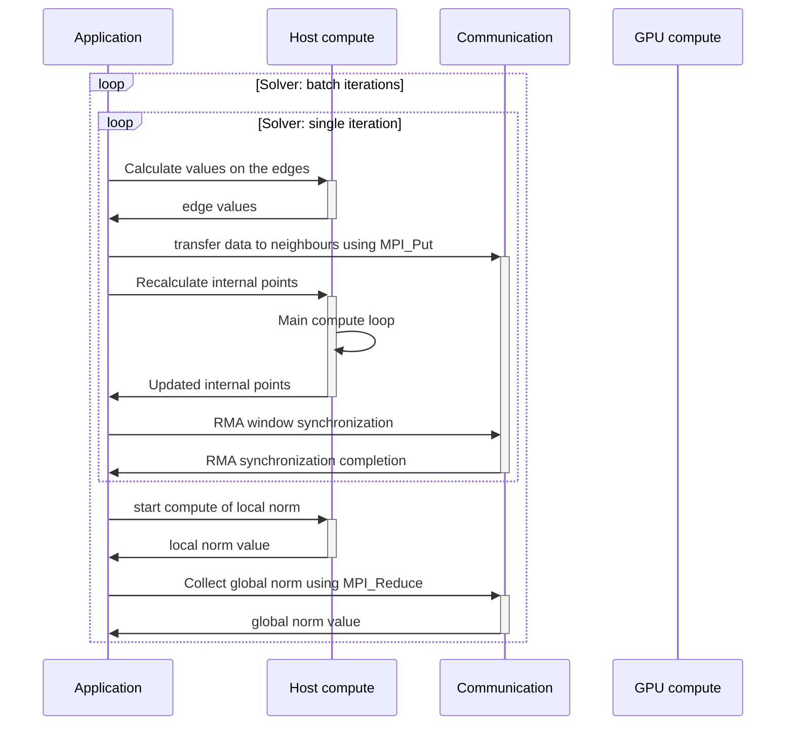
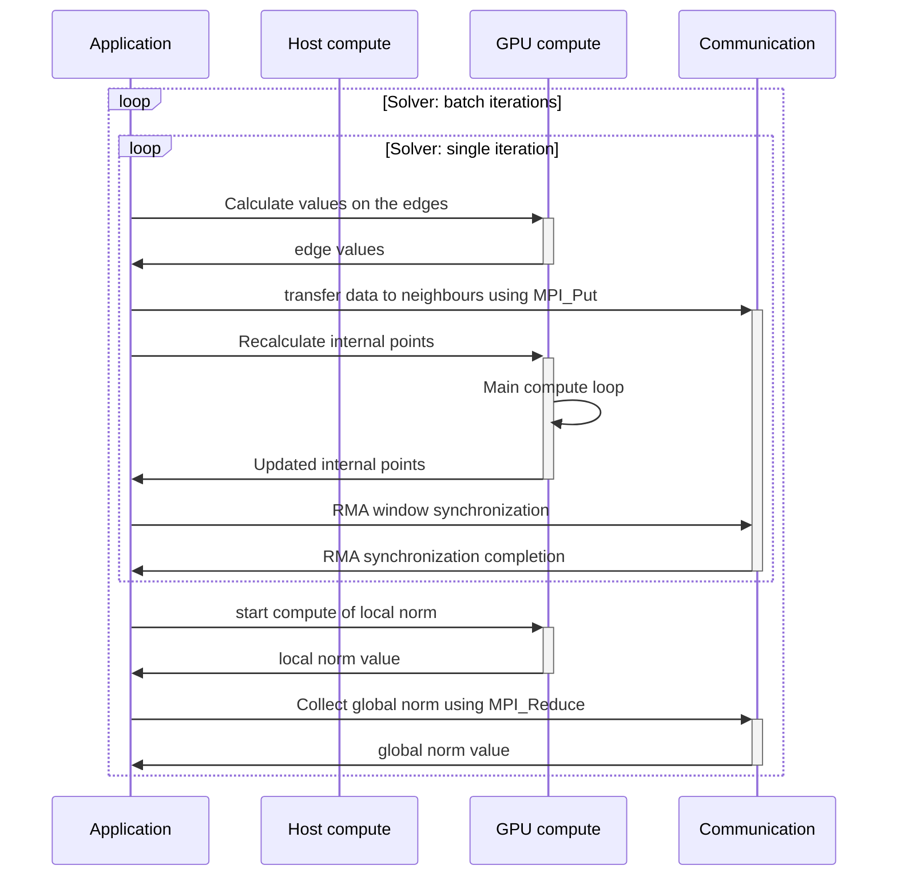
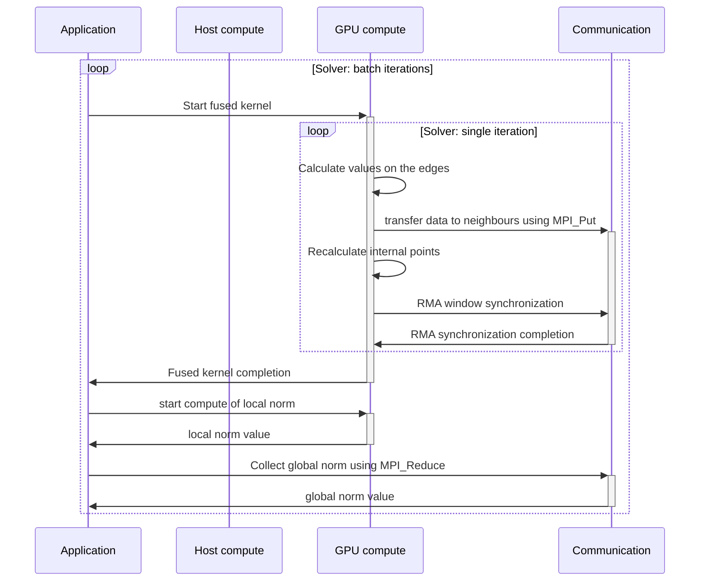
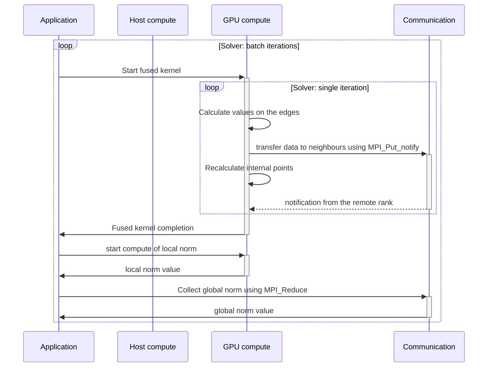

# `Distributed Jacobian Solver SYCL/MPI` sample

The `Distributed Jacobian Solver SYCL/MPI` demonstrates using GPU-aware MPI-3, one-sided communications available in the Intel® MPI Library.

| Area                | Description
|:---                 |:--
| What you will learn | How to use MPI-3 one-sided communications with GPU buffers and SYCL* offload to reach better compute/communication overlap.
| Time to complete    | 45 minutes
| Category            | Concepts and Functionality

For more information on Intel® MPI Library and complete documentation of all features,
see the [Intel® MPI Library Documentation](https://www.intel.com/content/www/us/en/developer/tools/oneapi/mpi-library-documentation.html) page.

## Purpose

The sample demonstrates an actual use case (Jacobian solver) for MPI-3 one-sided communications allowing to overlap compute kernel and communications. The sample illustrates how to use host- and device-initiated one-sided communication with SYCL kernels.

## Prerequisites

| Optimized for    | Description
|:---              |:---
| OS               | Linux*
| Hardware         | 4th Generation Intel® Xeon® Scalable processors <br> Intel® Data Center GPU Max Series
| Software         | Intel® MPI Library 2021.11

## Key Implementation Details

This sample implements a well-known distributed 2D Jacobi solver with 1D data distribution. The sample uses Intel® MPI [GPU Support](https://www.intel.com/content/www/us/en/docs/mpi-library/developer-reference-linux/current/gpu-support.html). 

The sample has three variants demonstrating different approaches to the Jacobi solver.

### `Data layout description`

The data layout is a 2D grid of size (Nx+2) x (Ny+2), distributed across MPI processes along the Y-axis.
The first and last rows/columns are constant and used for boundary conditions.
Each process handles Nx x (Ny/comm_size) subarray. 

```
             Left border                                Right border  
                  |                                            |
                  v                                            v
                 ------------------------------------------------
 Top border ---> |X|                                          |X|
                 ------------------------------------------------
                 | |                /\                        | |
                 | |                 |                        | |
                 | |                 |                        | |
                 | |                 |                        | |                    ------------------------------------------------
                 | |                 |                        | |                    |X|                                          |X| <- Last row of i-1 subarray from the previous iteration used for calculation
                 | |                 |                        | |....................------------------------------------------------
                 | |<--------- Nx x Ny array ---------------->| |                    | |                                          | |
                 | |                 |                        | |                    | |          i-th process subarray           | |
                 | |                 |                        | |                    | |            Nx x (Ny/comm_size)           | |
                 | |                 |                        | |                    | |                                          | |
                 | |                 |                        | |....................------------------------------------------------
                 | |                 |                        | |                    |X|                                          |X| <- First row of i+1 subarray from the previous iteration used for calculation
                 | |                 V                        | |                    ------------------------------------------------
                 ------------------------------------------------
 Bottom border-> |X|                                          |X|
                 ------------------------------------------------
```

### `01_jacobian_host_mpi_one-sided`

This program demonstrates a baseline implementation of the distributed Jacobian solver. In this sample you will see the basic idea of the algorithm, as well as how to implement the halo-exchange using MPI-3 one-sided primitives required for this solver.

The solver is an iterative algorithm where each iteration of the program recalculates border values first, then border values transfer to neighbor processes, which are used in next iteration of algorithm. Each process recalculates internal point values for the next iteration in parallel with communication. After a number of iterations, the algorithm reports norm values for validation purposes.



### `02_jacobian_device_mpi_one-sided_gpu_aware`

This program demonstrates how the same algorithm can be modified to add GPU offload capability. The program comes in two versions: OpenMP and SYCL. The program illustrates how device memory can be passed directly to MPI one-sided primitives. In particular, device memory can be passed to `MPI_Win_create` call to create an RMA Window placed on a device. Also, aside from a device RMA-window placement, device memory can be passed to `MPI_Put`/`MPI_Get` primitives as a target or origin buffer.



> **Note**: Only contiguous MPI datatypes are supported.

### `03_jacobian_device_mpi_one-sided_device_initiated`

This program demonstrates how to initiate one-sided communications directly from the offloaded code. The Intel® MPI Library allows calls to some communication primitives directly from the offloaded code (SYCL or OpenMP). This is the list of supported primitives:

- `MPI_Put`
- `MPI_Get`
- `MPI_Win_lock` / `MPI_Win_lock_all`
- `MPI_Win_unlock` / `MPI_Win_unlock_all`
- `MPI_Win_flush` / `MPI_Win_flush_all`
- `MPI_Win_fence`

To enable device-initiated communications, you must set an extra environment variable: `I_MPI_OFFLOAD_ONESIDED_DEVICE_INITIATED=1`.




### `04_jacobian_device_mpi_one-sided_device_initiated_notify`

---
**NOTE**
Intel® MPI Library 2021.13 is minimaly required version to run this sample.
Intel® MPI Library 2021.14 or later is recommended version to run this sample.

---

This program demonstrates how to initiate one-sided communications directly from the offloaded code. The Intel® MPI Library allows calls to some communication primitives directly from the offloaded code (SYCL or OpenMP). In contrast to the prior example, this one demonstrates the usage of one-sided communications with notification (extension of MPI-4.1 standard).

To enable device-initiated communications, you must set an extra environment variable: `I_MPI_OFFLOAD_ONESIDED_DEVICE_INITIATED=1`.



## Build the `Distributed Jacobian Solver SYCL/MPI` Sample

> **Note**: If you have not already done so, set up your CLI
> environment by sourcing  the `setvars` script in the root of your oneAPI installation.
>
> Linux*:
> - For system-wide installations: `. /opt/intel/oneapi/setvars.sh`
> - For private installations: ` . ~/intel/oneapi/setvars.sh`
> - For non-POSIX shells, like csh, use the following command: `bash -c 'source <install-dir>/setvars.sh ; exec csh'`
>
> For more information on configuring environment variables, or if you are using a Unified Directory Layout, see
*[Use the setvars and oneapi-vars Scripts with Linux*](https://www.intel.com/content/www/us/en/docs/oneapi/programming-guide/current/use-the-setvars-script-with-linux-or-macos.html)*.

### On Linux*

1. Change to the sample directory.

2. Run `make` to build a release version of the sample.
   ```
   make
   ```
   Alternatively, you can build the debug version.
   ```
   make debug
   ```

3. Clean the project files. (Optional)
   ```
   make clean
   ```

### Troubleshooting

If an error occurs, you can get more details by running `make` with
the `VERBOSE=1` argument:
```
make VERBOSE=1
```
If you receive an error message, troubleshoot the problem using the Diagnostics Utility. The diagnostic utility provides configuration and system checks to help find missing dependencies, permissions errors, and other issues. See the *[Diagnostics Utility for Intel® oneAPI Toolkits User Guide](https://www.intel.com/content/www/us/en/docs/oneapi/user-guide-diagnostic-utility/current/overview.html)* for more information on using the utility.

## Run the `Distributed Jacobian Solver SYCL/MPI` Sample

### On Linux

1. Run the sample using a `mpirun` command similar to the following:

   ```
   mpirun -n 2 -genv I_MPI_OFFLOAD=1 ./src/02_jacobian_device_mpi_one-sided_gpu_aware/mpi3_onesided_jacobian_gpu_sycl
   ```

Device-initiated communications require to set an extra environment variable: `I_MPI_OFFLOAD_ONESIDED_DEVICE_INITIATED=1`.

If everything worked, the Jacobi solver started an iterative computation for a defined number of iterations. By default, the sample reports norm values after every 10 computation iterations and reports the overall solver time at the end.

## Example Output

```
> mpirun  -n 4 -genv I_MPI_OFFLOAD=2 ./src/02_jacobian_device_mpi_one-sided_gpu_aware/mpi3_onesided_jacobian_gpu_sycl
NORM value on iteration 10: 52.074559
NORM value on iteration 20: 30.813843
NORM value on iteration 30: 22.697284
NORM value on iteration 40: 18.277382
NORM value on iteration 50: 15.453062
NORM value on iteration 60: 13.473527
NORM value on iteration 70: 11.999518
NORM value on iteration 80: 10.853941
NORM value on iteration 90: 9.934763
NORM value on iteration 100: 9.178795
Average solver time: 0.333635(sec)
```

## License

Code samples are licensed under the MIT license. See
[License.txt](License.txt) for details.

Third party program Licenses can be found here: [third-party-programs.txt](third-party-programs.txt).
