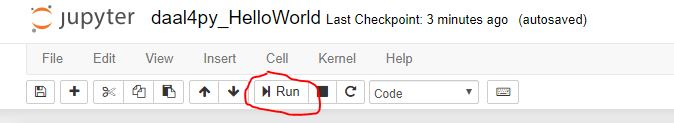
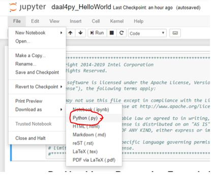

# daal4py Getting Started
This Getting Started sample code show how to do batch linear regression using the python API package daal4py from oneDAL. It demonstrates how to use software products that can be found in the [Intel AI Analytics Toolkit powered by oneAPI](https://software.intel.com/content/www/us/en/develop/tools/oneapi/ai-analytics-toolkit.html). 

| Optimized for                     | Description
| :---                              | :---
| OS                                | 64-bit Linux: Ubuntu 18.04 or higher, 64-bit Windows 10, macOS 10.14 or higher
| Hardware                          | Kaby Lake with GEN9 or newer
| Software                          | Intel oneAPI Deep Neural Network Library (oneDNN), Intel oneAPI DPC++ Compiler, Intel oneAPI Threading Building Blocks (oneTBB)
| What you will learn               | basic oneDNN programming model for Intel CPU and GPU
| Time to complete                  | 15 minutes

## What You Will Learn

* How to create oneDNN memory objects.
* How to get data from application buffer into a oneDNN memory object.
* How tensor's logical dimensions and memory object formats relate.
* How to create oneDNN primitives.
* How to execute the primitives.
* 
## Key implementation details 
This Getting Started sample code is implemented for CPU using the Python language. The example assumes you have daal4py and scikit-learn installed inside a conda environment, similar to what is delivered with the installation of the Intel(R) Distribution for Python as part of the [oneAPI AI Analytics Toolkit powered by oneAPI](https://software.intel.com/en-us/oneapi/ai-kit). 

## License  
This code sample is licensed under MIT license

## How to Build and Run 

oneAPI Data Analytics Library is ready for use once you finish the Intel AI Analytics Toolkit installation, and have run the post installation script.

You can refer to the oneAPI [main page](https://software.intel.com/en-us/oneapi) for toolkit installation, and the Toolkit [Getting Started Guide for Linux](https://software.intel.com/en-us/get-started-with-intel-oneapi-linux-get-started-with-the-intel-ai-analytics-toolkit) for post-installation steps and scripts.

## Activate conda environment With Root Access

Please follow the Getting Started Guide steps (above) to set up your oneAPI environment with the setvars.sh script. Then navigate in linux shell to your oneapi installation path, typically `~/intel/inteloneapi`. Intel Python environment will be activte by default. However, if you activated another environment, you can return with the following command:

#### Linux
```
source activate base
```

## Activate conda environment Without Root Access (Optional)

By default, the Intel AI Analytics toolkit is installed in the inteloneapi folder, which requires root privileges to manage it. If you would like to bypass using root access to manage your conda environment, then you can clone your desired conda environment using the following command:

#### Linux
```
conda create --name user_base --clone base
```

Then activate your conda environment with the following command:

```
source activate user_base
```

### Install _Jupyter Notebook_

Launch Jupyter Notebook in the directory housing the code example

```
conda install jupyter nb_conda_kernels
```

#### _View in Jupyter Notebook_

_Note: This distributed execution cannot be launched from the jupyter notebook version, but you can still view inside the notebook to follow the included write-up and description._

Launch Jupyter Notebook in the directory housing the code example

```
jupyter notebook
```

Open .pynb file and run cells in Jupyter Notebook using the "Run" button (see image)



##### Expected Printed Output for Cells (with similar numbers):
```
Here's our model:


 NumberOfBetas: 14

NumberOfResponses: 1

InterceptFlag: False

Beta: array(
  [[ 0.00000000e+00 -1.05416344e-01  5.25259886e-02  4.26844883e-03
     2.76607367e+00 -2.82517989e+00  5.49968304e+00  3.48833264e-03
    -8.73247684e-01  1.74005447e-01 -8.38917510e-03 -3.28044397e-01
     1.58423529e-02 -4.57542900e-01]],
  dtype=float64, shape=(1, 14))

NumberOfFeatures: 13

Here is one of our loaded model's features:

 [[ 0.00000000e+00 -1.05416344e-01  5.25259886e-02  4.26844883e-03
   2.76607367e+00 -2.82517989e+00  5.49968304e+00  3.48833264e-03
  -8.73247684e-01  1.74005447e-01 -8.38917510e-03 -3.28044397e-01
   1.58423529e-02 -4.57542900e-01]]
[CODE_SAMPLE_COMPLETED_SUCCESFULLY]
```


#### _Run as Python File_

Open notebook in Jupyter and download as python file



Run the Program

`python IntelPython_GettingStarted.py`

The output files of the script will be saved in the included models and results directories. 

##### Expected Printed Output (with similar numbers):
```
Here's our model:


 NumberOfBetas: 14

NumberOfResponses: 1

InterceptFlag: False

Beta: array(
  [[ 0.00000000e+00 -1.05416344e-01  5.25259886e-02  4.26844883e-03
     2.76607367e+00 -2.82517989e+00  5.49968304e+00  3.48833264e-03
    -8.73247684e-01  1.74005447e-01 -8.38917510e-03 -3.28044397e-01
     1.58423529e-02 -4.57542900e-01]],
  dtype=float64, shape=(1, 14))

NumberOfFeatures: 13

Here is one of our loaded model's features:

 [[ 0.00000000e+00 -1.05416344e-01  5.25259886e-02  4.26844883e-03
   2.76607367e+00 -2.82517989e+00  5.49968304e+00  3.48833264e-03
  -8.73247684e-01  1.74005447e-01 -8.38917510e-03 -3.28044397e-01
   1.58423529e-02 -4.57542900e-01]]
[CODE_SAMPLE_COMPLETED_SUCCESFULLY]
```

