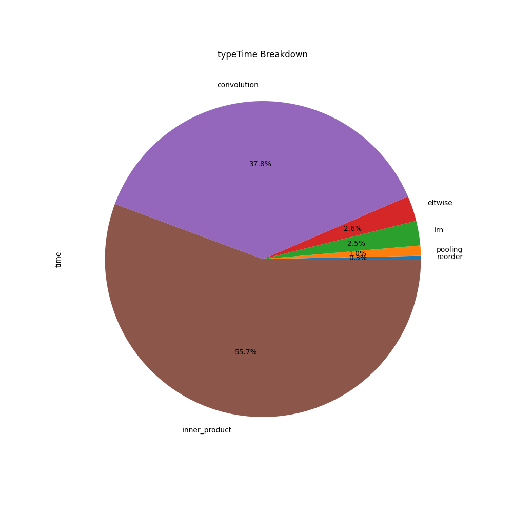
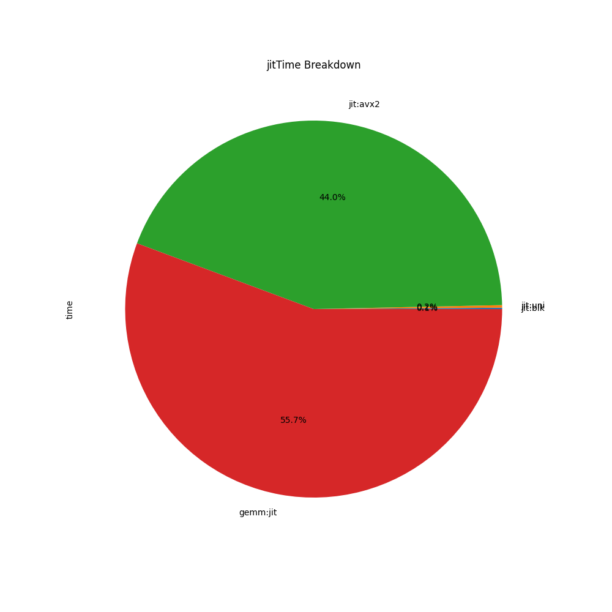
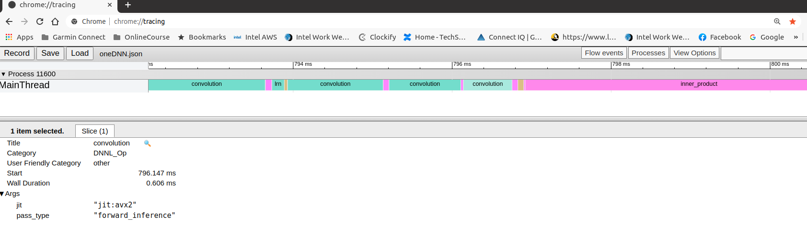

# oneDNN verbose log parser
This parser tool helps users to analyze oneDNN verbose logs with some statistic charts and a timeline chart.

*  A pie chart of oneDNN primitive types breakdown will be generated as the below diagram.  
  

*  A pie chart of oneDNN JIT kernels breakdown will be generated as the below diagram.  
  

*  A oneDNN.json file will be generated, and users could view the timeline result by loading oneDNN.json fie into chrome://tracing tool as the below diagram.  

## Prerequisites 

*  users need to get a oneDNN verbose log with display timestamp enabled from their workloads first.   
*  Please enable both oneDNN verobse log with timestamp by following commands.  
   `$export DNNL_VERBOSE=1`   
   `$export DNNL_VERBOSE_TIMESTAMP=1`  

## How to parse logs

### Raw log from frameworks like tensorflow or pytorch
*  parse a raw log "log.txt" from workload : `$python profile_utils.py log.txt` 
    *  users will see output from console
    *  users will also get some pie chart diagram PNG files like typeTime Breakdown.png
    *  users will also get a parsed output mkldnn_log.csv which only contains onednn logs

### Pure oneDNN log or parsed ouput 'mkldnn_log.csv'
*  parse a onednn log "mkldnn_log.csv" : `$python profile_utils.py mkldnn_log.csv` 
    * users will see output from console 
    * users will also get some pie chart diagram PNG files like typeTime Breakdown.png

### Compare two pure oneDNN logs 
*  compare two onednn log "a.csv" and "b.csv" : `$python profile_utils.py a.csv b.csv` 
    * users will see output from console 
    * users will also get a bar chart diagram PNG files like typeTime Comparison.png
