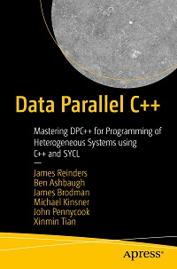

# Data Parallel C++ Book Source Samples

This repository accompanies
[*Data Parallel C++: Mastering DPC++ for Programming of Heterogeneous Systems using C++ and SYCL*](https://www.apress.com/9781484255735)
by James Reinders, Ben Ashbaugh, James Brodman, Michael Kinsner, John
Pennycook, Xinmin Tian (Apress, 2020).

[comment]: #cover


Many of the samples in the book are snips from the more complete files in this repository. The full files contain supporting code, such as header inclusions, which are not shown in every listing within the book. The complete listings are intended to compile and be modifiable for experimentation.

> :warning: Samples in this repository are updated to align with the most recent changes to the language and toolchains, and are more current than captured in the book text due to lag between finalization and actual publication of a print book. If experimenting with the code samples, start with the versions in this repository. DPC++ and SYCL are evolving to be more powerful and easier to use, and updates to the sample code in this repository are a good sign of forward progress!

Download the files as a zip using the green button, or clone the repository to
your machine using Git.

| Optimized for                       | Description
|:---                               |:---
| OS                                | Linux* Ubuntu* 18.04; Windows 10
| Hardware                          | Skylake with GEN9 or newer
| Software                          | Intel&reg; oneAPI DPC++/C++ Compiler

## Purpose
<add the purpose for this sample> Example: The code will attempt to execute on an available GPU and fall back to the system's CPU if a compatible GPU is not detected.  The compilation device is displayed in the output along with elapsed time to render the Mandelbrot image. This helps compare different offload implementations based on the complexity of the computation.
## License  
Code samples are licensed under the MIT license. See
[License.txt](https://github.com/oneapi-src/oneAPI-samples/blob/master/License.txt) for details.

Third-party program Licenses can be found here: [third-party-programs.txt](https://github.com/oneapi-src/oneAPI-samples/blob/master/third-party-programs.txt)

## Building the `InsertSampleName Here` Program for CPU?, GPU? FPGA? or other?

> :warning: The samples in this repository are intended to compile with the open source project toolchain linked below, or with the 2021.1 release or newer of the DPC++ toolchain. If you have an older toolchain installed, you may encounter compilation errors due to evolution of the features and extensions.
### Prerequisites

To build and use these examples, you will need and install a DPC++ toolkit
-[Intel® oneAPI Base Toolkit](https://software.intel.com/content/www/us/en/develop/tools/oneapi/base-toolkit.html)
-[Intel® oneAPI HPC Toolkit](https://software.intel.com/content/www/us/en/develop/tools/oneapi/hpc-toolkit.html)
-[Intel® oneAPI IoT Toolkit](https://software.intel.com/content/www/us/en/develop/tools/oneapi/iot-toolkit.html)

Alternatively, much of the toolchain can be built directly from:

- [Intel LLVM Github Repo](https://github.com/intel/llvm)

Some of the Chapter 18 examples require an installation of oneDPL, which is available from:
- [oneDPL](https://github.com/oneapi-src/oneDPL)

### Include Files
The include folder is located at %ONEAPI_ROOT%\dev-utilities\latest\include on your development system.

### Running Samples In DevCloud
<add additional details for running this sample on Devcloud>
Example: If running a sample in the Intel DevCloud, remember that you must specify the compute node (CPU, GPU, FPGA) and whether to run in batch or interactive mode. For more information, see the Intel® oneAPI Base Toolkit Get Started Guide (https://devcloud.intel.com/oneapi/get-started/base-toolkit/)

### On a Linux System

1. Setup oneAPI environment variables:
> Linux Sudo: . /opt/intel/oneapi/setvars.sh  
> Linux User: . ~/intel/oneapi/setvars.sh  

    ```sh
    source path/to/intel/oneapi/setvars.sh
    ```
2. Linux: Create build files using CMake.
   For example, to generate build files using `make`:
   
    ```sh
    mkdir build && cd build
    cmake -G "Unix Makefiles" ..
    ```

    NOTE: If you do not have oneDPL installed, you can disable compilation of
    those tests with the option `NODPL`

    ```sh
    cmake -G "Unix Makefiles" -DNODPL=1 ..
    ```
    Build with the generated build files:
    ```sh
    make
    ```

### On a Windows System

1. Setup oneAPI environment variables:
    > Windows: C:\Program Files(x86)\Intel\oneAPI\setvars.bat
    This will need to be run each time you open a new cmd window(non Persistent)
    - Aternatively you can search for the oneAPI cmd prompt - startmenu> look for `Intel oneAPI 202*`> "Intel oneAPI command prompt for Intel 64 for Visual Studio 2017"  

    On Windows:

    ```sh
    path\to\Intel\oneAPI\setvars.bat
    ```

2. Windows: Create build files using CMake, specifying the DPC++ toolchain.
   For example, to generate build files using `ninja`:

    ```sh
    mkdir build && cd build
    cmake -G "Ninja" ..
    ```

    NOTE: If you do not have oneDPL installed, you can disable compilation of
    those tests with the option `NODPL`

    ```sh
    cmake -G "Ninja" -DNODPL=1 ..
    ```
    Build with the generated build files:
    ```sh
    ninja install
    ```
