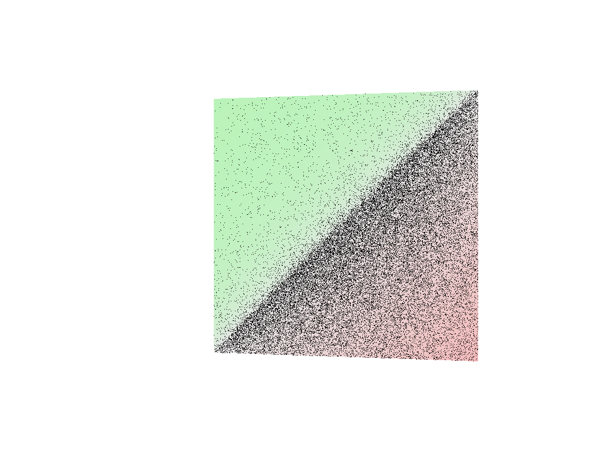

# Getting Started Sample for Intel&reg; Rendering Toolkit (Render Kit): Intel&reg; OSPRay

Intel&reg; OSPRay is an open source, scalable, and portable ray tracing engine
for high-performance, high-fidelity visualization. Easily build applications
that use ray tracing based rendering for both surface and volume-based
visualizations. OSPRay uses abstracted functionality from Intel&reg; Embree, Intel&reg; Open
Volume Kernel Library (Intel&reg; Open VKL), and Intel&reg; Open Image Denoise.

| Minimum Requirements              | Description
|:---                               |:---
| OS                                | Linux* Ubuntu* 22.04 <br>CentOS 8 (or compatible) <br>Windows* 10 or 11<br>macOS* 10.15+
| Hardware                          | <ul><li>Intel 64 Penryn CPU or higher with SSE4.1 extensions</li><ul><li>Optimized requirements: Intel 64 Skylake CPU or higher with AVX512 extentions) </li></ul><li>ARM64 with NEON extensions</li><li>GPUs: Xe-HPG, or Xe-HPC architecture based Intel&reg; Graphics devices including Intel&reg; Arc&trade; A-Series Graphics and Intel&reg; Data Center Graphics</li></ul>
| Compiler Toolchain                | Windows OS: MSVS 2022 (or 2019) installed with Windows SDK and CMake*; Other platforms: C++11 compiler, a C99 compiler (for example, gcc/c++/clang), and CMake*
| Libraries                         | <ul><li>Install Intel&reg; Rendering Toolkit (Render Kit), for Intel&reg; OSPRay, Intel&reg; Embree, Intel&reg; Open VKL, and Intel&reg; Open Image Denoise</li><li> Install Intel&reg; oneAPI Base Toolkit (Base Kit) for Intel&reg; oneAPI DPC++ Compiler and Runtimes</li><li>macOS: Base Kit not required on macOS</li></ul>
| Image Display Tool                | A .ppm filetype viewer (for example, [ImageMagick](https://www.imagemagick.org)).

| Optional Requirement                    | Description
|:---                                     |:---
| Intel GPU Configuration                 | **System BIOS**: [Quick Start](https://www.intel.com/content/www/us/en/support/articles/000091128/graphics.html) <br> **Windows\***: [Drivers for Intel&reg; Graphics products](https://www.intel.com/content/www/us/en/support/articles/000090440/graphics.html ) <br> **Linux\***: [Install Guide](https://dgpu-docs.intel.com/installation-guides/index.html#)

| Objective                         | Description
|:---                               |:---
| What you will learn               | How to build and run a basic rendering program using the Intel&reg; OSPRay API from the Render Kit.
| Time to complete                  | 5 minutes


## Purpose

- This getting started sample program, `ospTutorialCpp`, renders two conjoined
  triangles with the [Intel&reg; OSPRay
  API](https://www.ospray.org/documentation.html).
- Two renders of the triangles are written to .ppm image files on disk. The
  first image is rendered with one accumulation. The second image is rendered
  with ten accumulations.

One Accumulation:


Ten Accumulations:


## Key Implementation details

- The noise visible with only one accumulation is a common artifact of Monte
  Carlo based sampling. Notice the noise reduction (convergence) apparent in the
  image with ten accumulations.
- This sample uses the C++ API wrapper for the Intel&reg; OSPRay API. The C++
  API wrapper definitions are accessed via ospray_cpp.h. A pure C99 version of
  this tutorial is available on the [OSPRay github
  portal](https://github.com/ospray/ospray).
- This sample defines triangle vertex and color data using vector types found in
  the Render Kit rkcommon support library. These types can be swapped out for
  vector types found in the OpenGL* Math (GLM) library. An alternate, GLM,
  implementation of the sample is available for advanced users on the [OSPRay
  github portal](https://github.com/ospray/ospray).
- This sample renders single images. OSPRay is also used heavily in interactive
  rendering environments. Advanced users can see `ospExamples` on the [OSPRay
  github portal](https://github.com/ospray/ospray) and the [Intel OSPRay
  Studio](https://github.com/ospray/ospray_studio) showcase interactive
  application.

## Build and Run

### Windows

1. Run a new **x64 Native Tools Command Prompt for MSVS 2022**.

```
call <path-to-oneapi-folder>\setvars.bat
cd <path-to-oneAPI-samples>\RenderingToolkit\GettingStarted\01_ospray_gsg
mkdir build
cd build
cmake ..
cmake --build . --config Release
cd Release
.\ospTutorialCpp.exe
```
2. Example stdout output:
```
rendering initial frame to firstFrameCpp.ppm
rendering 10 accumulated frames to accumulatedFrameCpp.ppm
picked geometry [instance: 0000028FEA8F9860, model: 0000028FEA8CAE50, primitive: 1]
```

3. Review the first output image with a .ppm image viewer. Example using
   ImageMagick display:
```
<path-to-ImageMagick>\imdisplay.exe firstFrameCpp.ppm
```

4. Review the accumulated output image with a .ppm image viewer. Example using
   ImageMagick display:
```
<path-to-ImageMagick>\imdisplay.exe accumulatedFrameCpp.ppm
```

5. Intel&reg; Data Center GPU users: set the level zero flat device [hierarchy](https://www.intel.com/content/www/us/en/developer/articles/technical/flattening-gpu-tile-hierarchy.html) environment variable to composite:
```
set ZE_FLAT_DEVICE_HIERARCHY=COMPOSITE
```

6. GPU (Beta in 2024.0) users try running the application in GPU mode:
```
REM close imdisplay and delete get started images
del firstFrameCpp.ppm
del accumulatedFrameCpp.ppm
REM run program
.\ospTutorialCpp.exe --osp:load-modules=gpu --osp:device=gpu

```

7. Review stdout output. Notice, picking `ospPick(..)` functionality is not available on GPU in the initial Intel&reg; OSPray 3.0 release:
```
rendering initial frame to firstFrameCpp.ppm
rendering 10 accumulated frames to accumulatedFrameCpp.ppm
picked geometry [instance: 0000000000000000, model: 0000000000000000, primitive: 4294967295]
```

8. Review GPU generated output images like in steps 3. and 4. above.

### Linux

1. Start a new Terminal session.
```
source <path-to-oneapi-folder>/setvars.sh
cd <path-to-oneAPI-samples>/RenderingToolkit/GettingStarted/01_ospray_gsg
mkdir build
cd build
cmake ..
cmake --build .
./ospTutorialCpp
```

2. Example stdout output:
```
rendering initial frame to firstFrameCpp.ppm
rendering 10 accumulated frames to accumulatedFrameCpp.ppm
picked geometry [instance: 0000028FEA8F9860, model: 0000028FEA8CAE50, primitive: 1]
```

3. Review the first output image with a .ppm image viewer. Example using
   ImageMagick display:
```
<path-to-ImageMagick>/display-im6 firstFrameCpp.ppm
```

4. Review the accumulated output image with a .ppm image viewer. Example using
   ImageMagick display:
```
<path-to-ImageMagick>/display-im6 accumulatedFrameCpp.ppm
```

5. Intel&reg; Data Center GPU users: set the level zero flat device [hierarchy](https://www.intel.com/content/www/us/en/developer/articles/technical/flattening-gpu-tile-hierarchy.html) environment variable to composite:
```
export ZE_FLAT_DEVICE_HIERARCHY=COMPOSITE
```

6. GPU (Beta in 2024.0) users try running the application in GPU mode:
```
# close display-im6 and delete get started images
rm firstFrameCpp.ppm
rm AccumulatedFrameCpp.ppm
# run program
./ospTutorialCpp --osp:load-modules=gpu --osp:device=gpu

```

7. Review stdout output. Notice, picking `ospPick(..)` functionality is not available on GPU in the initial Intel&reg; OSPray 3.0 release:
```
rendering initial frame to firstFrameCpp.ppm
rendering 10 accumulated frames to accumulatedFrameCpp.ppm
picked geometry [instance: 0000000000000000, model: 0000000000000000, primitive: 4294967295]
```

8. Review GPU generated output images like steps 3. and 4. above.

### macOS

1. Start a new Terminal session.

```
source <path-to-oneapi-folder>/setvars.sh
cd <path-to-oneAPI-samples>/RenderingToolkit/GettingStarted/01_ospray_gsg
mkdir build
cd build
cmake ..
cmake --build .
./ospTutorialCpp
```

2. Review the first output image with a .ppm image viewer. Example using
   ImageMagick display:
```
<path-to-ImageMagick>/imdisplay firstFrameCpp.ppm
```

3. Review the accumulated output image with a .ppm image viewer. Example using
   ImageMagick display:
```
<path-to-ImageMagick>/imdisplay accumulatedFrameCpp.ppm
```

## Troubleshoot

If you observe segmentation faults on Intel&reg; Data Center Max GPU, please ensure you have set environment variables by:
1. Using the setvars script
2. Setting level zero flat device hierarchy environment variable to composite.

To look for variables on Linux* OS:
```
env | grep LD_LIBRARY_PATH
env | grep ONEAPI
env | grep ZE_
```

Windows* OS:
```
set | findstr PATH
set | findstr ONEAPI
set | findstr ZE_
```

Intel&reg; Xe-LP architecture devices are not supported.

## License

This code sample is licensed under the Apache 2.0 license. See
[LICENSE.txt](LICENSE.txt) for details.

Third party program Licenses can be found here:
[third-party-programs.txt](https://github.com/oneapi-src/oneAPI-samples/blob/master/third-party-programs.txt).
