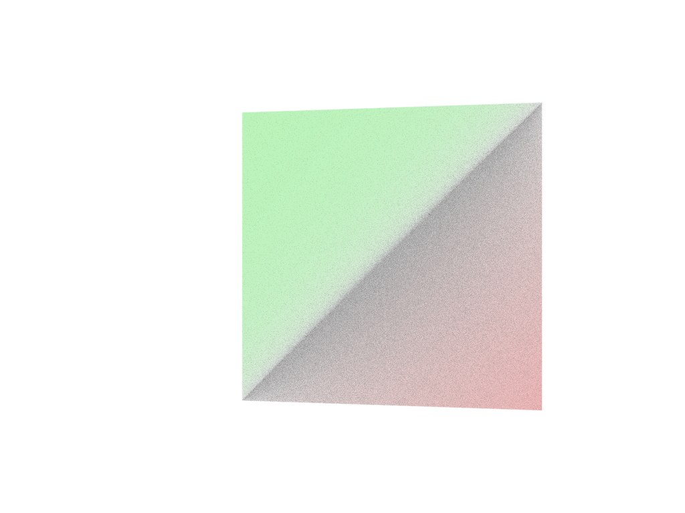

# Getting Started Sample for Intel&reg; oneAPI Rendering Toolkit (Render Kit): Intel&reg; Open Image Denoise


The Intel&reg; Open Image Denoise (Intel &reg; OIDN) is an open source library of high-performance,
high-quality, denoising filters for images rendered with ray tracing. Significantly reduce rendering times in ray tracing based rendering applications.

| Minimum Requirements              | Description
|:---                               |:---
| OS                                | Linux* Ubuntu* 18.04, 22.04 (or compatible) <br>CentOS 8 (or compatible) <br>Windows8, 10, 11 <br>macOS 10.15+
| Hardware                          | <ul><li>Intel 64 Penryn CPU or higher with SSE4.1 extensions</li><ul><li>Optimized requirements: Intel 64 Skylake CPU or hiigher with AVX512 extentions) </li></ul><li>ARM64 with NEON extensions</li><li>Xe-LP, Xe-HPG, or Xe-HPC architecture based Intel&reg; Graphics devices including Intel&reg; Processor Graphics, Intel&reg; Arc&trade; Graphics, and Intel&reg; Data Center Graphics</li><li>Volta, Turing, Ampere, Ada Lovelace, and Hopper architecture based NVIDIA* GPU devices</li><li>RDNA2 (Navi 21) and RDNA3 (Navi 3x) architecture based AMD* GPU devices</li></ul>
| Compiler Toolchain                | Windows* OS: MSVS 2019 or higher installed with Windows* SDK and CMake*<br> Other platforms: C++11 compiler, a C99 compiler (ex: gcc/c++/clang), and CMake*
| Libraries                         | <ul><li>Install Intel&reg; oneAPI Rendering Toolkit (Render Kit), including Intel&reg; Open Image Denoise and Intel&reg; oneTBB</li><li>Install Intel&reg; oneAPI Base Toolkit (Base Kit) for included Intel&reg; oneAPI DPC/C++ Compiler Runtimes (SYCL* library)</li></ul>
| Image Display Tool                | A `.ppm`/`.pfm` filetype viewer (for example, [ImageMagick](https://www.imagemagick.org)).
| Image Conversion Tool             | A converter for `.ppm`, `.pfm`, and endian conversions (for example, ImageMagick).


| Objective                         | Description
|:---                               |:---
| What you will learn               | How to build and run a basic rendering denoiser program using the Intel&reg; Open Image Denoise API from the Render Kit.
| Time to complete                  | 5 minutes


## Purpose

This getting started sample program, `oidnDenoise`, denoises a raytraced image using the Open Image Denoise API.
The output is written to disk as a .pfm image file.

Example input:


Example output:


## Key Implementation Details

- The `oidnDenoise` program input is a noisy image. In this example, the `accumulatedFrameCpp`
  portable float map (`.pfm`) image is used for input. Recall, this image was originally generated from the
  Intel&reg; OSPRay getting started sample, `ospTutorial`. 
- Device targeting is exposed in the `oidnDenoise` application via the `-d` command line toggle. 
- The program writes a denoised `.pfm` image file to disk.
- The sample program demonstrates usage of the [Open Image Denoise API](https://github.com/OpenImageDenoise/oidn/blob/master/readme.pdf) (3MB pdf)

## Build and Run

You may either use the given input image file in this directory `accumlatedFrameCpp.pfm` or use the output of the Intel&reg; OSPRay getting started sample program, `ospTutorial`, to generate the input image file. Find the sample in the [01_ospray_gsg](../01_ospray_gsg) folder of this samples repository.


### Windows

1. Run a new **x64 Native Tools Command Prompt for MSVS 2022**. Build the this sample program `oidnDenoise`:

```
call <path-to-oneapi-folder>\setvars.bat
cd <path-to-oneAPI-samples>\RenderingToolkit\GettingStarted\04_oidn_gsg
mkdir build
cd build
cmake ..
cmake --build . --config Release
cd Release
```

2. If you are using the [01_ospray_gsg](../01_ospray_gsg) samples, convert the accumulatedFrameCpp.ppm image to LSB data ordering and .pfm
   format. Example conversion with ImageMagick convert:

```
<path-to-ImageMagick>\magick.exe convert <path-to-gsg>\01_ospray_gsg\build\Release\accumulatedFrameCpp.ppm -endian LSB PFM:accumulatedFrameCpp.pfm
```

3. Denoise the image:

```
.\oidnDenoise.exe -d cpu -hdr <path-to-pfm-image>\accumulatedFrameCpp.pfm -o denoised.pfm
```

4. If you have a capable GPU device, also try denoising the image using GPU:

```
.\oidnDenoise.exe -d sycl -hdr <path-to-pfm-image>\accumulatedFrameCpp.pfm -o denoised.pfm
```

5. Review the output for visual comparison to the input. Example view with
   ImageMagick display:

```
<path-to-ImageMagick>\imdisplay.exe denoised.pfm
<path-to-ImageMagicl>\imdisplay.exe <path-to-pfm-image>\accumulatedFrameCpp.pfm
```

### Linux

1. Start a new Terminal session. Build the sample program `oidnDenoise`:
```
source <path-to-oneapi-folder>/setvars.sh
cd <path-to-oneAPI-samples>/RenderingToolkit/GettingStarted/04_oidn_gsg
mkdir build
cd build
cmake ..
cmake --build .
```

2. If you are using the [01_ospray_gsg](../01_ospray_gsg) sample, convert the `accumulatedFrameCpp.ppm` image to LSB data ordering and .pfm
   format. Example conversion with ImageMagick convert:
```
<path-to-ImageMagick>/convert-im6 <path-to-gsg>/01_ospray_gsg/build/accumulatedFrameCpp.ppm -endian LSB PFM:accumulatedFrameCpp.pfm
```

3. Denoise the image.

```
./oidnDenoise -d cpu -hdr <path-to-pfm-image>/accumulatedFrameCpp.pfm -o denoised.pfm
```

4. If you have a capable GPU device, also try denoising the image using GPU:
```
./oidnDenoise -d sycl -hdr <path-to-pfm-image>/accumulatedFrameCpp.pfm -o denoised.pfm
```

5. Review the output for visual comparison to the input. Example view with
   ImageMagick display:

```
<path-to-ImageMagick>/display-im6 denoised.pfm
<path-to-ImageMagick>/display-im6 <path-to-pfm-image>/accumulatedFrameCpp.pfm
```


### macOS

1. Start a new Terminal session. Build the sample program `oidnDenoise`:

```
source <path-to-oneapi-folder>/setvars.sh
cd <path-to-oneAPI-samples>/RenderingToolkit/GettingStarted/04_oidn_gsg
mkdir build
cd build
cmake ..
cmake --build .
```

2. If you are using the [01_ospray_gsg](../01_ospray_gsg) sample, convert the `accumulatedFrameCpp.ppm` image to LSB data ordering and .pfm
   format. Example conversion with ImageMagick convert:
```
<path-to-ImageMagick>/magick convert <path-to-gsg>/01_ospray_gsg/build/accumulatedFrameCpp.ppm -endian LSB PFM:accumulatedFrameCpp.pfm
```

3. Denoise the image.

```
./oidnDenoise -d cpu -hdr accumulatedFrameCpp.pfm -o denoised.pfm
```

4. Review the output for visual comparison to the input. Example view with
   ImageMagick display.

```
<path-to-ImageMagick>/imdisplay denoised.pfm
<path-to-ImageMagick>/imdisplay <path-to-pfm-image>/accumulatedFrameCpp.pfm
```

## Next Steps

- Of course, `oidnDenoise` can denoise other, user-provided noisy input images. Try it!
- Along with the input image, the program can optionally take in albedo and normal buffers
  corresponding to the same pixels of the input image. Inclusion of such
  auxialiary feature images can significantly improve denoising quality. 
- The Intel&reg; OSPRay Studio showcase application demonstrates in-source
  denoising with the Intel&reg; OSPRay library. The noisy image buffer and
  auxiliary buffers are readily emitted from the Intel&reg; OSPRay API. All
  configured OSPray Framebuffer channels are fed through the denoiser for a high quality interactive
  experience.
- You can list oidn capable devices through the program by running with just the `-ld` toggle. If you have a capable non-Intel device, try `-d hip` or `-d cuda` as appropriate.

### OSPRay and OIDN

To add an Open Image Denoise API image operation pass with OSPRay edit the `01_ospray_gsg` sample program to change a few things! Steps to add the pass (see source below):

0. See [OSPRay API Manual](https://www.ospray.org/documentation.html)
1. The frame buffer is to be a float buffer, notice the use of `OSP_FB_RGBA32F` format. You may also add `OSP_FB_NORMAL` and `OSP_FB_ALBEDO` to the frame buffer channels.
2. We create an array of OSPImageOperation objects. Then initialize the first object as a denoiser. The object is committed.
3. Since the image operations are an array an ospray object data array is setup to bing the image operations. The new data object is committed.
4. The data object is set to the frame buffer, specifying the `"imageOperation"` parameter. The frame buffer is committed.
5. Don't forget to release the `data` and `imops[0]` objects by the end of the program. (`ospRelease(..)`)
6. Don't forget writing the image to disk needs to conversion from float format to the output you use... Here is a verbose (self-documenting) conversion:


Updated pass integration source:
```
//  OSPFrameBuffer framebuffer =
//    ospNewFrameBuffer(imgSize.x, imgSize.y, OSP_FB_SRGBA,
//                      OSP_FB_COLOR | /*OSP_FB_DEPTH |*/ OSP_FB_ACCUM);
    
  OSPFrameBuffer framebuffer =
      ospNewFrameBuffer(imgSize.x, imgSize.y, OSP_FB_RGBA32F,
                        OSP_FB_COLOR | /*OSP_FB_DEPTH |*/ OSP_FB_ACCUM);
     
  //We make this an array because the array can be extended to include a tonemap pass 
  OSPImageOperation imops[1];
  imops[0] = ospNewImageOperation("denoiser");
  ospCommit(imops[0]);   

  data = ospNewSharedData1D(imops, OSP_IMAGE_OPERATION, 1);
  ospCommit(data);
  ospSetObject(framebuffer, "imageOperation", data);  

  // Existing code below
  ospCommit(framebuffer);
  ospResetAccumulation(framebuffer);

  printf("rendering initial frame to firstFrame.png...");
```

Updated buffer write out example:
```
void writeHDPNG(const char *fileName, const vec2i &size, const float *pixel) {
  constexpr int nChannels{4};
  const int stride{nChannels * size.x};
  /* Added for OIDN */
  uint32_t* pxout = (uint32_t*)malloc(sizeof(uint32_t)*size.x*size.y);
  for(size_t j = 0; j < size.y; j++) {
   for(size_t i = 0; i < size.x; i++) {
       uint32_t r = (unsigned char)clamp(pixel[j * nChannels * size.x + i * nChannels] * 255.f, 0.f, 255.0f);
       uint32_t g = (unsigned char)clamp(pixel[j * nChannels * size.x + i * nChannels + 1] * 255.f, 0.f, 255.0f);
       uint32_t b = (unsigned char)clamp(pixel[j * nChannels * size.x + i * nChannels + 2] * 255.f, 0.f, 255.0f);
       uint32_t a = (unsigned char)clamp(pixel[j * nChannels * size.x + i * nChannels + 3] * 255.f, 0.f, 255.0f);
       pxout[j * size.x + i] = (a << 24) | (b << 16) | (g << 8) | r;
       //Repack the color channels
       //Example for r... here are is where r should be for the pxout array of uint32_t objects: 0x000000000000FFFFh
       //Example for r in a binary representation of the above 0x00000000000000000000000011111111b
       //Example for g... here are is where g should be for the pxout array of uint32_t objects: 0x00000000FFFF0000h
       //Example for g in a binary representation of the above 0x00000000000000001111111100000000b
   }
  }
        
  stbi_write_png(fileName, size.x, size.y, nChannels, pxout, stride);
  if(pxout) { 
      free(pxout);
      pxout = 0;
  }
}
```


## License

This code sample is licensed under the Apache 2.0 license. See
[LICENSE.txt](LICENSE.txt) for details.

Third party program Licenses can be found here:
[third-party-programs.txt](https://github.com/oneapi-src/oneAPI-samples/blob/master/third-party-programs.txt).

*Other names and brands may be claimed as the property of others.
