# Introduction to Ray Tracing with Intel&reg; Embree on Intel&reg;CPU

## Purpose
This sample demonstrates building and running a basic geometric ray tracing
application with Intel&reg; Embree on an Intel CPU.

- Use this code and accompanying walkthrough to understand basic ray tracing of an image with the Intel&reg; Embree API. This sample prepares an API
explorer for further self-directed exploration of Intel&reg; Embree repository
tutorial programs. 

- You can expect to need less than 5 minutes to compile, run,
and review the ouput imagery. However, you might need 20 minutes (or more) to
understand the walkthrough and code depending on rendering algorithm and math
familiarity.

- This sample source code is derived from the `triangle_geometry`
source hosted as part of the Intel&reg; Embree tutorials in the [Embree
repository](https://github.com/embree/embree) on GitHub.

__Output Image:__


## Prerequisites

| Minimum Requirements              | Description
|:---                               |:---
| OS                                | Linux* Ubuntu* 18.04 <br>CentOS* 8 (or compatible) <br>Windows* 10 <br>macOS* 10.15+
| Hardware                          | Intel 64 Penryn or higher with SSE4.1 extensions; ARM64 with NEON extensions <br>(Optimization requirement: Intel&reg; Embree is further optimized for Intel 64 Skylake or higher with AVX512 extensions)
| Compiler Toolchain                | Windows* OS: MSVS 2019 or MSVS 2022 with Windows* SDK and CMake* <br>Other platforms: C++11 compiler and CMake*
| Libraries                         | Install Intel&reg; oneAPI Rendering Toolkit (Render Kit), including Intel&reg; Embree and Intel® oneAPI Threading Building Blocks (oneTBB) <br>Install Intel&reg; oneAPI Base Toolkit for the `dev-utilities` default component
| Tools                             | .png capable image viewer

## Build and Run

### Windows*

Open a new x64 Native Command Prompt for VS 2019. Navigate to the source folder:

```
cd <path-to-oneAPI-Samples>\RenderingToolkit\Tutorial\IntroToRayTracingWithEmbree\cpu
```

Build and Run the Application:
```
call <path-to-oneAPI>\setvars.bat
mkdir build
cd build
cmake -G"Visual Studio 16 2019" -A x64 ..
cmake --build . --config Release
cd Release
.\rkRayTracer.exe
```
**Note**: Visual Studio 2022 users should use the x64 NAtive Command Prompt for VS 2022 and `-G"Visual Studio 17 2022"`
generator flag.

Open the resulting image file: `rkRayTracer.png` with an image viewer.

### Linux* or macOS*

Open a new Terminal. Navigate to the source folder:

````
cd <path-to-oneAPI-Samples>/RenderingToolkit/Tutorial/IntroToRayTracingWithEmbree/cpu
````

```
source <path-to-oneAPI>/setvars.sh
mkdir build
cd build
cmake -DCMAKE_BUILD_TYPE=Release ..
cmake --build .
./rkRayTracer
```

Open the resulting image file, `rkRayTracer.png` , with an image viewer.

## Scene Description

### Geometric Objects

1. The code renders an image of two geometric objects from a perspective camera.
   The first object is a cube. The cube consists of 8 vertices, 12 triangles,
   and 6 faces. Triangles are our primitive geometric object.
2. The cube is of size 2 x 2 x 2 units and is centered about the origin in
   (x,y,z) cartesian world space. Each cube face (group of two triangles) is
   given a new color.
3. The second object is our ground plane. The ground plane consists of 4
   vertices, 2 triangles, and 1 face. The ground plane is red.
4. The ground plane is 20 x 20 units in world space. The center of the ground
   plane is 0, -2, 0 in cartesian (x,y,z) coordinate world space. The plane is
   coplanar with $y=-2$;

### Light
1. An infinite-distanced directional light is defined. The light is traveling in
   the direction of -1, -1, -1.

### Camera Transform and Ray Casts

1. A perspective camera is positioned at 1.5, 1.5, -1.5 in cartesian (x,y,z)
   world space. The camera is looking at the origin 0, 0, 0. The camera is thus
   facing the center of the cube.
2. The world 'up' direction is aligned with the positive y axis (0, 1, 0).
3. The camera is defined with an angular field of vision, specifically 90
   degrees. It is also given as a width and height in pixels. We use the image
   aspect ratio, the field of vision, camera position, and camera look-at point
   to transform each ray cast based on which pixel is being computed.
5. All image pixel color values are initialized to black. When a ray is cast and
   an object hit occurs, the color associated with the intersected triangle is
   queried. The queried color is added to the image pixel at half
   magnitude/intensity.
6. A second hit query occurs determines if the hit is not in shadow with respect
   to our light. If the hit is not in shadow, the image pixel intensity doubles.
   The shadow is a function of the dot product between the light direction and
   the direction normal to the surface. The limited intensity gives the
   impression of the cube casting a shadow onto our ground plane.
7. The computed image is written to disk for review.

### Example images

__The cube rendered by itself from the given camera position: 1.5, 1.5, -1.5__

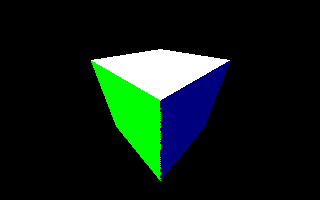

__The cube rendered from the opposite camera position: -1.5, -1.5, 1.5__


__The ground plane rendered by itself from camera position 1.5, 1.5, -1.5. The
shadows from the omitted cube are still rendered__

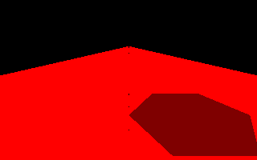

__Default sample program output image__


## Code Walkthrough using Embree API

Beginning in the main function, an Intel&reg; Embree device is created using the
`rtcNewDevice` function. The object created by `rtcNewDevice` provides a factory
for all other Embree objects. These objects, such as geometry, can only be used
with their associated device. In this sample, the `nullptr` represents no
configuration parameters in use. Look for `rtc` as a prefix for Intel&reg;
Embree API function calls and `RTC` as a prefix for Embree API data structures.

```
    /* create device */
    g_device = rtcNewDevice(nullptr);
```
**Note**: Configuration parameters provide threading control, isa selection,
frequency control, and internal memory control. Explorers are encouraged to use
the no-parameter default until they begin benchmarking their completed solution.

`rtcSetDeviceErrorFunction` allows the Intel&reg; Embree runtime to assign our
developer defined error function as a call back if an error occurs. If a call to
the Embree API generates and error, the error handler will be executed.

Next, initialize objects. The `device_init` user function sets up objects to be
associated with our Embree `RTCDevice`. The code initializes the Intel&reg;
Embree `RTCScene`. A scene is a collection of Embree objects. The intersect and
occluded API functions work on these scenes. (Think of a scene as representing a
spatial acceleration structure, such as a bounding volume hierarchy.) Proceed to
define the cube and ground plane.

```
void device_init(char* cfg) {
  /* create scene */
  g_scene = nullptr;
  g_scene = rtcNewScene(g_device);

  /* add cube */
  geomIDs.push_back(addCube(g_scene));

  /* add ground plane */
  geomIDs.push_back(addGroundPlane(g_scene));

  /* commit changes to scene */
  rtcCommitScene(g_scene);
}
```

### Cube


1. The cube is defined first by creating our needed `RTCGeometry` object. The
`RTCGeometry` mesh that represents our cube is attached to our scene later.

```
  /* create a triangulated cube with 12 triangles and 8 vertices */
  RTCGeometry mesh = rtcNewGeometry(g_device, RTC_GEOMETRY_TYPE_TRIANGLE);
```

2. We create 16 byte aligned arrays for vertex and face color information. These
   arrays will be indexed when we determine color contributions to pixels of
   interest. When binding these buffers, the alignment helps Embree optimize for
   performance.
```
  /* create face and vertex color arrays */
  g_cube_face_colors = (Vec3fa*)alignedMalloc(sizeof(Vec3fa) * 12, 16);
  g_cube_vertex_colors = (Vec3fa*)alignedMalloc(sizeof(Vec3fa) * 8, 16);
```
3. We create set our geometry buffer of 8 vertices using the
   `rtcSetNewGeometryBuffer` function.  Then proceed to assign vertex color
   values and spatial locations for the vertices.
```
  /* set vertices and vertex colors */
  Vertex* vertices = (Vertex*)rtcSetNewGeometryBuffer(
      mesh, RTC_BUFFER_TYPE_VERTEX, 0, RTC_FORMAT_FLOAT3, sizeof(Vertex), 8);
  g_cube_vertex_colors[0] = Vec3fa(0, 0, 0);
  vertices[0].x = -1;
  vertices[0].y = -1;
  vertices[0].z = -1;
...
```
4. We create an index buffer to create triangles from indexed collections of
   vertices. We assign the vertices of each triangle in our cube.

```
/* set triangles and face colors */
  int tri = 0;
  Triangle* triangles = (Triangle*)rtcSetNewGeometryBuffer(
      mesh, RTC_BUFFER_TYPE_INDEX, 0, RTC_FORMAT_UINT3, sizeof(Triangle), 12);

  // left side
  g_cube_face_colors[tri] = Vec3fa(1, 0, 0);
  triangles[tri].v0 = 0;
  triangles[tri].v1 = 1;
  triangles[tri].v2 = 2;
  tri++;
  g_cube_face_colors[tri] = Vec3fa(1, 0, 0);
...
```
5. The number of vertex attributes of the `mesh` object is set. Then we set our
   cube vertex attributes, our vertex colors, to the first slot for the `mesh`.
   The `rtcCommitGeometry(mesh)` updates internal state for the geometry. This
   allows for interpolations (see `rtcInterpolate`) or commitments to scene to
   occur.


```
  rtcSetGeometryVertexAttributeCount(mesh, 1);
  rtcSetSharedGeometryBuffer(mesh, RTC_BUFFER_TYPE_VERTEX_ATTRIBUTE, 0,
                             RTC_FORMAT_FLOAT3, g_cube_vertex_colors, 0,
                             sizeof(Vec3fa), 8);
```

6. `rtcAttachGeometry` attaches the `RTCGeometry` to the `RTCScene`. At this
   point, the geometry is included inside of the `RTCScene`. The `RTCGeometry`
   can be released with `rtcReleaseGeometry` after is has been attached to the
   scene. The geometry ID is returned so we can identify geometries that ray
   operations will intersect later.

```
  rtcCommitGeometry(mesh);
  unsigned int geomID = rtcAttachGeometry(scene_i, mesh);
  rtcReleaseGeometry(mesh);
  return geomID;
```
### Ground Plane

1. `RTCGeometry` and color array creation are like the creation used for the
   cube. However, in this plane case, the number of faces and vertices are two
   and four respectively:

```
  /* create a triangulated plane with 2 triangles and 4 vertices */
  RTCGeometry mesh = rtcNewGeometry(g_device, RTC_GEOMETRY_TYPE_TRIANGLE);

  /* create face and vertex color arrays */
  g_ground_face_colors = (Vec3fa*)alignedMalloc(sizeof(Vec3fa) * 2, 16);
  g_ground_vertex_colors = (Vec3fa*)alignedMalloc(sizeof(Vec3fa) * 4, 16);
```

2. The creation of the geometry buffer is similar to our cube. In this case,
   again only 4 vertices and two triangles are needed. Colors are assigned
   similarly.

```
/* set vertices */
  Vertex* vertices = (Vertex*)rtcSetNewGeometryBuffer(
      mesh, RTC_BUFFER_TYPE_VERTEX, 0, RTC_FORMAT_FLOAT3, sizeof(Vertex), 4);
  g_ground_vertex_colors[0] = Vec3fa(1, 0, 0);
  vertices[0].x = -10;
  vertices[0].y = -2;
  vertices[0].z = -10;
  g_ground_vertex_colors[1] = Vec3fa(1, 0, 1);
...
/* set triangles */
  Triangle* triangles = (Triangle*)rtcSetNewGeometryBuffer(
      mesh, RTC_BUFFER_TYPE_INDEX, 0, RTC_FORMAT_UINT3, sizeof(Triangle), 2);

  g_ground_face_colors[0] = Vec3fa(1, 0, 0);
  triangles[0].v0 = 0;
  triangles[0].v1 = 1;
  triangles[0].v2 = 2;
  g_ground_face_colors[1] = Vec3fa(1, 0, 0);
...
```

3.  Similar again to the cube: vertex attributes are set, the `RTCGeometry` is
    committed and attached to the scene, a geometry ID is captured, and the
    `RTCGeometry` is released:

```
  rtcSetGeometryVertexAttributeCount(mesh, 1);
  rtcSetSharedGeometryBuffer(mesh, RTC_BUFFER_TYPE_VERTEX_ATTRIBUTE, 0,
      RTC_FORMAT_FLOAT3, g_ground_vertex_colors, 0,
      sizeof(Vec3fa), 4);

  rtcCommitGeometry(mesh);
  unsigned int geomID = rtcAttachGeometry(scene_i, mesh);
  rtcReleaseGeometry(mesh);
  return geomID;
```

Back in our `device_init` function, the geometry IDs are stored for later
lookup. Also, the `RTCScene` is committed with the `rtcCommitScene` function.

### Image Buffer and Camera

Back in the `main` function, an image buffer is created. There are many types of
image buffers. Here an 8-bit per channel image buffer is used for simplicity.
Many image buffers in a high dynamic range environment are 32-bit floating point
per color channel. This buffer is set to zero for all values. This will map to a
black default color to be used. A default color is useful for debugging any
issues with pixel colors being generated incorrectly, or mistakenly not being
generated at all.

```
/* create an image buffer initialize it with all zeroes */
  const unsigned int width = 320;
  const unsigned int height = 200;
  const unsigned int channels = 3;
  g_pixels = (unsigned char*)new unsigned char[width * height * channels];
  std::memset(g_pixels, 0, sizeof(unsigned char) * width * height * channels);


```

Next, we create a perspective camera. Our camera is described with a position,
look-at point, world-up vector, and field of vision. It is described as a width
and height in number of pixels.


```
g_camera = positionCamera(Vec3fa(1.5f, 1.5f, -1.5f), Vec3fa(0, 0, 0),
                            Vec3fa(0, 1, 0), 90.0f, width, height);
```

In `positionCamera`, a data structure or vector containers is setup to support
image to world space transformations based on our camera parameters. There are
many approaches to generating camera rays. This function precomputes a
transformation for ray image locations later in the program. A proof for
generating camera rays for different types of cameras is outside of the scope of
this article.


### Ray Intersection Tests

In the `renderFrameStandard` function, the image is separated into tiles. Each
tile is submitted for compute with the `tbb::parallel_for` function. The
function uses tbb::blocked_range<size_t> and a lambda expression to further
render each tile of our image within a oneTBB task. The oneTBB task is
advantageous for performance scalability. Why? This is because oneTBB tasks are
dynamically spawned and managed at runtime in accordance with the topology of
the target system. A 320x200 basic example image with negligible secondary ray
casts serves as a useful sandbox to use oneTBB. However, tile compute time is
highly variable in scenes with a highly variable number secondary ray casts. The
tasking infrastructure provides both task management and compute resource
scalability for tasks running in parallel that may complete at varying times.

For more information on `tbb::parallel_for` see the oneTBB user guide article on
[parallel_for](https://oneapi-src.github.io/oneTBB/main/tbb_userguide/parallel_for_os.html).

```
  void renderFrameStandard(...) {
  tbb::task_group_context tgContext;
  tbb::parallel_for(
      tbb::blocked_range<size_t>(0, numTilesX * numTilesY, 1),
      [&](const tbb::blocked_range<size_t>& r) {
        const int threadIndex = tbb::this_task_arena::current_thread_index();
        for (size_t i = r.begin(); i < r.end(); i++)
          renderTileTask((int)i, threadIndex, pixels, width, height, channels,
                         time, camera, numTilesX, numTilesY);
      },
      tgContext);
...
  }
```

Next, the `renderTileTask` function renders a ray for each pixel element of the
tile:

```
/* task that renders a single screen tile */
void renderTileTask(...) {
...
  for (unsigned int y = y0; y < y1; y++)
    for (unsigned int x = x0; x < x1; x++) {
      renderPixelStandard(x, y, pixels, width, height, channels, time, camera);
    }
}


```

`renderPixelStandard` is used to determine the color from a ray cast originating
from each pixel of our image.

1. To determine the color, an intersection test between a pixel ray and a scene
   object is used. Embree facilitates this test by creating an
   `RTCIntersectContext` object:

```
/* task that renders a single screen pixel */
void renderPixelStandard(...) {
  RTCIntersectContext context;
  rtcInitIntersectContext(&context);
```

2. A ray direction and ray origin are defined. The perspective camera defines
   the origin as the camera location. The direction is based on the input pixel
   location and the precomputed camera transformation from our `positionCamera`
   function earlier. The direction vector is normalized to a unit vector with
   the `normalize` function.

```
  const Vec3fa dir = rkcommon::math::normalize(x * camera.l.vx +
                                                 y * camera.l.vy + camera.l.vz);
  const Vec3fa org = Vec3fa(camera.p.x, camera.p.y, camera.p.z);
```

3. An `RTCRayHit` data structure is initialized. It is filled with the ray
   origin and direction. It is also filled with `tnear` which represents the ray
   parametric input parameter at which ray intersections will begin computation.
   This value must be within the range of [0, infinity]. `tfar` represents the
   highest value of ray parametric input parameter at which intersections will
   be computer. This parameter is set to the floating-point representation of
   infinity. The `hit` sections of the data structure are set next.
   `RTC_INVALID_GEOMETRY_ID` bitflags are used. Later, when the `RTCRayHit` is
   checked for intersection, the API will update these values on a successful
   hit to provide identifiers for both the geometric ID and primitive ID within
   the geometries attached and committed to the scene. The ray mask value is set
   to -1 as a marker that these rays are valid. See `rtcSetGeometryMask` in the
   Embree API for more information. The time value is to support motion blur.
   Motion blur is outside the scope of this article.

```
  /* initialize ray */
  RTCRayHit rhPrimary;
  rhPrimary.ray.dir_x = dir.x;
  rhPrimary.ray.dir_y = dir.y;
  rhPrimary.ray.dir_z = dir.z;
  rhPrimary.ray.org_x = org.x;
  rhPrimary.ray.org_y = org.y;
  rhPrimary.ray.org_z = org.z;
  rhPrimary.ray.tnear = 0.0f;
  rhPrimary.ray.time = time;
  rhPrimary.ray.tfar = std::numeric_limits<float>::infinity();
  rhPrimary.hit.geomID = RTC_INVALID_GEOMETRY_ID;
  rhPrimary.hit.primID = RTC_INVALID_GEOMETRY_ID;
  rhPrimary.ray.mask = -1;

```

4. The `rtcIntersect1` Embree API function performs an intersection test of the
   ray within our scene. The result of the intersection test is stored in our
   `RTCRayHit` data structure.

```
  /* intersect ray with scene */
  rtcIntersect1(g_scene, &context, &rhPrimary);

```


### Ray hit

1. A color is initialized to black. If no intersection is found, a black pixel
   will be written to the output image buffer later.

```
  /* shade pixels */
  Vec3fa color = Vec3fa(0.0f);
```

2. A check is performed on the `RTCRayHit` data structure to determine if one of
   the geometries in the scene has been intersected. If so, we determine which
   geometry was hit and store the color that was assigned to that primitive with
   the `primID`. The primitive in this case are the triangles that were defined
   earlier in the index buffer.

```
  if (rhPrimary.hit.geomID != RTC_INVALID_GEOMETRY_ID) {
    Vec3fa diffuse;

    if (rhPrimary.hit.geomID == geomIDs[0])
      diffuse = g_cube_face_colors[rhPrimary.hit.primID];
    else if (rhPrimary.hit.geomID == geomIDs[1])
      diffuse = g_ground_face_colors[rhPrimary.hit.primID];
```

3. Half of our primitive color intensity is added to the base color for use in
   determining the final pixel color.
```
    color = color + diffuse * 0.5f;
```

4. An occlusion test is performed to understand if the surface is in shadow
   based on a global light direction vector (`lightDir`). For the occlusion
   test, a shadow ray is generated from the primary ray hit point in the scene.
   This point is computed parametrically with the primary ray `tfar` serving at
   a parametric input. Using `tfar` the primary ray hit location is determined.
   The `tnear` parameter is assigned slightly differently here, as shadow rays
   need their own near clipping planes to be some value greater than 0.f to
   avoid artifacts.

```
    Vec3fa lightDir = normalize(Vec3fa(-1, -1, -1));

    /* initialize shadow ray */
    RTCRay rShadow;
    Vec3fa sOrg = org + rhPrimary.ray.tfar * dir;
    rShadow.dir_x = -lightDir.x;
    rShadow.dir_y = -lightDir.y;
    rShadow.dir_z = -lightDir.z;
    rShadow.org_x = sOrg.x;
    rShadow.org_y = sOrg.y;
    rShadow.org_z = sOrg.z;
    rShadow.tnear = 0.001f;
    rShadow.time = 0.0f;
    rShadow.tfar = std::numeric_limits<float>::infinity();
    rShadow.mask = -1;
```

5. The occlusion test is performed with the `rtcOccluded1` Embree API function.
   The `tfar` value is stored in the `RTCRay` data structure. It will be used to
   determine if the location is occluded.

```
    /* trace shadow ray */
    rtcOccluded1(g_scene, &context, &rShadow);
```

6. The test for `tfar` greater than zero represents a surface that is *not*
   occluded. The normal of the surface is gathered from our surface point. The
   diffuse surface color is scaled by the dot product between the light
   direction and the normal direction. This result is added to the existing
   color. This addition gives the impression that surfaces outside of shadow are
   "fully" lit. The intensity is proportional to the angle between the surface
   and the light direction.

```
    /* add light contribution */
    if (rShadow.tfar >= 0.0f) {
      Vec3fa Ng =
          Vec3fa(rhPrimary.hit.Ng_x, rhPrimary.hit.Ng_y, rhPrimary.hit.Ng_z);
      color =
          color + diffuse * rkcommon::math::clamp(
                                -rkcommon::math::dot(lightDir, normalize(Ng)),
                                0.0f, 1.0f);
    }
  }
```

### Write the image

After the color is determined, red, green, and blue pixel component values of
the color are written to the image buffer. Each channel is clamped between 0.f
and 1.f. Then scaled to fit in an 8-bit unsigned char value. The image writer in
use, *stb*, takes pixel data written in red, green, blue order.

```
  /* write color to framebuffer */
  unsigned char r =
      (unsigned char)(255.0f * rkcommon::math::clamp(color.x, 0.0f, 1.0f));
  unsigned char g =
      (unsigned char)(255.0f * rkcommon::math::clamp(color.y, 0.0f, 1.0f));
  unsigned char b =
      (unsigned char)(255.0f * rkcommon::math::clamp(color.z, 0.0f, 1.0f));
  pixels[y * width * channels + x * channels] = r;
  pixels[y * width * channels + x * channels + 1] = g;
  pixels[y * width * channels + x * channels + 2] = b;
```

Back in the main function, `stb_write_png` is used to write the image to disk. A
.png format is used for simplicity. Note, that often in ray tracing, it is
desirable for output images to be written in floating point for high dynamic
range file types.

```
  stbi_write_png("rkRayTracer.png", width, height, channels,
                 g_pixels, width * channels);
```

### Cleanup

The image buffer is cleaned up and deleted. This is followed by releasing the
`RTCScene` with `rtcReleaseScene` and freeing all the buffers used for geometry
colors. Lastly, the `RTCDevice` is released with `rtcReleaseDevice`

```
  delete[] g_pixels;
  g_pixels = nullptr;
  device_cleanup();
  rtcReleaseDevice(g_device);
  printf("success\n");
  return 0;
```

## Next Steps

### Get the full tutorial codes

- You can get Intel&reg; Embree stand alone code from the [Embree
  repository](https://github.com/embree/embree).
- Alternately, you can get Intel&reg; Embree from the Intel&reg; oneAPI
	Rendering Toolkit (Render Kit) `rkutil` Superbuild cmake script. 
  - The script is available after toolkit install in the
	`oneAPI-root-directory/rkutil/latest/superbuild` folder. It is also available
	on the Render Kit superbuild
	[repository](https://github.com/RenderKit/superbuild). 
- The superbuild script gives a complete (and most importantly) build time configurable sandbox
	rendering toolkit libraries
  - Basic Instructions are found on the Superbuild
		  [README.md](https://github.com/RenderKit/superbuild/README.md)
  - Detailed instructions for [Windows](https://www.intel.com/content/www/us/en/developer/articles/technical/build-intel-oneapi-rendering-toolkit-windows.html),
		  [Linux](https://www.intel.com/content/www/us/en/developer/articles/technical/build-intel-oneapi-rendering-toolkit-linux.html), and
		  [macOS](https://www.intel.com/content/www/us/en/developer/articles/technical/build-oneapi-rendering-toolkit-macos.html) operating systems are also available.


### Preview of full feature codes

The `rkRayTracer` sample avoids some implementation features in the
interest of being a basic introduction. However, the full details of ray tracing
features available with Intel&reg; Embree are best observed in the Intel&reg;
Embree tutorial codes. These codes reside within the [Embree
repository](https://github.com/embree/embree).

The Intel&reg; oneAPI Rendering Toolkit `rkRayTracer` sample
forgoes use of the Embree common library found in the full codes. The Embree
common library implements math, tasking, and system access routines that are
common to rendering applications. The Intel&reg; Embree common library lives in
the Embree repository but is not the same as the Intel&reg; Embree API. The
Intel&reg;Embree common library defines objects and functions in an insular
fashion. In turn, Intel&reg; Embree uses the Intel&reg; Embree common library so
Intel&reg; Embree can be flexible enough to provide standalone ray tracing
capability when required.

The full version of `triangle_geometry` uses Intel&reg; Embree common in a
manner that is more scalable and maintainable than our introductory application
here on the oneAPI samples repository. It is recommended to use the Intel&reg;
Embree common library objects and routines in production projects where
applicable. Popular IDEs like Microsoft Visual Studio* can allow for gui review
of types and function definitions used in the full tutorial applications. Thus,
they are often used for source code exploration.

### Differences with Full Tutorial Geometry

**rkcommon versus the Intel&reg; Embree common library**

For our abridged oneAPI tutorial, in place of Intel&reg; Embree common library,
rkcommon is used. rkcommon is an internal support library for the oneAPI
Rendering Toolkit. Replacement objects and replacement function from rkcommon
include:
- `Vec3fa` - Our Vec3fa vector container comes from
	`rkcommon::math::vec_t<float, 3, 1>`. This is a container for three floats
	with some basic overloads. The full Embree tutorials use `embree::Vec3fa` from
	Embree common, where vector operations are slightly different. It uses
	hardware instruction capability available on Intel hardware.
- `normalize` - This function normalizes a vector.
- `cross` - This function finds the cross product between two vectors.
- `deg2rad` - This function converts angles given in degrees to radians.
- `clamp` - This function clamps a numerical value to a given range.

**Render Frame Shader Types**

The full tutorial `triangle_geometry` code runs by default as an interactive gui
program. Default shading gives the same result as has been described in this
sample.

Developers may notice that vertex color attributes were set, but not used in our
sample application. Only face colors were used. In the full tutorial
applications, different shading modes are accessible via the F1 through F12
keys. These shader modes are useful for capturing various effects as well as
visual debugging. For reference, these shader modes are defined in the common
tutorial `tutorial_device.cpp`. F1 is our face color renderer as-is. For
reference, here are examples images from the other example shaders. Note that
not all of these shaders will be useful with this particular geometry.

__F2: An eye light__

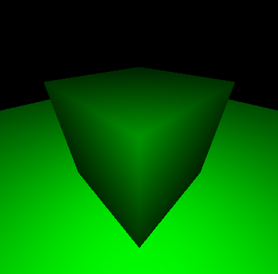

__F3: occlusion__

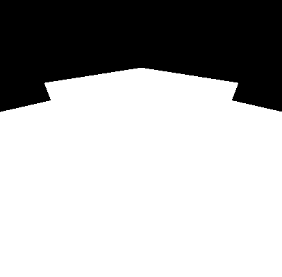

__F4: UV visualization__

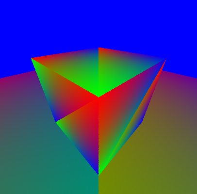

__F5: Normal visualization__

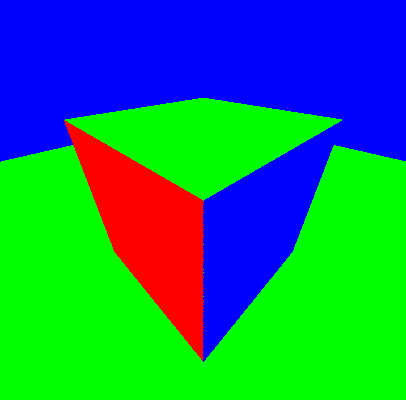

__F6: Geometries labeled by color__

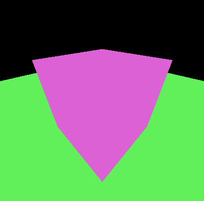

__F7: Geometries and Primitives labeled__

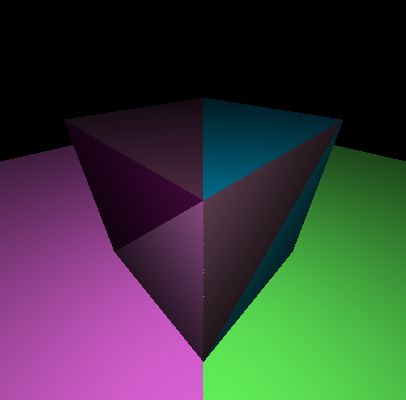

__F8: Texture Coordinates__

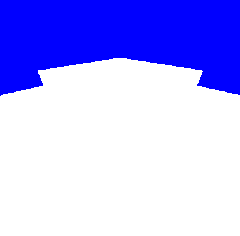

__F11: Ambient Occlusion__

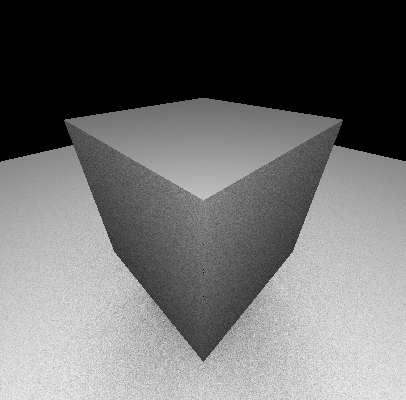

Furthermore, vertex color shading is possible by way of the `rtcInterpolate0`
function. Smooth normal shading for surfaces is possible by way of the
`rtcInterpolate1` function. For more information, see the `interpolation`
tutorial, `interpolation_device.cpp` function `renderPixel` for an example on
approaching this shader.

Adding different shading modes to this sample is left as an exercize for the
reader.

__`interpolation` tutorial program output render with interpolation of vertex
colors__

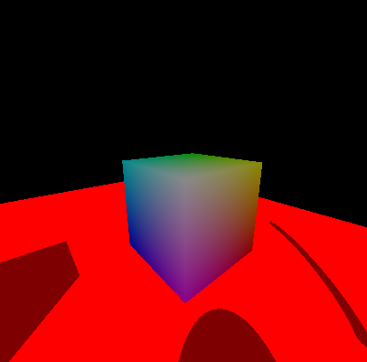


**Controls**

The full tutorials have gui controls defined in
`TutorialApplication::keyboardFunc` of `tutorial.cpp`. The mouse and left,
right, up, down, and WASD control camera movement. 

**parallel execution**

Full Embree tutorials encapsulate `parallel_for` from oneTBB as
`embree::parallel_for`. As needed, find `embree::parallel_for` in
embree/common/algorithms. Full Embree tutorials also encapsulate
current_thread_index underneath the TaskScheduler object found in
embree/common/tasking/taskschedulertbb.h

rkRayTracer sample:
```
    tbb::task_group_context tgContext;
    tbb::parallel_for(tbb::blocked_range<size_t>(0,numTilesX * numTilesY, 1), [&](const tbb::blocked_range<size_t>& r) {
        const int threadIndex = tbb::this_task_arena::current_thread_index();
        for (size_t i = r.begin(); i < r.end(); i++) 
            renderTileTask((int)i, threadIndex, pixels, width, height, channels, time, camera, numTilesX, numTilesY);
            
        }, tgContext);
    if (tgContext.is_group_execution_cancelled())
        throw std::runtime_error("task cancelled");
```
Full Embree tutorial triangle_geometry:
```
  parallel_for(size_t(0),size_t(numTilesX*numTilesY),[&](const range<size_t>& range) {
    const int threadIndex = (int)TaskScheduler::threadIndex();
    for (size_t i=range.begin(); i<range.end(); i++)
      renderTileTask((int)i,threadIndex,pixels,width,height,time,camera,numTilesX,numTilesY);
  }); 
```

Users are encouraged to review and use the Intel&reg; Embree common objects when
moving from sample to proof of concept and production applications.

**Embree tutorial objects**

The full Embree tutorial programs launch applications using a Tutorial class
object. This object is reused across all tutorials and implements many
convenience features. Depending on the scope of the specific tutorial
application, features include but are not limited to:
- Interactive windowing (full triangle_geometry by default starts in interactive
	mode)
- A reference scene graph facility with load routines for different scene types
- Command parsing for scene control (Example: Setting camera parameters via
	command line)
- Animated cameras
- Motion blur
- Metadata shading (We only render with a pure albedo color in our oneAPI
	example, but the full tutorial can visualize various metadata. Examples
	include visualizing compute cost of a ray, and visualizing differential
	geometry at a ray intersection.)
- Performance metrics for rays
- More

The oneAPI triangle_geometry sample program also manually defines transform
objects that are offered in the Embree tutorial library. Notice our camera
containers which hold data for transformations: `AffineSpace3fa`,
`LinearSpace3fa`.
```
struct LinearSpace3 {
    Vec3fa vx, vy, vz;

};
typedef struct Affine3fa {
    LinearSpace3 l;
    Vec3fa p;
} ISPCCamera;
```

Within Embree common these containers service a dedicated camera object with
convenient functions for camera transforations. Here are snippets from the full
tutorials that constitute the perspective camera projection.

`embree/common/math/affinespace.h`:
```
      /*! return matrix for looking at given point, only in 3D */
      static __forceinline AffineSpaceT lookat(const VectorT& eye, const VectorT& point, const VectorT& up) {
        VectorT Z = normalize(point-eye);
        VectorT U = normalize(cross(up,Z));
        VectorT V = normalize(cross(Z,U));
        return AffineSpaceT(L(U,V,Z),eye);
      }
```
`embree/tutorials/common/tutorial/camera.h`:
```
    AffineSpace3fa camera2world ()
    {
      AffineSpace3fa local2world = AffineSpace3fa::lookat(from, to, up);
      if (!(local2world == local2world))
        throw std::runtime_error("invalid camera specified");

      if (handedness == RIGHT_HANDED)
        local2world.l.vx = -local2world.l.vx;

      return local2world;
    }
    ...

    ISPCCamera getISPCCamera (size_t width, size_t height)
    {
      const float fovScale = 1.0f/tanf(deg2rad(0.5f*fov));
      const AffineSpace3fa local2world = camera2world();
      Vec3fa vx = local2world.l.vx;
      Vec3fa vy = -local2world.l.vy;
      Vec3fa vz = -0.5f*width*local2world.l.vx + 0.5f*height*local2world.l.vy + 0.5f*height*fovScale*local2world.l.vz;
      Vec3fa p =  local2world.p;
      return ISPCCamera(AffineSpace3fa(vx,vy,vz,p));
    }
```
These are defined in camera.h of in embree/tutorials/common/tutorial.

## Conclusion

At this point, we have covered an introduction for how to raytrace a scene with
the Intel&reg; Embree API. We have introduced the full Intel&reg; Embree
tutorial programs for further evaluation. Still, many users may desire to use a
rendering API at a higher layer, perhaps at an _engine_ layer. Such developers
should consider examining the Intel OSPRay API and library, which implements
rendering facilities on top of Embree.

You can find more information by visiting [Intel&reg; oneAPI Rendering
Toolkit](https://software.intel.com/content/www/us/en/develop/tools/oneapi/rendering-toolkit.html).

## License

Code samples are licensed under the Apache 2.0 license. See
[LICENSE.txt](LICENSE.txt) for details.
