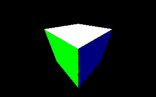

# Ray Tracing with Intel&reg; Embree on Intel&reg; GPUs

## Purpose
- This sample program demonstrates building and running a basic geometric ray tracing
application with Intel&reg; Embree running on an Intel GPU.

- Use this application to understand the basic ray tracing of an image with Intel Embree and how to target Intel GPU. This tutorial and program, `rkRayTracerGPU`, is the sequel to the [IntroToRayTracingWithEmbree/cpu](../cpu) `rkRayTracer` tutorial sample program.

- Both the `rkRayTracerGPU` and `rkRayTracer` source code are derived from the `triangle_geometry_sycl`/`triangle_geometry`
source hosted as part of the Intel&reg; Embree tutorials in the [Embree
repository](https://github.com/embree/embree) on GitHub.

__Output Image:__


## Prerequisites

| Minimum Requirements              | Description
|:---                               |:---
| OS                                | Linux* Ubuntu* 22.04 <br>CentOS* 8 (or compatible) <br>Windows* 10 <br>macOS* 10.15+
| Hardware                          | Intel&reg; Arc Graphics (Xe-HPG architecture, DG2-128, DG2-512) or higher
| Libraries                         | Install Intel&reg; oneAPI Rendering Toolkit (Render Kit) including Intel&reg; oneAPI DPC++ Compiler, Intel&reg; Embree, and Intel® oneAPI Threading Building Blocks (oneTBB) <br>Install Intel&reg; oneAPI Base Toolkit for the `dev-utilities` default component
| SYCL Compiler                     | oneAPI DPC++ 2023.0.0 compiler or higher
| Compiler Toolchain                | Windows* OS: MSVS 2019 or MSVS 2022 with Windows* SDK and CMake* <br>Other platforms: C++17 compiler and CMake*
| Tools                             | .png capable image viewer
| Knowledge                         | First, build and run the IntroToRayTracingWithEmbree `rkRayTracer` [CPU](../cpu) sample program

## Build and Run

### Windows*

***Scripted Build***

.bat scripts are included for scripted build in either Visual Studio* IDE or nmake build environments.

Open a new x64 Native Tools Command Prompt for VS 2022. Navigate to the source folder:

```
cd <path-to-oneAPI-Samples>\RenderingToolkit\Tutorial\IntroToRayTracingWithEmbree\cpu
```

Run the MSVS build script to generate the sample program and MSVS .sln files for source code review:
```
build-win-vs-dpcpp-toolchain.bat
```

If you prefer command line builds only, use an nmake script:
```
build-win-nmake-icx-cl.bat
```

```
call <path-to-oneAPI>\setvars.bat
```
```
cd bin
.\rkRayTracerGPU.exe
```

An output image, `rkRayTracerGPU.png`, is written to the program current working directory. Open the image with a .png capable image viewer.


***Manual build***

Open a new x64 Native Tools Command Prompt for VS 2022. Navigate to the source folder.

```
cd <path-to-oneAPI-Samples>\RenderingToolkit\Tutorial\IntroToRayTracingWithEmbree\gpu
```

Run oneAPI setvars.bat:

```
call <path-to-oneAPI>\setvars.bat

```
Build and run the application:

```
mkdir build
cd build
cmake -G"Visual Studio 17 2022" -A x64 -T"Intel(R) oneAPI DPC++ Compiler 2023" ..
cmake --build . --config Release
cmake --install . --config Release
cd ..\bin
.\rkRayTracerGPU.exe
```
**Note**: Visual Studio 2019 users should use the x64 Native Tools Command Prompt for VS 2019 and the `-G"Visual Studio 16 2019"`
generator flag.

Open the resulting file: `rkRayTracerGPU.png` with an image viewer.

### Linux* OS

Open a new Terminal session. Navigate to the source folder.

```
cd <path-to-oneAPI-Samples>/RenderingToolkit/Tutorial/IntroToRayTracingWithEmbree/gpu
```

Build and run the application:

```
source <path-to-oneAPI>/setvars.sh
mkdir build
cd build
cmake -DCMAKE_BUILD_TYPE=Release -DCMAKE_CXX_COMPILER=icpx ..
cmake --build .
cmake --install .
cd ../bin
./rkRayTracerGPU
```

Open the resulting file: `rkRayTracerGPU.png` with an image viewer.

### Output image

__Default sample program output image__


### Example images

Edits to application logic can render the following images:

__The cube rendered by itself from the given camera position: 1.5, 1.5, -1.5__



__The cube rendered from the opposite camera position: -1.5, -1.5, 1.5__


__The ground plane rendered by itself from camera position 1.5, 1.5, -1.5. The
shadows from the omitted cube are still rendered__


## Next Steps

### Pathtracer

Many new rendering developers wish to see a full global illumination solution. Global illumination is beyond the scope of this application. Review the [rkPathTracer](../../PathTracingWithEmbree) tutorial sample program for more information.

### Get the full tutorial codes

- You can get Intel&reg; Embree stand alone code from the [Embree
  repository](https://github.com/embree/embree).
- Alternately, you can get Intel&reg; Embree from the Intel&reg; oneAPI
	Rendering Toolkit (Render Kit) `rkutil` Superbuild cmake script. 
  - The script is available after toolkit install in the
	`oneAPI-root-directory/rkutil/latest/superbuild` folder. It is also available
	on the Render Kit superbuild
	[repository](https://github.com/RenderKit/superbuild). 
- The superbuild script gives a complete build time configurable sandbox for
	Rendering toolkit libraries and features.
  - Basic Instructions are found on the Superbuild Github
		  [README.md](https://github.com/RenderKit/superbuild/README.md)
  - Detailed instructions for [Windows](https://www.intel.com/content/www/us/en/developer/articles/technical/build-intel-oneapi-rendering-toolkit-windows.html),
		  [Linux](https://www.intel.com/content/www/us/en/developer/articles/technical/build-intel-oneapi-rendering-toolkit-linux.html), and
		  [macOS](https://www.intel.com/content/www/us/en/developer/articles/technical/build-oneapi-rendering-toolkit-macos.html) operating systems are also available.


## Conclusion

At this point, we have covered an introduction for how to raytrace a scene with
the Intel&reg; Embree API. and provided links to the full Intel&reg; Embree tutorial programs for further evaluation. Still, many users may desire to use a
rendering API at a higher layer, perhaps at an _engine_ layer. Such developers
should consider examining the Intel&reg; OSPRay API and library, which implements
rendering facilities on top of Embree.

You can find more information by visiting [Intel&reg; oneAPI Rendering
Toolkit](https://software.intel.com/content/www/us/en/develop/tools/oneapi/rendering-toolkit.html).

## License

Code samples are licensed under the Apache 2.0 license. See
[LICENSE.txt](LICENSE.txt) for details.
