# Path Tracing with Intel&reg; Embree Sample Program

This sample program illustrates path tracing using Intel Embree from the Intel&reg; oneAPI Rendering Toolkit (Render Kit).

[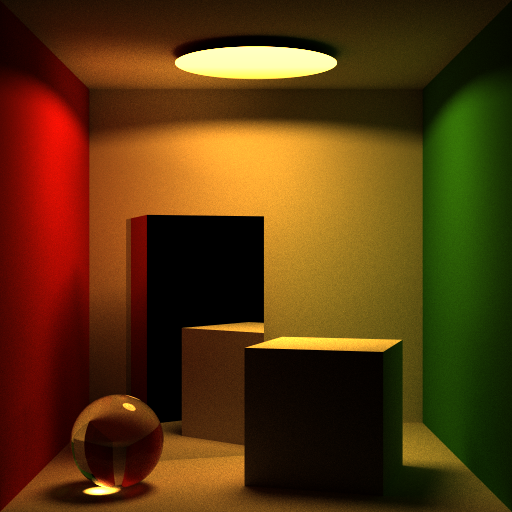](example-images/pathtracer-accu-cornell-spp1-accu4000-plength8-512x512.png)

| Area                   | Description
|:---                    |:---
| What you will learn    | How to implement basic pathtracing with Intel Embree.
| Time to complete       | ~10 minutes to compile and run. <br> 60+ minutes to review algorithms, make edits, rebuild, and run the modified application.


## Purpose

In completing this pathtracer tutorial, you should understand how to implement a basic pathtracer with Intel Embree. You should better understand:
- Pathtracing as a type of rendering, including the `pathtracer` as implemented within Intel&reg; OSPRay.
- Considerations of visual quality when implementing applications with Intel Embree.
- Meaning behind the rendering control parameters in Intel&reg; OSPRay Studio reference application or other professional rendering solutions.
- Exploration of the full featured tutorial codes on the Intel Embree github [repository](https://github.com/embree/embree).

This tutorial follows two paths:
1. A _key features_ description of the logical additions to the previous '[Introduction to Ray Tracing with Intel Embree](../IntroToRayTracingWithEmbree)' `rkRayTracer`/`triangle_geometry` application. These additions help create a Monte Carlo path tracer.
2. A _source code_ walk-through describing how the features are implemented with Embree API calls.

>**Note**: This sample source code is a consolidated refactor of the `pathtracer` source hosted as part of the Embree tutorials in the [Embree
repository](https://github.com/embree/embree) on GitHub.

You can expect less than 10 minutes to compile and run the unmodified application. Expect at least an hour for following the algorithm, self-directed edits, then to rebuild, rerun, and understand the application.

## Prerequisites

Make sure to try the [rkRayTracer](../IntroToRayTracingWithEmbree) sample program first.

| Minimum Requirements | Description                                                                                                                                                                                                                     |
|:-------------------- |:------------------------------------------------------------------------------------------------------------------------------------------------------------------------------------------------------------------------------- |
| OS                   | Linux* Ubuntu* 18.04 <br>CentOS* 8 (or compatible) <br>Windows* 10 <br>macOS* 10.15+                                                                                                                                            |
| Hardware             | <ul><li>Intel&reg; 64 (Intel 64 Penryn or higher with SSE4.1 extensions compatible) <ul><li>Intel Atom&reg; processors</li><li>Intel&reg; Core&trade; processor family</li><li>Intel&reg; Xeon&reg; processor family</li><li>Intel&reg; Xeon&reg; Scalable processor family</li></ul></li><li>ARM</li><ul><li>ARM64 with NEON extensions (ex: Apple* M1)</li></ul></li><li>Intel Embree is further optimized for Intel 64 Skylake or higher with AVX512 extensions</li></ul>  |
| Compiler Toolchain   | Windows* OS: MSVS 2019 or MSVS 2022 with Windows* SDK and CMake* <br>Other platforms: C++14 compiler and CMake*                                                                                                                 |
| Libraries            | Install Intel oneAPI Rendering Toolkit (Render Kit) for Intel Embree and Intel&reg; oneAPI Threading Building Blocks (oneTBB) <br>Install Intel&reg; oneAPI Base Toolkit for the `dev-utilities` default component |
| Tools                | .png capable image viewer                                                                                                                                                                                                       |

## Build and Run

### Windows*

1. Open an x64 Native Tools Command Prompt for VS 2019 (or 2022).

2. Set toolkit environment variables.

> **Note**: If you have not already done so, set up your CLI
> environment by sourcing  the `setvars` script in the root of your oneAPI installation.
>
> Windows*:
> - `C:\Program Files(x86)\Intel\oneAPI\setvars.bat`
> - Windows PowerShell*, use the following command: `cmd.exe "/K" '"C:\Program Files (x86)\Intel\oneAPI\setvars.bat" && powershell'`
> For more information on configuring environment variables, see [Use the setvars Script with Windows*](https://www.intel.com/content/www/us/en/develop/documentation/oneapi-programming-guide/top/oneapi-development-environment-setup/use-the-setvars-script-with-windows.html).

3. Build and run the application:

```
mkdir build
cd build
cmake -G"Visual Studio 16 2019" -A x64 ..
cmake --build . --config Release
cd Release
.\rkPathTracer.exe
```

**Note**: Visual Studio 2022 users should use the `-G"Visual Studio 17 2022"`
generator flag.

4. Open the resulting .png image files with an image viewer. The .png files will be in the working directory for the executing program.

5. Examine the sources as desired with the Visual Studio IDE:

```
devenv rkPathTracer.sln
```

### Linux* or macOS*

1. Open a new terminal.

2. Set toolkit environment variables.  

> **Note**: If you have not already done so, set up your CLI
> environment by sourcing  the `setvars` script in the root of your oneAPI installation.
>
> Linux*:
> - For system wide installations: `. /opt/intel/oneapi/setvars.sh`
> - For private installations: ` . ~/intel/oneapi/setvars.sh`
> - For non-POSIX shells, like csh, use the following command: `bash -c 'source <install-dir>/setvars.sh ; exec csh'`
> For more information on configuring environment variables, see [Use the setvars Script with Linux* or macOS*](https://www.intel.com/content/www/us/en/develop/documentation/oneapi-programming-guide/top/oneapi-development-environment-setup/use-the-setvars-script-with-linux-or-macos.html).

3. Build and run the application:

```
mkdir build
cd build
cmake -DCMAKE_BUILD_TYPE=Release ..
cmake --build .
./rkPathTracer
```

4. Open the resulting .png image files with an image viewer. The .png files will be in the working directory for the executing program.

### Build Troubleshoot

Imaging headers are used from `%ONEAPI_ROOT%\dev-utilities\latest\include`. If needed, these headers are also available common resources from the [oneAPI-samples](https://github.com/oneapi-src/oneAPI-samples/tree/master/common) GitHub repository.

## Path Tracing Concepts

Now that you have built and run the sample program successfully, you are ready to move forward. The remainder of this document discusses important concepts and implementation details.  

### Ray Tracing

In the '[Introduction to Ray Tracing with Intel Embree](../IntroToRayTracingWithEmbree)' sample, the source code demonstrates how to find basic albedo (surface color) and trivial lighting for a cube and a plane. Recap Image:

[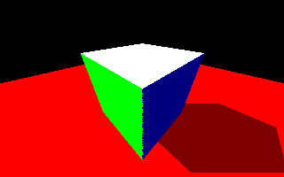](example-images/rkRayTracer.png)

1. The output image is generated via rays cast from each pixel of our camera to corresponding scene geometry intersection. These initial rays from the camera are the primary rays in our scene. The color at the ray intersection is determined.
2. Then, if and only if the intersected surface is not occluded from the light position, the albedo would be increased to full strength. The difference in albedo intensity gies the impression of a shadow on the plane underneath the cube. 
3. The shadow gives the appearance of depth and an idea of distance for the cube hovering above our plane. 

However, this is only a first step to computing light transport used to simulate generation of a photorealistic image. So far, the `triangle_geometry` sample application, only simulates **direct illumination**.

### Path Tracing

[Path tracing](https://en.wikipedia.org/wiki/Path_tracing) implements a simulation of [global illumination](https://en.wikipedia.org/wiki/Global_illumination).

Our primary rays alone do not capture light illuminating a surface from other surfaces visible to the intersection. So, in this tutorial, we construct a multiple segment ray path to capture that light. The path continues from a primary ray intersection point to sample light from other visible surfaces and lights in the scene.
By integrating and scaling the light visible from the hemisphere above all multiple-segment path intersections, global illumination is simulated.

The path itself need not stop after one additional path 'segment' (a segment being a reflection or refraction). Multiple bounces can capture light from multiple surfaces. In a limited compute resource environment, we either set a constant path length or create logical heuristics limiting the path length.
Surface properties affect the light reflected. The sample program introduces material properties to alter the light reflected off surfaces. Such a function is commonly referred to as a bidirectional ray distribution function ([BRDF](https://en.wikipedia.org/wiki/Bidirectional_reflectance_distribution_function)).

### Key Features Added

This program adds application-level features to the `rkRayTracer`/`triangle_geometry` sample to demonstrate a reference Monte Carlo path tracer program. The new key features are:

- [Added scenes](#added-scenes-feature)
- [Materials](#materials-feature)
- [Light](#light-feature)
- [Simulating Global Illumination](#simulating-global-illumination-feature)
- [Accumulation buffer](#accumulation-buffer-feature)
- [Convergence](#convergence-feature)

The new key features are discussed below at a high level then described with in-source implementation details. You might need to read the key feature descriptions and review the source-accompanied descriptions several times to understand the application.

### Added Scenes (Feature)

Global illumination is difficult to demonstrate without paths that interact with more than one surface. To assist, three sets of hardcoded scene data are included in this sample program. Each scene is described with an example image. You may configure and regenerate these images with this tutorial source code.

1. Cornell Box scene geometry, as defined within Intel OSPRay's `ospExamples` application.<br>

    The Cornell Box is a familiar dataset that can show capability of computing global illumination and shadows. The tall box is a mirror. Code is added to place an extra refractive sphere into the scene. All other surfaces are diffuse. 

[](example-images/pathtracer-accu-cornell-spp1-accu4000-plength8-512x512.png)

2. The `triangle_geometry` scene from `rkRayTracer` and the Embree repository tutorials.<br>

    The intent with this scene is to observe a familiar introductory scene in a pathtracing environment.

[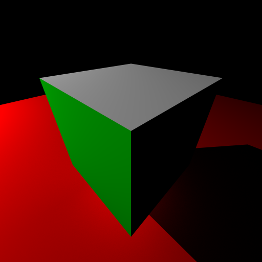](example-images/pathtracer-accu-cubeandplane-spp1-accu4000-plength8-512x512.png)

3. A 'pool' scene<br>

    This scene is focused on observing the behavior of a fresnel surface.

[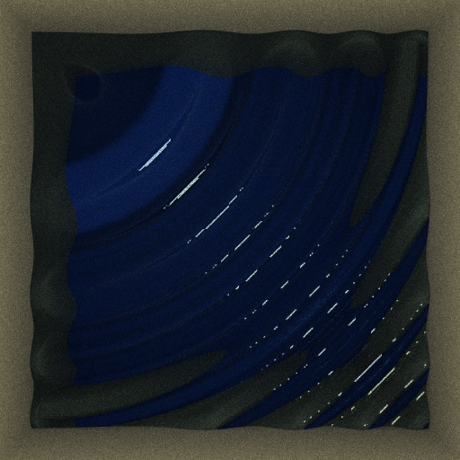](example-images/pathtracer-accu-pool-spp1-accu4000-plength8-512x512.png)

Each geometry specified allows the user to try different materials and colors. You are encouraged to modify and rebuild the scenes to examine and understand behavior!


### Materials (Feature)
Three basic materials are implemented in the sample program.

1. [Lambertian](https://en.wikipedia.org/wiki/Lambertian_reflectance):<br>
   This is a soft diffuse material that scatters light proportional to the cosine of the angle of incidence in all directions. Another description often used for a Lambertian surface is: ideal _matte_ surface.
   
   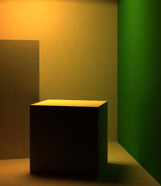

2. Mirror:<br>
   We introduce a mirror as a material surface. This mirror has an albedo that can be used to limit reflected energy. Limiting reflectance more closely matches the behavior of real mirrors. Below see an example mirror material as specified on the tall box within the Cornell Box scene.
   
   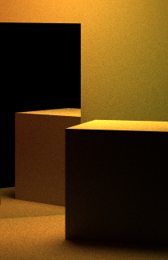

3. [Fresnel](https://en.wikipedia.org/wiki/Fresnel_equations):<br>
   We introduce fresnel materials. These materials have reflective and refractive light transport behaviors. Below see an example fresnel (glass) sphere added to the Cornell Box scene.
   
   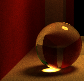

You are encouraged to modify material, albedo, and even geometry parameters to examine behavior!
   
### Light (Feature)

Three basic lights are implemented with the sample program.

1. Directional Light

This is similar to the `triangle_geometry`/`rkRayTracer` sample light.

2. Point Light

This light emits in all directions. It can also have a non-negative radius (making it a point or a sphere). If it is a sphere it can have corresponding geometry. Corresponding geometry will be used to allow the spherical light to leave soft shadows in the scene.

3. Spot light

The spot light is a disc light that emits in a specified direction. It also has a radius and corresponding geometry. It can leave soft shadows in the scene.

### Simulating Global Illumination (Feature)

Review this sample application's representative path tracer algorithm at a high (informal) level:

1. Take a color 'sample' at each pixel of the image. The 'sample' is to be computed from an n-segment ray emanating from a pixel. The pixel location is mapped to that of the capture plane of a 3D virtual camera. The ray is cast into the scene.
2. At a ray-to-scene intersection, determine the light coming from the material at the intersection. If the material is a light source, add that light's radiance based on the light type and ray direction before terminating the path.
3. Otherwise, perform a shadow ray test from the intersection to all light emitters in the scene. Aggregate the visible radiance proportional to the type of light, distance to the surface, and the material.
4. Next, generate a bounce ray pointing to a location on the unit hemisphere above an intersection. The bounce ray direction is a function of the material and outgoing ray direction. This ray represents the direction of the next segment of our *path* being traced.
5. In the case of a Lambertian surface generate a ray segment randomly as a representative reflection of all incident light at the point. Lower ray angles (approaching tangent) will contribute very little global light through the new ray segment. Higher angles will contribute more.
6. In the case of a mirror, the reflection is not random. The reflected ray is computed as a mirror ray. The mirror material rays will not attenuate based on direction. They will only attenuate based upon the inherent reflectivity of the mirror.
7. Lastly, Fresnel materials will reflect or refract rays based on a fresnel material constant (eta) and the angle of incidence. Different materials will have different fresnel constant.
8. Light attenuation (color) is evaluated based on the material and corresponding outgoing and incoming light directions from the surface. 
   >**Note**: The directions are referred to in source as Omega out and Omega in, *wo* and *wi*.
9. The probability density function is computed for the path segment. This allows the source to integrate multiple samples per pixel together in a Monte Carlo fashion. The PDF is used to appropriately scale radiance sampled from a given direction.
10. The light weight for subsequent path segments is computed. The weight is attenuated by material evaluated radiance attenuation and the pdf.
11. The next path segment is computed. If the path is at its maximum length the Luminance sample for the pixel is returned.

Multiple paths can be sampled for each pixel. The samples can be used to generate an aggregate of samples per pixel. In this implementation, each path sample will originate at a random offset within the bounds of the pixel. This provides an antialiasing effect for the image.

### Accumulation Buffer (Feature)

Once path samples are computed, the accumulation buffer assists in getting the sample data into images.
 
- The accumulation buffer stores total luminance sampled underneath all pixels over all accumulations. 
- To write to an image output, the accumulation tuple for each pixel is divided by number of accumulations to get per channel color averages.
- An accumulation buffer is useful in an interactive rendering context. It intermittently updates a windowed frame buffer. The application can continue with a stationary scene and camera to accumulate and thus converge the image.
- In this tutorial program, the accumulation buffer is first used to write the first sample of all pixels to an image. Next, the application accumulates many more rendered frames (accumulations) and writes a final output image. 


### Convergence (Feature)

- A rendered image is a _converged_ image if an infinite number of pixel samples with infinite path length are taken. All paths under all sampled pixels can logically account for all light in the scene.
- Practically, because compute resources are finite, software sets restrictions: the number of samples per pixel, an accumulation limit, and maximum path length to the discretion of the application.
- This tutorials sets these values to 1, 500, and 8 by default respectively. Change these values to introduce or reduce the effects of noise.


### Example Images:

> **Note**: Click on a noisy image below to see the full size original noise pattern.

| Description                                                         | Example Image
|:---                                                                 | :---
| 1spp x 1 accumulation, 1 total sample per pixel (no mirror)         | [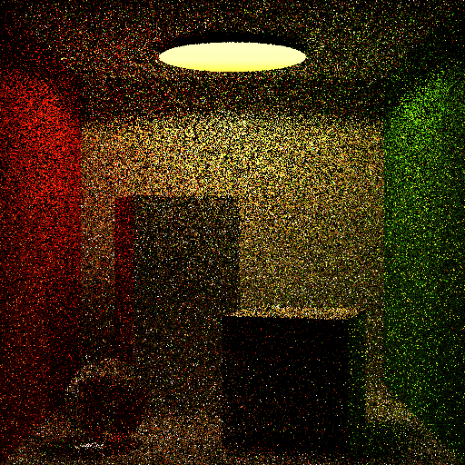](example-images/pathtracer-single-cornell-spp1-accu4000-plength8-512x512-nomirror.png) 
| 1spp x 1000 accumulations, 1000 total samples per pixel (no mirror) | [](example-images/pathtracer-accu-cornell-spp1-accu1000-plength8-512x512-nomirror.png)
| 1spp x 4000 accumulations, 4000 total samples per pixel (no mirror) | [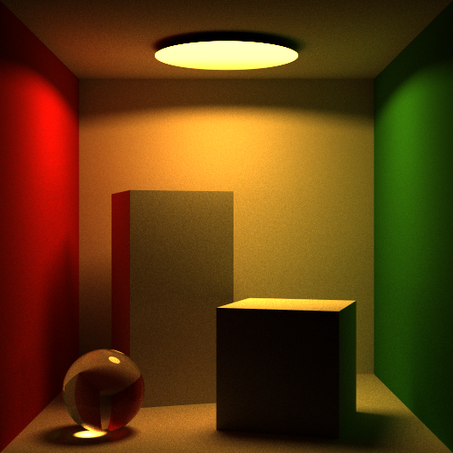](example-images/pathtracer-accu-cornell-spp1-accu4000-plength8-512x512-nomirror.png)
| 1spp x 1 accumulation, 1 total sample per pixel (mirror)            | [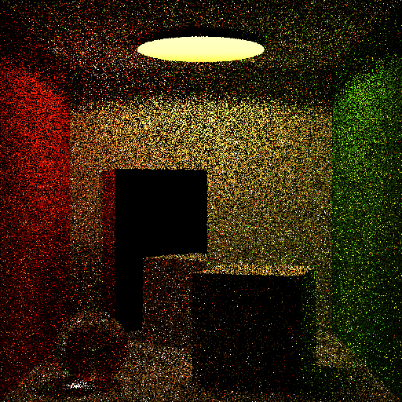](example-images/pathtracer-single-cornell-spp1-accu4000-plength8-512x512.png)
| 1spp x 4000 accumulations, 4000 total samples per pixel (mirror)    | [](example-images/pathtracer-accu-cornell-spp1-accu4000-plength8-512x512.png)
| 1spp x 1 accumulation, 1 total sample per pixel                     | [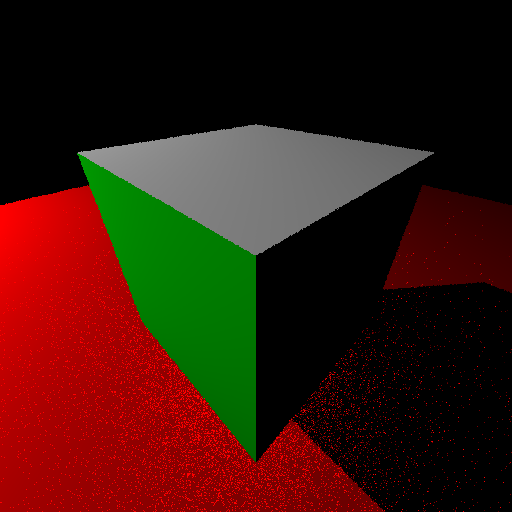](example-images/pathtracer-single-cubeandplane-spp1-accu4000-plength8-512x512.png)
| 1spp x 4000 accumulations, 4000 total samples per pixel             | [](example-images/pathtracer-accu-cubeandplane-spp1-accu4000-plength8-512x512.png)
| 1spp x 1 accumulation, 1 total sample per pixel                     | [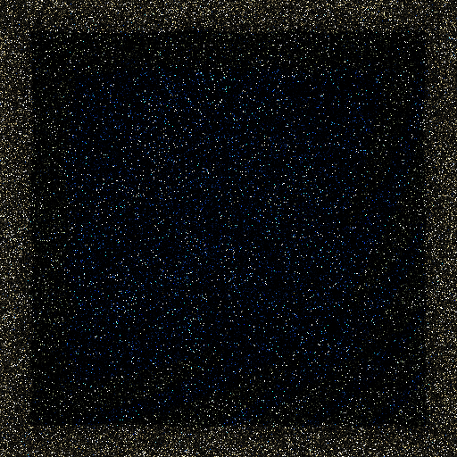](example-images/pathtracer-single-pool-spp1-accu4000-plength8-512x512.png)
| 1spp x 4000 accumulations, 4000 total samples per pixel             | [](example-images/pathtracer-accu-pool-spp1-accu4000-plength8-512x512.png)

### Embree functions

The following [Embree API functions](https://raw.githubusercontent.com/embree/embree/master/readme.pdf) are used in this application:

Geometry:
- rtcNewGeometry(...)
- rtcSetNewGeometryBuffer(...)
- rtcCommitGeometry(...)
- rtcAttachGeometry(...)
- rtcReleaseGeometry(...)
- rtcSetGeometryVertexAttributeCount(...)
- rtcSetSharedGeometryBuffer(...)

Ray Queries:
- rtcIntersect1(...)
- rtcOccluded1(...)
- rtcInitIntersectArguments(...)
- rtcInitOccludedArguments(...)

Device:
- rtcGetDeviceError(...)
- rtcNewDevice(...)
- rtcSetDeviceErrorFunction(...)

Scene:
- rtcNewScene(...)
- rtcReleaseScene(...)

## Details of Improvements (Source)

The logical approach to the application and outputs have been described. This section identifies key source lines that implement the algorithms as described above.

It is highly advised to walk through the source in an IDE environment that allows for quick lookup of symbol and function definitions! Follow along with the API pdf [manual](https://raw.githubusercontent.com/embree/embree/master/readme.pdf).


### rkPathTracer.cpp
In `rkPathTracer.cpp` we have `main(..)`. We set the image size, number of channels, accumulation limit, number of samples per pixel and maximum number of segments to a path here.

```
  /* create an image buffer initialize it with all zeroes */
  const unsigned int width = 512;
  const unsigned int height = 512;
  const unsigned int channels = 3;
  /* Control the total number of accumulations, the total number of samples per
   * pixel per accumulation, and the maximum path length of any given traced
   * path.*/
  const unsigned long long accu_limit = 500;
  const unsigned int spp = 1;
  const unsigned int max_path_length = 8;
```
The values above are also resident in higher level APIs like Intel OSPRay for controlling rendering.

The application will create a `Renderer` to render a selected scene. The `SceneSelector` enum is used to control which hardcoded scene (geometry, light, and camera) information to load in the sample program.

```
  std::unique_ptr<Renderer> r;

  // SceneSelector sceneSelector = SceneSelector::SHOW_POOL;
  SceneSelector sceneSelector = SceneSelector::SHOW_CORNELL_BOX;
  // SceneSelector sceneSelector = SceneSelector::SHOW_CUBE_AND_PLANE;
  r = std::make_unique<Renderer>(width, height, channels, spp, accu_limit,
                                 max_path_length, sceneSelector);
```

The renderer first generates and writes an image with one accumulation. Then, we render all accumulations and write the final image from all accumulations.
```
  r->render_accumulation();
  
  ...

  /* Render all remaining accumulations (in addition to the first) */
  for (unsigned long long i = 1; i < accu_limit; i++) {
    ...

    r->render_accumulation();

    ...
  }
```

You are encouraged to alter scene selection and rendering control values. Afterward, review single and multiple accumulation images to understand the output.


### Renderer.h

The renderer initializes the pixel buffer and the accumulation buffer.

```
m_pixels = (unsigned char*)new unsigned char[m_width * m_height * m_channels];
  std::memset(m_pixels, 0,
              sizeof(unsigned char) * m_width * m_height * m_channels);
```

```
  m_accu.resize(m_width * m_height);
  for (auto i = 0; i < m_width * m_height; i++)
    m_accu[i] = std::make_shared<Vec3ff>(0.0f);
```
A `Vec3ff` object was used. `Vec3ff` is one of a few float vector class objects usable from the `rkcommon` Render Kit library. These types have convenient overloads typical in graphics compute applications. They are **not** required to use Embree.

The renderer then initializes the Embree device with Embree API call `rtcNewDevice(..)`. If the device is not creadted, the Embree API `rtcGetDeviceError(..)` function is used to report any API error. Lastly, a device error handling function is assigned with `rtcSetDeviceErrorFunction(..)` for the Embree API to report any runtime errors.

```
void Renderer::init_device(const char* cfg) {
  /* create device */
  m_device = rtcNewDevice(nullptr);
  handle_error(nullptr, rtcGetDeviceError(m_device),
               "fail: Embree Error Unable to create embree device");

  /* set error handler */
  rtcSetDeviceErrorFunction(m_device, handle_error, nullptr);
}
```
Embree API functions and data structures are prefixed with `rtc`/`RTC`.

The Renderer instantiates a scene management object `SceneGraph`. `SceneGraph` is defined by the application.

```
void Renderer::init_scene(char* cfg, unsigned int width, unsigned int height) {
  m_sg = std::make_shared<SceneGraph>(m_device, m_sceneSelector, m_width,
                                      m_height);
}
```
The `Renderer` then creates a `PathTracer` object. The `PathTracer` object will trace paths for our `Renderer` later:

```
  m_pt = std::make_shared<PathTracer>(max_path_length, m_width, m_height,
                                      m_sg->getNumLights());
```

### SceneGraph.h

The `SceneGraph` initializes the Embree scene with `rtcNewScene(..)`. The Scene Graph then will initialize Embree geometries based on the selected scene. `std::map` objects are used for lookup tables to find Embree geometry and primitive information when we intersect objects when ray tracing.

```
void SceneGraph::init_embree_scene(const RTCDevice device,
                                   SceneSelector SELECT_SCENE,
                                   const unsigned int width,
                                   const unsigned int height) {
  m_sceneSelector = SELECT_SCENE;
  /* create scene */
  m_scene = nullptr;
  m_scene = rtcNewScene(device);

  switch (m_sceneSelector) {
    case SceneSelector::SHOW_CUBE_AND_PLANE:
      /* add cube, add ground plane, and light */

      geometries.push_back(std::make_unique<CubeAndPlane>(
          m_scene, device, m_mapGeomToPrim, m_mapGeomToLightIdx, m_lights,
          m_camera, width, height));

...

      break;

```

In the `SceneGraph`, a list of geometries (from `Geometry.h`) keeps all of the scenes automatically managed. Definition:

```
  // We'll use this 'geometries' container to automatically clean up the data
  // arrays created that are used to create embree geometries //
  std::vector<std::unique_ptr<Geometry>> geometries;
```

### Geometry.h

The `Geometry` object only serves to allow an extensible mechanism for geometry creation and destruction. Use the `geometries` std::vector object to add, remove, or edit geometries and create your own scenes in this application
`CornellBox.h`, `Pool.h`, `DefaultCubeAndPlane.h`, `Sphere.h` are all demonstrate 'Geometry' objects. They have hardcoded data for rendering.


### CornellBox.h

The Cornell box is one such derived `Geometry` object. Upon instantiation, we create Embree geometry with `rtcNewGeometry(..)` in `CornellBox::add_geometry(..)`. 

```
  /* create a mesh for all the quads in the Cornell Box scene */
  RTCGeometry mesh = rtcNewGeometry(device, RTC_GEOMETRY_TYPE_QUAD);
```

Creating the box geometry requires setting a buffer of defined vertex positions for the geometry. The Embree API function, `rtcSetNewGeometryBuffer(..)`, is used and it is passed `RTC_BUFFER_TYPE_VERTEX`. Vertex information is populated by way of the returned pointer.
```
  Vertex* vertices = (Vertex*)rtcSetNewGeometryBuffer(
      mesh, RTC_BUFFER_TYPE_VERTEX, 0, RTC_FORMAT_FLOAT3, sizeof(Vertex),
      m_cornellBoxVertices.size());
```

Next, we setup an index buffer for the `Geometry` defining `Quads`. The Embree API call `rtcSetNewGeometryBuffer(..)` is used. The `RTC_BUFFER_TYPE_INDEX` bitflag is passed to the function. Index information is populated by way of the returned pointer.

```
  /* set quads */
  Quad* quads = (Quad*)rtcSetNewGeometryBuffer(mesh, RTC_BUFFER_TYPE_INDEX, 0,
                                               RTC_FORMAT_UINT4, sizeof(Quad),
                                               m_cornellBoxIndices.size());
```
Lastly, we bind vertex colors to a vertex attribute with `rtcSetGeometryVertexAttributeCount(..)` and `rtcSetSharedGeometryBuffer(..)`. Vertex attributes are not used directly in this sample. They are a place holder for expanding the application to consider vertex colors with the API.

Notice that such buffers need to be aligned per the API specificiation. `alignedMalloc(..)` is to allocate memory for `m_cornell_vertex_colors`.

```
  rtcSetGeometryVertexAttributeCount(mesh, 1);
  rtcSetSharedGeometryBuffer(mesh, RTC_BUFFER_TYPE_VERTEX_ATTRIBUTE, 0,
                             RTC_FORMAT_FLOAT3, *m_cornell_vertex_colors, 0,
                             sizeof(Vec3fa), m_cornellBoxVertices.size());
```

The geometry `mesh` is committed, attached to our scene, then the mesh is released. Embree API functions `rtcCommitGeometry(..)`, `rtcAttachGeometry(..)`, and `rtcReleaseGeometry(..)` are used respectively.

```
  rtcCommitGeometry(mesh);
  unsigned int geomID = rtcAttachGeometry(scene, mesh);
  rtcReleaseGeometry(mesh);
```

We set up a look up table (using `std::map`) for each face's albedo (color) and assigned material. This is used later when the pathtracer intersects objects.The table ties the geometry id returned from the Embree API to abedo and material values.
```
  MatAndPrimColorTable mpTable;
  mpTable.materialTable = m_cornellBoxMats;
  mpTable.primColorTable = m_cornell_face_colors;
  mapGeomToPrim.insert(std::make_pair(geomID, mpTable));
```

The other `Geometry` derived objects are of similar construction. Albeit, the may use different primitive types (e.g. Quad vs Triangle vs other). For example, The `Sphere` object in `Sphere.h` uses an Embree defined Sphere primitive as opposed to defining many vertices manually to approximate a sphere from triangles.

The Cornell scene also configures a light and camera associated with it. The camera view is oriented based on field of view, look at direction, up direction, width and height in pixels.

```
  float fov = 30.0f;
  float fovrad = fov * M_PI / 180.0f;
  float half_fovrad = fovrad * 0.5f;
  camera = positionCamera(Vec3fa(0.0, 0.0, -1.0f - 1.f / tanf(half_fovrad)),
                          Vec3fa(0, 0, 0), Vec3fa(0, 1, 0), fov, width, height);
```

We define a spot light with given direction, position, radius, power and opening angle properties. The spot light is at the top of the box and it faces the floor. It is added to the list of lights in our scene. We create a geometry for the spot light. Adding the light geometry is similar to adding our other geometries. See `Light.h` for the implementation.

```
  /* Here we have a light as a disc geometry */
  Vec3fa spotPos(0.f, 0.95f, 0.0f);
  Vec3fa spotDir(0.f, -1.f, 0.f);
  Vec3fa spotPow = 5.f * Vec3fa(0.78f, 0.551f, 0.183f);
  float spotCosAngleMax = cosf(80.f * M_PI / 180.f);
  float spotCosAngleScale = 50.f;
  float spotRadius = 0.4f;
  lights.push_back(std::make_shared<SpotLight>(spotPos, spotDir, spotPow,
                                               spotCosAngleMax,
                                               spotCosAngleScale, spotRadius));
  /* Add geometry if you want it! */
  if (spotRadius > 0.f) {
    std::shared_ptr<SpotLight> pSpotLight =
        std::dynamic_pointer_cast<SpotLight>(lights.back());
    unsigned int geomID =
        pSpotLight->add_geometry(scene, device, mapGeomToPrim);
    mapGeomToLightIdx.insert(std::make_pair(geomID, lights.size() - 1));
  }
```

Each of the geometries can assign a hard coded material. Here is an example with the Cornell Box:
```
const std::vector<enum class MaterialType>
    CornellBoxGeometry::m_cornellBoxMats = {
        // Floor
        MaterialType::MATERIAL_MATTE,
        /* Swap in thr below material to make the ceiling a matte material*/
        // Ceiling
        MaterialType::MATERIAL_MATTE,
        /* Swap in the below material to make the ceiling a mirror */
        /*
        //Ceiling
        MaterialType::MATERIAL_MIRROR,
        */
        // Backwall
        MaterialType::MATERIAL_MATTE,
        ...
```

Use the enum below to try different materials for the surfaces in different scenes. It is defined in `Materials.h`, which is described next.
```
/* Added for pathtracer */
enum class MaterialType {
  MATERIAL_MATTE,
  MATERIAL_MIRROR,
  MATERIAL_GLASS,
  MATERIAL_WATER,
  MATERIAL_EMITTER
};
```

### Materials.h

`Materials.h` defines functions `sample` `eval` and `pdf` for each Material. They are for computing:
- a direction sample from an intersected material
- a light quantity (for color) given the sample
- a probability density function (PDF) value given the sample

These functions are used later in the path tracer loop.

Each `Material_` prefixed function runs a material specific code path. In this example, we use one of Lambertian (Matte), Mirror, or Dielectric (Fresnel) materials depending on the material assigned to an intersected surface.

_sample_

Example: A matte sample given a 2D random variable:
```
Vec3fa Lambertian_sample(const Vec3fa& wo, const DifferentialGeometry& dg,
                         const Vec2f& randomMatSample) {
  return cosineSampleHemisphere(randomMatSample.x, randomMatSample.y, dg.Ns);
}
...
inline Vec3fa cosineSampleHemisphere(const float u, const float v,
                                     const Vec3fa& N) {
  /* Determine cartesian coordinate for new Vec3fa */
  const float phi = float(2.0f * M_PI) * u;
  const float cosTheta = sqrt(v);
  const float sinTheta = sqrt(1.0f - v);
  const float sinPhi = sinf(phi);
  const float cosPhi = cosf(phi);

  Vec3fa localDir = Vec3fa(cosPhi * sinTheta, sinPhi * sinTheta, cosTheta);
  /* Gives the new Vec3fa transformed about the input Vec3fa */

  return frame(N) * localDir;
}

```

_eval_

Example: appearance evaluation given a direction from a matte material:
```
inline Vec3fa Lambertian_eval(const Vec3fa& albedo, const Vec3fa& wo,
                              const DifferentialGeometry& dg,
                              const Vec3fa& wi_v) {
  /* The diffuse material. Reflectance (albedo) times the cosign fall off of the
   * vector about the normal. */
  return albedo * (1.f / (float)(float(M_PI))) * clamp(dot(wi_v, dg.Ns));
}
```

_pdf_:

Example: Probability Distribution Function for a matte material:
```
float Lambertian_pdf(const DifferentialGeometry& dg, const Vec3fa& wi1) {
  return dot(wi1, dg.Ns) / float(M_PI);
}
```


Some compute between sample, eval, and pdf functions for a material may be redundant. Obtaining direction from `sample`, value from `eval`, and pdf from `pdf` functions are separated from each other for study purposes. In the Embree github repository tutorials, a `Sample` data structure is used to group this functionality together.

>**Note:** The full path tracer application on the Embree repository contains implementations of several more material models.

### Lights.h

Similarly, we use sample and eval functions for each of the three lights implemented.

With the sample function, a random direction is sampled from the intersection point to the light surface. Sometimes with lights that have geometries, we will see in the path tracing loop that a random direction to the surface will be obscure. This provides a soft shadow effect.

```
Light_SampleRes SpotLight::sample(const DifferentialGeometry& dg,
                                  const Vec2f& s) {
  Light_SampleRes res;

  // extant light vector from the hit point
  res.dir = m_position - dg.P;

  if (m_radius > 0.f)
    res.dir = m_coordFrame * uniformSampleDisk(m_radius, s) + res.dir;

  const float dist2 = dot(res.dir, res.dir);
  const float invdist = rsqrt(dist2);

  // normalized light vector
  res.dir = res.dir * invdist;
  res.dist = dist2 * invdist;

  // cosine of the negated light direction and light vector.
  const float cosAngle = -dot(m_coordFrame.vz, res.dir);
  const float angularAttenuation =
      clamp((cosAngle - m_cosAngleMax) * m_cosAngleScale);

  if (m_radius > 0.f)
    res.pdf = m_diskPdf * dist2 * abs(cosAngle);
  else
    res.pdf = inf;  // we always take this res

  // convert from power to radiance by attenuating by distance^2; attenuate by
  // angle
  res.weight = m_power * ((invdist * invdist) * angularAttenuation);

  return res;
}
```

With the eval function, a light value is taken given a particular direction toward the light. `SpotLight` Example:
```
Light_EvalRes SpotLight::eval(const Vec3fa& org, const Vec3fa& dir) {
  Light_EvalRes res;
  res.value = Vec3fa(0.f);
  res.dist = inf;
  res.pdf = 0.f;

  if (m_radius > 0.f) {
    // intersect disk
    const float cosAngle = -dot(dir, m_coordFrame.vz);
    if (cosAngle > m_cosAngleMax) {  // inside illuminated cone?
      const Vec3fa vp = org - m_position;
      const float dp = dot(vp, m_coordFrame.vz);
      if (dp > 0.f) {  // in front of light?
        const float t = dp * rcp(cosAngle);
        const Vec3fa vd = vp + t * dir;
        if (dot(vd, vd) < (m_radius * m_radius)) {  // inside disk?
          const float angularAttenuation =
              min((cosAngle - m_cosAngleMax) * m_cosAngleScale, 1.f);
          const float pdf = m_diskPdf * cosAngle;
          res.value =
              m_power * (angularAttenuation * pdf);  // *sqr(t)/sqr(t) cancels
          res.dist = t;
          res.pdf = pdf * (t * t);
        }
      }
    }
  }

  return res;
}
```

The functionality of the lights is likely easier to understand after seeing the shadow ray (occlusion casts) in the main path tracer loop. Next, we will look at how the rendering occurs and ultimately uses the path tracer loop.


### Renderer.h (Accumulation)

At this point, all objects and parameters for Embree have been supplied and configured. We are now able to query and extract results from the Embree API. In `Renderer.h`, we revisit `render_accumulation(..)`.

The compute work for our image is split into image based 2D tiles. Intel oneTBB will then schedule rendering tasks to get executed on hardware thread elements. Scheduling is based on dynamic detection of system multithreading topology.

Each `tbb::parallel_for(..)` task will get its own set of tiles to compute on. The number of tiles is derived from the Intel oneTBB runtime. Each tile gets its own random number generator, see the definition of a `RandomSampler` data structure for more information.

```
  tbb::parallel_for(
      tbb::blocked_range<size_t>(0, numTilesX * numTilesY, 1),
      [&](const tbb::blocked_range<size_t>& r) {
        const int threadIndex = tbb::this_task_arena::current_thread_index();

        RandomSampler randomSampler;

        for (size_t i = r.begin(); i < r.end(); i++) {
          render_tile_task((int)i, threadIndex, numTilesX, numTilesY, randomSampler);
        }
      },
      tgContext);
```

Performance monitors that show multithreaded residency will show optimized usage of hardware threads. This leads to a major increase to performance over a single threaded implementation. See the Intel oneTBB [page](https://www.intel.com/content/www/us/en/developer/tools/oneapi/onetbb.html) for more information on oneTBB.

In the `Renderer::render_tile_task(..)` function we render each ray color sample from each pixel of the image.
```
void Renderer::render_tile_task(
    int taskIndex, int threadIndex, const int numTilesX, const int numTilesY,
    RandomSampler& randomSampler) {
  const unsigned int tileY = taskIndex / numTilesX;
  const unsigned int tileX = taskIndex - tileY * numTilesX;
  const unsigned int x0 = tileX * TILE_SIZE_X;
  const unsigned int x1 = min(x0 + TILE_SIZE_X, m_width);
  const unsigned int y0 = tileY * TILE_SIZE_Y;
  const unsigned int y1 = min(y0 + TILE_SIZE_Y, m_height);

  for (unsigned int y = y0; y < y1; y++)
    for (unsigned int x = x0; x < x1; x++) {
      Vec3fa Lsample = render_pixel_samples(x, y, randomSampler);
...
```

The result L sample is added to the accumulation buffer.

Each result channel of the accumulation buffer is transformed to 8bit unsigned characters and stored in the output pixel buffer. This write will be dependent on your output image buffer requirements for your application.
```
      /* write color from accumulation buffer to framebuffer */
      unsigned char r =
          (unsigned char)(255.0f * clamp(accu_color.x * f, 0.0f, 1.0f));
      unsigned char g =
          (unsigned char)(255.0f * clamp(accu_color.y * f, 0.0f, 1.0f));
      unsigned char b =
          (unsigned char)(255.0f * clamp(accu_color.z * f, 0.0f, 1.0f));
      m_pixels[y * m_width * m_channels + x * m_channels] = r;
      m_pixels[y * m_width * m_channels + x * m_channels + 1] = g;
      m_pixels[y * m_width * m_channels + x * m_channels + 2] = b;
```

An accumulation buffer is useful in an interactive application where the frame buffer is blitted to screen. For example, Intel OSPRay Studio will render accumulation passes and blit each update to screen. The result is a stationary camera will allow accumulation updates to converge the rendering result. The `rkPathTracer` sample application uses the accumulation buffer for study only and not for interactive blitting.

### RandomSampler.h

`RandomSampler.h` provides an implementation of an LCG (linear congruential engine) based random number generation engine. Random number solutions are critical for application performance and visual fidelity.

For our subpixel samples we use many random values to pick ray origins. We also sample surfaces directions from BRDFs and locations on light emitters. A high quality generator is important to reduce visual artifacts.

This by-hand implementation is constructed to be portable and fast. It was originally part of utility code on the Embree repository.

`RandomSampler::get_float()` returns a float between 0.f and 1.f
`RandomSampler::seed(..)` seeds the random number generator based on input parameters.

Sidebar: std::hash is implementation defined and not cryptographic. Using it to seed a random generator (including those in C++11 random library) is not recommended.

### PathTracer.h (Path Loop)

The path tracing loop for each sample under each pixel for each accumulation is in `PathTracer.h`.

In `PathTracer::render_path(..)` we:

Find a direction and origin for the specified path.

```
  Vec3fa dir = sg->get_direction_from_pixel(x, y);
  Vec3fa org = sg->get_camera_origin();
```
Initialize an Embree API `RTCRayHit` data structure for storage of collision information. The `RTCRayHit` structure stores our ray information but also our normal, barycentric coordinates for extended features like textures, as well as geometry identification information.

```
  /* initialize ray */
  RTCRayHit rayhit;
  init_RayHit(rayhit, org, dir, 0.0f, std::numeric_limits<float>::infinity(),
              m_time);

```

Initialize our aggregate path luminance and the luminance weight. The luminance weight will be attenuated as our path encounters intersections.

```
  Vec3fa L = Vec3fa(0.0f);
  Vec3fa Lw = Vec3fa(1.0f);
```

Initialize a fresnel constant for the ray origin. This is used to calculate indexes of refraction across different mediums. We use `1.f` for a vacuum.

```
  Medium medium, nextMedium;
  medium.eta = nextMedium.eta = 1.f;
```

Define a `DifferentialGeometry` data structure for storing hit information.

```
  DifferentialGeometry dg;
```

Before the iterative path loop, we tell Embree it is free to internally optimize for ray coherency, given that first rays on the path are primary rays. Occlusion rays are assumed to be incoherent.

```
bool bCoherent = true;
```

Next, we iterate for every segment of the path. If it so happens that our remaining weight along the path is sufficiently low, we terminate the path.
```
  /* iterative path tracer loop */
  for (int i = 0; i < m_max_path_length; i++) {
    /* terminate if contribution too low */
    if (max(Lw.x, max(Lw.y, Lw.z)) < 0.01f) break;
```
Perform an intersection test for the path segment into the scene. If nothing is encountered we terminate the path. Otherwise, we flip the direction of the ray as we look to perform material computation with a ray leaving the material (ultimately, into our camera)
```
    if (!sg->intersect_path_and_scene(org, dir, rayhit, dg, bCoherent)) break;

    const Vec3fa wo = -dir;
```

Ask our SceneGraph what material the ray intersected. So, we access the lookup table constructed earlier for primitive materials.
```
    materialType =
        sg->m_mapGeomToPrim[rayhit.hit.geomID].materialTable[rayhit.hit.primID];
```

If we encounter a geometry that is a light source, we evaluate the light coming to our origin point and add that intensity to our aggregate luminance for the path. The path is terminated if it hits an emitter.
```
    if (materialType == MaterialType::MATERIAL_EMITTER) {
      std::shared_ptr<Light> light =
          sg->get_light_from_geomID(rayhit.hit.geomID);
      Light_EvalRes le = light->eval(org, dir);
      L = L + Lw * le.value;
      ...
      break;
```
If we do not encounter an emitter, we look up the albedo of the material:

```
      albedo = sg->m_mapGeomToPrim[rayhit.hit.geomID]
                   .primColorTable[rayhit.hit.primID];
```
We initialize an attenuation scaling value, `c`, for our material. We also initialize a data structure for our incoming ray (the next segment, Omega in _wi1_) and a random variable for sampling a direction from our material.
```
    Vec3fa c = Vec3fa(1.0f);

    Vec3fa wi1;
    Vec2f randomMatSample(randomSampler.get_float(), randomSampler.get_float());
```

If the material does not simply pass light through like in a pure reflection or refraction, we perform a shadow ray test to each light. We perform a random sample on each light, perform an occlusion test to the sample, then add direction and material weighted luminance to our running total for the path. Semi-obscure lights and lights at oblique angles will leave soft shadows or be attenuated.
```
    bCoherent = false;
    if (Material_direct_illumination(materialType)) {
      /* Cast shadow ray(s) from the hit point */
      sg->cast_shadow_rays(dg, albedo, materialType, Lw, wo, medium, m_time, L,
                           randomSampler, bCoherent);
    }

    ...
    //From SceneGraph.h cast_shadow_rays
        Vec2f randomLightSample(randomSampler.get_float(), randomSampler.get_float());
    Light_SampleRes ls = light->sample(dg, randomLightSample);

    /* If the sample probability density evaluation is 0 then no need to
     * consider this shadow ray */
    if (ls.pdf <= 0.0f) continue;

    RTCRayHit shadow;
    init_RayHit(shadow, dg.P, ls.dir, dg.eps, ls.dist, time);
    rtcOccluded1(m_scene, &m_context, &shadow.ray);
    if (shadow.ray.tfar >= 0.0f) {
      L = L + Lw * ls.weight *
                  Material_eval(albedo, materialType, Lw, wo, dg, ls.dir,
                                medium, randomLightSample);
    }

```

Next we figure our attenuation and the details for the next segment of the path.

We sample the material to find a direction based off the material properties and random value (BRDF).
```
    wi1 = Material_sample(materialType, Lw, wo, dg, medium, nextMedium,
                          randomMatSample);
```

We attenuate our 'color' evaluation for the material based on the direction sample.
```
    c = c * Material_eval(albedo, materialType, Lw, wo, dg, wi1, medium);
```


We find the Monte Carlo estimator proportion (probability density function) value for the direction sample.
```
    float nextPDF = Material_pdf(materialType, Lw, wo, dg, medium, wi1);
```

We scale our luminance weighting for subsequent segments by the current materials attenuation and the directional PDF.
```
    if (nextPDF <= 1E-4f) break;
    Lw = Lw * c / nextPDF;
```

We set the medium state for the next segment.
```
  medium = nextMedium;
```

We move slightly forward from the intersection point along the unit normal. This location is used as our next origin. `dg.eps`, an epsilon value based on the floating point dynamic range is used to avoid artifacts.
```
    float sign = dot(wi1, dg.Ng) < 0.0f ? -1.0f : 1.0f;
    dg.P = dg.P + sign * dg.eps * dg.Ng;
    org = dg.P;
```

We set our next direction to be the incoming light ray to the surface. Then we initialize the `RTCRayHit` data structure for computation over the next segment in the pathtracer loop.
```
    dir = normalize(wi1);
    init_RayHit(rayhit, org, dir, dg.eps, inf, m_time);
```

Finally, when the `PathTracer::render_path(..)` function has completed. The total luminance `L` for the path is returned.
```
      return L;
```

## Next Steps

### Intel&reg; Open Image Denoise: Fidelity And Convergence

In instances where convergence is taking longer, a developer may consider a denoise pass provided from a library like Intel [Open Image Denoise](https://www.openimagedenoise.org/). Many vendors of professional rendering solutions use Open Image Denoise as a final frame pass to enhance image quality.

| Description                                                                           | Example
|:---                                                                                   |:---
| Cornell Box at 256 spp                                                                | [](example-images/pathtracer-accu-cornell-spp1-accu256-plength8-512x512.png)
| Cornell Box at 256 spp filtered by the Intel Open Image Denoise `oidnDenoise` program | [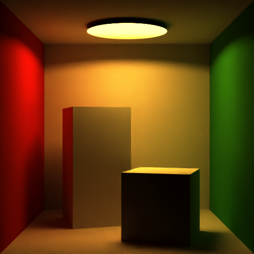](example-images/256spp-denoised.png)

### Intel&reg; Implicit Single Program Multiple Data (SPMD) Program Compiler (Intel ISPC)

[Intel ISPC](https://ispc.github.io/) is a compiler that ingests ISPC C, code that is a variant of the C99 language. This source allows for a programmatic and abstracted usage of SIMD compute lanes available on x86 hardware architecture. Usage of these lanes allows for better performance opportunities with Embree applications.

>**Note**: This sample code does not use ISPC C source because of its interest as an introduction to the API. On the Embree repository, ISPC versions of tutorial sources reside next to pure C/C++ versions.

### Intel&reg; VTune&trade; Profiler

Intel VTune Profiler is a great tool when attempting to optimize a ray tracing application. The tool can help you obtain performance from the architectural capabilities of the platform.

Use Intel VTune Profiler if you are considering program performance-affecting changes, including but not limited to: 
- General elimination of redundant compute
- Random number routines (third-party or your own)
- Adding Ray splitting techniques
- Generating additional output buffer access patterns efficiently (normal, albedo)
- Using a different tasking or threading model

Intel VTune Profiler provides:
- A `hotspots` mode. It shows which functions in the call stack are using the most compute time. Spend optimization efforts on the bottleneck functions in your application.
- Visualization of hardware thread residency. This reinforces the value of any multithreaded approach actually using sing multithreaded compute hardware effectively.
- Visualization of residency for SIMD (Single Instruction Multiple Data) Vector hardware operations. As a rule of thumb, the higher vector hardware utility for a program the better the performance.
- See the Intel VTune Amplifier [metrics of interest](https://www.intel.com/content/www/us/en/develop/documentation/vtune-help/top/reference/cpu-metrics-reference.html):
    - SIMD Instructions per Cycle
    - SIMD Compute-to-L2 Access Ratio
    - SIMD Compute-to-L1 Access Ratio
    - FP Vector
    - FP x87
    - CPU Utilization
    - FPU Utilization
    - % of Packed FP Instructions
    - % of 128-bit Packed Floating Point Instructions
    - % of 256-bit Packed Floating Point Instructions
    - % of Packed SIMD Instructions
    - % of Scalar FP Instructions
    - % of Scalar SIMD Instructions


Running your Intel Embree based application through Intel VTune Profiler is highly recommended. It comes with the Base Kit.

## Intel OSPRay: off-the-shelf renderers
If you are interested in using a complete renderer implementing such pathtracer capability in your software, the Intel OSPRay API defines such renderer objects. Consider any of these [renderers]( https://www.ospray.org/documentation.html#renderers):
- Pathtracer `pathtracer`:
    - Supports volumetric visualization, global illumination, materials, textures. Has a significant superset of features over this tutorial program.
- SciVis `scivis`:
    - Supports volumetric visualization, ambient occlusion, lights.
- AmbientOcclusion `ao`:
    - Supports volumetric visualization, ambient occlusion, no lights.

## Scene Graphs:
Typical rendering applications employ a scenegraph for managing complex scene data from cameras, instances, objects, as well as materials, textures, and animations. This tutorial hardcodes a few basic geometric objects and materials staged within the `SceneGraph`. To review other, more complete reference Scene Graphs see:
- The full Intel Embree tutorial programs that contain a basic reference [scene graph]( https://github.com/embree/embree/blob/v3.13.4/tutorials/common/tutorial/tutorial.cpp).
- Intel OSPRay Studio uses its own reference [scene graph](https://github.com/ospray/ospray_studio/tree/release-0.11.x/sg).

Each implementation can be a reference point in building out your own scene graph in a production application. When moving beyond sandbox study programs, software scalability challenges make a robust scene graph a practical necessity.

## Lights

For simplicity, our lights in this sample code are limited. Consider adding different lights. See the full Intel Embree tutorials demonstrate a few different [light types to try](https://github.com/embree/embree/tree/v3.13.4/tutorials/common/lights).

## Materials omissions

Bi-directional Ray Distribution Function (BRDF) parameterization

The full Embree tutorial application passes a structure representing a Bi-directional Ray Distribution Function (BRDF) representing reflectance model parameters. Our application hard codes reflection models in the interest of simplicity. However, the full tutorial application includes a BRDF parser for use with geometric models stored on disk in .obj/.mtl format.
For example: when reviewing Embree repository codes, notice that parameters associated with the [Phong](https://en.wikipedia.org/wiki/Phong_reflection_model) reflection model are considered.

`pathtracer_device.cpp` from the Embree [tutorials](https://github.com/embree/embree/blob/v3.13.5/tutorials/pathtracer/pathtracer_device.cpp) features additional hand coded material types.

## Texturing

We do not cover texturing in this sample. Review the Embree repository source to see a demonstration of applying textures. See `OBJMaterial__preprocess(..)` in `pathtracer_device.cpp`: [Reference](https://github.com/embree/embree/blob/698442324ccddd11725fb8875275dc1384f7fb40/tutorials/pathtracer/pathtracer_device.cpp#L477)

## Transparency

Transparent materials are omitted in this tutorial. The full Intel Embree path tracer demonstrates [transparency]( https://github.com/embree/embree/blob/v3.13.4/tutorials/pathtracer/pathtracer_device.cpp#L1630) in materials. 

## More Information
You can find more information at the [ Intel oneAPI Rendering Toolkit portal ](https://software.intel.com/content/www/us/en/develop/tools/oneapi/rendering-toolkit.html).

# License

Code samples are licensed under the Apache 2.0 license. See
[LICENSE.txt](LICENSE.txt) for details.
