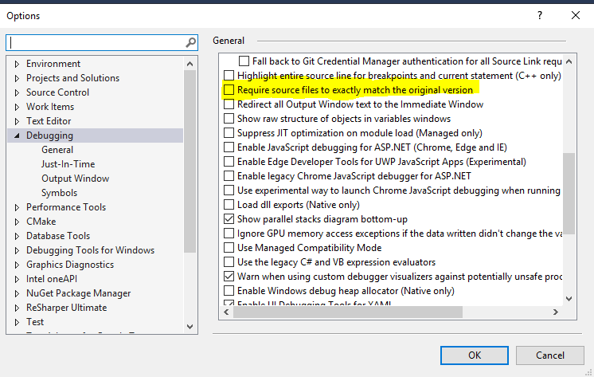

# `array-transform` Sample

This is a small DPC++ example for exercising application debugging using
Intel&reg; Distribution for GDB\*.  It is highly recommended that you go
through this sample *after* you familiarize yourself with the basics of
DPC++, and *before* you start using the debugger.

This sample accompanies the
[Get Started Guide](https://software.intel.com/en-us/get-started-with-debugging-dpcpp)
of the application debugger.

| Optimized for       | Description
|---------------------|--------------
| OS                  | Linux Ubuntu 18.04 to 20.04, CentOS* 8, Fedora* 30, SLES 15; Windows* 10
| Hardware            | Kaby Lake with GEN9 (on GPU) or newer (on CPU)
| Software            | Intel&reg; oneAPI DPC++/C++ Compiler
| What you will learn | Essential debugger features for effective debugging of DPC++ on CPU, GPU, and FPGA emulator
| Time to complete    | 20 minutes for CPU or FPGA emulator; 30 minutes for GPU

## Purpose

The `array-transform` sample is a DPC++ application with a small
computation kernel that is designed to illustrate key debugger
features such as breakpoint definition, thread switching,
scheduler-locking, and SIMD lane views.  The sample is intended
for exercising the debugger, not for performance benchmarking.

The debugger supports debugging kernels that run on the CPU, GPU, or
the accelerator devices.  For convenience, the `array-transform`
sample provides ability to select the target device by passing the
program `cpu`, `gpu`, or `accelerator` as the command-line argument.
The selected device is displayed in the output.  Concrete instructions
about how to run the program and example outputs are given further
below.  For complete setup and usage instructions, see the
[Get Started Guide](https://software.intel.com/en-us/get-started-with-debugging-dpcpp)
of the application debugger.


## Key Implementation Details

The basic DPC++ implementation explained in the code includes device
selection, buffer, accessor, and command groups.  The kernel contains
data access via read/write accessors and a conditional statement to
illustrate (in)active SIMD lanes on a GPU.

## License

This code sample is licensed under MIT license.

## Building and Running the `array-transform` Program

### Setup

Preliminary setup steps are needed for the debugger to function.
Please see the setup instructions in the Get Started Guide based on
your OS:
[Linux](https://software.intel.com/en-us/get-started-with-debugging-dpcpp-linux),
[Windows](https://software.intel.com/en-us/get-started-with-debugging-dpcpp-windows).


### Include Files

The include folder is located at
`%ONEAPI_ROOT%\dev-utilities\latest\include` on your development
system.


### Running Samples In DevCloud

If running a sample in the Intel DevCloud, remember that you must
specify the compute node (CPU, GPU, FPGA) as well whether to run in
batch or interactive mode.  For the array transform sample, a node
with GPU and an interactive shell is recommended.

```
$ qsub -I -l nodes=1:gpu:ppn=2
```

For more information see the Intel® oneAPI
Base Toolkit Get Started Guide
(https://devcloud.intel.com/oneapi/get-started/base-toolkit/).


### Auto-Attach

The debugger has a feature called _auto-attach_ that automatically
starts and connects an instance of `gdbserver-gt` so that kernels
offloaded to the GPU can be debugged conveniently.  Auto-attach is
by default enabled.  To turn this feature off, if desired (e.g. if
interested in debugging CPU or FPGA-emu only), do:
```
$ export INTELGT_AUTO_ATTACH_DISABLE=1
```

To turn the feature back on:
```
$ unset INTELGT_AUTO_ATTACH_DISABLE
```


### On a Linux* System

Perform the following steps:

1.  Build the program using the following `cmake` commands.
    ```
    $ cd array-transform
    $ mkdir build
    $ cd build
    $ cmake ..
    $ make
    ```
    > Note: The cmake configuration enforces the `Debug` build type.

2.  Run the program:
    ```
    $ ./array-transform <device>
    ```
    > Note: `<device>` is the type of the device type to offload the kernel.
    > Use `cpu`, `gpu`, or `accelerator` to select the CPU, GPU, or the
    > FPGA emulator device, respectively.  E.g.:
    ```
    $ ./array-transform cpu
    ```

3.  Start a debugging session:
    ```
    $ gdb-oneapi --args array-transform <device>
    ```

4.  Clean the program using:
    ```
    $ make clean
    ```

By default, CMake configures the build for Just-in-Time (JIT)
compilation of the kernel.  However, it also offers an option for
*Ahead-of-Time* (AoT) compilation.  To compile the kernel
ahead-of-time for a specific device, set the `DPCPP_COMPILE_TARGET`
option to the desired device during configuration.  For CPU, use the
`cpu` value; for FPGA-emu, use the `fpga-emu` value.  Other values are
assumed to be for GPU, and are passed directly to the GPU AoT
compiler.

> *Hint:* Run `ocloc compile --help` to see available GPU device options.

For example, to do AoT compilation for a `kbl` GPU device:

```
$ cmake .. -DDPCPP_COMPILE_TARGET=kbl
```

or for the Gen12 family:

```
$ cmake .. -DDPCPP_COMPILE_TARGET=gen12LP
```

> *Note:* AoT compilation is particularly helpful in larger
> applications where compiling with debug information takes
> considerably longer time.

For instructions about starting and using the debugger, please
see the
[Get Started Guide (Linux)](https://software.intel.com/en-us/get-started-with-debugging-dpcpp-linux).

### On a Windows* System Using Visual Studio* Version 2017 or Newer

#### Command line using MSBuild

* `set CL_CONFIG_USE_NATIVE_DEBUGGER=1`
* `MSBuild array-transform.sln /t:Rebuild /p:Configuration="debug"`

#### Visual Studio IDE

1. Right-click on the solution files and open via either Visual Studio 2017
   or 2019.

2. Open in Visual Studio "Tools > Options > Debugging > General" and
   ensure that "Require source files to exactly match the original
   version" Debugging option is **not** checked.  
   

3. Select Menu "Build > Build Solution" to build the selected configuration.

4. Select Menu "Debug > Start Debugging" to run the program.

5. The solution file is configured to pass `cpu` as the argument to the
   program.  To select a different device, go to project's "Configuration
   Properties > Debugging" and set the "Command Arguments" field.
   Use `gpu` or `accelerator` to target the GPU or the FPGA emulator device,
   respectively.

For detailed instructions about starting and using the debugger,
please see the
[Get Started Guide (Windows)](https://software.intel.com/en-us/get-started-with-debugging-dpcpp-windows).


### Example Outputs

```
$ gdb-oneapi -q --args ./array-transform cpu
Reading symbols from ./array-transform...
(gdb) break 56
Breakpoint 1 at 0x4057b7: file array-transform.cpp, line 56.
(gdb) run
...<snip>...
[SYCL] Using device: [Intel(R) Core(TM) i9-7900X CPU @ 3.30GHz] from [Intel(R) OpenCL]
[Switching to Thread 0x7fffe3bfe700 (LWP 925)]

Thread 16 "array-transform" hit Breakpoint 1, main::$_1::operator()<cl::sycl::handler>
(cl::sycl::handler&) const::{lambda(auto:1)#1}::operator()<cl::sycl::item<1, true> >
(cl::sycl::item<1, true>) const (this=0x7fffe3bfcfa8, index=...) at array-transform.cpp:56
56              int element = in[index];  // breakpoint-here
(gdb)
```

```
$ gdb-oneapi -q --args ./array-transform accelerator
Reading symbols from ./array-transform...
(gdb) break 56
Breakpoint 1 at 0x4057b7: file array-transform.cpp, line 56.
(gdb) run
...<snip>...
[SYCL] Using device: [Intel(R) FPGA Emulation Device] from [Intel(R) FPGA Emulation Platform for OpenCL(TM)]
[Switching to Thread 0x7fffe1ffb700 (LWP 2387)]

Thread 9 "array-transform" hit Breakpoint 1, main::$_1::operator()<cl::sycl::handler>
(cl::sycl::handler&) const::{lambda(auto:1)#1}::operator()<cl::sycl::item<1, true> >
(cl::sycl::item<1, true>) const (this=0x7fffe1ff9fa8, index=...) at array-transform.cpp:56
56              int element = in[index];  // breakpoint-here
(gdb)
```

```
$ gdb-oneapi -q --args ./array-transform gpu
Reading symbols from ./array-transform...
(gdb) break 56
Breakpoint 1 at 0x4057b7: file array-transform.cpp, line 56.
(gdb) run
...<snip>...
[SYCL] Using device: [Intel(R) Gen9] from [Intel(R) Level-Zero]
...<snip>...
[Switching to Thread 1073741824 lane 0]

Thread 2.2 hit Breakpoint 1,  with SIMD lanes [0-7], main::$_1::operator()
<cl::sycl::handler>(cl::sycl::handler&) const::{lambda(auto:1)#1}::operator()
<cl::sycl::item<1, true> >(cl::sycl::item<1, true>) const (this=0x2f690c0, index=...)
at array-transform.cpp:56
56              int element = in[index];  // breakpoint-here
(gdb)
```

## Useful Commands

`help <cmd>`
: Print help info about the command `cmd`.

`run [arg1, ... argN]`
: Start the program, optionally with arguments.

`break <filename>:<line>`
: Define a breakpoint at given source file's specified line.

`info break`
: Show the defined breakpoints.

`delete <N>`
: Remove the `N`th breakpoint.

`watch <exp>`
: Stop when value of the expression `exp` changes.

`step`, `next`
: Single-step a source line, stepping into/over function calls.

`continue`
: Continue execution.

`print <exp>`
: Print value of expression `exp`.

`backtrace`
: Show the function call stack.

`up`, `down`
: Go one level up/down in the function call stack.

`disassemble`
: Disassemble the current function.

`info args`/`locals`
: Show the arguments/local vars of the current function.

`info reg <regname>`
: Show contents of the specified register.

`info inferiors`
: Display information about the `inferiors`.  For GPU
  offloading, one inferior represents the host process, and
  another (`gdbserver-gt`) represents the kernel.

`info threads <ID>`
: Display information about threads with id `ID`, including their
  active SIMD lanes. Omit id to display all threads.

`thread <thread_id>:<lane>`
: Switch context to the SIMD lane `lane` of the specified thread.
  E.g: `thread 2.6:4`

`thread apply <thread_id>:<lane> <cmd>`
: Apply command `cmd` to the specified lane of the thread.
  E.g: `thread apply 2.3:* print element` prints
  `element` for each active lane of thread 2.3.
  Useful for inspecting vectorized values.

`x /<format> <addr>`
: Examine the memory at address `addr` according to
  `format`.  E.g: `x /i $pc` shows the instruction pointed by
  the program counter.  `x /8wd &count` shows 8 words in decimal
  format located at the address of `count`.

`set nonstop on/off`
: Enable/disable the nonstop mode.  This command may **not** be used
  after the program has started.

`set scheduler-locking on/step/off`
: Set the scheduler locking mode.

`maint jit dump <addr> <filename>`
: Save the JIT'ed objfile that contains address `addr` into the file
  `filename`.  Useful for extracting the DPC++ kernel when running on
  the CPU device.

`cond [-force] <N> <exp>`
: Define the expression `exp` as the condition for breakpoint `N`.
  Use the optional `-force` flag to force the condition to be defined
  even when `exp` is invalid for the current locations of the breakpoint.
  Useful for defining conditions involving JIT-produced artificial variables.
  E.g.: `cond -force 1 __ocl_dbg_gid0 == 19`.

---

\* Intel is a trademark of Intel Corporation or its subsidiaries.  Other
names and brands may be claimed as the property of others.
