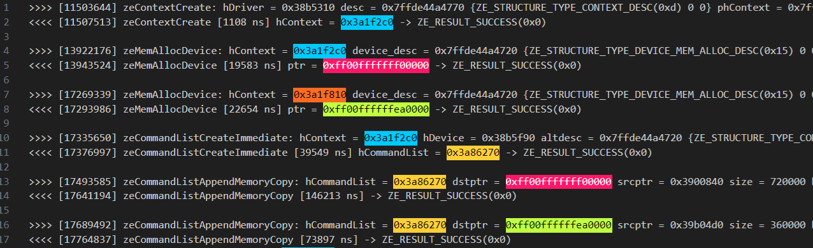

# `Guided Matrix Multiplication Invalid Contexts` Sample

The `Guided Matrix Multiplication Invalid Contexts` sample demonstrates how to
use the Intel® oneAPI Base Toolkit (Base Kit) and several tools found in it to
triage incorrect use of the SYCL language.

The sample is a simple program that multiplies together two large matrices and
verifies the results.

| Property              | Description
|:---                   |:---
| What you will learn   | A method to determine the root cause of incorrect use of queues with different contexts.
| Time to complete      | 50 minutes

> **Note**: For comprehensive instructions on the Intel® Distribution for GDB*
> and writing SYCL code, see the *[Intel® oneAPI Programming
> Guide](https://software.intel.com/en-us/oneapi-programming-guide)*. (Use
> search or the table of contents to find relevant information quickly.)

## Purpose

The sample in this tutorial shows how to debug incorrect use of variables that
are owned by different queues that have different contexts.

This type of error can be hard to detect and determine the root cause in a
large body of code where queues and memory are passed between functions. The
lack of tools that tell you what is wrong combined with the fact that the
default Level Zero driver does not notice there is a problem (only the OpenCL™
driver and CPU-side runtimes report the issue) make this issue particularly
painful since code that runs on a single device can fail to run on two devices
with no indication as to why.

The sample includes different versions of a simple matrix multiplication
program.

| File                                 | Description
|:---                                  |:---
| `1_matrix_mul_invalid_contexts.cpp`  | This example shows what happens when a developer mixes up queues owned by different contexts.
| `2_matrix_mul.cpp`                   | A working version of the matrix multiply code that uses the same queue for all memory operations.

## Prerequisites

| Optimized for       | Description
|:---                 |:---
| OS                  | Ubuntu* 20.04
| Hardware            | GEN9 or newer
| Software            | Intel® oneAPI DPC++/C++ Compiler <br> Intel® Distribution for GDB* <br> [Tracing and Profiling Tool](https://github.com/intel/pti-gpu/tree/master/tools/onetrace), which is available from the [onetrace](https://github.com/intel/pti-gpu/tree/master/tools/onetrace) GitHub repository.

## Key Implementation Details

The basic SYCL* standards implemented in the code include the use of the
following:

- SYCL* queues and devices

- Explicit memory operations using Unified Shared Memory (USM)

- SYCL* kernels (including parallel_for function and explicit memory copies)

- SYCL* queues

## Set Environment Variables

When working with the command-line interface (CLI), you should configure the
oneAPI toolkits using environment variables. Set up your CLI environment by
sourcing the `setvars` script every time you open a new terminal window. This
practice ensures that your compiler, libraries, and tools are ready for
development.

## Build and Run the `Guided Matrix Multiplication Invalid Contexts` Programs

> **Note**: If you have not already done so, set up your CLI environment by
> sourcing  the `setvars` script in the root of your oneAPI installation.
>
> Linux*:
>
> - For system wide installations: `. /opt/intel/oneapi/setvars.sh`
>
> - For private installations: `. ~/intel/oneapi/setvars.sh`
>
> - For non-POSIX shells, like csh, use the following command:
>   `bash -c 'source <install-dir>/setvars.sh ; exec csh'`
>
> For more information on configuring environment variables, see *[Use the
> setvars Script with Linux* or
> macOS*](https://www.intel.com/content/www/us/en/develop/documentation/oneapi-programming-guide/top/oneapi-development-environment-setup/use-the-setvars-script-with-linux-or-macos.html)*.

### Use Visual Studio Code* (VS Code) (Optional)

You can use Visual Studio Code* (VS Code) extensions to set your environment,
create launch configurations, and browse and download samples.

The basic steps to build and run a sample using VS Code include:

 1. Configure the oneAPI environment with the extension **Environment
    Configurator for Intel® oneAPI Toolkits**.

 2. Download a sample using the extension **Code Sample Browser for Intel®
    oneAPI Toolkits**.

 3. Open a terminal in VS Code (**Terminal > New Terminal**).

 4. Run the sample in the VS Code terminal using the instructions below.

To learn more about the extensions and how to configure the oneAPI
environment, see the *[Using Visual Studio Code with Intel® oneAPI Toolkits
User
Guide](https://www.intel.com/content/www/us/en/develop/documentation/using-vs-code-with-intel-oneapi/top.html)*.

### On Linux*

1. Change to the sample directory.

2. Build the programs.

   ```
   mkdir build
   cd build
   cmake ..
   make
   ```

3. Run the programs.
   ```
   make run_all
   ```

   > **Note**: The application by default uses the Level Zero runtime and will
   > run without errors.  We will do a deeper investigation of the
   > application, in particular with the openCL runtime, to expose problems
   > that could also manifest in Level Zero.

   For the mixed queue version only, enter the following:
   ```
   make run_bugged
   ```

   For the working version only, enter the following:
   ```
   make run_OK
   ```

4. Clean the program. (Optional)

   ```
   make clean
   ```

#### Troubleshooting

If an error occurs, you can get more details by running `make` with
the `VERBOSE=1` argument:

```
make VERBOSE=1
```

If you receive an error message, troubleshoot the problem using the
**Diagnostics Utility for Intel® oneAPI Toolkits**. The diagnostic utility
provides configuration and system checks to help find missing dependencies,
permissions errors, and other issues. See the *[Diagnostics Utility for Intel®
oneAPI Toolkits User
Guide](https://www.intel.com/content/www/us/en/develop/documentation/diagnostic-utility-user-guide/top.html)*
for more information on using the utility.

### Build and Run the Sample in Intel® DevCloud (Optional)

When running a sample in the Intel® DevCloud, you must specify the compute
node (CPU, GPU, FPGA) and whether to run in batch or interactive mode.

Use the Linux instructions to build and run the program.

You can specify a GPU node using a single line script.

```
qsub  -I  -l nodes=1:gpu:ppn=2 -d .
```

- `-I` (upper case I) requests an interactive session.

- `-l nodes=1:gpu:ppn=2` (lower case L) assigns one full GPU node.

- `-d .` sets the current folder as the working directory for the task.

  |Available Nodes    |Command Options
  |:---               |:---
  |GPU                |`qsub -l nodes=1:gpu:ppn=2 -d .`
  |CPU                |`qsub -l nodes=1:xeon:ppn=2 -d .`

For more information on how to specify compute nodes read *[Launch and manage
jobs](https://devcloud.intel.com/oneapi/documentation/job-submission/)* in the
Intel® DevCloud for oneAPI Documentation.

> **Note**: Since Intel® DevCloud for oneAPI includes the appropriate
> development environment already configured, you do not need to set
> environment variables.

## Guided Debugging

The following instructions assume you have installed Intel® Distribution for
GDB* and have a basic working knowledge of GDB.

To learn how setup and use Intel® Distribution for GDB*, see *[Get Started
with Intel® Distribution for GDB* on Linux* OS
Host](https://www.intel.com/content/www/us/en/docs/distribution-for-gdb/get-started-guide-linux)*.

> **Note**: SYCL applications will use the oneAPI Level Zero runtime by
> default. oneAPI Level Zero provides a low-level, direct-to-metal interface
> for the devices in a oneAPI platform. For more information see *[Using the
> oneAPI Level Zero Interface: A Brief Introduction to the Level Zero
> API](https://www.intel.com/content/www/us/en/developer/articles/technical/using-oneapi-level-zero-interface.html?wapkw=Level%20Zero#gs.dxm4t4)*.

This guided example demonstrates what might happen when a developer mixes up
queues owned by different contexts.

### Getting the Tracing and Profiling Tool

At an important step in this tutorial, the instructions require a utility that
was not installed with the Intel® oneAPI Base Toolkit (Base Kit).

You must download the [Tracing and Profiling
Tool](https://github.com/intel/pti-gpu/tree/master/tools/onetrace) code from
GitHub and build the utility. The build instructions are included in the
README in the GitHub repository.

### Check the Programs

1. Notice that both versions of the application run to completion and report
   correct results.

   SYCL applications use the Level Zero runtime by default with an Intel GPU.
   If you use OpenCL™ software to run `1_matrix_mul_invalid_contexts`, the
   program with a bug in it will crash before it can report results.

2. Check the results on a **GPU** with OpenCL.

   ```
   ONEAPI_DEVICE_SELECTOR=opencl:gpu ./1_matrix_mul_invalid_contexts
   ```

   The output might look similar to the following:

   ```
   Initializing
   Computing
   Device: Intel(R) Graphics [0x020a]
   Device compute units: 960
   Device max work item size: 1024, 1024, 1024
   Device max work group size: 1024
   Problem size: c(150,600) = a(150,300) * b(300,600)
   terminate called after throwing an instance of 'cl::sycl::runtime_error'
     what():  Native API failed. Native API returns: -5 (CL_OUT_OF_RESOURCES) -5 (CL_OUT_OF_RESOURCES)
   Aborted (core dumped)
   ```

   > **Note:** this will only work if the `sycl-ls` command shows OpenCL
   > devices for the graphics card, such as like this:

   ```
   $ sycl-ls
   [opencl:cpu][opencl:0] Intel(R) OpenCL, Intel(R) Xeon(R) Platinum 8360Y CPU @ 2.40GHz OpenCL 3.0 (Build 0) [2024.18.6.0.02_160000]
   [opencl:gpu][opencl:1] Intel(R) OpenCL Graphics, Intel(R) Data Center GPU Max 1550 OpenCL 3.0 NEO  [24.22.29735.27]
   [opencl:gpu][opencl:2] Intel(R) OpenCL Graphics, Intel(R) Data Center GPU Max 1550 OpenCL 3.0 NEO  [24.22.29735.27]
   [opencl:cpu][opencl:3] Intel(R) OpenCL, Intel(R) Xeon(R) Platinum 8360Y CPU @ 2.40GHz OpenCL 3.0 (Build 0) [2023.16.7.0.21_160000]
   [opencl:fpga][opencl:4] Intel(R) FPGA Emulation Platform for OpenCL(TM), Intel(R) FPGA Emulation Device OpenCL 1.2  [2023.16.7.0.21_160000]
   [level_zero:gpu][level_zero:0] Intel(R) Level-Zero, Intel(R) Data Center GPU Max 1550 1.3 [1.3.29735]
   [level_zero:gpu][level_zero:1] Intel(R) Level-Zero, Intel(R) Data Center GPU Max 1550 1.3 [1.3.29735]
   ```

   If you are missing `[opencl:gpu]` devices you may have to add the necessary libraries to your device path by setting the appropriate path in `DRIVERLOC` and then running the following four commands (for Ubuntu - adapt for other OSes):

   ```
   export DRIVERLOC=/usr/lib/x86_64-linux-gnu
   export OCL_ICD_FILENAMES=$OCL_ICD_FILENAMES:$DRIVERLOC/intel-opencl/libigdrcl.so
   export LD_LIBRARY_PATH=$LD_LIBRARY_PATH:$DRIVERLOC
   export PATH=$PATH:/opt/intel/oneapi:$DRIVERLOC
   ```

3. Check the results on the **CPU** using OpenCL. You should see similar problems.

   ```
   ONEAPI_DEVICE_SELECTOR=opencl:cpu ./1_matrix_mul_invalid_contexts
   ```

   The output might look like the following:

   ```
   Initializing
   Computing
   Device: Intel(R) Xeon(R) Platinum 8360Y CPU @ 2.40GHz
   Device compute units: 144
   Device max work item size: 8192, 8192, 8192
   Device max work group size: 8192
   terminate called after throwing an instance of 'cl::sycl::runtime_error'
     what():  No device of requested type available. Please check https://software.intel.com/content/www/us/en/develop/articles/intel-oneapi-dpcpp-system-requirements.html -1 (CL_DEVICE_NOT_FOUND)
   Aborted (core dumped)
   ```

Note the change in results. In the next section we will examine what went
wrong.

### Use the Debugger to Find the Issue

In this section, you will use the Intel® Distribution for GDB* to determine
what might be wrong.

1. Start the debugger using OpenCL™ on the **GPU**.

   ```
   ONEAPI_DEVICE_SELECTOR=opencl:gpu gdb-oneapi ./1_matrix_mul_invalid_contexts
   ```

2. You should get the prompt `(gdb)`.

3. From the debugger, run the program.

   ```
   (gdb) run
   ```

   This will launch the application and provide some indication of where the
   code failed.

   ```
   Starting program: .../1_matrix_mul_invalid_contexts
   :
   [Thread debugging using libthread_db enabled]
   Using host libthread_db library "/usr/lib/x86_64-linux-gnu/libthread_db.so.1".
   Initializing
   Computing
   Device: Intel(R) Graphics [0x020a]
   Device compute units: 960
   Device max work item size: 1024, 1024, 1024
   Device max work group size: 1024
   Problem size: c(150,600) = a(150,300) * b(300,600)
   [New Thread 0x15553b1c8700 (LWP 47514)]
   terminate called after throwing an instance of 'sycl::_V1::runtime_error'
   what():  Native API failed. Native API returns: -5 (PI_ERROR_OUT_OF_RESOURCES) -5 (PI_ERROR_OUT_OF_RESOURCES)

   Thread 1 "a.out" received signal SIGABRT, Aborted.
   __pthread_kill_implementation (no_tid=0, signo=6, threadid=<optimized out>) at ./nptl/pthread_kill.c:44
   warning: 44     ./nptl/pthread_kill.c: No such file or directory

   (gdb)
   ```

4. Prompt for a call stack to inspect the results.

   ```
   (gdb) where
   ```

   The output can be extensive and might look similar to the following:

   ```
   #0  __pthread_kill_implementation (no_tid=0, signo=6, threadid=<optimized out>) at ./nptl/pthread_kill.c:44
   #1  __pthread_kill_internal (signo=6, threadid=<optimized out>) at ./nptl/pthread_kill.c:78
   #2  __GI___pthread_kill (threadid=<optimized out>, signo=signo@entry=6) at ./nptl/pthread_kill.c:89
   #3  0x0000155554a4526e in __GI_raise (sig=sig@entry=6) at ../sysdeps/posix/raise.c:26
   #4  0x0000155554a288ff in __GI_abort () at ./stdlib/abort.c:79
   #5  0x00001555552a5ffe in ?? () from /usr/lib/x86_64-linux-gnu/libstdc++.so.6
   #6  0x00001555552bae9c in ?? () from /usr/lib/x86_64-linux-gnu/libstdc++.so.6
   #7  0x00001555552a5a49 in std::terminate() () from /usr/lib/x86_64-linux-gnu/libstdc++.so.6
   #8  0x00001555552bae8e in std::rethrow_exception(std::__exception_ptr::exception_ptr) () from /usr/lib/x86_64-linux-gnu/libstdc++.so.6
   #9  0x0000155555000b93 in sycl::_V1::detail::Scheduler::enqueueCommandForCG(std::shared_ptr<sycl::_V1::detail::event_impl>, std::vector<sycl::_V1::detail::Command*, std::allocator<sycl::_V1::detail::Command*> >&, sycl::_V1::detail::BlockingT) () from /opt/intel/oneapi/compiler/2024.2/lib/libsycl.so.7
   #10 0x00001555550001e1 in sycl::_V1::detail::Scheduler::addCG(std::unique_ptr<sycl::_V1::detail::CG, std::default_delete<sycl::_V1::detail::CG> >, std::shared_ptr<sycl::_V1::detail::queue_impl> const&, _pi_ext_command_buffer*, std::vector<unsigned int, std::allocator<unsigned int> > const&) () from /opt/intel/oneapi/compiler/2024.2/lib/libsycl.so.7
   #11 0x0000155555039c8a in sycl::_V1::handler::finalize() () from /opt/intel/oneapi/compiler/2024.2/lib/libsycl.so.7
   #12 0x0000155554fbc2fd in void sycl::_V1::detail::queue_impl::finalizeHandler<sycl::_V1::handler>(sycl::_V1::handler&, sycl::_V1::event&) ()
      from /opt/intel/oneapi/compiler/2024.2/lib/libsycl.so.7
   #13 0x0000155554fbbe19 in sycl::_V1::detail::queue_impl::submit_impl(std::function<void (sycl::_V1::handler&)> const&, std::shared_ptr<sycl::_V1::detail::queue_impl> const&, std::shared_ptr<sycl::_V1::detail::queue_impl> const&, std::shared_ptr<sycl::_V1::detail::queue_impl> const&, sycl::_V1::detail::code_location const&, std::function<void (bool, bool, sycl::_V1::event&)> const*) () from /opt/intel/oneapi/compiler/2024.2/lib/libsycl.so.7
   #14 0x0000155554fbb800 in sycl::_V1::detail::queue_impl::submit(std::function<void (sycl::_V1::handler&)> const&, std::shared_ptr<sycl::_V1::detail::queue_impl> const&, sycl::_V1::detail::code_location const&, std::function<void (bool, bool, sycl::_V1::event&)> const*) () from /opt/intel/oneapi/compiler/2024.2/lib/libsycl.so.7
   #15 0x000015555506f8b5 in sycl::_V1::queue::submit_impl(std::function<void (sycl::_V1::handler&)>, sycl::_V1::detail::code_location const&) ()
      from /opt/intel/oneapi/compiler/2024.2/lib/libsycl.so.7
   #16 0x0000000000404b98 in sycl::_V1::queue::submit<main::{lambda(auto:1&)#1}>(main::{lambda(auto:1&)#1}, sycl::_V1::detail::code_location const&) (this=0x7fffffffb2e0, CGF=...,
      CodeLoc=...) at /opt/intel/oneapi/compiler/2024.2/bin/compiler/../../include/sycl/queue.hpp:358
   #17 0x00000000004046c3 in main () at 1_matrix_mul_invalid_contexts.cpp:101
   (gdb)
   ```

5. Note the last frame number in the call stack (your last frame may vary
   from the example above).

6. Switch the debugger focus to that frame.

   ```
   (gdb) frame 17
   ```

   Your output will be similar to the following:

   ```
   #13 0x000000000040408a in main () at src/1_matrix_mul_invalid_contexts.cpp:101
   101         q.submit([&](auto &h) {
   (gdb)
   ```

7. Examine the source code in that region.

   ```
   (gdb) list
   ```

   You should see the code around the line reporting the problem.

   ```
   96
   97          // Submit command group to queue to initialize matrix b
   98          q.memcpy(dev_b, &b_back[0], N*P * sizeof(float));
   99
   100         // Submit command group to queue to initialize matrix c
   101         q.submit([&](auto &h) {
   102             h.memcpy(dev_c, &c_back[0], M*P * sizeof(float));
   103         });
   104
   105         q.wait();
   (gdb)
   ```

   As you can see, there is something wrong in line 101.  Unfortunately, the
   generic `PI_OUT_OF_RESOURCES` we saw when it crashed does not really mean
   anything - it just tells us there is a problem.

   Fortunately, in this case the two variables, `dev_c` and `c_back`, are
   allocated only a few lines above line 101. In real code this might have
   happened in another source file or library, so hunting down this issue is
   going to be much harder.

   Look at the source, and note that `dev_c` is defined as:

   ```
   float * dev_c = sycl::malloc_device<float>(M*P, q2);
   ```

   and `c_back` is defined as follows as local memory

   ```
   float(*c_back)[P] = new float[M][P];
   ```

8. Look at line 101, and notice the discrepancy.

   ```
   q.submit([&](auto &h) {
   ```

   Variable `dev_c` was allocated on queue `q2` while the submit statement is
   being done on queue `q`.

### Identify the Problem without Code Inspection

You must have already built the [Tracing and Profiling
Tool](https://github.com/intel/pti-gpu/tree/master/tools/onetrace). Once you
have built the utility, you can start it before your program (similar to
starting GBD).

One of the things that the Tracing and Profiling utility can help us identify
is printing every low-level API call made to OpenCL™ or Level Zero. This is
the features that we will use to attempt to match the source to the events.

1. Let's look at the output from using OpenCL again since the program stopped
   when it hit a failure previously.<br> Include `-c` when invoking `onetrace`
   to enable call logging of API calls.

   > **Note**: You must modify the command shown below to include the path to
   > where you installed the `onetrace` utility.

   ```
   ONEAPI_DEVICE_SELECTOR=opencl:gpu [path]/onetrace -c ./1_matrix_mul_invalid_contexts
   ```

   The `onetrace` utility outputs extensive results. A few key excerpts with
   areas of interest are shown below.

   

   Let's work backwards from the error, starting with `clEnqueueMemcpyINTEL`.

   This function (line 22) uses `command_queue = 0x49d7130` and copies
   `src_ptr` into device memory `dst_ptr = 0xff00ffffffeb0000`. Working back
   up the stack, you can see we allocated the device memory with the address
   `0xff00ffffffeb0000` using device context `0x49dbff0` (line 16). However,
   the command queue (`0x49d7130`) being used in the `clEnqueueMemcpyINTEL`
   was created using the device context `0x488d190` (line 4), which is
   different from the device context used to allocate the destination memory
   (`0x49dbff0` - line 16 again). The generic error we get is the OpenCL
   indication stating that this is illegal.

   This is legal if both queues point to the same device context; however, in
   this example `q2` is actually defined pointing to another device context.
   You might do this in actual code if you have multiple offload compute
   devices you are targeting. This code is sending work and data to each
   device for processing. It is easy to accidentally send the wrong pointer to
   the wrong queue in complex code.

   For context an example of legal memory copy where the device context
   (`0x488d190`) used for the command queue (`0x49d7130`) is the same as that
   uses for the memory allocation is shown as well (lines 4, 7, 19).

2. Let's also look at the output from Level Zero, and see if we could have
   detected the issue there:

   ```
   ONEAPI_DEVICE_SELECTOR=level_zero:gpu [path]onetrace -c ./1_matrix_mul_invalid_contexts
   ```

   Your output might be similar to the following:

   

   Once again, if we look closely, we can see that we are using two different
   device contexts, one to create the command queue, and one to create the
   memory at `0xff00ffffffea0000`, which is potentially illegal. On a
   single-card, single-tile system this may be legal, but if you are using
   different device contexts to access different tiles, or different offload
   devices, the program will crash in those cases but not in the single-card,
   single-tile system. This could make debugging quite challenging.

   The `onetrace` utility can be very helpful detecting these sorts of issues
   at a low level.  It has other useful abilities, like telling you how much
   runtime each OpenCL or Level Zero call consumed, how long your kernels ran
   on the device, how long memory transfers took, and it can even create a
   timeline showing what happened when using the Chrome(tm) tracing browser
   tool.

### Fix the Problem

To fix this problem, you must change the `malloc_device` allocating `dev_c` to
use the same queue (and thus same device context) as the first two device
allocations or create queue `q` to use the same underlying device context.

If you really need to operate over multiple devices, this example will need to
be entirely re-written, which is beyond the scope of this tutorial.

## License

Code samples are licensed under the MIT license. See
[License.txt](https://github.com/oneapi-src/oneAPI-samples/blob/master/License.txt) for details.

Third party program Licenses can be found here:
[third-party-programs.txt](https://github.com/oneapi-src/oneAPI-samples/blob/master/third-party-programs.txt).
