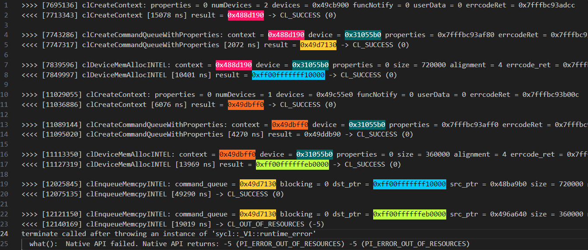

# `Guided Matrix Multiplication Invalid Contexts` Sample

The `Guided Matrix Multiplication Invalid Contexts` sample demonstrates how to
use the Intel® oneAPI Base Toolkit (Base Kit) and several tools found in it to
triage incorrect use of the SYCL language.

The sample is a simple program that multiplies together two large matrices and
verifies the results.

| Property              | Description
|:---                   |:---
| What you will learn   | A method to determine the root cause of incorrect use of queues with different contexts.
| Time to complete      | 50 minutes

> **Note**: For comprehensive instructions on the Intel® Distribution for GDB* and writing SYCL code, see the *[Intel® oneAPI Programming Guide](https://www.intel.com/content/www/us/en/docs/oneapi/programming-guide/current/overview.html)*. (Use search or the table of contents to find relevant information quickly.)

## Purpose

The sample in this tutorial shows how to debug incorrect use of variables that
are owned by different queues that have different contexts.

This type of error can be hard to detect and determine the root cause in a
large body of code where queues and memory are passed between functions. The
lack of tools that tell you what is wrong combined with the fact that the
default Level Zero driver does not notice there is a problem (only the OpenCL™
driver and CPU-side runtimes report the issue) make this issue particularly
painful since code that runs on a single device can fail to run on two devices
with no indication as to why.

The sample includes different versions of a simple matrix multiplication
program.

| File                                 | Description
|:---                                  |:---
| `1_matrix_mul_invalid_contexts.cpp`  | This example shows what happens when a developer mixes up queues owned by different contexts.
| `2_matrix_mul.cpp`                   | A working version of the matrix multiply code that uses the same queue for all memory operations.

## Prerequisites

| Optimized for       | Description
|:---                 |:---
| OS                      | Ubuntu* 24.04 LTS
| Hardware                | GEN9 or newer
| Software                | Intel® oneAPI DPC++/C++ Compiler 2025.1 <br> Intel® Distribution for GDB* 2025.1 <br> Unified Tracing and Profiling Tool 2.1.2, which is available from the [following Github repository](https://github.com/intel/pti-gpu/tree/master/tools/unitrace).
| Intel GPU Driver | Intel® General-Purpose GPU Rolling Release driver 2507.12 or later from https://dgpu-docs.intel.com/releases/releases.html

## Key Implementation Details

The basic SYCL* standards implemented in the code include the use of the
following:

- SYCL* queues and devices

- Explicit memory operations using Unified Shared Memory (USM)

- SYCL* kernels (including parallel_for function and explicit memory copies)

- SYCL* queues

## Set Environment Variables

When working with the command-line interface (CLI), you should configure the
oneAPI toolkits using environment variables. Set up your CLI environment by
sourcing the `setvars` script every time you open a new terminal window. This
practice ensures that your compiler, libraries, and tools are ready for
development.

## Build and Run the `Guided Matrix Multiplication Invalid Contexts` Programs

> **Note**: If you have not already done so, set up your CLI environment by
> sourcing  the `setvars` script in the root of your oneAPI installation.
>
> Linux*:
>
> - For system wide installations: `. /opt/intel/oneapi/setvars.sh`
>
> - For private installations: `. ~/intel/oneapi/setvars.sh`
>
> - For non-POSIX shells, like csh, use the following command:
>   `bash -c 'source <install-dir>/setvars.sh ; exec csh'`
>
> For more information on configuring environment variables, see *[Use the setvars Script with Linux* or macOS*](https://www.intel.com/content/www/us/en/docs/oneapi/programming-guide/current/use-the-setvars-and-oneapi-vars-scripts-with-linux.html)*.

### Use Visual Studio Code* (VS Code) (Optional)

You can use Visual Studio Code* (VS Code) extensions to set your environment,
create launch configurations, and browse and download samples.

The basic steps to build and run a sample using VS Code include:

 1. Configure the oneAPI environment with the extension *Environment Configurator for Intel® Software Development Tools*.

 2. Download a sample using the extension *Code Sample Browser for Intel® Software Development Tools*.

 3. Open a terminal in VS Code (`Terminal > New Terminal`).

 4. Run the sample in the VS Code terminal using the instructions below.

To learn more about the extensions and how to configure the oneAPI environment, see the *[Using Visual Studio Code with Intel® oneAPI Toolkits User Guide](https://www.intel.com/content/www/us/en/docs/oneapi/user-guide-vs-code/current/overview.html)*.

### On Linux*

1. Change to the sample directory.

2. Build the programs.

   ```
   mkdir build
   cd build
   cmake ..
   make
   ```

3. Run the programs.
   ```
   make run_all
   ```

   > **Note**: The application by default uses the Level Zero runtime and will
   > run without errors.  We will do a deeper investigation of the
   > application, in particular with the openCL runtime, to expose problems
   > that could also manifest in Level Zero.

   For the mixed queue version only, enter the following:
   ```
   make run_bugged
   ```

   For the working version only, enter the following:
   ```
   make run_OK
   ```

4. Clean the program. (Optional)

   ```
   make clean
   ```

#### Troubleshooting

If an error occurs, you can get more details by running `make` with
the `VERBOSE=1` argument:

```
make VERBOSE=1
```

If you receive an error message, troubleshoot the problem using the **Diagnostics Utility for Intel® oneAPI Toolkits**. The diagnostic utility provides configuration and system checks to help find missing dependencies, permissions errors, and other issues. See the *[Diagnostics Utility for Intel® oneAPI Toolkits User Guide](https://www.intel.com/content/www/us/en/docs/oneapi/user-guide-diagnostic-utility/current/overview.html)* for more information on using the utility.


## Guided Debugging

The following instructions assume you have installed Intel® Distribution for
GDB* and have a basic working knowledge of GDB.

### Setting up to Debug on the GPU
To learn how setup and use Intel® Distribution for GDB*, see the *[Get Started with Intel® Distribution for GDB* on Linux* OS Host](https://www.intel.com/content/www/us/en/docs/distribution-for-gdb/get-started-guide-linux/current/overview.html)*.  Additional setup instructions you should follow are at *[GDB-PVC debugger](https://dgpu-docs.intel.com/system-user-guides/DNP-Max-1100-userguide/DNP-Max-1100-userguide.html#gdb-pvc-debugger)* and *[Configuring Kernel Boot Parameters](https://dgpu-docs.intel.com/driver/configuring-kernel-boot-parameters.html)*.

Documentation on using the debugger in a variety of situations can be found at *[Debug Examples in Linux](https://www.intel.com/content/www/us/en/docs/distribution-for-gdb/tutorial-debugging-dpcpp-linux/current/overview.html)*

>**Note**: SYCL applications will use the oneAPI Level Zero runtime by default. oneAPI Level Zero provides a low-level, direct-to-metal interface for the devices in a oneAPI platform. For more information see the *[Level Zero Specification Documentation - Introduction](https://oneapi-src.github.io/level-zero-spec/level-zero/latest/core/INTRO.html)* and *[Intel® oneAPI Level Zero](https://www.intel.com/content/www/us/en/docs/dpcpp-cpp-compiler/developer-guide-reference/current/intel-oneapi-level-zero.html)*.

### Getting the Tracing and Profiling Tool

At a step in this tutorial, the instructions require a utility that was not installed with the Intel® oneAPI Base Toolkit (Base Kit).

To complete the steps in the following section, you must download the [Unified Tracing and Profiling Tool](https://github.com/intel/pti-gpu/tree/master/tools/unitrace) code from GitHub and build the utility. The build instructions are included in the README in the GitHub repository.  This build will go much more smoothly if you first install the latest drivers from [the Intel GPU driver download site](https://dgpu-docs.intel.com/driver/overview.html), especially the development packages (only available in the Data Center GPU driver install ).  Once you have built the utility, you invoke it on the command line in front of your program (similar to using GDB).

### Check the Programs

1. Notice that both versions of the application run to completion and report
   correct results.

   SYCL applications use the Level Zero runtime by default with an Intel GPU.
   If you use OpenCL™ software to run `1_matrix_mul_invalid_contexts`, the
   program with a bug in it will crash before it can report results.

2. Check the results on a **GPU** with OpenCL.

   ```
   ONEAPI_DEVICE_SELECTOR=opencl:gpu ./1_matrix_mul_invalid_contexts
   ```

   The output might look similar to the following:

   ```
   Initializing
   Computing
   Device: Intel(R) Data Center GPU Max 1550
   Device compute units: 512
   Device max work item size: 1024, 1024, 1024
   Device max work group size: 1024
   Problem size: c(150,600) = a(150,300) * b(300,600)
   terminate called after throwing an instance of 'sycl::_V1::exception'
      what():  Enqueue process failed.
   Aborted (core dumped)
   ```

   > **Note:** this will only work if the `sycl-ls` command shows OpenCL
   > devices for the graphics card, such as like this:

   ```
   $ sycl-ls
   [opencl:cpu][opencl:0] Intel(R) OpenCL, Intel(R) Xeon(R) Platinum 8360Y CPU @ 2.40GHz OpenCL 3.0 (Build 0) [2024.18.6.0.02_160000]
   [opencl:gpu][opencl:1] Intel(R) OpenCL Graphics, Intel(R) Data Center GPU Max 1550 OpenCL 3.0 NEO  [24.22.29735.27]
   [opencl:gpu][opencl:2] Intel(R) OpenCL Graphics, Intel(R) Data Center GPU Max 1550 OpenCL 3.0 NEO  [24.22.29735.27]
   [opencl:cpu][opencl:3] Intel(R) OpenCL, Intel(R) Xeon(R) Platinum 8360Y CPU @ 2.40GHz OpenCL 3.0 (Build 0) [2023.16.7.0.21_160000]
   [opencl:fpga][opencl:4] Intel(R) FPGA Emulation Platform for OpenCL(TM), Intel(R) FPGA Emulation Device OpenCL 1.2  [2023.16.7.0.21_160000]
   [level_zero:gpu][level_zero:0] Intel(R) Level-Zero, Intel(R) Data Center GPU Max 1550 1.3 [1.3.29735]
   [level_zero:gpu][level_zero:1] Intel(R) Level-Zero, Intel(R) Data Center GPU Max 1550 1.3 [1.3.29735]
   ```

   If you are missing `[opencl:gpu]` devices you may have to add the necessary libraries to your device path by setting the appropriate path in `DRIVERLOC` and then running the following four commands (for Ubuntu - adapt for other OSes):

   ```
   export DRIVERLOC=/usr/lib/x86_64-linux-gnu
   export OCL_ICD_FILENAMES=$OCL_ICD_FILENAMES:$DRIVERLOC/intel-opencl/libigdrcl.so
   export LD_LIBRARY_PATH=$LD_LIBRARY_PATH:$DRIVERLOC
   export PATH=$PATH:/opt/intel/oneapi:$DRIVERLOC
   ```

3. Check the results on the **CPU** using OpenCL.

   ```
   ONEAPI_DEVICE_SELECTOR=opencl:cpu ./1_matrix_mul_invalid_contexts
   ```
   Interestingly, this runs just fine.  In the next section we will try to explain the inconsistency.

### Use the Debugger to Find the Issue

In this section, you will use the Intel® Distribution for GDB* to determine
what might be wrong.  

In case we need view code running on the GPU, we need to enable GPU debugging.  This will require [some setup on your system](#setting-up-to-debug-on-the-gpu) before you can see code running on the GPU.

1. Start the debugger using OpenCL™ on the **GPU**.

   ```
   ONEAPI_DEVICE_SELECTOR=opencl:gpu ZET_ENABLE_PROGRAM_DEBUGGING=1 gdb-oneapi ./1_matrix_mul_invalid_contexts
   ```

2. You should get the prompt `(gdb)`.

3. From the debugger, run the program.

   ```
   (gdb) run
   ```

   This will launch the application and provide some indication of where the
   code failed.

   ```
   Starting program: ./1_matrix_mul_invalid_contexts
   :
   [Thread debugging using libthread_db enabled]
   Using host libthread_db library "/usr/lib/x86_64-linux-gnu/libthread_db.so.1".
   Initializing
   Computing
   Device: Intel(R) Data Center GPU Max 1550
   Device compute units: 512
   Device max work item size: 1024, 1024, 1024
   Device max work group size: 1024
   Problem size: c(150,600) = a(150,300) * b(300,600)
   [New Thread 0x7fffcbe006c0 (LWP 308676)]
   terminate called after throwing an instance of 'sycl::_V1::exception'
   what():  Enqueue process failed.

   Thread 1 "1_matrix_mul_in" received signal SIGABRT, Aborted.
   __pthread_kill_implementation (no_tid=0, signo=6, threadid=<optimized out>) at ./nptl/pthread_kill.c:44
   warning: 44     ./nptl/pthread_kill.c: No such file or directory
   (gdb)
   ```

4. Prompt for a call stack to inspect the results.

   ```
   (gdb) where
   ```

   The output can be extensive and might look similar to the following:

   ```
   #0  __pthread_kill_implementation (no_tid=0, signo=6, threadid=<optimized out>) at ./nptl/pthread_kill.c:44
   #1  __pthread_kill_internal (signo=6, threadid=<optimized out>) at ./nptl/pthread_kill.c:78
   #2  __GI___pthread_kill (threadid=<optimized out>, signo=signo@entry=6) at ./nptl/pthread_kill.c:89
   #3  0x00007ffff744527e in __GI_raise (sig=sig@entry=6) at ../sysdeps/posix/raise.c:26
   #4  0x00007ffff74288ff in __GI_abort () at ./stdlib/abort.c:79
   #5  0x00007ffff78a5ff5 in ?? () from /usr/lib/x86_64-linux-gnu/libstdc++.so.6
   #6  0x00007ffff78bb0da in ?? () from /usr/lib/x86_64-linux-gnu/libstdc++.so.6
   #7  0x00007ffff78a5a55 in std::terminate() () from /usr/lib/x86_64-linux-gnu/libstdc++.so.6
   #8  0x00007ffff78bb0c1 in std::rethrow_exception(std::__exception_ptr::exception_ptr) ()
      from /usr/lib/x86_64-linux-gnu/libstdc++.so.6
   #9  0x00007ffff7ec9ef3 in sycl::_V1::detail::Scheduler::enqueueCommandForCG(std::shared_ptr<sycl::_V1::detail::event_impl>, std::vector<sycl::_V1::detail::Command*, std::allocator<sycl::_V1::detail::Command*> >&, sycl::_V1::detail::BlockingT) () from /opt/intel/oneapi/compiler/2025.1/lib/libsycl.so.8
   #10 0x00007ffff7ec9695 in sycl::_V1::detail::Scheduler::addCG(std::unique_ptr<sycl::_V1::detail::CG, std::default_delete<sycl::_V1::detail::CG> >, std::shared_ptr<sycl::_V1::detail::queue_impl> const&, bool, ur_exp_command_buffer_handle_t_*, std::vector<unsigned int, std::allocator<unsigned int> > const&) ()
      from /opt/intel/oneapi/compiler/2025.1/lib/libsycl.so.8
   #11 0x00007ffff7efe432 in sycl::_V1::handler::finalize() () from /opt/intel/oneapi/compiler/2025.1/lib/libsycl.so.8
   #12 0x00007ffff7e84277 in void sycl::_V1::detail::queue_impl::finalizeHandler<sycl::_V1::handler>(sycl::_V1::handler&, sycl::_V1::event&) () from /opt/intel/oneapi/compiler/2025.1/lib/libsycl.so.8
   #13 0x00007ffff7e832b7 in sycl::_V1::detail::queue_impl::submit_impl(std::function<void (sycl::_V1::handler&)> const&, std::shared_ptr<sycl::_V1::detail::queue_impl> const&, std::shared_ptr<sycl::_V1::detail::queue_impl> const&, std::shared_ptr<sycl::_V1::detail::queue_impl> const&, bool, sycl::_V1::detail::code_location const&, bool, sycl::_V1::detail::SubmissionInfo const&) () from /opt/intel/oneapi/compiler/2025.1/lib/libsycl.so.8
   #14 0x00007ffff7e895c8 in sycl::_V1::detail::queue_impl::submit_with_event(std::function<void (sycl::_V1::handler&)> const&, std::shared_ptr<sycl::_V1::detail::queue_impl> const&, sycl::_V1::detail::SubmissionInfo const&, sycl::_V1::detail::code_location const&, bool) () from /opt/intel/oneapi/compiler/2025.1/lib/libsycl.so.8
   #15 0x00007ffff7f33afa in sycl::_V1::queue::submit_with_event_impl(std::function<void (sycl::_V1::handler&)>, sycl::_V1::detail::SubmissionInfo const&, sycl::_V1::detail::code_location const&, bool) ()
      from /opt/intel/oneapi/compiler/2025.1/lib/libsycl.so.8
   #16 0x00000000004049a3 in sycl::_V1::queue::submit_with_event<main::{lambda(auto:1&)#1}>(main::{lambda(auto:1&)#1}, sycl::_V1::queue*, sycl::_V1::detail::code_location const&) (this=0x7fffffffb778, CGF=..., SecondaryQueuePtr=0x0,
      CodeLoc=...) at /opt/intel/oneapi/compiler/2025.1/bin/compiler/../../include/sycl/queue.hpp:2826
   #17 0x00000000004043bd in sycl::_V1::queue::submit<main::{lambda(auto:1&)#1}>(main::{lambda(auto:1&)#1}, sycl::_V1::detail::code_location const&) (this=0x7fffffffb778, CGF=..., CodeLoc=...)
      at /opt/intel/oneapi/compiler/2025.1/bin/compiler/../../include/sycl/queue.hpp:365
   #18 0x0000000000403f7b in main ()
      at 1_matrix_mul_invalid_contexts.cpp:99

   (gdb)
   ```

5. Note the last frame number in the call stack (your last frame may vary
   from the example above).

6. Switch the debugger focus to that frame.

   ```
   (gdb) frame 18
   ```

   Your output will be similar to the following:

   ```
   #18 0x0000000000403f7b in main ()
      at /nfs/site/home/cwcongdo/oneAPI-samples-true/Tools/ApplicationDebugger/guided_matrix_mult_InvalidContexts/src/1_matrix_mul_invalid_contexts.cpp:99
   99          q.submit([&](auto &h) {
   (gdb)
   ```

7. Examine the source code in that region.

   ```
   (gdb) list
   ```

   You should see the code around the line reporting the problem.

   ```
   94
   95          // Submit command group to queue to initialize matrix b
   96          q.memcpy(dev_b, &b_back[0], N*P * sizeof(float));
   97
   98          // Submit command group to queue to initialize matrix c
   99          q.submit([&](auto &h) {
   100             h.memcpy(dev_c, &c_back[0], M*P * sizeof(float));
   101         });
   102
   103         q.wait();
   ```

   As you can see, there is something wrong in line 99.  Unfortunately, the
   ` Enqueue process failed` message we saw when it crashed does not really tell us anything other than our attempt to submit the `memcpy` to the device failed

   Fortunately, in this case the two variables, `dev_c` and `c_back`, are
   allocated only a few lines above line 99. In real code this might have
   happened in another source file or library, so hunting down this issue is
   going to be much harder.

   Look at the source, and note that `dev_c` is defined as a pointer to device memory allocated on queue `q2`:

   ```
   float * dev_c = sycl::malloc_device<float>(M*P, q2);
   ```

   and `c_back` is defined as local memory

   ```
   float(*c_back)[P] = new float[M][P];
   ```

8. Look at line 99, and notice the discrepancy.

   ```
   q.submit([&](auto &h) {
   ```

   Variable `dev_c` was allocated on queue `q2` while the submit statement is
   being done on queue `q`.

### Identify the Problem without Code Inspection

You must have already built the [Unified Tracing and Profiling Tool](#getting-the-tracing-and-profiling-tool). Once you have built the utility, you can start it before your program (similar to using GBD).

One of the things that the Unified Tracing and Profiling utility can help us see
is every low-level API call made to OpenCL™ or Level Zero. We will use it to attempt to match the source to the events.

1. Let's look at the output from using OpenCL again since the program stopped
   when it hit a failure previously.<br> Include `-c` when invoking `unitrace`
   to enable call logging of API calls.

   > **Note**: You must modify the command shown below to include the path to
   > where you installed the `unitrace` utility.

   ```
   ONEAPI_DEVICE_SELECTOR=opencl:gpu [path]/unitrace -c --opencl ./1_matrix_mul_invalid_contexts
   ```

   The `unitrace` utility outputs extensive results, which will look similiar to the below. A few key excerpts with areas of interest are shown below (note - pulling these out is not easy without a program that can highlight multiple searches with different colors).

   

   Let's work backwards from the error, starting with `clEnqueueMemcpyINTEL` (which corresponds to the `q.submit` at line 99 in the source).

   The final `clEnqueueMemcpyINTEL` (line 22) uses `command_queue = 0x49d7130` and copies
   `src_ptr` into device memory `dst_ptr = 0xff00ffffffeb0000` (NOTE:  in some versions of `unitrace` these addresses may be returned in decimal rather than hexidecimal). Working back
   up the trace, you can see we allocated the destination device memory with the address
   `0xff00ffffffeb0000` using context `0x49dbff0` (line 16). However,
   the command queue (`0x49d7130`) being used in the `clEnqueueMemcpyINTEL`
   was created using the context `0x488d190` (line 4), which is
   different from the context used to allocate the destination device memory
   (`0x49dbff0` - line 16 again). The generic error we get is the OpenCL
   indication stating that this is illegal.

   This *is legal* if both queues point to the same device context; however, in
   this example `q2` is actually defined pointing to another device context.
   You might do this in actual code if you have multiple offload compute
   devices you are targeting. This code is sending work and data to each
   device for processing. It is easy to accidentally send the wrong pointer to
   the wrong queue in complex code.

   For comparison, an example of legal memory copy where the device context
   (`0x488d190`) used for the command queue (`0x49d7130`) is the same as that
   uses for the memory allocation is shown as well (lines 4, 7, 19).

2. Let's also look at the output from Level Zero, and see if we could have
   detected the issue there:

   ```
   ONEAPI_DEVICE_SELECTOR=level_zero:gpu [path]unitrace -c ./1_matrix_mul_invalid_contexts
   ```

   Your output might be similar to the following:

   

   Once again, if we look closely, we can see that we are using two different
   device contexts, one to create the command queue, and one to create the
   memory at `0xff00ffffffea0000`, which is potentially illegal. On a
   single-card, single-tile system this may be legal, but if you are using
   different device contexts to access different tiles, or different offload
   devices, the program will crash in those cases but not in the single-card,
   single-tile system. This could make debugging quite challenging.

   The `unitrace` utility can be very helpful detecting these sorts of issues
   at a low level.  It has other useful abilities, like telling you how much
   runtime each OpenCL or Level Zero call consumed, how long your kernels ran
   on the device, how long memory transfers took, and it can even create a
   timeline showing "what happened when" using the Chrome(tm) tracing browser
   tool.

### A final thought.
If you look at the source, `1_matrix_mul_invalid_contexts.cpp`, you will see that both queues where created with the `default_selector_v` device selector to make this tutorial work for most people (lines 66 and 79).   If these were set to use different device selectors (say `gpu_selector_v` and `cpu_selector_v` or a custom device), or we specified exactly which device to use for each queue, our ability to use `ONEAPI_DEVICE_SELECTOR` to explore the problem might have been handicapped in this sample.   But we hope it is clear that this code has an error in it in the case where two entirely different devices are selected.

For more on device discovery in SYCL, please see https://www.intel.com/content/www/us/en/developer/articles/technical/device-discovery-with-sycl.html.

### Fix the Problem

To fix this problem, you must change the `malloc_device` allocating `dev_c` to
use the same queue (and thus same device context) as the first two device
allocations or create queue `q` to use the same underlying device context.

If you really need to operate over multiple devices, this example will need to
be entirely re-written, which is beyond the scope of this tutorial.

## License

Code samples are licensed under the MIT license. See
[License.txt](License.txt) for details.

Third party program Licenses can be found here:
[third-party-programs.txt](third-party-programs.txt).
