``Intel®  System Debugger - System Debug`` Basic Usage Sample
=============================================================

+---------------+------------------------------------+
| Optimized for | Description                        |
+===============+====================================+
| OS            | Linux\* Ubuntu\* 18.04, Windows 10 |
+---------------+------------------------------------+
| Hardware      | Aaeon UpXtreme                     |
+---------------+------------------------------------+
| Software      | Intel® oneAPI System Debugger      |
+---------------+------------------------------------+

What it is
----------

This project demonstrates how you would use the Intel® system debugger
for system debug to find a bug in an example EFI application.

Licence
-------

This code sample is licensed under MIT license.

Software requirements
---------------------

This sample works on both Linux and Windows.

This sample has been tested on Windows 10, and requires a working OneAPI
IOT or OneAPI System Bring up installed.

Creating a bug
--------------

Lets make a simple “bug”. This, of course, isn’t really a bug - but will
be a write to an io port, that we will use the debugger to “catch”.

We can do this by using the efi application described
`here. <./EFIApplication.ipynb>`__.

To write to this IO port - we need to build the efi app with the cmake
option BAD=ON.

``cmake .. -DBAD=ON``

Flash the resulting ``uxdbgapp.efi`` to a USB stick, using the provided
tools (described `here. <./EFIApplication.ipynb>`__ ) and boot from this
on the upxtreme target.

Basics of the Intel® System Debugger
------------------------------------

So, lets use Intel® System Studio to connect to the target. This is
explained in section `Connection with TCA <./TCA.ipynb>`__.
``intel.sysdbg.connect()`` Once we are connected, we should see the
following: |firstview|

Now, we can halt the target using the |halt| button.

``target.suspend()``

We can then load the sources, of the binary that is currently running on
the target. This is done using the |loadthis| button

``threads[0].symbols.load_this()``

.. raw:: html

   <!--Removed as we aren't using a real bios anymore-->

.. raw:: html

   <!--If we also have the symbols for other portions of the firmware image, we can then load the sources for other sections, such as the DXE modules  using the dropdown, and selecting the  button.

   ```threads[0].symbols.load_dxe()```
   -->

We can then evaluate the value of a symbol |variables|

``threads[0].frames[0].symbols.find("x")[0].value().string()``

To go to the next instruction, we can perform step operations. There are
three types of *step*:

Step into |stepin| continue execution into the function that is
currently shown (not applicable in disasssembly).

``threads[0].runcontrol.step()``

step over |stepover| continue execution until the next line.

Source Lines:
``threads[0].runcontrol.step(stepType=tcf.services.runcontrol.RM_STEP_OVER_LINE)``

Instructions:
``threads[0].runcontrol.step(stepType=tcf.services.runcontrol.RM_STEP_OVER)``

Note- if we want to step in assembly, we should use instruction stepping
mode - this is denoted with |istep|.

step out: |stepout| continue execution until we leave the current
function.

``threads[0].runcontrol.step(stepType=tcf.services.runcontrol.RM_STEP_OUT)``

Using the system Debugger to find the bug
-----------------------------------------

Let’s ensure the target is in the state we want it to be.

We do this by setting a reset breakpoint: |bpadd| |resetbut|

``threads[0].breakpoints.add(condition="Reset")``

Then we reset the target using |resetbut|. The target should then halt at
the reset vector.

``target.platform.reset()``

Now, lets set the IO breakpoint. The *BAD* cmake option in the efi
application writes to port ``0x90``.

This breakpoint can be set like this: |addbp| |iobp|

``threads[0].breakpoints.add(condition="io_port:0x90")``

Lets use Instruction Tracing to track the targets execution.

We do this by going to \*Window-> Show View -> Instruction Trace View

You should see the following window. |itraceempty|

To enable trace, please click the configure button |itraceconfig|

Now, select *LBR* from the configuration menu. |itraceselect|

and then enable the trace with |itraceenable|

Now, lets resume the target using the |resume| button. The target should
then stop where the IO write happens.

``target.resume()``

After the target halts, the instruction trace should be shown in the
instruction trace view.

``threads[0].lbr.read(0, 100)``

From here we can use the debugger features to figure out what went wrong
in our code.

##Using an Int1 to Communicate with the debugger

Instead of using the IO port write, we can also use an Int1 exception to
communicate with the debugger.

This is what the ``notify_debugger_int(int value)`` function does in the
``main.c`` file in the ``uxdbgapp``.

This is the default method to communicate with the debugger.

This can be set using the following

|addbp|
|int1bp|

``threads[0].breakpoints.add(condition="Int1")``

Note
~~~~

Some targets don’t behave well with the Int1 instruction, while other
targets don’t behave properly with the IO port write. Knowing which one
to use depends on the machine.

Disclaimer
----------

IMPORTANT NOTICE: This software is sample software. It is not designed
or intended for use in any medical, life-saving or life-sustaining
systems, transportation systems, nuclear systems, or for any other
mission-critical application in which the failure of the system could
lead to critical injury or death. The software may not be fully tested
and may contain bugs or errors; it may not be intended or suitable for
commercial release. No regulatory approvals for the software have been
obtained, and therefore software may not be certified for use in certain
countries or environments.

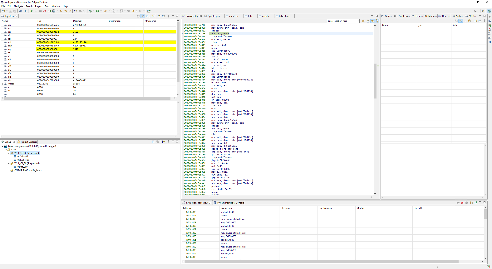

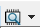
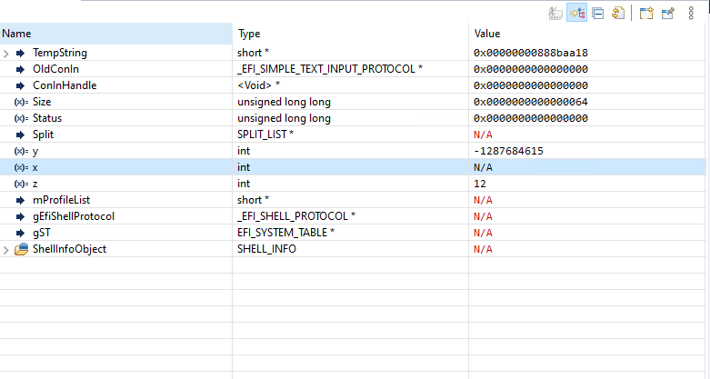


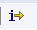

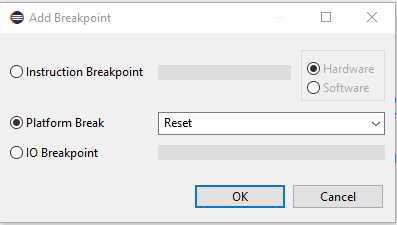

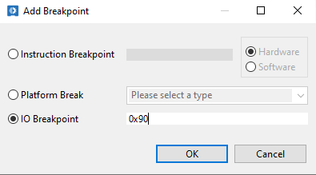
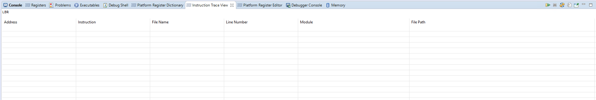
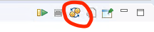
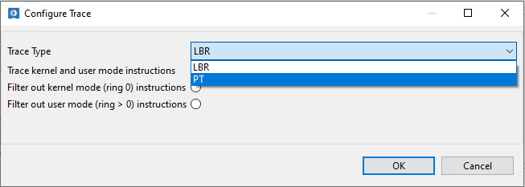
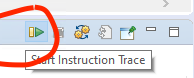

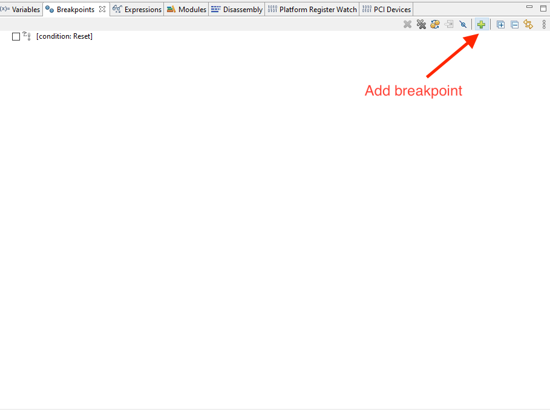
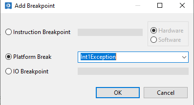

.. code:: ipython3

    #!/usr/bin/env python3
    '''
    ==============================================================
     Copyright © 2019 Intel Corporation

     SPDX-License-Identifier: MIT
    ==============================================================
    '''

    '''
    OneApi System Debug example. Use System debugger for source level debugging
    '''
    import intel.sysdbg

    intel.sysdbg.connect()

    threads = intel.sysdbg.threads
    target = intel.sysdbg.target

    target.suspend()
    threads[0].symbols.load_this()
    threads[0].symbols.load_dxe()

    threads[0].frames[0].symbols.find("x")[0].value().string()

    threads[0].breakpoints.add(condition="Reset")

    target.platform.reset()

    target.resume()
