Intel®  System Debugger - System Trace Example
==============================================

Introduction
------------

Intel® System Debugger component of Intel® oneAPI includes a Python*-based command line
interface for capturing and decoding system trace called TraceCLI.
Developers can use the TraceCLI Python package for automating trace
capture and the Intel System Debugger - System Trace UI for development and manual trace capture.

What it is
----------

This project demonstrates decoding a trace file using the two methods
mentioned above (trace UI and TraceCLI).

Software requirements
---------------------

This sample works on both Linux* and Windows* OS.

This sample has been tested on Windows 10, and requires a working Intel® System Bring-up toolkit installed.

Using the System Trace UI
-------------------------

Intel® oneAPI is shipped with the Intel® System Debugger, which provides an
Eclipse*-based UI for capturing/decoding system trace.

Decoding an example trace .bin file offline with Intel System Debugger
^^^^^^^^^^^^^^^^^^^^^^^^^^^^^^^^^^^^^^^^^^^^^^^^^^^^^^^^^^^^^^^^^^^^^^

Launch the IDE
..............

1. Launch Intel® System Debugger

2. Using the Eclipse Quick Access control (Ctrl+3), open the System Trace perspective:

................................

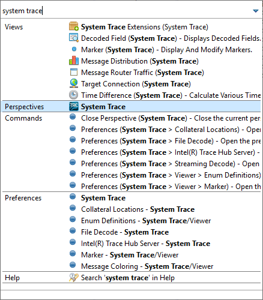

3. In the System Trace wizard, select **Set up project**.

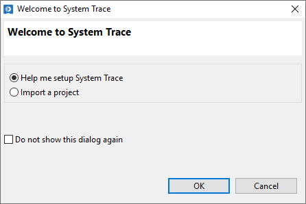

4. Enter a project name

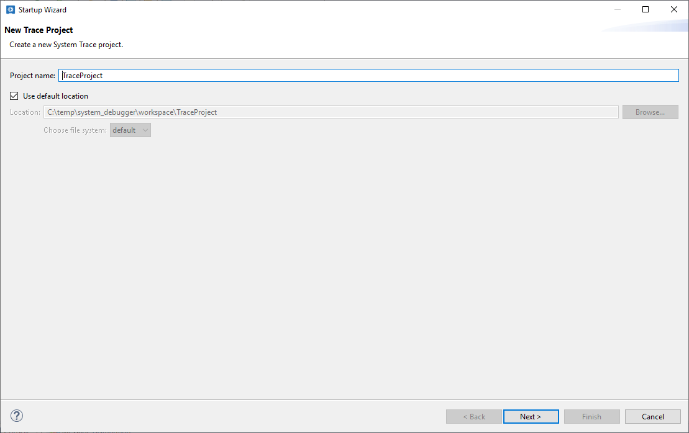

5. Choose **Manually select target**. Select "Generic 10th Gen Intel® Core Processor (Comet Lake)"
and click Next.

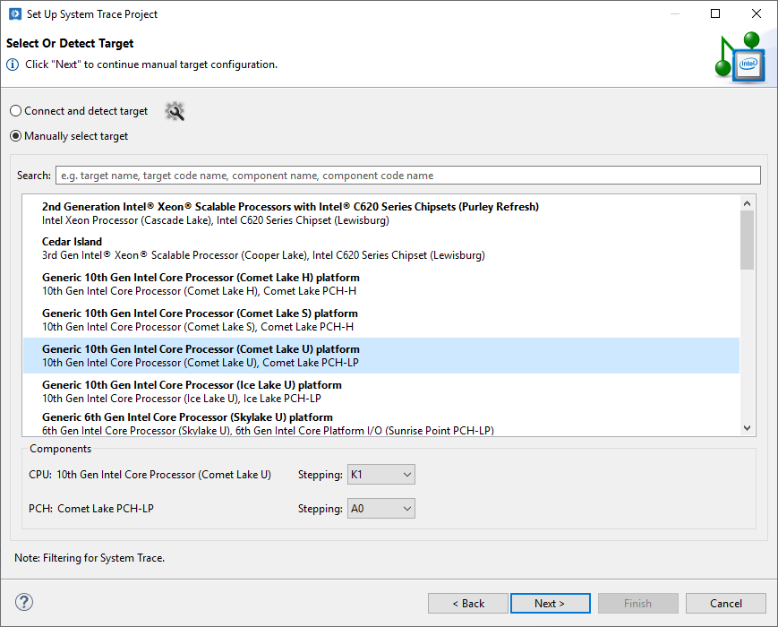

6. Select the **Intel® SVT DbC USB Debug Cable** and click Next.

.. figure:: ./_traceimages/image-20201001115999999.png
   :alt: image-20201001115999999

7. Since this is a file decode, uncheck 'Configure provider' as well as 'Connect to target on finish'.

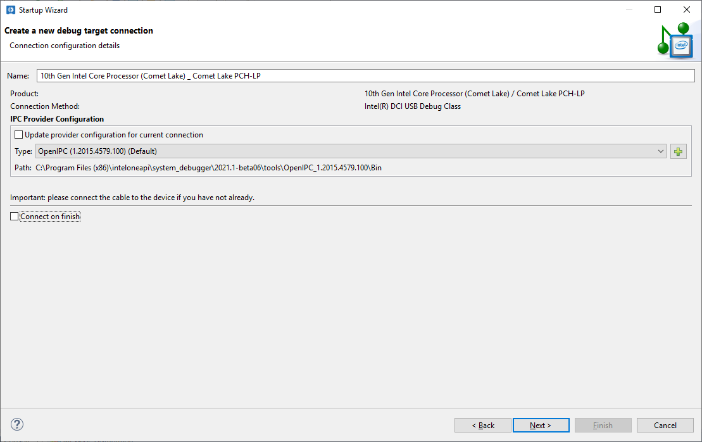

8. Provide a trace configuration name

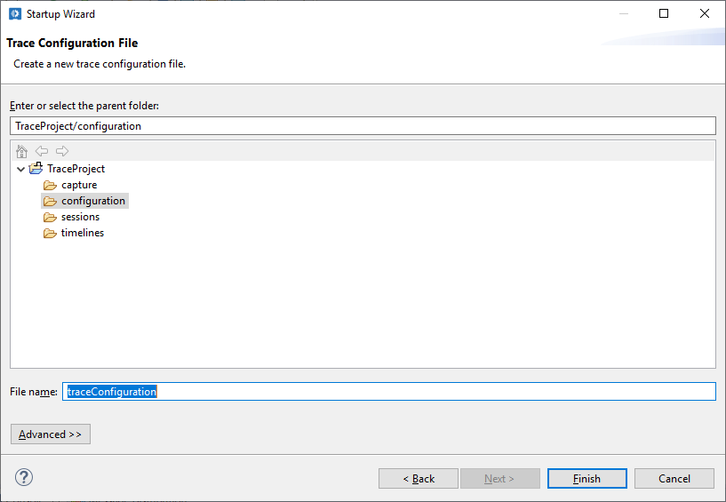

9. Import Trace Capture.

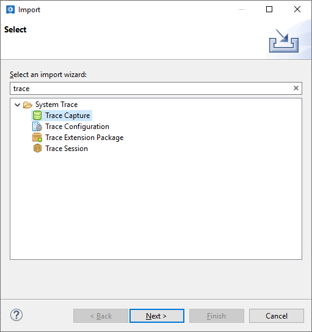

Alternatively, in the Project Explorer, expand the 'capture' node and click **Import Trace Capture**.

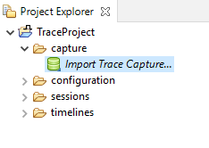

10. Select an example file at ``<isd install folder>/system_trace/examples/input/mipi_aet_fake_trace.bin.bin``

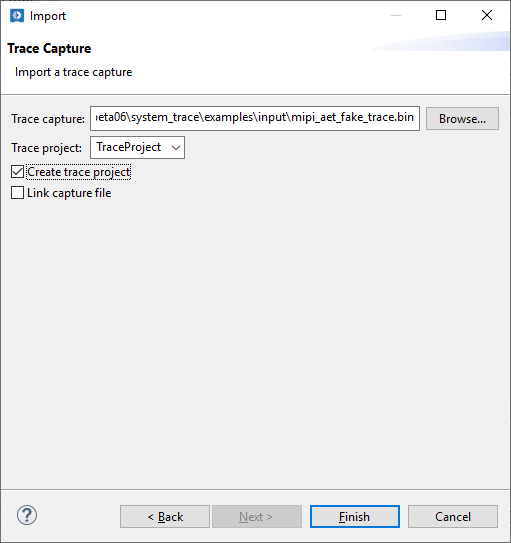

11. Select the imported capture for decoding

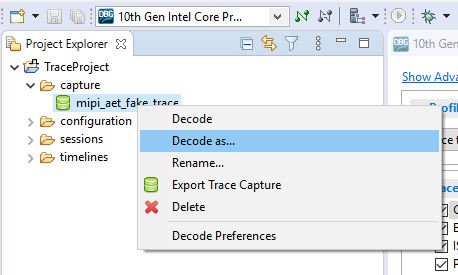

12. Ensure that **CMP General decode** use case is selected and click OK.

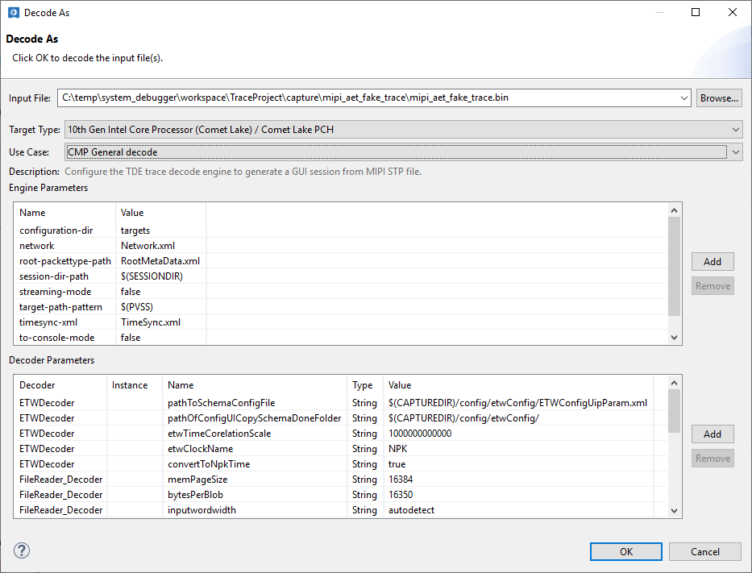

'MessageView001' opens showing decoded trace

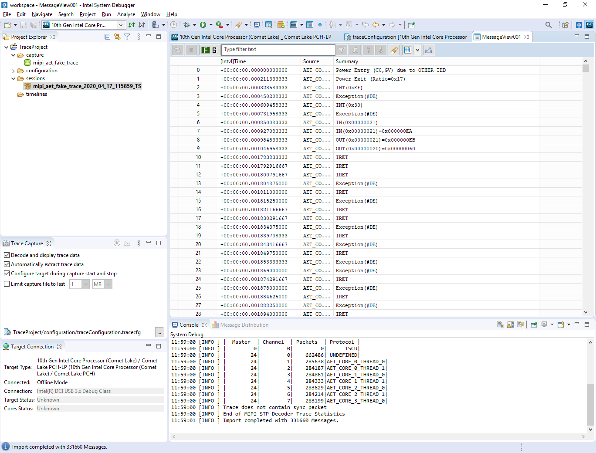

Using the TraceCLI
------------------

TraceCLI has three usage models (console, file decode, and streaming)

.. code-block:: console

    > intel_tracecli  --help
    usage: intel_tracecli [-h] [-v] [--pvss PVSS] [--target TARGET]
                          [--usecase USECASE] [--transport TRANSPORT]
                          {console,decode,stream} ...

    Intel TraceCLI Version 1.2003.826.200
    Copyright Intel Corporation All rights reserved

    positional arguments:
      {console,decode,stream}
        console             Run interactive mode
        decode              Decode a trace capture file
        stream              Capture and decode traces

Running the example
^^^^^^^^^^^^^^^^^^^

.. code-block:: console

    %ISS_PYTHON3_BIN% tracecli_example.py

    > $ISS_PYTHON3_BIN/tracecli_example.py
    Intel TraceCLI Version 1.2015.469.100
    Copyright Intel Corporation All rights reserved

    Using installation at C:\Program Files (x86)\inteloneapi\system_debugger\2021.1-beta06\\system_trace

    Basic usage guideline for file decode:
      1. session = trace.filedecode_session()
      2. session.interactive_setup()
      3. session.decode_file('ipc_trace_test.bin')

    Basic usage guideline for streaming:
      1. session = trace.stream_session()
      2. session.interactive_setup()
      3. session.start_stream_capture()
      4. session.enable_trace()
      5. session.disable_trace()
      6. session.stop_stream_capture()

    Other options (Examples):
    - session.set_decoder_parameter('MIPI_Decoder', 'startAtAsync', 'false')
    - session.csv_columns.extend(['MasterID','ChannelID','payload','Summary','PacketType'])

    Info: MIPI STP Decoder Trace Statistics [instance: mipi]
    |  Master  | Channel  | Packets  | Protocol |
    |         0|         0|         0|      TSCU|
    |        24|         0|    662486| UNDEFINED|
    |        24|         1|    285638|AET_CORE_0_THREAD_0|
    |        24|         2|    284187|AET_CORE_0_THREAD_1|
    |        24|         3|    284861|AET_CORE_1_THREAD_0|
    |        24|         4|    284333|AET_CORE_1_THREAD_1|
    |        24|         5|    283629|AET_CORE_2_THREAD_0|
    |        24|         6|    284214|AET_CORE_2_THREAD_1|
    |        24|         7|    283199|AET_CORE_3_THREAD_0|
    Trace does not contain sync packet
    End of MIPI STP Decoder Trace Statistics

    "Time","Source","Summary"
    "[000]0000:00:00.000000000000","AET_CORE_0_THREAD_1","Power Entry (C0,GV) due to OTHER_THD"
    "[000]0000:00:00.000211333333","AET_CORE_1_THREAD_1","Power Exit (Ratio=0x17)"
    "[000]0000:00:00.000328583333","AET_CORE_1_THREAD_0","INT(0xEF)"
    "[000]0000:00:00.000450208333","AET_CORE_2_THREAD_0","Exception(#DE)"
    "[000]0000:00:00.000609458333","AET_CORE_0_THREAD_0","INT(0x30)"
    "[000]0000:00:00.000731958333","AET_CORE_0_THREAD_0","Exception(#DE)"
    "[000]0000:00:00.000850083333","AET_CORE_1_THREAD_1","IN(0x00000021)"
    "[000]0000:00:00.000927083333","AET_CORE_0_THREAD_1","IN(0x00000021)=0x000000EA"
    "[000]0000:00:00.000984833333","AET_CORE_3_THREAD_0","OUT(0x00000021)=0x000000EB"
    "[000]0000:00:00.001046958333","AET_CORE_0_THREAD_1","OUT(0x00000020)=0x00000060"
    "[000]0000:00:00.001783833333","AET_CORE_1_THREAD_0","IRET"
    "[000]0000:00:00.001792916667","AET_CORE_1_THREAD_0","IRET"
    "[000]0000:00:00.001800791667","AET_CORE_0_THREAD_0","IRET"
    "[000]0000:00:00.001804875000","AET_CORE_2_THREAD_1","Exception(#DE)"
    "[000]0000:00:00.001811000000","AET_CORE_2_THREAD_0","IRET"
    "[000]0000:00:00.001815250000","AET_CORE_2_THREAD_0","Exception(#DE)"
    ...
