Intel Target Connection Assistant Basic Usage Sample
====================================================

+---------------+------------------------------------+
| Optimized for | Description                        |
+===============+====================================+
| OS            | Linux\* Ubuntu\* 18.04, Windows 10 |
+---------------+------------------------------------+
| Hardware      | Aaeon UpXtreme                     |
+---------------+------------------------------------+
| Software      | Intel® oneAPI System Debugger      |
+---------------+------------------------------------+

What it is
----------

This project demonstrates the recommended way of connecting to the
target for debug and trace.

Licence
-------

This code sample is licensed under MIT license.

Software requirements
---------------------

This sample works on both Linux and Windows.

This sample has been tested on Windows 10, and requires a working OneAPI
IOT Kit or OneAPI System Bring up installed.

Open the TCA connection wizard
------------------------------

-  Physically connect your target to the host and start Eclipse\* IDE

-  Click on **New Connection** in the tool bar

   image

-  In the launched wizard, select **New Connection for System Debug &
   Trace**

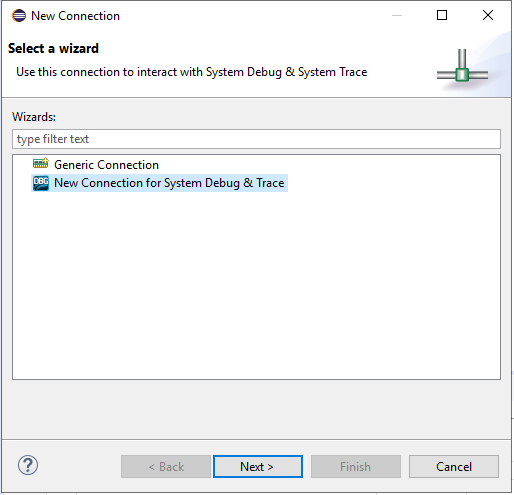

   image

Using Auto-detection (Recommended)
----------------------------------

TCA utilizes OpenIPC SmartStart feature to detect the connected target
automatically without need to manually select it. This is the
recommended approach.

1) Click on the radio button **Detect and connect to target**, then
   click on the **Next** button.

2) TCA will try to auto detect and connect to your target. The list of
   possible targets detected will be shown in the next page.

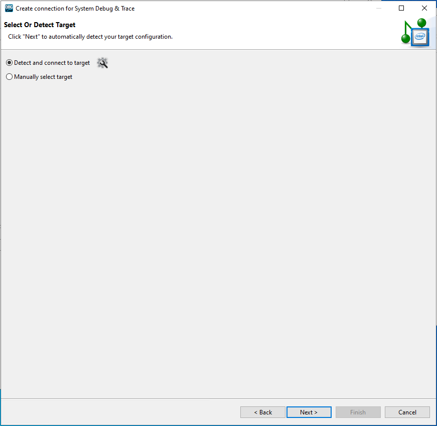

   image

3) Select your target from the list.

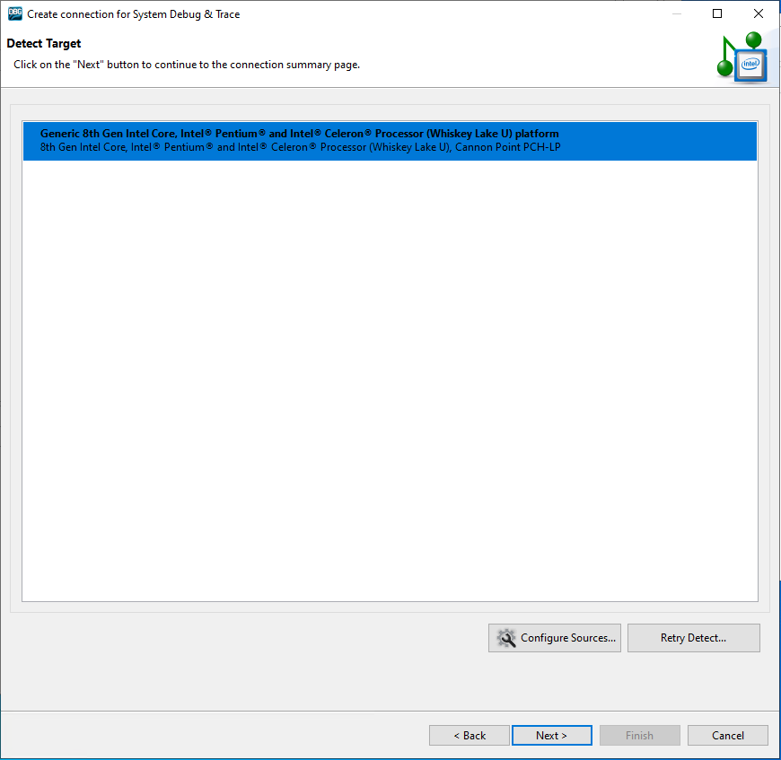

   image

4) Click on the **Next** button to go to the connection summary page.

5) Check the pre-configured settings. You can see the following data:

..

   ::

      * Detected target information and supported features

   ::

      * IPC provider version

..

   ::

      * Path to the IPC provider

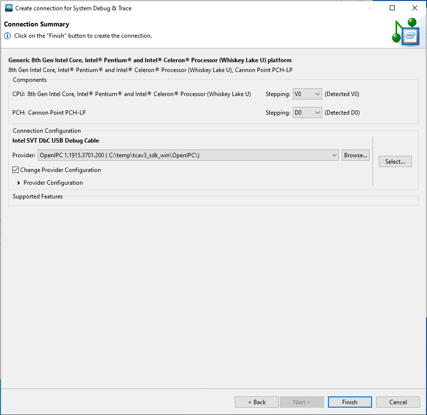

   image

6) Click on **Finish** to create the connection.

Manual configuration (Advanced)
-------------------------------

If you need more flexibility in configuring connection, you can always
create a connection manually, without using auto detection.

1) In the first wizard page click on **Manually select target** and
   select required target directly from the list. You can use the search
   field to easily find your target in the list.

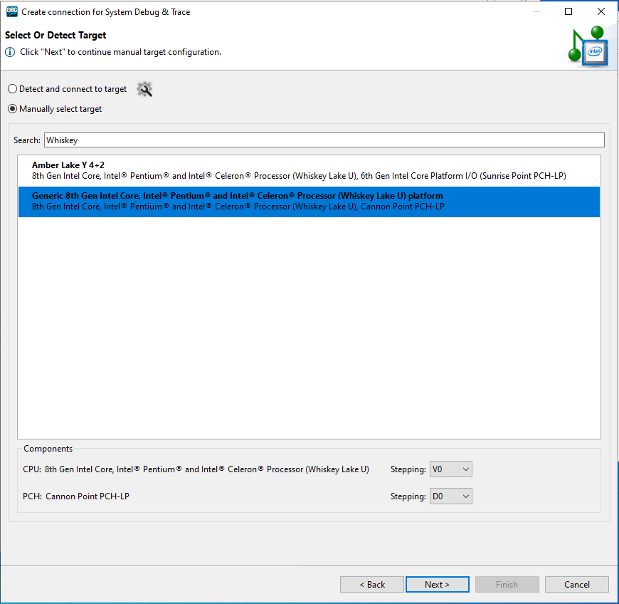

   image

2) Click on the **Next** button to go to the connection configuration
   selection. A connection configuration bundles all information
   together required to establish a target connection.

3) Choose the connection configuration which fits to your connection
   method and target.

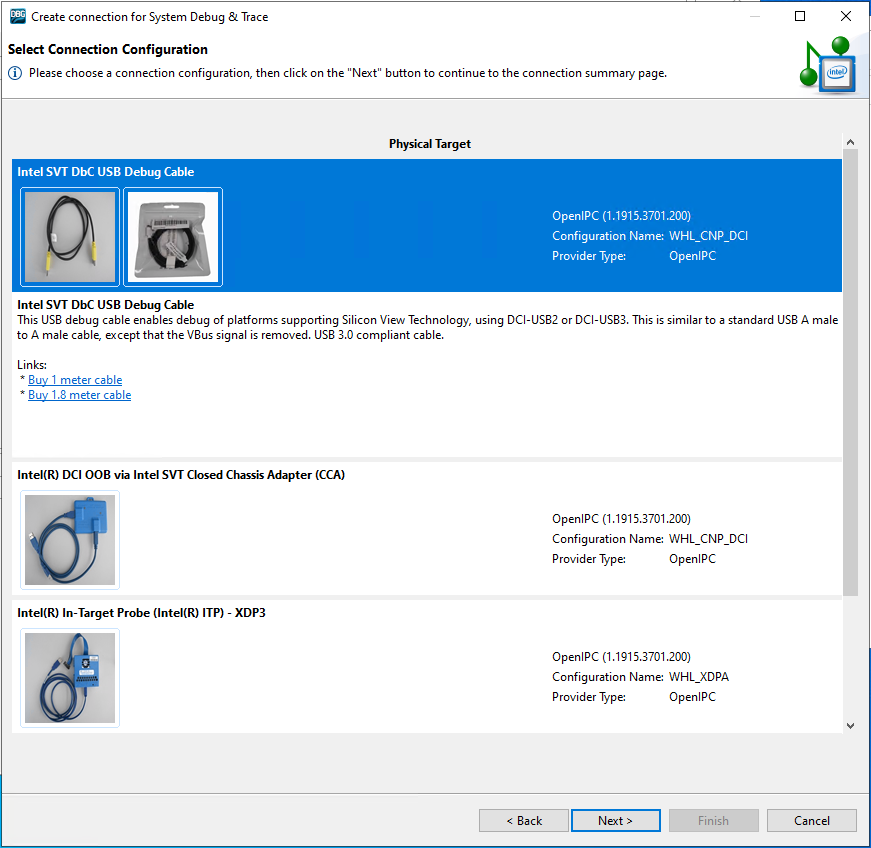

   image

4) Click on the **Next** button to go to the connection summary page.

5) Check the pre-configured settings. You can see the following data:

..

   ::

      * Detected target information and supported features

   ::

      * IPC provider version

..

   ::

      * Path to the IPC provider

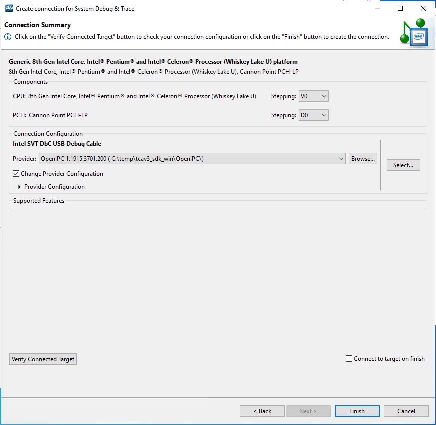

   image

If required, you can also choose your own version OpenIPC or Intel(R)
DAL and/or customize provider configuration.

**WARNING**: Using custom configurations can lead to non-functional
connection, use on your own risk

6) To check if your connection configuration is working you can click on
   the **Verify Connected Target** button.

7) Click on **Finish** to create the connection.

To connect or disconnect your target use the buttons in the tool bar
~~~~~~~~~~~~~~~~~~~~~~~~~~~~~~~~~~~~~~~~~~~~~~~~~~~~~~~~~~~~~~~~~~~~

   image

Using the Command Line
----------------------

Open the Intel System Debugger Shell
~~~~~~~~~~~~~~~~~~~~~~~~~~~~~~~~~~~~

-  Open a command line, CMD Prompt on windows and terminal on Linux/Mac

-  Change directory to the installation directory and source the file
   *iss_env.bat* or rather *iss_env.sh* on Linux/Mac

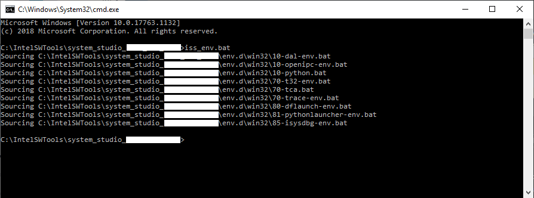

   image

-  Enter **“isd_cli”** to start the Intel System Debugger Shell

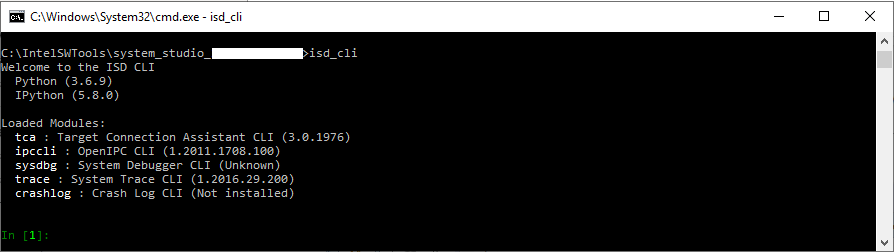

   image

Connecting to the Target
------------------------

This chapter describes the recommended way of connecting to the target
for debug and trace using the Intel Target Connection Assistant Python
Client.

.. _using-auto-detection-recommended-1:

Using Auto-detection (Recommended)
~~~~~~~~~~~~~~~~~~~~~~~~~~~~~~~~~~

TCA utilizes OpenIPC SmartStart feature to detect the connected target
automatically without need to manually select it. This is the
recommended approach.

1) Enter **“profile = tca.select()”** to start creating a connection
   profile. After successful creation, the profile will be stored in the
   variable named **profile**

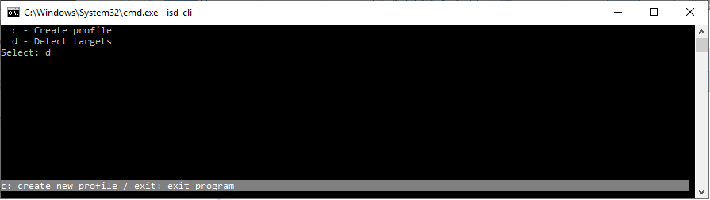

   image

2) Enter **“d”** to select auto detection. Intel Target Connection
   Assistant will try to detect your connected target.

   image

3) Select your target from the list. Enter the number in front of the
   target.

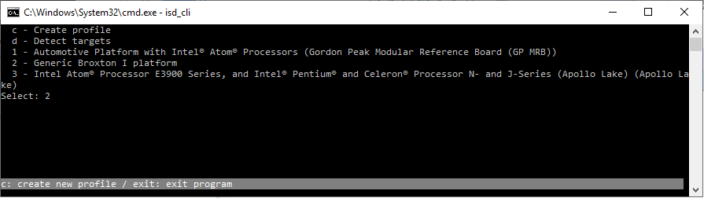

   image

4) Enter **“u”** to use the detected connection configuration.

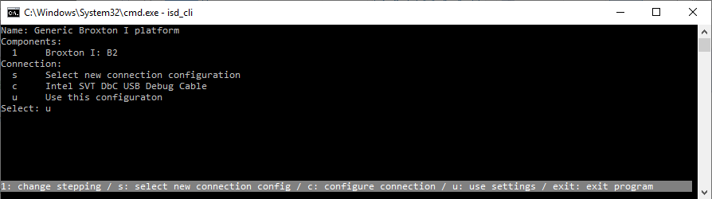

   image

5) To set the created profile as active profile, you need to load it
   with the command **“tca.load(profile)”**

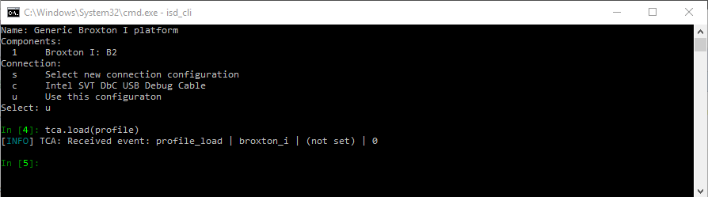

   image

.. _manual-configuration-advanced-1:

Manual configuration (Advanced)
-------------------------------

If you need more flexibility in configuring connection, you can always
create a connection manually, without using auto detection.

1) Enter **“profile = tca.select()”** to start creating a connection
   profile. After successful creation, the profile will be stored in the
   variable named **profile**

   image

2) Enter **“c”** to select auto detection. Intel Target Connection
   Assistant will try to detect your connected target.

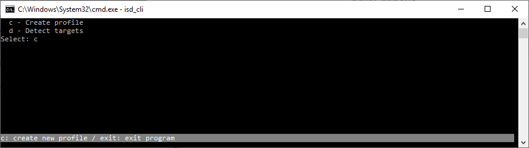

   image

3) Select your target from the list. Enter the number in front of the
   target.

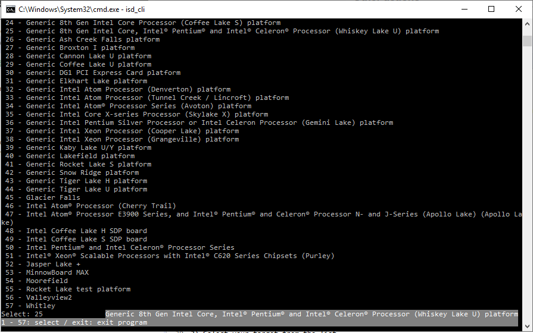

   image

4) Enter **“s”** to select a connection configuration. A connection
   configuration bundles all information together required to establish
   a target connection.

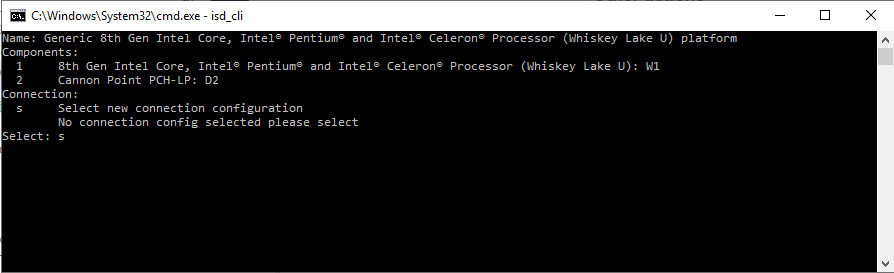

   image

5) Select the connection configuration which fits to your setup. Enter
   the number in front of the configuration.

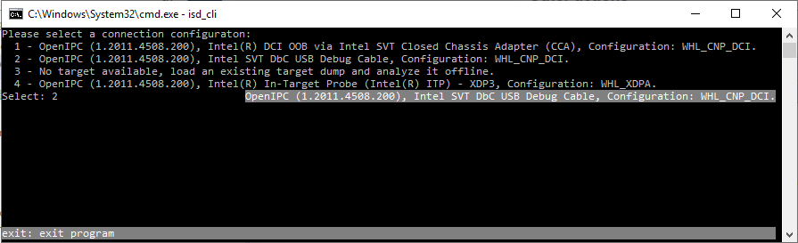

   image

6) Enter **“u”** to use the detected connection configuration.

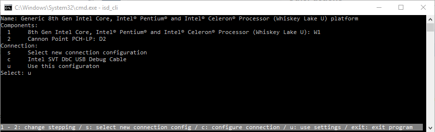

   image

7) To set the created profile as active profile, you need to load it
   with the command **“tca.load(profile)”**

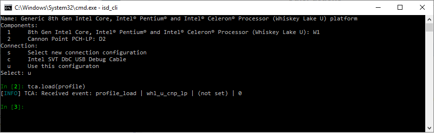

   image

Connect or disconnect target
----------------------------

To connect your target use the command **“tca.connect()”** and
**“tca.disconnect()”** to disconnect your target.

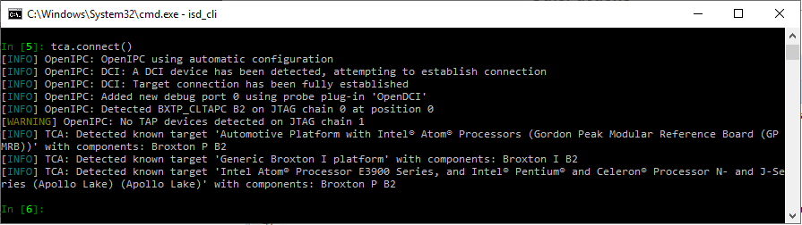

   image

Disclaimer
----------

IMPORTANT NOTICE: This software is sample software. It is not designed
or intended for use in any medical, life-saving or life-sustaining
systems, transportation systems, nuclear systems, or for any other
mission-critical application in which the failure of the system could
lead to critical injury or death. The software may not be fully tested
and may contain bugs or errors; it may not be intended or suitable for
commercial release. No regulatory approvals for the software have been
obtained, and therefore software may not be certified for use in certain
countries or environments.

.. code:: ipython3

    #!/usr/bin/env python3
    '''
    ==============================================================
     Copyright © 2019 Intel Corporation
    
     SPDX-License-Identifier: MIT
    ==============================================================
    '''
    
    '''
    OneApi TCA example. Use tca to connect to a target
    '''
    
    import intel.tca as tca
    
    target = tca.get_target(id="whl_u_cnp_lp")
    components = [(c.component, tca.latest(c.steppings))
                  for c in target.components]
    component_config = tca.ComponentWithSelectedSteppingList()
    for comp in components:
        config_tmp = tca.ComponentWithSelectedStepping()
        config_tmp.component, config_tmp.stepping = comp
    supported_connections = target.get_supported_connection_configurations(
        component_config)
    
    
    def conn_filter(conn: tca.ConnectionConfiguration) -> bool:
        if conn.type != tca.ConnectionType_IPC:
            return False
        if "CCA" not in conn.ipc_configuration.selection:
            return False
        return True
    
    
    connection_config = next(filter(conn_filter, supported_connections))
    profile = tca.Profile()
    profile.name = "My TCA profile"
    profile.target = target
    profile.component_configuration = component_config
    profile.connection_configuration = connection_config
    tca.load(profile)
    tca.connect()

