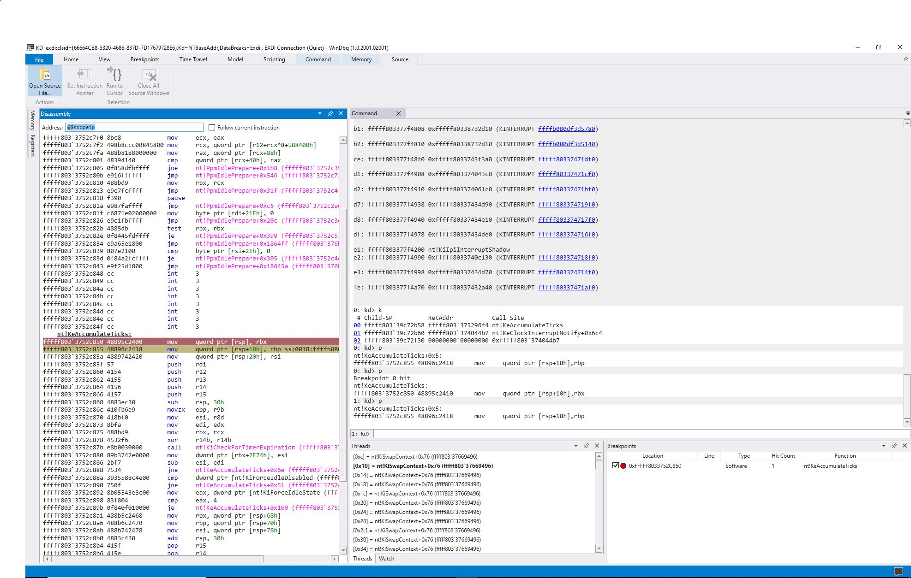
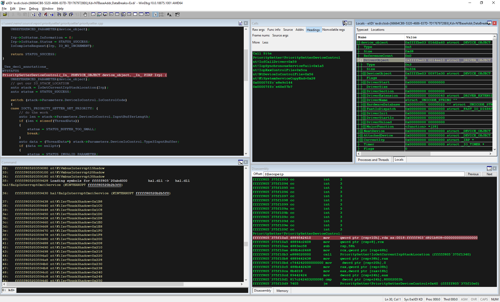
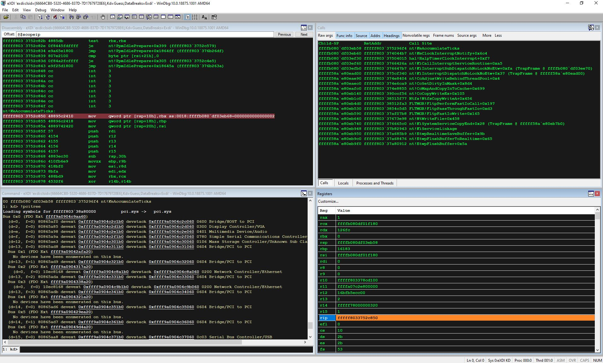
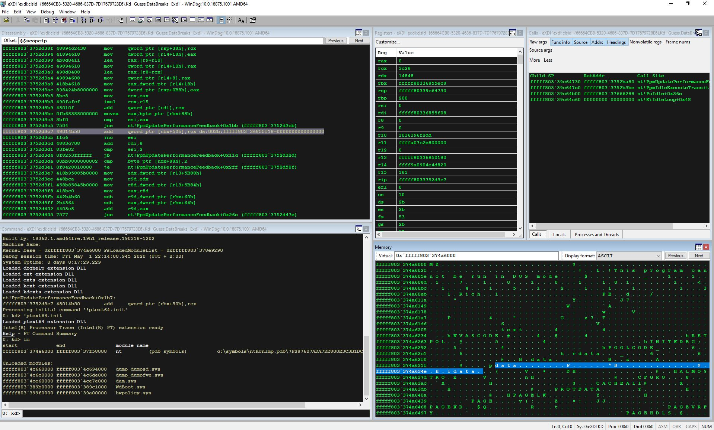
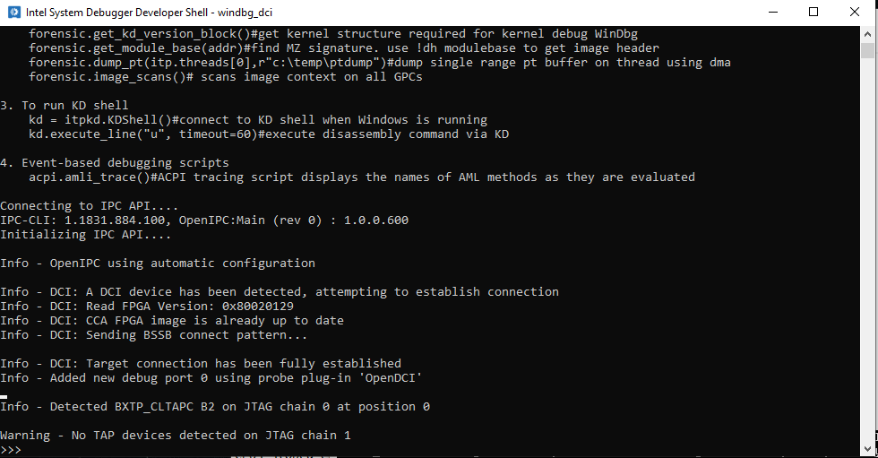

``Windbg over DCI`` Basic Usage Sample
======================================

+---------------+------------------------------------+
| Optimized for | Description                        |
+===============+====================================+
| OS            | Windows 10                         |
+---------------+------------------------------------+
| Hardware      | Aaeon UpXtreme                     |
+---------------+------------------------------------+
| Software      | Intel® oneAPI Beta Windbg over DCI |
+---------------+------------------------------------+

What it is
----------

This project demonstrates how you would use Windbg over DCI to connect
to a target and loading kernel symbols.

Licence
-------

This code sample is licensed under MIT license.

Software requirements
---------------------

This sample works with Windows 10 Host/Target Systems only. For a list
of system requirements matching your configuration, see the Intel®
System Debugger Release Notes. In case you need assistance installing or
running this product, please visit our Get Help page at
http://software.intel.com/en-us/support for support options.

Starting the Intel® Debug Extensions for *WinDbg* for IA JTAG debugging
-----------------------------------------------------------------------

**WinDbg** must have access to kernel symbols for the connection to
succeed.

Thus, you must set the symbol file path beforehand.

Launch **WinDbg** (not by using the batch script, as this will perform a
connection) and set the symbol file path by selecting *File > Symbol File
Path… and adding:

``srv*C:Symbols*http://msdl.microsoft.com/download/symbols``

to the path or by setting the ``_NT_symbol_path`` global environment
variable with a corresponding value. Save the workspace by selecting
File -> Save Workspace, and then closing **WinDbg**.

Note - You need to do this only once before the first use. Connect
the host system to the target one with the **Intel® In-Target Probe
(Intel® ITP)** or the **Intel® Direct Connect Interface (Intel® DCI)**.

Launching Windbg
~~~~~~~~~~~~~~~~

*Intel® Debug Extensions for WinDbg* can be launched as follows:

Click the desktop icon or open the Start Menu and click *Intel® Debug
Extensions* for WinDbg\* under **Intel® System Studio oneAPI.**

Run ``windbg_iajtag_console.bat`` located at:

``C:Program Files (x86)inteloneapisystem_debugger<version>windbg_iajtag_console.bat``

Another way to launch windbg over DCI would be to use the **iss_shell**.
Launch iss_shell.bat, that is located in the root installation
directory:

``C:Program Files (x86)inteloneapisystem_debugger<version>iss_shell.bat``

From *iss_shell* run ``windbg_dci`` to invoke WinDbg.

At this point, two Python objects are available for debugging:

**itp** - Intel® ITP interface

**itpkd** - wrapper over WinDbg\* and kernel debug console

|console|

Execute ``windbg()`` to halt the target and run a **WinDbg** session. After
that, **WinDbg** starts connecting to the target.

|windbg|

From now on, you could use windbg commands to interact with target, for
example:

Set a breakpoint:

|windbgbreak|

Debugging drivers:

|driver|

Get pcitree:

|driver|

Note
~~~~

Connecting to the target can take several minutes. Do not enter any
commands until the connection is fully established and the connection
confirmation message is displayed (Target initialization succeeded). If
the connection fails, you see an exception in the console. Check the
network connection if *KDVersionBlock* is not found. Run the target for a
while if the kernel is not found.

Using Intel® Debug Extensions for *WinDbg* with *WinDbg Preview*
----------------------------------------------------------------

System Requirements
~~~~~~~~~~~~~~~~~~~

-  Microsoft WinDbg Preview. For download and installation instructions,
   see the Windows\* Debugging Tools documentation.
-  Windows 10 version 14257.0 or higher

Starting Windbg Preview
~~~~~~~~~~~~~~~~~~~~~~~

To start using Intel® Debug Extensions for **WinDbg** with **WinDbg
Preview** follow the steps below:

1. Connect to the target.
2. Launch ``iss_shell.bat`` located in the installation root directory.
3. Execute the ``windbg_preview`` command to start **WinDbg Preview**.

|windbgprev|

Disclaimer
----------

IMPORTANT NOTICE: This software is sample software. It is not designed
or intended for use in any medical, life-saving or life-sustaining
systems, transportation systems, nuclear systems, or for any other
mission-critical application in which the failure of the system could
lead to critical injury or death. The software may not be fully tested
and may contain bugs or errors; it may not be intended or suitable for
commercial release. No regulatory approvals for the software have been
obtained, and therefore software may not be certified for use in certain
countries or environments.

.. |windbgbreak| image:: ./_windbgimages/windbg_break.png

